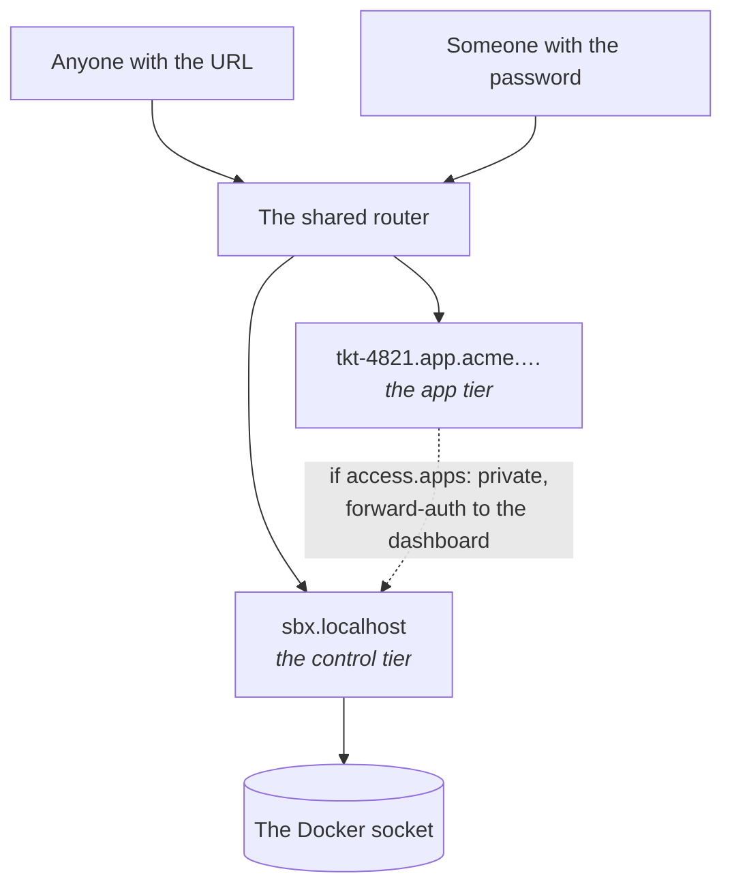
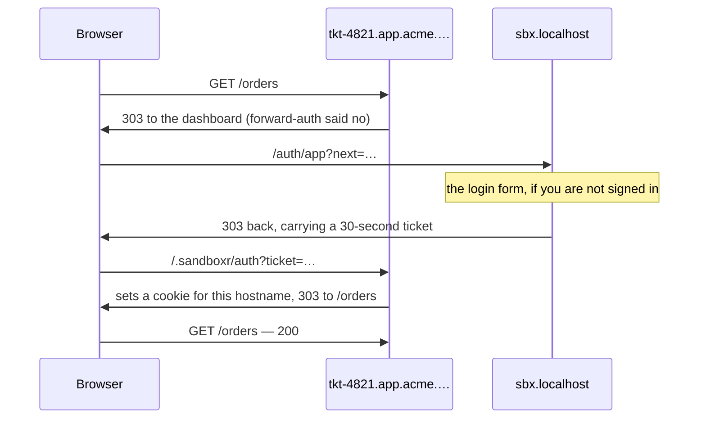

sandboxr has exactly two tiers, and they are not negotiable in the same way.

| | Default | Can it be turned off? |
|---|---|---|
| **The apps** a sandbox serves | `public` | Yes: `access.apps: private` |
| **The controls** — dashboard, terminal, start, stop, rebuild, migrate | Behind a password | **No** |



## Why apps are open by default

The point of a sandbox is sending somebody a link. A designer, a product manager, the person who
filed the ticket — none of them should need an account on your machine to look at a preview of
unreleased work.

By default the router publishes on `127.0.0.1` only, so "public" means *public to this machine's
browsers*. Binding beyond loopback (`sandboxr init --bind 0.0.0.0`, or running on a server) is what
makes it public in the ordinary sense. Read the rest of this page before you do that.

## Why the controls are not negotiable

The dashboard talks to the Docker socket. A control endpoint reachable without a password is not a
misconfigured page — it is the ability to run anything on the host.

So `access.controls` accepts exactly one value, `password`, and there is no setting that removes
it. A sandbox with no password set still starts; the dashboard simply admits nobody.

The set of things the controls can do is a **closed table** in the server's source. There is no
"run this command" box and there must never be one, because behind a password that would be a
remote shell with an extra step. [The dashboard](guides/dashboard.md) lists the table and the
security properties, each of which has a named test.

## The `private` tier

```yaml
access:
  apps: private
```

Every one of that project's app hostnames then goes through a forward-auth middleware in the
shared router, which asks the dashboard's `GET /auth/verify` whether the request carries a valid
**app token** — and whether that token's grant covers this project. A `public` project skips the
middleware entirely.

### Two tokens, scoped differently on purpose

| Cookie | Scope | Accepted by | Authorises |
|---|---|---|---|
| `sandboxr_session` | **Host-only** — the bare domain, nothing else | Every control route, and the terminal | The controls. Root-equivalent |
| `sandboxr_app` | **Host-only, on one sandbox hostname** | `GET /auth/verify`, for that hostname only | *Viewing* the one private app it was issued for |

Both are `HttpOnly`, `Secure` and `SameSite=Lax`, and they are not interchangeable. Each is signed
over its own version tag, so relabelling one as the other breaks the signature: a control session
sent to `/auth/verify` is a 401, and an app token sent to any control route is a 401.

The second exists because a browser can only send a sandbox hostname a cookie scoped to reach it,
so a host-only control session never arrives and a private app would be unreachable. The obvious
fix — putting `Domain` on the control session — is the one thing that must never be done. A
sandbox hostname serves the project's own code from a branch under review, so every cookie sent
there lands in a header that branch code handles, and the control session authorises actions
against the Docker socket. Widening it would hand every sandboxed app, and every public sandbox
reachable from the internet, a credential worth root on the host. `HttpOnly` is no defence: the
read is server-side, not page script.

A second cookie scoped `Domain=<domain>` would fix reachability, and it is not enough either: a
cookie cannot be scoped to "the private hostnames only", so it would reach every host under the
domain, public projects included, where a compromised app could capture it and view every private
app its grant covered. So the app token is bound to **one** hostname and set host-only on that
hostname, which removes that entirely — the browser offers it to the one app it was issued for,
and `verify` refuses it anywhere else even when it is replayed there by hand.

Which is why signing in does not set it: a cookie for a sandbox hostname can only be set by
something answering on that hostname. That is what the handshake below is.

Use `private` when the branch itself is sensitive, when the sandbox needs real data, or when it
needs real third-party credentials.

### Opening one in a browser

You do not sign in twice. Navigating to a private app that you have not opened yet sends you to
the dashboard's login form, and back to the app afterwards — and if you are already signed in to
the dashboard, straight back with nothing asked.



Three properties of that are deliberate, and each one is a thing that can go wrong:

- **The cookie it sets is good for that one hostname.** It is not scoped to the domain, so it is
  never sent to another project's app — including a public one, where the branch's own code would
  see it in a request header. Losing it costs the one app it was issued for.
- **`/.sandboxr/` is a reserved path** on every sandbox hostname on the machine, public projects
  included. It is the one path the dashboard answers there, and a project that serves a route of
  its own under it will find the dashboard answering instead.
- **Only a page is redirected.** Everything else keeps exactly the answer it got before.

### Only a page is redirected

This matters more than it looks. Forward-auth sits in front of **every** hostname of a private
project — `tkt-4821.api.acme.…` as much as `tkt-4821.app.acme.…` — so the clients on the other
side of the decision are curl, SDKs, webhook senders and server-to-server callers as well as
browsers. Answering one of those with a redirect to an HTML login page breaks it in the worst way
available: it reports a *parse error* rather than an authentication failure.

So three conditions have to hold before anything is redirected, and otherwise the response is
byte-for-byte what it was before — `401`, `application/json`, `{"ok":false}`, no `Location`:

| | Redirected | Refused |
|---|---|---|
| Method | `GET` or `HEAD` | anything else — a `303` turns a `POST` into a `GET` and drops its body |
| `Accept` | names `text/html` or `application/xhtml+xml` | `*/*`, `application/json`, or absent |
| `Sec-Fetch-Mode` | `navigate`, or not sent at all | `cors`, `same-origin`, `no-cors` |

> [!IMPORTANT] `Accept: */*` is never treated as asking for HTML
> It is curl's default and what a great many HTTP clients send, and it is a statement that
> anything will do — not a preference for a web page. Reading it as one would answer every API
> client on the machine with a login form.

`Sec-Fetch-Mode` is a veto rather than a requirement, so a client too old to send it is still
judged on `Accept` alone. Where it *is* sent it separates a real navigation from a `fetch()` that
happens to ask for HTML, which content negotiation cannot do. Node's own `fetch` sends
`Sec-Fetch-Mode: cors`, so a server-to-server caller written against it lands on the refusal
without having to do anything.

None of this touches the project's own authentication. sandboxr's gate and whatever the app does
inside it — Auth0, a session of its own, an API key — are independent layers: a request carrying a
valid app token is passed through untouched, and the app answers exactly as it would on a `public`
project.

The app cookie lasts an hour by default (`SANDBOXR_APP_SESSION_MINUTES`) rather than the week a
dashboard session does. It is short because the dashboard cannot clear it: the cookie lives on a
hostname the dashboard does not answer on, so signing out ends your control session and stops any
*new* app being opened, while one already open closes when the hour is up. When it does, the
handshake above runs again and you see nothing.

> [!NOTE] If a private app shows you `{"ok":false}`
> That is the forward-auth refusal, and reaching it in a browser window means the request was not
> a top-level navigation — so it is almost always an app's own `fetch`, an iframe, or a client
> sending `Accept: */*`. Open the app's own URL in a tab first; the handshake runs and the token
> it leaves behind covers the app's own requests too.

## Two refusals on a public sandbox

Making the apps public brings two hard requirements. Both are **refusals**, not warnings.

### 1. Where the data comes from

| `seed_from` source | `public` | `private` |
|---|---|---|
| `fixtures` | allowed | allowed |
| `file` with `anonymised: true` | allowed | allowed |
| `file` without it | **refused** | allowed |
| `local` — forking a database you run | **refused** | allowed |

A public URL over real records is a data leak, whatever the intention. A dump is only anonymised
if the author said so, in the config, where a reviewer can see it:

```yaml
database:
  seed_from:
    file: /var/sandboxr/seeds/acme.sql.zst
    anonymised: true
```

> [!NOTE] Listing several sources is not a violation
> A config is refused only when *none* of its sources is permissible. Which source a run uses
> depends on the machine — a laptop forks the container the developer already runs, a server
> restores a dump — so the choice is made when a sandbox starts.

"Anonymised" means anonymised: names, emails, addresses, phone numbers, payment details and free
text replaced, not obscured. A flag you set because it was in the way is worse than no flag,
because it looks like a decision somebody made.

### 2. The credentials

```yaml
access:
  apps: public
  credentials: dummy    # the default
```

With `credentials: dummy` and a secrets file present, `sandboxr up` refuses to start, and names
both ways out: `credentials: real`, or `apps: private`.

Anyone who can drive a public app can make it send real email, spend real credit, or write to
somebody's account. Supply harmless values through `env:` instead.

### Why refusals and not warnings

Neither failure can be undone. Leaked records stay leaked, and money spent calling somebody's API
stays spent. A warning is a thing you read after the fact.

Every refusal names the field and both ways out, so it is a decision you make rather than a wall
you hit.

## Different people, different projects

One password grants everything. Several passwords can each grant a subset:

```bash
export SANDBOXR_PASSWORD='...'              # every project
export SANDBOXR_PASSWORD_ACME='...'         # the acme project only
export SANDBOXR_PROJECTS_ACME='acme,demo'   # ...or name what it really grants
```

**The name in the variable is the project it grants**, not the person it belongs to. The grant is
checked everywhere: the sandbox list is filtered, actions are refused, the terminal will not open,
and the private-app check refuses a hostname the session was not granted.

Passwords are read once at startup and then **deleted from the environment**, so nothing the
dashboard spawns inherits them. The table holds a hash and a salt; comparison is timing-safe.

## Why the terminal is a page, not a hostname

An in-container shell is the most powerful thing sandboxr offers, so it lives inside the dashboard,
behind the same session as every other control. Giving it a hostname of its own would put a shell
one DNS record away from the app tier, where the whole design assumes anyone may arrive.

## Before you expose anything beyond your machine

- [ ] `access.apps` is what you meant for **every** project on the machine, not just the one you
      are thinking about.
- [ ] No project seeds from `local`, and every `file` seed is genuinely anonymised.
- [ ] `credentials` is `dummy` everywhere it should be, and you know why anywhere it is `real`.
- [ ] `SANDBOXR_PASSWORD` is long and random, and per-project passwords exist for anyone who
      should not have everything.
- [ ] The router is serving HTTPS, not plain HTTP.
- [ ] Only 80 and 443 are open. Sandbox containers publish **no** host ports; the router reaches
      them by container name on the shared Docker network.

## What this protects against, and what it does not

| Protects against | Does not protect against |
|---|---|
| A stranger starting, stopping or deleting your sandboxes | Anyone who has the password — they have everything |
| A stranger opening a shell on your machine | A branch's own code, which runs with the sandbox's access to its own database and storage |
| A public app revealing real customer records | A public app revealing unreleased *features*, which is the point |
| One project's password reaching another project | The worktree, which is bind-mounted read-write |

## Related

- [The dashboard](guides/dashboard.md) — the closed action table and the tested properties
- [Secrets](configuration/secrets.md) — what may and may not be imported
- [Running on a server](running-on-a-server.md)
