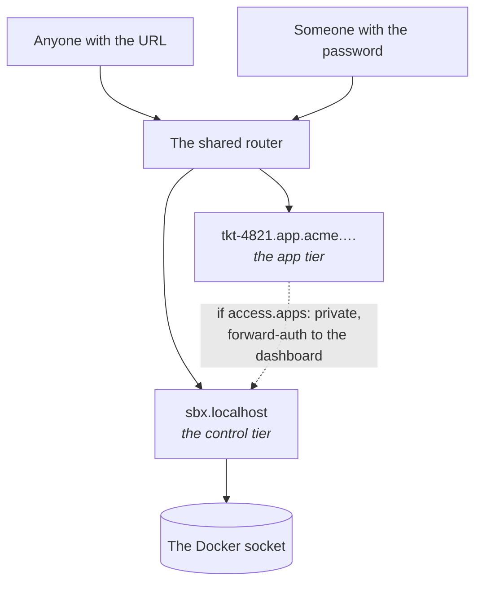
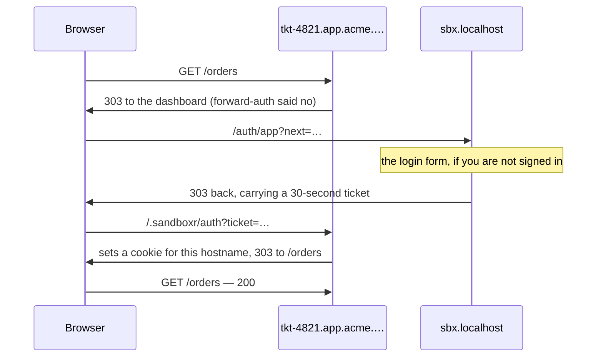

sandboxr has exactly two tiers of access, and they are not negotiable in the same way. This
page describes both, plus the refusals that come with making apps public.

```prompt
Review the access settings for every project on this machine before I expose it beyond
localhost.

Read docs/access.md and work through the checklist at the bottom of it. Report, per
project, its `access.apps`, its `access.credentials`, and which seed source it would
actually use. Check whether SANDBOXR_PASSWORD is set and whether the router is serving
https.

Stop and tell me — do not change anything — if any project is `public` while seeding from
a live database or carrying real credentials.
```

| | Default | Can it be turned off? |
|---|---|---|
| **The apps** a sandbox serves | `public` | Yes: `access.apps: private` |
| **The controls** — dashboard, terminal, start, stop, rebuild, migrate | Behind a password | **No** |



## Why apps are open by default

The point of a sandbox is sending somebody a link. A designer or the person who filed the
ticket should not need an account on your machine to see a preview of unreleased work.

By default the router publishes on `127.0.0.1` only, so "public" means *public to this
machine's browsers*. Binding beyond loopback is what makes it public in the ordinary sense —
`sandboxr init --bind 0.0.0.0`, or running on a server. Read the rest of this page first.

## Why the controls are not negotiable

The dashboard talks to the Docker socket. A control endpoint reachable without a password is
not a misconfigured page. It is the ability to run anything on the host.

So `access.controls` accepts exactly one value, `password`, and there is no setting that
removes it. A sandbox with no password set still starts. The dashboard simply admits nobody.

The set of things the controls can do is a **closed table** in the server's source. There is
no "run this command" box and there must never be one.
[The dashboard](guides/dashboard.md) lists the table and its security properties.

<details class="agent">
<summary><b>Details for an agent</b> — the control session, and how passwords are configured</summary>

`POST /auth/login` takes a password and sets a signed `sandboxr_session` cookie:
`HttpOnly`, `Secure`, `SameSite=Lax`, and **host-only** — scoped to the bare domain and
nothing else. It lasts a week by default (`SANDBOXR_SESSION_HOURS`, default 168).

One password grants everything; several can each grant a subset:

```bash
export SANDBOXR_PASSWORD='...'              # every project
export SANDBOXR_PASSWORD_ACME='...'         # the acme project only
export SANDBOXR_PROJECTS_ACME='acme,demo'   # ...or name what it really grants
```

**The name in the variable is the project it grants**, not the person it belongs to. The
suffix is lower-cased and `_` becomes `-`. The grant is checked everywhere: the workspace the
API answers with is filtered, actions are refused, the terminal will not open, and the
private-app check refuses a hostname the session was not granted.

Passwords are read once at startup and then **deleted from the environment**, so nothing the
dashboard spawns inherits them. The table holds a hash and a salt; comparison is timing-safe.
The login route is rate-limited.

Non-negotiables from the engineering contract:

- No action endpoint is reachable without a session. Not one.
- Every route declares its auth. There is no default, so a route added without a decision
  does not compile rather than shipping open.
- Commands are executed as argument arrays, never a shell string. Slugs, project names and
  branch names are validated before they reach one.
- The content-security policy has no `unsafe-inline` for script and no external origin.
  There is no relaxation, including for the terminal.

</details>

## The `private` tier

```yaml
access:
  apps: private
```

Every one of that project's app hostnames then goes through a check in the shared router
before anyone sees it. A `public` project skips that check entirely.

Use `private` when the branch itself is sensitive, when the sandbox needs real data, or when
it needs real third-party credentials.

> [!IMPORTANT] The `private` pair has never been exercised together
> The forward-auth middleware and the dashboard's `/auth/verify` are both written and both
> unit-tested. Nobody has yet run a browser through the whole handshake against a live
> private project. See [What is built](reference/status.md). Everything described in this
> section is what the code does; none of it is something that has been watched happening.

### Two tokens, scoped differently on purpose

| Cookie | Scope | Accepted by | Authorises |
|---|---|---|---|
| `sandboxr_session` | **Host-only** — the bare domain, nothing else | Every control route, and the terminal | The controls. Root-equivalent |
| `sandboxr_app` | **Host-only, on one sandbox hostname** | `GET /auth/verify`, for that hostname only | *Viewing* the one private app it was issued for |

Both are `HttpOnly`, `Secure` and `SameSite=Lax`, and they are not interchangeable.

<details class="agent">
<summary><b>Details for an agent</b> — how the router knows, and how the two tokens are kept apart</summary>

The check is a forward-auth middleware. It asks the dashboard's `GET /auth/verify` two
things: whether the request carries a valid **app token**, and whether that token's grant
covers this project.

A sandbox's container carries the label `sandboxr.access`, set to `public` or `private` from
the config. The router reconciles from Docker labels, so starting or stopping a sandbox never
regenerates a config file and never triggers a reload. A `private` sandbox's route labels name
the `sandboxr-auth@file` middleware; a `public` one's do not.

The container is told the same thing as `SANDBOXR_ACCESS`, so it can answer for itself.

Each cookie is signed over its own version tag, so relabelling one as the other breaks the
signature. A control session sent to `/auth/verify` is a 401, and an app token sent to any
control route is a 401.

</details>

<details class="why">
<summary><b>Why it works this way</b> — the one thing that must never be done</summary>

A browser can only send a sandbox hostname a cookie scoped to reach it, so a host-only
control session never arrives there and a private app would be unreachable. The obvious fix
— putting `Domain` on the control session — is the one thing that must never be done.

A sandbox hostname serves the project's own code from a branch under review. So every cookie
sent there lands in a header that branch code handles, and the control session authorises
actions against the Docker socket. Widening it would hand every sandboxed app, and every
public sandbox reachable from the internet, a credential worth root on the host. `HttpOnly`
is no defence: the read is server-side, not page script.

A second cookie scoped `Domain=<domain>` would fix reachability, and it is not enough
either. A cookie cannot be scoped to "the private hostnames only", so it would reach every
host under the domain — public projects included. A compromised app there could capture it
and view every private app its grant covered.

So the app token is bound to **one** hostname and set host-only on that hostname. The
browser offers it to the one app it was issued for, and `verify` refuses it anywhere else
even when it is replayed there by hand.

Which is why signing in does not set it: a cookie for a sandbox hostname can only be set by
something answering on that hostname. That is what the handshake below is for.

</details>

### Opening one in a browser

You do not sign in twice. Navigating to a private app you have not opened yet sends you to
the dashboard's login form, and back to the app afterwards. Already signed in to the
dashboard, you go straight back with nothing asked.



<details class="agent">
<summary><b>Details for an agent</b> — the three deliberate properties of that handshake, and the ticket's budget</summary>

- **The cookie it sets is good for that one hostname.** It is never sent to another
  project's app, including a public one where the branch's own code would see it in a request
  header. Losing it costs the one app it was issued for.
- **`/.sandboxr/` is a reserved path** on every sandbox hostname on the machine, public
  projects included. It is the one path the dashboard answers there. A project that serves a
  route of its own under it will find the dashboard answering instead.
- **Only a page is redirected.** Everything else keeps exactly the answer it got before.

The ticket is worth thirty seconds and one hostname. It is a bearer value that travels in a
URL, which is why it is that short.

</details>

### Only a page is redirected

The check sits in front of **every** hostname of a private project. So curl, SDKs and
server-to-server callers are on the other side of it as well as browsers. Redirecting one of
those to a login page makes it report a *parse error* rather than an authentication failure.

So three conditions have to hold before anything is redirected. Otherwise the response is
byte-for-byte what it was before — `401`, `application/json`, `{"ok":false}`, no `Location`:

| | Redirected | Refused |
|---|---|---|
| Method | `GET` or `HEAD` | anything else — a `303` turns a `POST` into a `GET` and drops its body |
| `Accept` | names `text/html` or `application/xhtml+xml` | `*/*`, `application/json`, or absent |
| `Sec-Fetch-Mode` | `navigate`, or not sent at all | `cors`, `same-origin`, `no-cors` |

None of this touches the project's own authentication. sandboxr's gate and the app's own
login are independent layers.

<details class="agent">
<summary><b>Details for an agent</b> — why <code>Accept: */*</code> is not HTML, <code>Sec-Fetch-Mode</code> as a veto, and what the app sees</summary>

**`Accept: */*` is never treated as asking for HTML.** It is curl's default and what a great
many HTTP clients send. It is a statement that anything will do, not a preference for a web
page. Reading it as one would answer every API client on the machine with a login form.

`Sec-Fetch-Mode` is a veto rather than a requirement, so a client too old to send it is
still judged on `Accept` alone. Where it *is* sent it separates a real navigation from a
`fetch()` that happens to ask for HTML, which content negotiation cannot do. Node's own
`fetch` sends `Sec-Fetch-Mode: cors`, so a server-to-server caller written against it lands
on the refusal without having to do anything.

A request carrying a valid app token is passed through untouched, and the app answers
exactly as it would on a `public` project. Whatever the app does inside the gate — an
identity provider, a session of its own, an API key — sandboxr neither sees nor changes.

</details>

### One token per hostname

A sandbox serves a hostname per app label, and each one gets its own cookie the first time
you open it. Opening `tkt-4821.app.acme.…` does not open `tkt-4821.api.acme.…`. Navigating to
the second runs the handshake again, invisibly, and leaves a second cookie.

That is the point: a token captured from one app is worth nothing at the next. It has one
consequence worth knowing.

> [!WARNING] A cross-hostname `fetch` needs that hostname opened once
> A front-end that calls its API on a **different** hostname gets a `401` until that hostname
> has been visited in the browser. The request is a subresource rather than a navigation, so
> it is refused rather than redirected. That looks like the API being down.
>
> The fix is the one already recommended for other reasons. Serve the API on the app's **own**
> hostname with a [`routes`](configuration/sandboxr-yaml.md#routes) prefix — one origin, one
> token, no CORS. See [why `routes` exists](architecture/request-path.md).

<details class="agent">
<summary><b>Details for an agent</b> — how long an app cookie lasts, and what signing out does to one</summary>

The app cookie lasts an hour by default (`SANDBOXR_APP_SESSION_MINUTES`) rather than the
week a dashboard session does. It is short because the dashboard cannot clear it: the cookie
lives on a hostname the dashboard does not answer on.

So signing out ends your control session and stops any *new* app being opened. One already
open closes when the hour is up, and the handshake above then runs again invisibly.

</details>

> [!NOTE] If a private app shows you `{"ok":false}`
> That is the refusal above, and reaching it in a browser window means the request was not a
> top-level navigation. So it is almost always an app's own `fetch`, an iframe, or a client
> sending `Accept: */*`. Open the app's own URL in a tab first. The handshake runs, and the
> token it leaves behind covers the app's own requests too.

## Two refusals on a public sandbox

Making the apps public brings two hard requirements. Both are **refusals**, not warnings.

### 1. Where the data comes from

| `seed_from` source | `public` | `private` |
|---|---|---|
| `fixtures` | allowed | allowed |
| `file` with `anonymised: true` | allowed | allowed |
| `file` without it | **refused** | allowed |
| `local` — forking a database you run | **refused** | allowed |

A public URL over real records is a data leak, whatever the intention. So a dump counts as
anonymised only where the author said so, in the config:

```yaml
database:
  seed_from:
    file: /var/sandboxr/seeds/acme.sql.zst
    anonymised: true
```

The flag is an assertion by whoever wrote the config, not something the tool can verify.
"Anonymised" means anonymised: names, emails, addresses, phone numbers, payment details and
free text all replaced.

> [!NOTE] Listing several sources is not a violation
> A config is refused only when *none* of its sources is permissible. Which source a run uses
> depends on the machine — a laptop forks the container the developer already runs, a server
> restores a dump. So the choice is made when a sandbox starts, and refused there if the
> chosen source is not allowed.

<details class="why">
<summary><b>Why it works this way</b> — an assertion rather than a check</summary>

The tool cannot tell an anonymised dump from a real one. So the honest design is to make
somebody state it explicitly in a reviewed file, rather than to imply a guarantee that does
not exist.

A flag you set because it was in the way is worse than no flag. It looks like a decision
somebody made.

</details>

### 2. The credentials

```yaml
access:
  apps: public
  credentials: dummy    # the default
```

With `credentials: dummy` and a secrets file that **holds something**, `sandboxr up` refuses
to start and names both ways out: `credentials: real`, or `apps: private`. What matters is
whether anything is in the file, not whether the file is there — an empty one carries no
credentials and is no reason to refuse.

Anyone who can drive a public app can make it send real email or spend real credit. Supply
harmless values through `env:` instead.

The dashboard says the same thing earlier. A project in this state gets a **read-only**
Environment panel naming both ways out, rather than a table that would only build a file no
sandbox could start with. See [Secrets](configuration/secrets.md).

### Why refusals and not warnings

Neither failure can be undone. Leaked records stay leaked, and money spent calling somebody's
API stays spent. A warning is a thing you read after the fact.

Every refusal names the field and both ways out. The exact wording of each is on
[The rules a config must obey](configuration/rules.md#public-projects-the-two-refusals).

## A sandbox that can open a pull request

Git works in every sandbox. `status`, `diff`, `log` and `commit` all behave, and a commit
carries the same name and address as one made on the host. None of that needs a credential.

Pushing does. `gh` is in every sandbox, but it is logged out until you say otherwise, in
`~/.sandboxr/config.yaml`:

```yaml
github: none          # the default: no sandbox gets a token

projects:
  acme-monorepo: { github: token }
```

The key is the project's directory in the workspace — the name the dashboard shows and every URL
carries — or the `project:` its own `sandboxr.yaml` declares. Either works, and a key that is
neither quietly does nothing; `sandboxr doctor` names one that matches no project.

`github: token` hands that project's sandboxes the credential `gh auth token` prints on this
machine. `gh` picks it up on its own, and git's https helper asks `gh` for it. So both
`gh pr create` and `git push` work, which is the whole of what an agent needs to finish a
branch.

> [!WARNING] The token is in the environment of every process in that container
> Not just an agent's. The project's own code, a dependency's install script and anything a
> session runs can read it. A personal token's scope is usually *your* scope: push access to
> every repository you can reach. That is a real widening, which is why it is per project
> rather than machine-wide, and off until you turn it on.

To turn it off, set `github: none` (or delete the entry) and start the sandbox again.
Nothing is stored: the token is read at `up` and lives only in the container's environment.

**You are told when it is off, at the start rather than at the push.** `up` prints a line naming
the exact key that would turn it on, and `sandboxr config` in the worktree prints the resolved mode
with the key that decided it. That exists because `git commit` works either way, so the absence has
no symptom at all until a push fails — which, in an agent session, is hours later.

<details class="why">
<summary><b>Why it works this way</b> — two behaviours of the token, and why the setting is not in <code>sandboxr.yaml</code></summary>

- **It is not refused for a `public` project**, unlike a real secrets file. Nothing serves
  `GH_TOKEN` over http, so reading it means executing code inside the container. A public
  sandbox is still a dev build of an unfinished branch on an open hostname, so `up` says so
  once when the two settings meet.
- **An agent session is not automatically allowed to use it.** `git push` and `gh` are
  outside the commands a session may run without asking, deliberately. Everything inside a
  sandbox is recoverable by deleting it, right up until a command reaches the network as you.

The setting lives on the machine because the token is yours, not the project's. A setting in
a repository is a setting a repository can *ask for*, and cloning something new should never
be a way to be handed your credentials.

</details>

## Why the terminal is a page, not a hostname

An in-container shell is the most powerful thing sandboxr offers, so it lives inside the
dashboard, behind the same session as every other control. A hostname of its own would put a
shell one DNS record away from the app tier, where the design assumes anyone may arrive.

## Before you expose anything beyond your machine

- [ ] `access.apps` is what you meant for **every** project on the machine.
- [ ] No project seeds from `local`, and every `file` seed is genuinely anonymised.
- [ ] `credentials` is `dummy` everywhere it should be, and you know why anywhere it is
      `real`.
- [ ] `SANDBOXR_PASSWORD` is long and random. Per-project passwords exist for anyone who
      should not have everything.
- [ ] The router is serving HTTPS, not plain HTTP.
- [ ] Only 80 and 443 are open. Sandbox containers publish **no** host ports; the router
      reaches them by container name on the shared Docker network.

Remote deployment does not exist yet — no certificate automation, no DNS record, no service
unit. [On a server, for a team](setups/shared-server.md) says what that costs.

## What this protects against, and what it does not

| Protects against | Does not protect against |
|---|---|
| A stranger starting, stopping or deleting your sandboxes | Anyone who has the password — they have everything |
| A stranger opening a shell on your machine | A branch's own code, which runs with the sandbox's access to its own database and storage |
| A public app revealing real customer records | A public app revealing unreleased *features*, which is the point |
| One project's password reaching another project | The worktree, which is bind-mounted read-write |
| A sandbox reaching GitHub as you, until you opt in | A project you *have* opted in, where the token is readable by anything running in the container |

**Next:** [The dashboard](guides/dashboard.md) for the closed action table behind the
password, or [Secrets](configuration/secrets.md) for what may and may not reach a sandbox, and
how the one file that holds it is edited.
