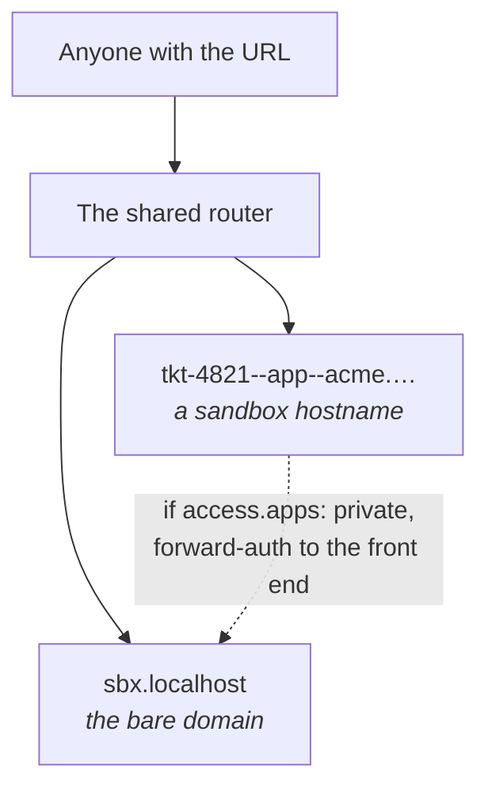

A sandbox has one access setting — whether its apps are open — and one mechanism for everything
else, which sandboxer builds and does not answer. This page describes both, plus the refusals
that come with making apps public.

```prompt
Review the access settings for every project on this machine before I expose it beyond
localhost.

Read docs/access.md and work through the checklist at the bottom of it. Report, per
project, its `access.apps`, its `access.credentials`, and which seed source it would
actually use. Then run `sandboxer doctor` and tell me whether the router is serving https
and what, if anything, is answering on the bare domain.

Stop and tell me — do not change anything — if any project is `public` while seeding from
a live database or carrying real credentials.
```

| | Default | Who decides |
|---|---|---|
| **The apps** a sandbox serves | `public` — anyone who can reach the URL | `access.apps: private` in the project's `sandboxer.yaml` |
| **The bare domain** — whatever control plane you put there | Nothing is serving it | Whoever starts a container there. sandboxer starts none |



## Why apps are open by default

The point of a sandbox is sending somebody a link. A designer or the person who filed the
ticket should not need an account on your machine to see a preview of unreleased work.

By default the router publishes on `127.0.0.1` only, so "public" means *public to this
machine's browsers*. Binding beyond loopback is what makes it public in the ordinary sense —
`sandboxer init --bind 0.0.0.0`, or running on a server. Read the rest of this page first.

## The `private` tier

```yaml
access:
  apps: private
```

Every one of that project's app hostnames then goes through a check in the shared router
before anyone sees it. A `public` project skips that check entirely.

Use `private` when the branch itself is sensitive, when the sandbox needs real data, or when
it needs real third-party credentials.

The check is a **forward-auth middleware**, and what it asks is a front end on the bare
domain. sandboxer writes the middleware, routes the hostnames and knows which of them must be
protected. It does not decide anything: whoever put a container on the bare domain does, and
the engine forwards the request only when that container answers `200`. There is no per-app
exception — a private project is private on every hostname it has.

> [!IMPORTANT] Nobody has watched the whole handshake run
> The middleware is written and unit-tested. Nothing in this repository answers it, so nobody
> has run a browser through the whole thing against a live private project. Everything in this
> section is what the code does; none of it is something that has been seen happening.
> [What is built](reference/status.md) is the whole inventory.

<details class="agent">
<summary><b>Details for an agent</b> — the middleware, the label it points at, and how the router knows</summary>

`sandboxer init` writes `dynamic/middlewares.yml` under the router's config directory:

```yaml
http:
  middlewares:
    sandboxer-auth:
      forwardAuth:
        address: "http://sandboxer-dashboard:8080/auth/verify"
        trustForwardHeader: true
```

The container name and the port are **named by the caller** — `frontendContainer` and
`frontendPort` on `initAccess` — because the engine starts no front end, so there is nothing
to look up at the moment the address has to be decided. The values above are the defaults.
`trustForwardHeader: true` is what sends the original hostname across, so a verifier can
answer per project rather than per machine.

A sandbox's container carries the label `sandboxer.access`, set to `public` or `private` from
the config. The router reconciles from Docker labels, so starting or stopping a sandbox never
regenerates a config file and never triggers a reload. A `private` sandbox's route labels name
the `sandboxer-auth@file` middleware; a `public` one's do not.

`access.apps` is read once, when the routes are written. A project changed to `private` is
protected on the next `up` and not before, which is why `sandboxer config` reports the resolved
value rather than the file's.

The container is told the same thing as `SANDBOXER_ACCESS`. **Nothing reads it back** — no
container script and no host package. It is a fact a project's own code may read, not a second
copy of the decision, and the decision is enforced at the router or not at all.

`/.sandboxer/` is a reserved path on **every** sandbox hostname on the machine, public projects
included. The router sends it to the front end rather than to the sandbox, because the cookie
that opens a private app has to be set on that app's own hostname and only something answering
there can set it. A project that serves a route of its own under that prefix will find the
front end answering instead.

</details>

## The bare domain, and what `sandboxer init` does not do

`sandboxer init` prepares the whole domain and then leaves it empty. It makes the directories,
creates the shared Docker network, builds the base image, issues the certificate, writes the
router config, starts the router and writes `host.env` — and then prints that **nothing is
serving `https://<domain>`**, because sandboxer is a command-line tool.

That is not a failure to report. There is no control plane in this repository and no password:
whatever answers on the bare domain is somebody else's container, and the engine's whole part
in it is a label.

<details class="agent">
<summary><b>Details for an agent</b> — claiming the bare domain, and what the report hands you</summary>

A container claims the bare domain with the label `sandboxer.frontend`, whatever the container
is. `frontendRouteLabels` in `packages/core/src/access/frontend.ts` builds the rest: two
routers onto one service, the bare domain and the reserved handshake path on sandbox
hostnames. `listFrontends` is one `docker ps` for everything currently claiming it.

Holding that label is a claim to own the machine's authentication, not a routing convenience.
It is what the forward-auth middleware calls, and the engine believes its answer.

`AccessReport.frontend` from `initAccess` is where a front end must listen and what the router
will send it — `{ port, domain, tls }`. `sandboxer doctor` reports what is actually there, and
says `nothing is serving <url> — sandboxer is a command-line tool` when the answer is nothing.
An empty bare domain is **not** a failed check: it is the ordinary state of a machine that has
run `init`, and reporting it as a fault would point somebody back at `init` in a loop that
cannot end.

`access.controls` in `sandboxer.yaml` accepts exactly one value, `password`, and there is no
setting that removes it. The engine parses the field and enforces nothing: it is a statement
about the control plane, for the control plane to keep.

See [Contracts](architecture/contracts.md) §7.2 for the whole of what putting a container
there takes.

</details>

## Two refusals on a public sandbox

Making the apps public brings two hard requirements. Both are **refusals**, not warnings.

### 1. Where the data comes from

| `seed_from` source | `public` | `private` |
|---|---|---|
| `fixtures` | allowed | allowed |
| `file` with `anonymised: true` | allowed | allowed |
| `file` without it | **refused** | allowed |
| `local` — forking a database you run | **refused** | allowed |

A public URL over real records is a data leak, whatever the intention. So a dump counts as
anonymised only where the author said so, in the config:

```yaml
database:
  seed_from:
    file: /var/sandboxer/seeds/acme.sql.zst
    anonymised: true
```

The flag is an assertion by whoever wrote the config, not something the tool can verify.
"Anonymised" means anonymised: names, emails, addresses, phone numbers, payment details and
free text all replaced.

> [!NOTE] Listing several sources is not a violation
> A config is refused only when *none* of its sources is permissible. Which source a run uses
> depends on the machine — a laptop forks the container the developer already runs, a server
> restores a dump. So the choice is made when a sandbox starts, and refused there if the
> chosen source is not allowed.

<details class="why">
<summary><b>Why it works this way</b> — an assertion rather than a check</summary>

The tool cannot tell an anonymised dump from a real one. So the honest design is to make
somebody state it explicitly in a reviewed file, rather than to imply a guarantee that does
not exist.

A flag you set because it was in the way is worse than no flag. It looks like a decision
somebody made.

</details>

### 2. The credentials

```yaml
access:
  apps: public
  credentials: dummy    # the default
```

With `credentials: dummy` and a secrets file that **holds something**, `sandboxer up` refuses
to start and names both ways out: `credentials: real`, or `apps: private`. What matters is
whether anything is in the file, not whether the file is there — an empty one carries no
credentials and is no reason to refuse.

Anyone who can drive a public app can make it send real email or spend real credit. Supply
harmless values through `env:` instead. See [Secrets](configuration/secrets.md).

### Why refusals and not warnings

Neither failure can be undone. Leaked records stay leaked, and money spent calling somebody's
API stays spent. A warning is a thing you read after the fact.

Every refusal names the field and both ways out. The exact wording of each is on
[The rules a config must obey](configuration/rules.md#public-projects-the-two-refusals), and
the requirement itself is [Contracts](architecture/contracts.md) §5.3.

## A sandbox that can open a pull request

Git works in every sandbox. `status`, `diff`, `log` and `commit` all behave, and a commit
carries the same name and address as one made on the host. None of that needs a credential.

Pushing does. `gh` is in every sandbox, but it is logged out until you say otherwise, in
`~/.sandboxer/config.yaml`:

```yaml
github: none          # the default: no sandbox gets a token

projects:
  acme-monorepo: { github: token }
```

The key is the project's directory in the workspace — the name every URL carries — or the
`project:` its own `sandboxer.yaml` declares. Either works, and a key that is neither quietly
does nothing; `sandboxer doctor` names one that matches no project.

`github: token` hands that project's sandboxes the credential `gh auth token` prints on this
machine. `gh` picks it up on its own, and git's https helper asks `gh` for it. So both
`gh pr create` and `git push` work, which is the whole of what an agent needs to finish a
branch.

> [!WARNING] The token is in the environment of every process in that container
> Not just an agent's. The project's own code, a dependency's install script and anything a
> session runs can read it. A personal token's scope is usually *your* scope: push access to
> every repository you can reach. That is a real widening, which is why it is per project
> rather than machine-wide, and off until you turn it on.

To turn it off, set `github: none` (or delete the entry) and start the sandbox again.
Nothing is stored: the token is read at `up` and lives only in the container's environment.

**You are told when it is off, at the start rather than at the push.** `up` prints a line naming
the exact key that would turn it on, and `sandboxer config` in the worktree prints the resolved mode
with the key that decided it. That exists because `git commit` works either way, so the absence has
no symptom at all until a push fails — which, for an agent working unattended, is hours later.

<details class="why">
<summary><b>Why it works this way</b> — two behaviours of the token, and why the setting is not in <code>sandboxer.yaml</code></summary>

- **It is not refused for a `public` project**, unlike a real secrets file. Nothing serves
  `GH_TOKEN` over http, so reading it means executing code inside the container. A public
  sandbox is still a dev build of an unfinished branch on an open hostname, so `up` says so
  once when the two settings meet.
- **Handing a sandbox the token is not the same as permitting its use.** Whatever runs
  commands in there should keep `git push` and `gh` outside what it does without asking.
  Everything inside a sandbox is recoverable by deleting it, right up until a command reaches
  the network as you. The engine cannot enforce that distinction — it sets the variable and
  stops.

The setting lives on the machine because the token is yours, not the project's. A setting in
a repository is a setting a repository can *ask for*, and cloning something new should never
be a way to be handed your credentials.

[Contracts](architecture/contracts.md) §7.1 is the whole of it, including the two mounts that
make git work at all.

</details>

## Before you expose anything beyond your machine

- [ ] `access.apps` is what you meant for **every** project on the machine.
- [ ] No project seeds from `local`, and every `file` seed is genuinely anonymised.
- [ ] `credentials` is `dummy` everywhere it should be, and you know why anywhere it is
      `real`.
- [ ] You know what is answering on the bare domain, and it has authentication of its own.
      `sandboxer doctor` names it, and names nothing unless you put something there.
- [ ] The router is serving HTTPS, not plain HTTP.
- [ ] Only 80 and 443 are open. Sandbox containers publish **no** host ports; the router
      reaches them by container name on the shared Docker network.

Remote deployment does not exist yet — no certificate automation, no DNS record, no service
unit. [On a server, for a team](setups/shared-server.md) says what that costs.

## What this protects against, and what it does not

| Protects against | Does not protect against |
|---|---|
| A public app revealing real customer records | A public app revealing unreleased *features*, which is the point |
| A stranger opening a private project's apps — as well as the front end on the bare domain manages it | A front end that answers `200` to anyone, because the engine asks it and believes the answer |
| A sandbox reaching GitHub as you, until you opt in | A project you *have* opted in, where the token is readable by anything running in the container |
| A sandbox hostname being reachable without going through the router | A branch's own code, which runs with the sandbox's access to its own database and storage |
| | The worktree, which is bind-mounted read-write |

**Next:** [The rules a config must obey](configuration/rules.md) for the exact wording of every
refusal, or [Secrets](configuration/secrets.md) for what may and may not reach a sandbox, and
how the one file that holds it is edited.
</content>
</invoke>
