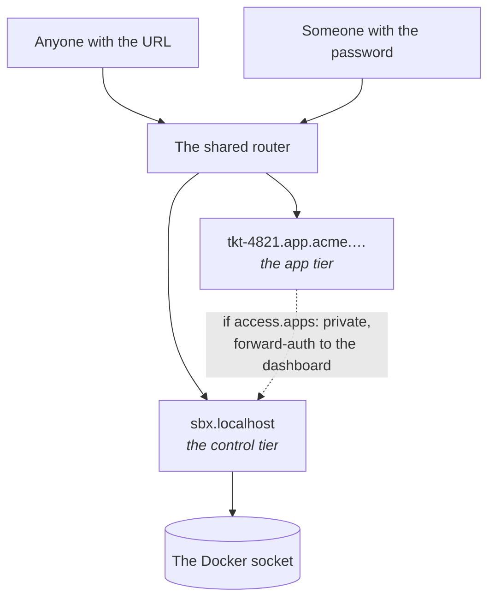

sandboxr has exactly two tiers, and they are not negotiable in the same way.

| | Default | Can it be turned off? |
|---|---|---|
| **The apps** a sandbox serves | `public` | Yes: `access.apps: private` |
| **The controls** — dashboard, terminal, start, stop, rebuild, migrate | Behind a password | **No** |



## Why apps are open by default

The point of a sandbox is sending somebody a link. A designer, a product manager, the person who
filed the ticket — none of them should need an account on your machine to look at a preview of
unreleased work.

By default the router publishes on `127.0.0.1` only, so "public" means *public to this machine's
browsers*. Binding beyond loopback (`sandboxr init --bind 0.0.0.0`, or running on a server) is what
makes it public in the ordinary sense. Read the rest of this page before you do that.

## Why the controls are not negotiable

The dashboard talks to the Docker socket. A control endpoint reachable without a password is not a
misconfigured page — it is the ability to run anything on the host.

So `access.controls` accepts exactly one value, `password`, and there is no setting that removes
it. A sandbox with no password set still starts; the dashboard simply admits nobody.

The set of things the controls can do is a **closed table** in the server's source. There is no
"run this command" box and there must never be one, because behind a password that would be a
remote shell with an extra step. [The dashboard](guides/dashboard.md) lists the table and the
security properties, each of which has a named test.

## The `private` tier

```yaml
access:
  apps: private
```

Every one of that project's app hostnames then goes through a forward-auth middleware in the
shared router, which asks the dashboard's `GET /auth/verify` whether the request carries a valid
**app token** — and whether its grant covers this project. A `public` project skips the
middleware entirely.

### One login, two tokens

`POST /auth/login` sets two signed cookies, not one. Both are `HttpOnly`, `Secure` and
`SameSite=Lax`.

| Cookie | Scope | Accepted by | Authorises |
|---|---|---|---|
| `sandboxr_session` | **Host-only** — the bare domain, nothing else | Every control route, and the terminal | The controls. Root-equivalent |
| `sandboxr_app` | `Domain=<domain>` — sandbox hostnames too | `GET /auth/verify`, nothing else | *Viewing* the private apps its grant covers |

They are not interchangeable. Each is signed over its own version tag, so relabelling one as the
other breaks the signature: a control session sent to `/auth/verify` is a 401, and an app token
sent to any control route is a 401.

The second cookie exists because a browser can only send a sandbox hostname a cookie scoped to
reach it, so a host-only control session never arrives and a private app is unreachable. The
obvious fix — putting `Domain` on the control session — is the one thing that must never be done.
A sandbox hostname serves the project's own code from a branch under review, so every cookie sent
there lands in a header that branch code handles, and the control session authorises actions
against the Docker socket. Widening it would hand every sandboxed app, and every public sandbox
reachable from the internet, a credential worth root on the host. `HttpOnly` is no defence: the
read is server-side, not page script.

> [!NOTE] What the app token still exposes
> A cookie cannot be scoped to "private hostnames only", so `sandboxr_app` reaches every host
> under the domain, public projects included. A malicious or compromised app can capture it and
> view the private apps its grant already covered. Bounded to viewing — no control, no Docker
> socket, no path to the other tier. Every cookie-based scheme pays some version of this; the
> design that avoids it is a redirect handshake issuing a token bound to one hostname, which is
> not built.

> [!WARNING] A signed-out browser gets a bare 401
> Forward-auth cannot send you a login page from an app hostname, so an expired or missing app
> token shows `{"ok":false}` rather than a form. Log in on the bare domain first, then load the
> app.

Use it when the branch itself is sensitive, when the sandbox needs real data, or when it needs
real third-party credentials.

## Two refusals on a public sandbox

Making the apps public brings two hard requirements. Both are **refusals**, not warnings.

### 1. Where the data comes from

| `seed_from` source | `public` | `private` |
|---|---|---|
| `fixtures` | allowed | allowed |
| `file` with `anonymised: true` | allowed | allowed |
| `file` without it | **refused** | allowed |
| `local` — forking a database you run | **refused** | allowed |

A public URL over real records is a data leak, whatever the intention. A dump is only anonymised
if the author said so, in the config, where a reviewer can see it:

```yaml
database:
  seed_from:
    file: /var/sandboxr/seeds/acme.sql.zst
    anonymised: true
```

> [!NOTE] Listing several sources is not a violation
> A config is refused only when *none* of its sources is permissible. Which source a run uses
> depends on the machine — a laptop forks the container the developer already runs, a server
> restores a dump — so the choice is made when a sandbox starts.

"Anonymised" means anonymised: names, emails, addresses, phone numbers, payment details and free
text replaced, not obscured. A flag you set because it was in the way is worse than no flag,
because it looks like a decision somebody made.

### 2. The credentials

```yaml
access:
  apps: public
  credentials: dummy    # the default
```

With `credentials: dummy` and a secrets file present, `sandboxr up` refuses to start, and names
both ways out: `credentials: real`, or `apps: private`.

Anyone who can drive a public app can make it send real email, spend real credit, or write to
somebody's account. Supply harmless values through `env:` instead.

### Why refusals and not warnings

Neither failure can be undone. Leaked records stay leaked, and money spent calling somebody's API
stays spent. A warning is a thing you read after the fact.

Every refusal names the field and both ways out, so it is a decision you make rather than a wall
you hit.

## Different people, different projects

One password grants everything. Several passwords can each grant a subset:

```bash
export SANDBOXR_PASSWORD='...'              # every project
export SANDBOXR_PASSWORD_ACME='...'         # the acme project only
export SANDBOXR_PROJECTS_ACME='acme,demo'   # ...or name what it really grants
```

**The name in the variable is the project it grants**, not the person it belongs to. The grant is
checked everywhere: the sandbox list is filtered, actions are refused, the terminal will not open,
and the private-app check refuses a hostname the session was not granted.

Passwords are read once at startup and then **deleted from the environment**, so nothing the
dashboard spawns inherits them. The table holds a hash and a salt; comparison is timing-safe.

## Why the terminal is a page, not a hostname

An in-container shell is the most powerful thing sandboxr offers, so it lives inside the dashboard,
behind the same session as every other control. Giving it a hostname of its own would put a shell
one DNS record away from the app tier, where the whole design assumes anyone may arrive.

## Before you expose anything beyond your machine

- [ ] `access.apps` is what you meant for **every** project on the machine, not just the one you
      are thinking about.
- [ ] No project seeds from `local`, and every `file` seed is genuinely anonymised.
- [ ] `credentials` is `dummy` everywhere it should be, and you know why anywhere it is `real`.
- [ ] `SANDBOXR_PASSWORD` is long and random, and per-project passwords exist for anyone who
      should not have everything.
- [ ] The router is serving HTTPS, not plain HTTP.
- [ ] Only 80 and 443 are open. Sandbox containers publish **no** host ports; the router reaches
      them by container name on the shared Docker network.

## What this protects against, and what it does not

| Protects against | Does not protect against |
|---|---|
| A stranger starting, stopping or deleting your sandboxes | Anyone who has the password — they have everything |
| A stranger opening a shell on your machine | A branch's own code, which runs with the sandbox's access to its own database and storage |
| A public app revealing real customer records | A public app revealing unreleased *features*, which is the point |
| One project's password reaching another project | The worktree, which is bind-mounted read-write |

## Related

- [The dashboard](guides/dashboard.md) — the closed action table and the tested properties
- [Secrets](configuration/secrets.md) — what may and may not be imported
- [Running on a server](running-on-a-server.md)
