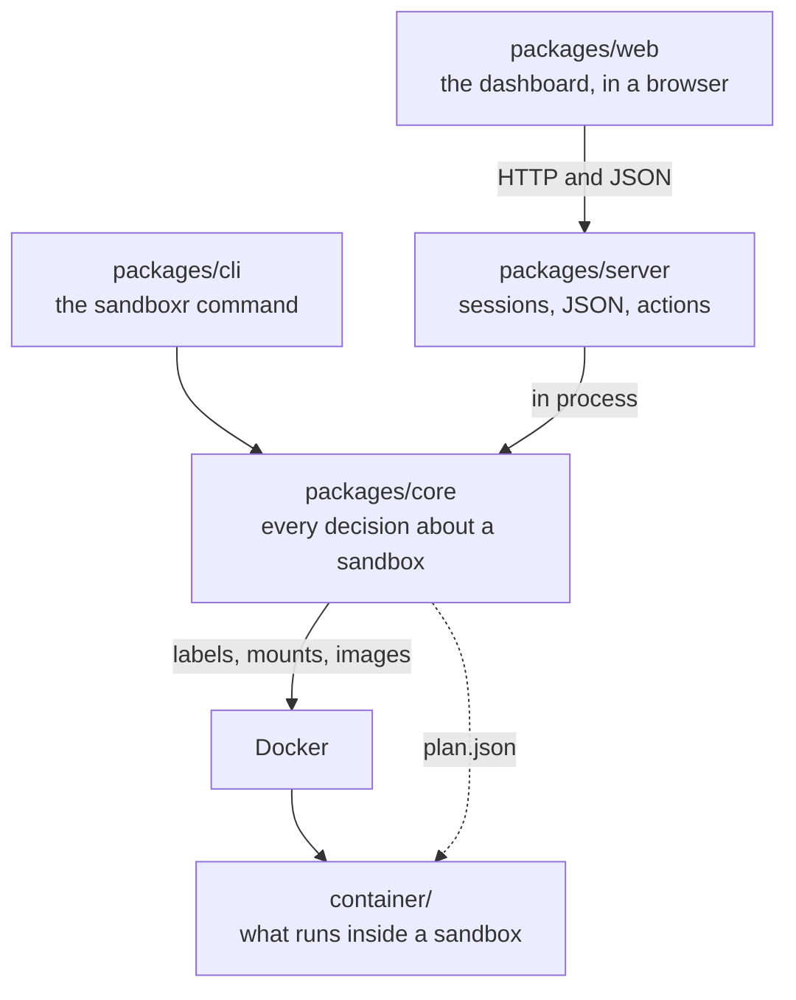

sandboxr is six pieces of code. This page names each one and says what it owns. Every other page
in this section is a detail of one of the boundaries drawn here.

One rule explains the whole layout. **One piece decides what a sandbox is, and everything else
asks it.** That piece is `packages/core`. The command line and the dashboard are two faces over
it, and neither is allowed a second opinion.

If you have not read [How it works, in five steps](../how-it-works.md), read that first. It tells
the same story from the outside, without naming a package.

## The one that decides

`packages/core` holds every decision. What a [slug](../reference/glossary.md) is. What a
container is called. Which files get mounted where. How much memory the container gets. Whether a
[sandbox](../reference/glossary.md) counts as running, starting or degraded. What a database
driver has to do. It talks to Docker and to git, and it answers questions.

Core is a library. It has no command line and no web server of its own.

## The two faces

`packages/cli` is the `sandboxr` command. It parses arguments, calls one core function, and
prints the result. That is all it does.

`packages/server` is the dashboard's server. It owns sessions, the password, the JSON API, the
streamed action output and the terminal socket. It calls core **in the same process** — it never
runs the `sandboxr` command to get an answer.

`packages/web` is the dashboard as it appears in a browser: React, built by Vite. It renders what
the API sends and posts actions back. It decides nothing about what a sandbox is.

## The one that runs inside

`container/` is what lives *inside* a sandbox: the two Dockerfiles, the s6 service definitions and
the shell scripts. It is generic. It knows nothing about any particular project, and it reads
everything it needs from one file the host writes for it, [`plan.json`](plan-json.md).

This is the only directory in the repository that contains shell scripts. Everything on the host
side is TypeScript.

## The one that publishes these pages

`packages/docs` is the machinery that turns `docs/` into a website. The pages themselves are plain
Markdown in `docs/`, so they read on GitHub with no build step.

## How they fit together

## What each one may not know

The prohibitions matter more than the responsibilities, because each one closes off a way for two
parts of sandboxr to disagree.

| Piece | May never |
|---|---|
| `packages/core` | Print for a human, or know that a web server exists |
| `packages/cli` | Decide anything. If the dashboard could disagree with it, the logic is in the wrong place |
| `packages/server` | Shell out to the `sandboxr` command, or reimplement a core rule |
| `packages/web` | Hold any logic about what a sandbox is — which actions apply, what makes one degraded, how a slug is derived |
| `container/` | Read `sandboxr.yaml`, or name a service, port, package or route of its own |
| `packages/docs` | Be required for a page to be readable |

<b>Why it works this way</b> — what a second implementation costs

Volume names keyed on a lockfile hash. Seed cache invalidation. Plan resolution. The worktree
cases. Every one of those is fiddly, and every one of them is needed by both the command line and
the dashboard.

A second implementation of any of them drifts within a week. Then the two disagree about what a
sandbox is, and a person watching one of them is being told something false. So there is one
implementation, in core, and the dashboard reaches it through exactly one file:
`packages/server/src/core/adapter.ts`.

The dashboard does talk to the Docker socket directly, for two things core cannot express:
streaming an exec line by line, and hijacking a connection for a terminal.

## The contract behind all of this

[`docs/architecture/contracts.md`](contracts.md) is the authority on every boundary named above: naming, paths,
the config schema, the driver interface, the plan, access control. A package that disagrees with
it is a bug.

It is written for people changing the code, so it is deliberately not one of these pages.
[Read it in the repository](contracts.md).

**Next:** [Package by package](packages.md) for the same six pieces in full, including the
interfaces between them. Or [How a request arrives](request-path.md) if you are chasing a routing
problem right now.
