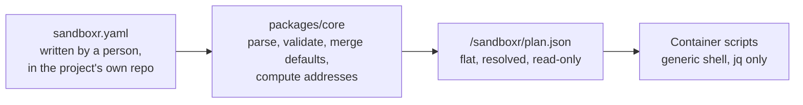

> **Partly verified** — The emitter in packages/core is written and unit-tested, and the container's generators have been run against both worked example plans. No plan emitted by packages/core has ever started a real project.

`sandboxr.yaml` is the file a person writes. **Nothing inside a container ever reads it.**

The host turns it into one flat file — `plan.json` — and mounts that into the container,
read-only. Everything the container does is a function of that file: which services exist, what
the router serves, which database to bring up, what environment each process gets. Nothing in the
container's scripts names a service, a port, a package or a route.

This is the single most important boundary in sandboxr, so it is worth being clear about why it
is drawn here at all.



*Resolution happens once, on the host, where there is a schema and a type checker.*


## Why the boundary is here

**Because the container would otherwise have to do the thinking in shell.** Merging defaults into
every entry, checking that a dev server has a port, deciding what a hostname is, working out which
service may open a database file — that is easy in a language with a schema and a type checker. On
the container side there is `jq` and nothing else. Worse, the container's version of those rules
would have to agree with the host's version, exactly, for ever. Two implementations of one set of
defaulting rules drift apart within a month, and the symptom is a sandbox that disagrees with the
`sandboxr config` output about what the project is.

**Because one image has to serve every project.** A multi-service monorepo on MySQL and a single
Cloudflare Worker on a file database run from the same generic container. That is only possible if
the container knows nothing about either.

**Because a flat plan has nothing left to infer.** Every default is already merged, every optional
field is either present or absent. A script reading the plan never reproduces a defaulting rule,
because there is no rule left to reproduce.

> [!NOTE] Where the specification actually lives
> `container/README.md`, section "The plan", is the authoritative specification, with two worked
> examples in `container/examples/*.plan.json`. The emitter is
> `packages/core/src/config/plan.ts`, and a test compares what it emits against the shape of those
> examples — which is what keeps the two halves honest. This page explains the file; those are the
> contract.

## The whole plan

Here is a complete plan for the fictional project **acme**: three Go backends, several front-end
apps, a CMS running as a dev server, MySQL, and object storage.

```jsonc
{
  "project": "acme",                    // required

  "database": {
    "driver": "mysql",                  // mysql | d1 | sqlite | none
    "version": "8.4",
    "name": "acme",                     // defaults to the project name
    "owner": "app",                     // file drivers: the one service that may open it
    "fixtures": "db/seeds/fixtures.sql",         // repo-relative
    "seed": { "path": "acme-3f2a1b.sql.zst", "anonymised": true },
    "migrate": {
      "workdir": "services",            // repo-relative; omitted means run in an empty directory
      "command": "go run ./cmd/migrate --env local",
      "since": "20240101",              // exported as SANDBOXR_MIGRATE_SINCE
      "failure_pattern": "[0-9]+ failed",
      "file_pattern": "[0-9]{8}-[^ ]+\\.sql",
      "error_pattern": "Error [0-9]+ \\([0-9A-Z]+\\):.*"
    }
  },

  "storage": { "driver": "minio", "buckets": ["uploads", "avatars", "exports"] },

  "toolchain": { "go": "1.23", "node": "22" },

  "deps": {                             // omitted entirely if there is no Node tree
    "root": "web",                      // repo-relative directory holding the lockfile
    "lockfile": "package-lock.json",
    "install": "npm ci --no-audit --no-fund"
  },

  "services": [
    { "kind": "backend", "name": "api", "label": "api", "port": 8001,
      "health": "/health", "workdir": "services",
      "build": "go build -o {out} ./{name}" },

    { "kind": "static", "label": "app", "package": "web", "root": "web/packages",
      "build": "npx vite build", "out": "dist",
      "static_mode": "spa" },

    { "kind": "server", "label": "cms", "package": "cms", "root": "web/packages",
      "serve": "npx next dev --port 3000 --hostname 127.0.0.1", "port": 3000,
      "prepare": "npm run codegen", "optional": true }
  ],

  "routes": { "app": { "/api": "api", "/cms": "cms" } },

  "env": { "DB_HOST": "${SANDBOXR_DB_HOST}", "S3_BUCKET": "uploads" }
}
```

Nine top-level keys. The rest of this page is each one.

> [!TIP] An absent field is absent, not null
> The emitter drops keys whose value is undefined rather than writing `null` or `false`. The
> container reads the plan with `jq`, where a missing key is the natural idiom and a `null` has to
> be special-cased at every single read.

## `project`

The project's name. Required, and it appears in the container name, the volume names and every
hostname the sandbox serves. Lower-case letters, digits and hyphens.

## `database`

Everything about the sandbox's own database. Note "its own" — a sandbox never touches the source
it was seeded from.

- **`driver`** is `mysql`, `d1`, `sqlite` or `none`, and it decides which services exist at all.
  With `none`, the sandbox has no database services and is much cheaper.
- **`version`** is the version to bring up. The version the project's production runs, not
  whatever the developer happens to have installed — a migration is only meaningfully tested
  against the version it will really run on.
- **`name`** defaults to the project name, and is resolved here rather than in the container so
  that the name is decided in exactly one place.
- **`owner`** matters only for the file-backed drivers, and names the single service allowed to
  open the database file. Two processes opening the same file deadlock.
- **`fixtures`** is a repo-relative file applied after migrations.
- **`seed`** names the artifact in the mounted cache, and says whether the person who wrote the
  config asserted it is anonymised. That assertion is what a public sandbox is checked against.
- **`migrate`** is the project's own migration command and how to read its output.

<details>
<summary><b>Details for an agent:</b> every database field, its type, and the one field resolved by the host that the config does not carry</summary>

| Field | Type | Notes |
|---|---|---|
| `driver` | `mysql` \| `d1` \| `sqlite` \| `none` | Decides the service graph |
| `version` | string | Omitted for `none` |
| `name` | string | Defaulted to `project` by the emitter; omitted entirely for `none` |
| `owner` | string | Required in the plan for `d1` and `sqlite` |
| `fixtures` | string | Repo-relative path, applied after migrations, non-fatal |
| `seed.path` | string | **Basename only** — the file as it appears in `/sandboxr/cache` |
| `seed.anonymised` | boolean | `true` for a fixtures seed by construction, or for a `file` seed the config marked `anonymised: true` |
| `migrate.command` | string | The project's own runner. sandboxr never reimplements migration logic |
| `migrate.workdir` | string | Repo-relative. Absent means run from a directory where no project config file resolves |
| `migrate.since` | string | Exported as `SANDBOXR_MIGRATE_SINCE`; the command must consume it |
| `migrate.failure_pattern` | regex | A match means failed, whatever the exit code said |
| `migrate.file_pattern` | regex | Extracts which file failed, for the status document |
| `migrate.error_pattern` | regex | Extracts the error text, for the status document |

**`owner` is resolved by the emitter, not copied.** The config may leave it out when a project has
only one runtime, because there is then nothing to choose between — but the plan may not, because
the container withholds the database's location from every service that is not the owner. An
absent owner there means *no* service gets it, and the one that needed it fails on a missing
binding. `ownerFor` in `packages/core/src/config/plan.ts` fills in the single candidate.

</details>

## `storage`

`driver` is `minio` or `none`, plus a list of buckets to create at boot. This is object storage
*inside* the sandbox, so an upload can never reach a real bucket. The stand-in is in the base
image whether or not a project asks for it, because that is a guarantee rather than a feature.

## `toolchain`

Which language runtimes the project's image layer installs — `go` and `node` today, as version
prefixes like `1.23` or `24`. A prefix, not an exact version, because the image build resolves it
against the vendor's published index.

## `deps`

The project's dependency tree, and the block is omitted entirely when there is none.

- **`root`** is the repo-relative directory holding the lockfile. For a monorepo that is often not
  the repository root.
- **`lockfile`** is the file to hash. The hash is what the shared dependency volume is named after,
  so two sandboxes with identical dependencies share one install.
- **`install`** is the command to run when the branch's lockfile does not match the image's.

The mechanics of why this exists at all — the bind mount hiding what the image installed — are on
[the startup graph](./startup.md#dependency-caching-and-why-deps-init-exists).

## `services`

One array, carrying all three kinds of thing a project can run, each with an explicit `kind`.

`backends` and `frontends` are a *human* distinction: they read better in a config file. At
runtime they are the same sort of entry with a different `kind`, and flattening them here is what
lets the container iterate over "everything this project runs" without knowing the config's shape.

| `kind` | What it is | Built | Runs as |
|---|---|---|---|
| `backend` | A compiled service with a port | On demand, to a binary | A supervised process |
| `static` | A front-end that builds to a directory | On demand | No process at all — files |
| `server` | A front-end that *is* a long-running server | Nothing to build | A supervised process |

[Three runtime kinds](../configuration/runtime-kinds.md) covers why the third one cannot be folded into
either of the others.

<details>
<summary><b>Details for an agent:</b> every field of every service kind, including the two the config schema does not have</summary>

**`kind: backend`**

| Field | Notes |
|---|---|
| `name` | The service's own name. Used for the binary, the service id and route targets |
| `label` | The hostname part it is served on |
| `port` | The loopback port it listens on. Injected as `PORT` when the service starts |
| `build` | The build command. `{out}` and `{name}` are substituted |
| `health` | A path the router proxies at `/__sandboxr/health/<name>` |
| `workdir` | Repo-relative directory to build in |
| `memory` | This service's requirement. Raises the whole container's limit |
| `optional` | Written only when true |

**`kind: static`**

| Field | Notes |
|---|---|
| `label` | The hostname part, and the directory under `/srv/www` |
| `package` | The package directory name |
| `root` | Repo-relative directory the packages live under. Always present, `.` when there is no prefix |
| `build` | The build command |
| `out` | The directory the build produces, relative to the package |
| `static_mode` | `spa` \| `files` \| `html`. Defaults to `spa` |
| `memory` | Checked against the container's limit *before* the build starts |
| `in_build_all` | Written **only when false** — the default is to be included |
| `optional` | Written only when true |

**`kind: server`**

| Field | Notes |
|---|---|
| `label`, `package`, `root` | As for `static` |
| `serve` | The command that runs the server. Must bind loopback |
| `port` | The port it binds. Injected as `PORT` |
| `prepare` | An optional one-off command before it starts, such as code generation |
| `health`, `memory`, `optional` | As above |

**Two fields have no counterpart in the config schema and are part of the contract anyway**
(§5.4): `static_mode`, because the three ways to serve a directory are genuinely different and a
wrong guess half-works rather than failing; and `in_build_all`, so "rebuild everything" can skip
something expensive and rarely wanted.

`root` is always written, even as `.`, because the container joins it with the package name
unconditionally and an absent key would have to be defaulted in shell — which is exactly the kind
of second decision this file exists to prevent.

</details>

## `routes`

Path prefixes served on an app's own hostname, mapped to the service that should answer them.

```jsonc
"routes": { "app": { "/api": "api", "/cms": "cms" } }
```

Read it as: on the `app` hostname, anything under `/api` goes to the service called `api`. The
target may be a backend's `name` or any service's `label`, and `name` wins. Ordering in the file
does not matter — the router generator sorts prefixes longest-first, so `/api/admin` can never be
swallowed by `/api`.

This exists to take CORS out of the picture:
[the full reasoning](./request-path.md#why-routes-exists-at-all).

## `env`, the join between two vocabularies

```jsonc
"env": { "DB_HOST": "${SANDBOXR_DB_HOST}", "APP_URL": "${SANDBOXR_URL_APP}", "S3_BUCKET": "uploads" }
```

The container works out **where** things are. The project reads **its own names** for them —
`DB_HOST`, `DATABASE_URL`, `MYSQL_ADDR`, whatever that project happens to call it. Something has
to join the two, and only the project knows its own spelling, so the plan carries the mapping.

Values are expanded with `envsubst`, a tool that substitutes `${...}` placeholders and **does not
run a shell**. A value in the plan is therefore data, and can never be a command. That is
deliberate: the plan is generated from a file in a project's repository, and a project repository
is not a trust boundary you want handing shell strings to a container's startup.

> [!WARNING] This block is for addresses, not secrets
> Anything genuinely secret comes from the project's secrets file, which the host passes separately
> and which never appears in the plan. The plan is written to
> `~/.sandboxr/build/<project>/<slug>.plan.json` at ordinary file permissions and is readable by
> anyone who can read the sandbox's configuration.

## What the sandbox computes for itself

The contract forbids importing anything that describes *where* something runs. Importing a
developer's `DB_HOST` would point a disposable copy at their real database; importing storage
credentials would point it at real cloud storage. So the container derives those itself and
exports them under a `SANDBOXR_` prefix, and the `env` map above is how a project reaches them.

| Variable | Present when |
|---|---|
| `SANDBOXR_DB_DRIVER`, `SANDBOXR_DB_NAME`, `SANDBOXR_DB_DIR` | always |
| `SANDBOXR_DB_HOST`, `_PORT`, `_USER`, `_PASSWORD` | `driver: mysql` |
| `SANDBOXR_DB_FILE` | `driver: sqlite` |
| `SANDBOXR_D1_DIR`, `SANDBOXR_D1_OWNER` | `driver: d1` |
| `SANDBOXR_S3_ENDPOINT`, `_KEY`, `_SECRET`, `_REGION` | storage is declared |
| `SANDBOXR_URL_<LABEL>` | one per label, upper-cased with hyphens as underscores |
| `SANDBOXR_PORT_<SERVICE>` | one per port-holding service |
| `SANDBOXR_MIGRATE_SINCE` | `migrate.since` is set |

`SANDBOXR_URL_<LABEL>` exists because only the container knows both the slug and the domain at the
moment a build runs. Same-origin API calls do not need it — the router serves `/api` on the app's
own hostname — but a link from one app to another needs an absolute, slug-bearing URL.

> [!TIP] `migrate.since` arrives as a variable, not a flag
> sandboxr cannot guess a runner's flag spelling, so `since` is exported as
> `SANDBOXR_MIGRATE_SINCE` and the command in the config has to consume it:
>
> ```yaml
> migrate:
>   command: go run ./cmd/migrate --since "$SANDBOXR_MIGRATE_SINCE"
> ```

## File-backed drivers must be pointed at the sandbox's own directory

This is the one thing a project config has to get right for `d1` and `sqlite`, and getting it
wrong is quiet rather than loud. Both the `serve` and the `migrate` commands must direct the
runtime at the sandbox's state directory:

```yaml
database:
  driver: d1
  owner: app
  migrate:
    command: npx wrangler d1 migrations apply DB --local --persist-to $SANDBOXR_D1_DIR

frontends:
  apps:
    - label: app
      package: .
      serve: npx wrangler dev --port 8787 --ip 127.0.0.1 --persist-to $SANDBOXR_D1_DIR
      port: 8787
```

Without it, the runtime writes its state **into the worktree**. Which means the sandbox's data
lands in your branch, two sandboxes on one worktree share a database file, and the
[one-writer rule](../databases/d1-sqlite.md#one-writer-per-file) is broken by construction.

## Where the plan lives, and what else is mounted

The plan is written on the host and mounted **read-only** — a container that could rewrite its own
plan could change what it claims to be running.

<details>
<summary><b>Details for an agent:</b> every path the container expects mounted, and the environment the host must pass</summary>

| Inside the container | What it is |
|---|---|
| `/workspace` | the worktree, bind-mounted read-write |
| `/sandboxr/plan.json` | the plan, read-only |
| `/sandboxr/cache` | the host's seed cache, read-only |
| `/var/log/sandboxr` | per-sandbox logs, so they outlive the container |
| `/var/lib/sandboxr/data` | the database volume |
| `/var/lib/sandboxr/blob` | the object-storage volume |
| `/var/lib/sandboxr/bin` | built binaries |
| `/srv/www` | built websites |
| `/workspace/<deps.root>/node_modules` | the shared dependency volume, keyed on the lockfile hash |

On the host the plan is at `~/.sandboxr/build/<project>/<slug>.plan.json`, and the host-side
constants for every path above are in `packages/core/src/sandbox/layout.ts`.

Environment the host passes: `SANDBOXR_SLUG` is **required**. `SANDBOXR_DOMAIN`,
`SANDBOXR_PROJECT`, `SANDBOXR_WITH`, `SANDBOXR_SEED`, `SANDBOXR_DB_USER`, `SANDBOXR_DB_PASSWORD`,
`SANDBOXR_S3_KEY` and `SANDBOXR_S3_SECRET` all have defaults.

</details>

## Related

- [The startup graph](./startup.md) — what the plan is used to generate.
- [How a request arrives](./request-path.md) — the router, also generated from it.
- [Three runtime kinds](../configuration/runtime-kinds.md) — the `kind` field, in depth.
- [sandboxr.yaml](../configuration/sandboxr-yaml.md) — the human-facing file this is a projection of.
