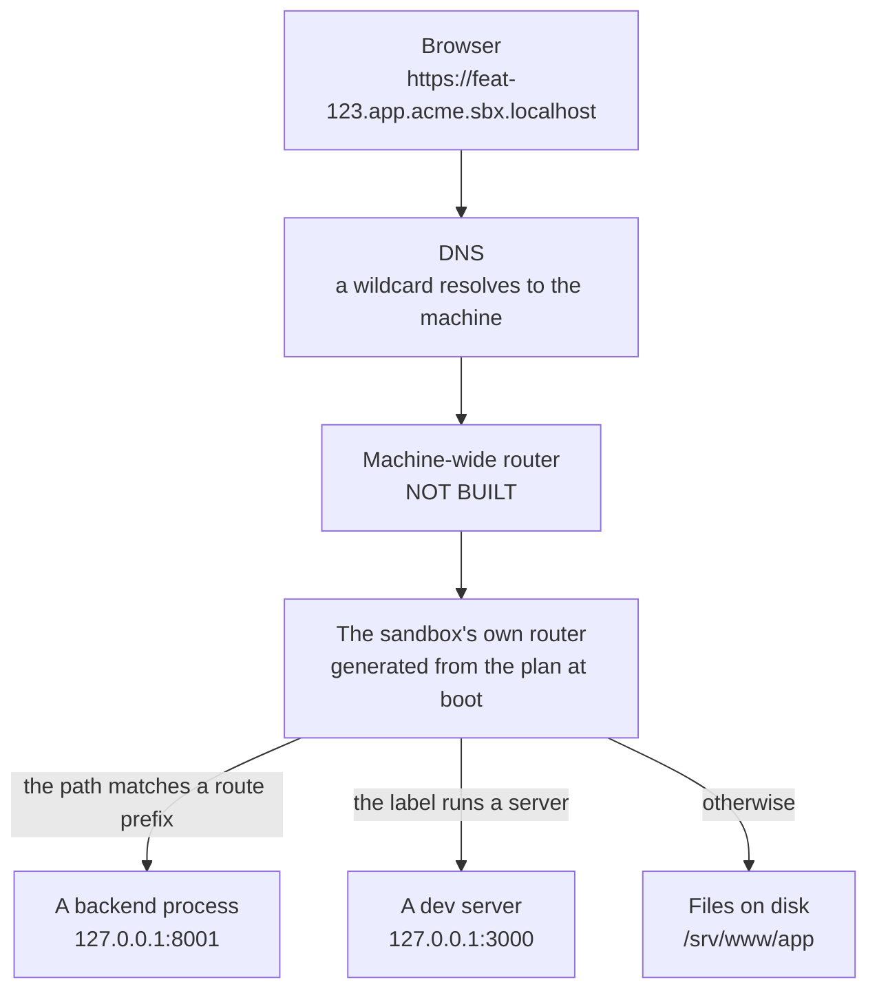

> **Partly verified** — The router inside a sandbox is generated at every boot and has been served for real against the base image — a built app, a deep path, an unbuilt app, the status surface and an unknown host all answered as described here. The machine-wide router in front of it does not exist.

A sandbox URL passes through **two** routers, and telling them apart is most of what makes a
routing problem quick to fix.

- The **outer** router is one process for the whole machine. Its only question is *which
  sandbox*. It terminates HTTPS, reads the hostname, and hands the request to a container.
- The **inner** router runs inside each sandbox. Its question is *which app*. It is generated
  fresh from [the plan](./plan-json.md) at every boot, and knows nothing about any
  other sandbox.

> [!CAUTION] The outer router does not exist
> Nothing in this repository starts, configures or reconciles a machine-wide router. There is no
> code that terminates TLS, no code that maps a hostname to a container, and no service that would
> keep such a thing in step with what is running.
>
> What exists is one line: every sandbox container is labelled `sandboxr.router=true`, so a router
> could find them. That is the whole of it. Everything under "Hop 1" below is the shape the piece
> is intended to take. Everything under "Hop 2" is code that has actually served requests. See
> [what is built](../reference/status.md).



*Two hops. The first picks a container and is not built; the second picks a process inside it and is.*


## Hop 1 — which sandbox

Read a sandbox hostname as four parts:

```
feat-123 . app  . acme    . sbx.localhost
  slug     label  project   domain
```

Every sandbox hostname on a machine resolves to the same address, so DNS is a wildcard per
project and knows nothing about which sandboxes exist. Starting a sandbox is therefore never a
DNS change. The [deployment guide](../running-on-a-server.md) has the arithmetic, which is fiddlier
than it looks.

The router in front is where three jobs would happen: HTTPS is terminated with a wildcard
certificate, the hostname is split into its four parts, and the container whose
`sandboxr.project` and `sandboxr.slug` labels match is handed the request. There is no routing
table to maintain, because [the labels are the table](./state.md).

Sandbox containers publish **no host ports at all**. A router reaches them by container name on
a shared Docker network called `sandboxr`, which is why a server needs only 80 and 443 open —
there is nothing else listening.

<details>
<summary><b>Details for an agent:</b> what a machine-wide router has to do, and the one thing that exists today</summary>

Today, in `packages/core/src/sandbox/run.ts`, every `docker run` carries
`--label sandboxr.router=true` alongside the labels in
[contract §3.4](./state.md), and joins the `sandboxr` network. No process consumes
either fact.

What the missing piece would have to do:

| Job | Detail |
|---|---|
| Terminate TLS | One wildcard certificate per project, plus the bare domain. HTTP-01 cannot issue a wildcard, so DNS-01 and a provider credential. |
| Parse the hostname | `<slug>.<label>.<project>.<domain>`, with the domain from `SANDBOXR_DOMAIN`. |
| Find the container | Match `sandboxr.project` and `sandboxr.slug`, and reconcile as containers come and go, so `up` never has to write config or trigger a reload. |
| Enforce access | If `sandboxr.access` is `private`, a forward-auth middleware against the dashboard's `GET /auth/verify`, which answers 200 or 401 and also checks the session's grant covers that hostname's project. A `public` project skips it entirely. |
| Serve the bare domain | `<domain>` with no sandbox part is the dashboard, always, and never a per-sandbox hostname. |
| Reach the container | By container name on the `sandboxr` network. Never a published host port. |

The dashboard's side of that handshake is written and tested — `GET /auth/verify` in
`packages/server/src/auth/routes.ts`. It is the router that would call it that does not exist.

</details>

## Hop 2 — which app inside the sandbox

This half is real. At every boot, `container/scripts/gen-caddyfile.sh` reads the plan and writes
the sandbox's router configuration. Host matchers are **exact**: one per label the plan declares,
spelled `<slug>.<label>.<project>.<domain>`.

Take a request to `https://feat-123.app.acme.sbx.localhost/api/orders`, with acme's config saying:

```yaml
routes:
  app:
    "/api": api
    "/cms": cms
```

The label is `app`, so the request belongs to the `app` site. The path starts with `/api`, which
is a declared prefix, so `/api` is stripped and the rest is proxied to the `api` backend on its
port inside the container. A request to `/orders` on the same hostname matches no prefix, so it
is served from the app's built files instead.

### Path prefixes are sorted for you

Longest prefix wins, and the generator sorts them by length before writing them out. Declaring
`"/api"` above `"/api/admin"` in your config is therefore harmless — the order in the file does
not decide the order in the router.

### Why `routes` exists at all

Every backend already has a hostname of its own, so serving `/api` on the app's hostname looks
redundant. It is not. A same-origin request needs no preflight, no per-sandbox allowlist and no
cookie reasoning, so this takes CORS out of the picture entirely — and the app's own code can
say `/api` in every environment.

### Three ways to serve a built directory

A static app declares `static_mode`, and the router serves it accordingly:

| Mode | Behaviour | For |
|---|---|---|
| `spa` | Any unknown path falls back to `index.html` | A single-page app with client-side routing |
| `html` | `/blog/foo` resolves to `foo.html` | A generator that emits extensionful files |
| `files` | An unknown path is a real 404 | A plain directory of assets |

The default is `spa`. Getting it wrong does not crash anything — it produces an app that
*half-works*, which is why it is declared rather than guessed.

<details>
<summary><b>Details for an agent:</b> how the router config is generated, and every rule the generator applies</summary>

Written to `/run/sandboxr/Caddyfile` by `container/scripts/gen-caddyfile.sh`, before the
supervisor starts. It is regenerated on every boot, so an edit to it is lost on restart.

- **The domain is read once**, from `SANDBOXR_DOMAIN`. The container library falls back to
  `sbx.localhost`; the contract's default is `sbx.localhost`, and the host always passes one.
- **One site block per service in the plan**, keyed by a named matcher derived from the label —
  `admin-api` becomes `@admin_api`.
- **An optional service that was not requested gets no site block.** A service marked
  `optional: true` is dormant unless named in `SANDBOXR_WITH`, which is what
  `sandboxr up --with cms` sets.
- **A route target may be a backend's `name` or any service's `label`**, and `name` wins, so a
  backend is never shadowed by a front-end that happens to share its label. A target holding no
  port is skipped with a warning rather than written as a broken proxy.
- **Prefixes are emitted longest-first**, and each strips itself before proxying
  (`uri strip_prefix /api`).
- **`root` is set before the matcher that tests for `index.html`.** Reversed, the test resolves
  against the router's working directory, always misses, and makes every built app report itself
  as unbuilt.
- **`s3` is a reserved label** when the project declares object storage:
  `<slug>.s3.<project>.<domain>` reaches the in-sandbox object store, and `/console/*` on that
  hostname reaches its web console.
- **TLS is not terminated here.** The sandbox speaks plain HTTP on port 80 and only splits by
  hostname. Encryption is the outer router's job.

</details>

## What the answer tells you

Each of these comes from a different layer, and the response says which one. It is the fastest
diagnostic on this site.

| What you got | What it means | What to do |
|---|---|---|
| **502** | The label is right and the service behind it is not up — still building, crashed, or still waiting on the database. | `sandboxr status`, then `sandboxr logs <slug>` |
| **503, with build instructions** | The label is right and that app has never been built in this sandbox. Not a failure. | `sandboxr reload --web <label>` |
| **404 reading `sandboxr: no route for …`**, naming your host | You reached a sandbox and it serves no such hostname. Wrong label, wrong project, wrong slug, or a domain that is not the one the sandbox was started with. | Check the label against the project's config, and the domain against `SANDBOXR_DOMAIN` |
| **404 from something that is clearly an API** | You reached the right app, and a `routes` prefix points at the wrong service — or none matched, so the request fell through to the static files. | Check the `routes` block for that label |
| **Nothing at all, or a refused connection** | You never reached a sandbox. With no machine-wide router built, this is the ordinary answer from outside today. | [What is built](../reference/status.md) |
| **A certificate warning** | Nothing terminates TLS today. Same cause as the row above. | — |
| **`ok`** from `/__sandboxr/live` | The container and its router are both up. Anything still wrong is one specific service. | — |

That last row is the single fastest check:

```bash
curl -s https://feat-123.app.acme.sbx.localhost/__sandboxr/live
```

<details>
<summary><b>If it goes wrong:</b> the 503 page names a command that does not exist, and two ways a hostname misses that do not look like typos</summary>

**The unbuilt page is out of date.** `gen-caddyfile.sh` writes a 503 body reading
`Run: sandboxr build <slug> --app <label>`. There is no `sandboxr build` command. What builds a
front-end is:

```bash
sandboxr reload --web app
```

**Two hostname misses that are not typos:**

- An `optional` service that was not started has no site block at all, so its hostname 404s
  exactly as a misspelling would. Start it with `sandboxr up --with cms`.
- A label is sanitised the way a slug is — lower-cased, anything outside `[a-z0-9-]` replaced by
  `-`. A label with an underscore or a capital in the config is not the label in the URL.

**404 rather than a silent refusal is deliberate, and so is naming the host.** A mismatch that
identifies itself is a five-second fix; one that does not costs an afternoon in the wrong layer.

</details>

## The status surface

Every hostname a sandbox serves answers these four paths, whatever else is on it, and answers
them while the database is still restoring:

| Path | What it gives you |
|---|---|
| `/__sandboxr/live` | `ok`, unconditionally — the container is up |
| `/__sandboxr/status.json` | `booting` / `ok` / `degraded`, plus the migration verdict |
| `/__sandboxr/built.json` | Each label, and when it was last built |
| `/__sandboxr/health/<service>` | Proxied to that service's own declared health path |

They answer during a first boot because the sandbox's router is deliberately not made to wait for
the database. During a restore that takes minutes, these are the only way to tell a slow sandbox
from a broken one —
[the reasoning in full](./startup.md#the-router-is-deliberately-not-gated).

> [!CAUTION] Why the domain is read in exactly one place
> The internal tool sandboxr was ported from wrote its domain into a static router config, in
> thirteen places. Its domain setting therefore silently did nothing: every request landed on the
> catch-all 404 and nothing said why. Here the config is generated at every boot and the domain is
> read once.

## The whole path, for one request

| Step | Where | What happens | Built? |
|---|---|---|---|
| 1 | DNS | The four-label name resolves to the machine | Manual today |
| 2 | Outer router | TLS is terminated with a wildcard certificate | No |
| 3 | Outer router | `Host` is split into slug, label, project and domain | No |
| 4 | Outer router | The container with matching labels is found | No |
| 5 | Outer router | A `private` project's hostnames are checked against the dashboard | Dashboard side only |
| 6 | Docker network | The container is reached by name; no host port is involved | Yes — the network and the labels are set |
| 7 | Inner router | The label picks a backend, a static app or a dev server | Yes |
| 8 | Inner router | For an app, the path is matched against `routes` prefixes first | Yes |
| 9 | The process, or the filesystem | Something answers | Yes |

## Related

- [The startup graph](./startup.md) — how the things at step 7 come to exist.
- [plan.json](./plan-json.md) — what steps 7 and 8 are generated from.
- [State lives in labels](./state.md) — why steps 3 to 5 need no configuration file.
- [Three runtime kinds](../configuration/runtime-kinds.md) — what step 7 is choosing between.
- [Symptom to cause](../troubleshooting.md) — when the table above is not enough.
