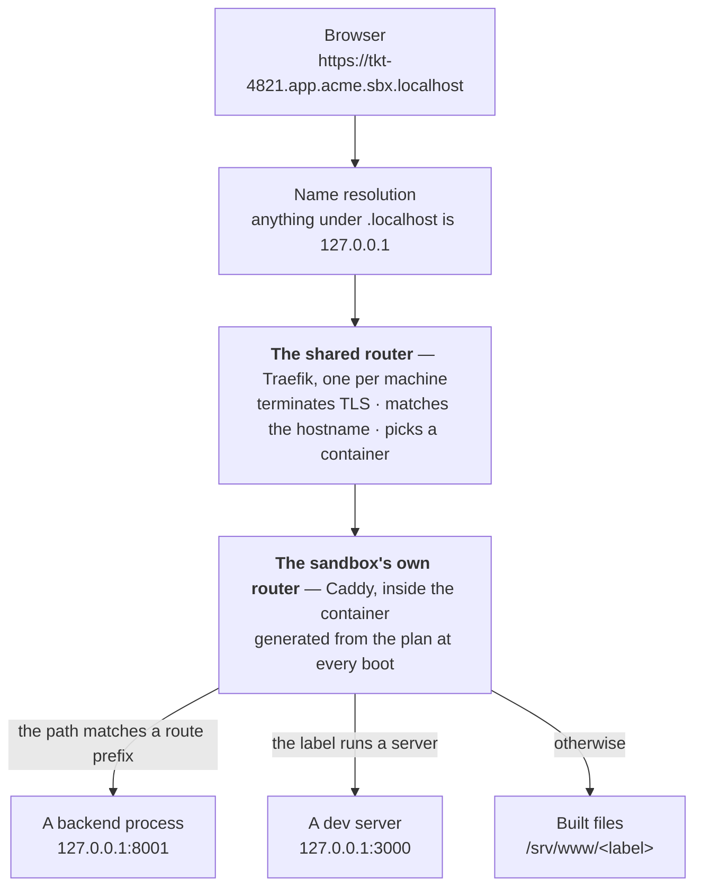

A sandbox URL passes through **two** routers. Telling them apart is most of what makes a routing
problem quick to fix.

The first router is shared by the whole machine. Its only job is to decide *which sandbox* a
hostname belongs to. The second router lives inside that sandbox. Its job is to decide *which app*
inside it should answer.

So a wrong answer is usually easy to place. If nothing knew the hostname at all, the outer router
said so. If something answered but it was the wrong thing, the inner one did.

[How it works, in five steps](../how-it-works.md) introduces the hostname shape. This page goes
deeper.



## Hop 1 — which sandbox

Read a sandbox hostname as four parts:

```
tkt-4821 . app  . acme    . sbx.localhost
  slug     label  project   domain
```

The shared router is a single Traefik container called `sandboxr-router`, started by `sandboxr
init`. It publishes `127.0.0.1:80` and `127.0.0.1:443` by default, and it is the only thing on the
machine that publishes anything. Sandbox containers get **no published ports at all**. They join
one shared Docker network called `sandboxr`, and the router reaches them by container name.

### It reconciles from labels, not from a config file

Starting or stopping a sandbox never regenerates a config file and never triggers a reload. The
sandbox's own `docker run` carries everything the router needs.

<details class="agent">
<summary><b>Details for an agent</b> — every router label a sandbox container carries</summary>

Written by `sandboxRouteLabels` in `packages/core/src/access/router.ts`. `<container>` is
`sandboxr-<project>-<slug>`.

| Label | Value |
|---|---|
| `traefik.enable` | `true` |
| `traefik.http.routers.<container>.rule` | `` HostRegexp(`^<slug>\.[a-z0-9-]+\.<project>\.<domain>$`) `` |
| `traefik.http.routers.<container>.entrypoints` | `websecure` when the router terminates TLS, otherwise `web` |
| `traefik.http.routers.<container>.service` | `<container>` |
| `traefik.http.routers.<container>.tls` | `true`, only when the router terminates TLS |
| `traefik.http.services.<container>.loadbalancer.server.port` | `80` |
| `traefik.http.routers.<container>.middlewares` | `sandboxr-auth@file`, **only** when `access.apps` is `private` |

The slug and the project are escaped as regular-expression literals, so a name containing a dot
cannot widen the rule.

There is **one router entry per sandbox, not per app**: the label in the middle of the rule is a
wildcard. Adding a front-end to a project therefore never requires telling the shared router about
it. The container is the right thing to resolve a label, and it already does.

Traefik's Docker provider runs with `exposedByDefault: false`. This router sits on a network shared
with every sandbox, and a default of "expose everything" would publish a container to the
internet-facing entry point the moment it joined.

Two more labels exist on the machine's own containers, and they are what keeps those containers out
of every sandbox listing: `sandboxr.role=router` and `sandboxr.role=dashboard`.

</details>

### Certificates are per sandbox

A DNS wildcard matches exactly one label. A sandbox hostname is three labels above the domain. So
`*.<domain>` reaches the dashboard and nothing else, and there is no wildcard that reaches a
sandbox.

Each sandbox therefore gets its own certificate, with its hostnames listed. mkcert issues it when
the sandbox starts and it is removed when the sandbox goes. Traefik picks between certificates by
SNI and watches the directory, so nothing reloads.

<details class="failure">
<summary><b>If it goes wrong</b> — no trusted certificate, and the redirect that would follow</summary>

When no trusted certificate authority is present, the router serves plain HTTP and the `websecure`
entry point is **not written at all**. Redirecting to a scheme nothing serves would take the whole
machine off the air rather than upgrading it.

The scheme sandboxr prints in a URL is read from what `init` actually wrote, not from whether
mkcert is installed. The two disagree in the common case — mkcert installed *after* the last `init`
— and a URL printed for a scheme nothing is listening on sends you to a connection refused.

mkcert refuses a multi-level wildcard outright (`"*.*.example" is not a valid hostname`). Trying it
produces no certificate at all and a router that quietly falls back to plain HTTP.

The base certificate covers the domain, one wildcard under it, `localhost`, `127.0.0.1` and `::1`.
mkcert is the only issuer sandboxr supports, because it is the only one that can make a browser
trust a local name with no public DNS record. There is no ACME support — see
[What is built](../reference/status.md).

</details>

### Private projects, and the one path the dashboard answers elsewhere

If `access.apps` is `private`, the sandbox's router entry carries a forward-auth middleware
pointing at the dashboard's `GET /auth/verify`, which answers 200 or 401. A `public` project skips
the middleware entirely. [Access and security](../access.md) describes this from a reader's side.

The credential that opens a private app is bound to the hostname being asked about. A cookie can
only be set by something answering *on* that hostname, so the dashboard needs a way to answer
there. That is the one deliberate exception to "the dashboard never appears on a sandbox hostname".

<details class="agent">
<summary><b>Details for an agent</b> — the handshake router, and what <code>/auth/verify</code> requires</summary>

A second router entry sits on the dashboard's container:

| Label | Value |
|---|---|
| `traefik.http.routers.sandboxr-handshake.rule` | `` HostRegexp(`^[a-z0-9-]+\.[a-z0-9-]+\.[a-z0-9-]+\.<domain>$`) && PathPrefix(`/.sandboxr/auth`) `` |
| `traefik.http.routers.sandboxr-handshake.service` | `sandboxr-dashboard` — two routers, one service |
| `traefik.http.routers.sandboxr-handshake.priority` | `10000` |

The priority is explicit because Traefik defaults it to the **length of the rule**, which would
decide this by accident. The handshake rule's host pattern is generic where a sandbox's names its
slug and project, so which string is longer depends on how long somebody's branch name is.

The host pattern counts labels rather than naming anything. Three labels above the domain is a
sandbox, and the dashboard's own bare domain has none, so this can never shadow the control plane.
It carries no forward-auth middleware — the request whose whole purpose is to obtain a credential
cannot be asked to present that credential first.

Two consequences:

- **`/.sandboxr/` is reserved on every sandbox hostname**, public projects included. One rule for
  the machine rather than one per private sandbox, because the rule has to exist before the sandbox
  it is for. Reconciling it from a sandbox's own labels would make it appear and disappear as a
  project's `access` changed.
- **Only a browser navigation is redirected to a login page.** Forward-auth covers a private
  project's API hostnames as much as its front-ends. So `GET /auth/verify` requires a `GET` or
  `HEAD`, an explicit `text/html` or `application/xhtml+xml` in `Accept`, and — where the client
  sends one — `Sec-Fetch-Mode: navigate`. `Accept: */*` is curl's default and is **not** read as
  asking for HTML. Everything else gets the identical `401 application/json {"ok":false}`, so an
  app's own `fetch` and every API client see a refusal rather than a login page.

Note the two prefixes are different and both are reserved. `/.sandboxr/auth` belongs to the
**dashboard**, on every sandboxr hostname. `/__sandboxr/` belongs to the **sandbox's own router**,
below.

</details>

## Hop 2 — which app inside the sandbox

At every boot the container generates its own router configuration from
[`plan.json`](plan-json.md). Host matchers here are **exact**: one per label the plan declares.

Take `https://tkt-4821.app.acme.sbx.localhost/api/orders`, with this in the config:

```yaml
routes:
  app:
    "/api": api
```

The label is `app`, so the request belongs to the `app` site. The path starts with `/api`, which is
a declared prefix, so `/api` is stripped and the rest is proxied to the `api` backend on its port
inside the container. A request to `/orders` matches no prefix, so it is served from the app's built
files instead.

TLS is **not** terminated here. The sandbox speaks plain HTTP on port 80 and only splits by
hostname.

<details class="agent">
<summary><b>Details for an agent</b> — every rule the router generator applies</summary>

Written by `container/scripts/gen-caddyfile.sh` into `/run/sandboxr/Caddyfile` at every boot.

- **Prefixes are emitted longest-first**, so declaring `"/api"` above `"/api/admin"` is harmless.
- **A route target may be a backend's `name` or any service's `label`**, and `name` wins — so a
  backend is never shadowed by a front-end sharing its label. A target holding no port is skipped
  with a warning rather than written as a broken proxy.
- **An optional service nobody requested gets no site block at all.** Its hostname 404s exactly as
  a misspelling would. `sandboxr up --with cms` is what starts it. It gets no
  `/__sandboxr/health/<id>` route either, which is how the dashboard tells a service that was never
  started from one that is failing.
- **A health route is written only for a service that will run, and only when it declares one.** A
  service needs a port, a `health` path, and to have been requested.
- **`/__sandboxr/` is reserved and answers before any app.** A path under it that names nothing is
  a 404 from the router itself, with the body `sandboxr: no such status route <path>`.
- **A label is sanitised the way a slug is** — lower-cased, anything outside `[a-z0-9-]` replaced
  by `-`. A label with an underscore in the config is not the label in the URL.
- **`s3` is a reserved label** when the project declares object storage. `/console/*` reaches the
  object store's console; everything else on that hostname reaches its API.
- **An unknown hostname answers 404 naming the host it was asked for**, as
  `sandboxr: no route for <host>`. The usual cause is a label the shared router matched by
  wildcard that this project's plan does not declare. The 404 is the only place that shows up.
- Service ids are what the health routes and the per-service log files use: a backend is its
  sanitised `name`, and a front-end of either kind is `web-<label>`.

</details>

<details class="why">
<summary><b>Why it works this way</b> — the reserved status prefix, and what it cost to learn</summary>

Without the reserved prefix, a path under `/__sandboxr/` that named nothing fell through to the
site block for whatever hostname it arrived on. A host matcher matches every path, so this was
inevitable rather than unlucky.

The request that landed there was the health probe of a dormant service, because a dormant service
deliberately gets no health route. What came back was the front-end's own answer.

- While the app was unbuilt, the probe got that app's 503 "not built yet" page, and the dashboard
  read every dormant service as `down`.
- Once the app was built, the same probe got the app's `index.html` with a 200, and the same dead
  service read as `up`.

Neither answer had anything to do with the service, and the second is the worse one. A service's
reachability must not depend on whether an unrelated front-end has been built. The 404 restores
that: it is the router saying it has no route, which is a different answer from a service saying
no.

</details>

### Why `routes` exists at all

Every backend already has a hostname of its own, so serving `/api` on the app's hostname looks
redundant. It is not.

A same-origin request needs no preflight, no per-sandbox allowlist and no cookie reasoning. That
takes CORS out of the picture entirely, and the app's own code can say `/api` in every environment.

### Three ways to serve a built directory

| `static_mode` | Behaviour | For |
|---|---|---|
| `spa` *(default)* | Any unknown path falls back to `index.html` | A single-page app with client-side routing |
| `html` | `/blog/foo` resolves to `foo.html` | A generator emitting extensionful files |
| `files` | An unknown path is a real 404 | A plain directory of assets |

Getting it wrong does not crash anything. It produces an app that half-works, which is why it is
declared rather than guessed.

## The status surface

Every hostname a sandbox serves answers these, whatever else is on it — and answers them **while
the database is still restoring**.

| Path | What it gives you |
|---|---|
| `/__sandboxr/live` | `ok`, unconditionally |
| `/__sandboxr/status.json` | `booting` / `ok` / `degraded`, plus the migration verdict |
| `/__sandboxr/built.json` | Each label, and when it was last built |
| `/__sandboxr/health/<service>` | Proxied to that service's own declared health path |
| anything else under `/__sandboxr/` | 404, from the router itself |

They answer during a first boot because the sandbox's router is deliberately not gated on the
database. During a restore that takes minutes, these are the only way to tell a slow sandbox from
a broken one. [The startup graph](startup.md) has the reasoning in full.

## How to read the answer you got

Each of these comes from a different layer, and the response tells you which one. It is the fastest
diagnostic in this whole section.

| What you got | What it means | What to do |
|---|---|---|
| **Connection refused** | Nothing reached the shared router | `sandboxr doctor` — is the router running, and on which port? |
| **404 from Traefik itself** | The shared router is up and no sandbox matched the hostname | `sandboxr ls`, then check the slug and the project |
| **404 reading `sandboxr: no route for …`** | You reached a sandbox and it serves no such hostname. Wrong label, wrong project, wrong slug, or a domain the sandbox was not started with | Check the label against the config, and the domain against `SANDBOXR_DOMAIN` |
| **404 reading `sandboxr: no such status route …`** | You reached a sandbox and asked for a `/__sandboxr/` path that names nothing. For a health route, that means the service is dormant, not broken | `sandboxr up --with <name>` if you wanted it running |
| **502** | The label is right and the service behind it is not up — still building, crashed, or waiting on the database | `sandboxr status`, then `sandboxr logs <slug>` |
| **503 with build instructions** | The label is right and that app has never been built in this sandbox. Not a failure | `sandboxr reload <slug> --web=<label>`, or the app's own build button in the dashboard |
| **404 from something that is clearly an API** | You reached the right app, and a `routes` prefix points at the wrong service — or none matched, so the request fell through to the static files | Check the `routes` block for that label |
| **`{"ok":false}`** | A `private` project's forward-auth refused a request that did not ask for a page — usually the app's own `fetch`, since a navigation is redirected to the login form instead | Open the app's own URL in a tab and sign in there first |
| **A certificate warning** | The router is serving a certificate the browser does not trust | `mkcert -install`, then `sandboxr init` |
| **`ok` from `/__sandboxr/live`** | The container and its own router are both up. Anything still wrong is one specific service | — |

That last row is the single fastest check:

```bash
curl -s https://tkt-4821.app.acme.sbx.localhost/__sandboxr/live
```

> [!NOTE] The 503 page names a command that does not exist yet
> The "not built yet" page a sandbox serves says `sandboxr build <slug> --app <label>`. There is no
> `build` verb in the command line today. Use `sandboxr reload <slug> --web=<label>`, or the
> per-app build button in the dashboard. The message in `container/scripts/gen-caddyfile.sh` is
> stale.

<details class="why">
<summary><b>Why it works this way</b> — the domain is read in exactly one place</summary>

The internal tool sandboxr was ported from wrote its domain into a static router config, in thirteen
places. Its domain setting therefore silently did nothing: every request landed on the catch-all 404
and nothing said why.

Here the config is generated at every boot and the domain is read once, from `SANDBOXR_DOMAIN`. Its
default is `sbx.localhost`, and that ending is deliberate. Every current browser and macOS's own
resolver answer any name under `.localhost` with the loopback address, so there is no resolver file
to install, no `/etc/hosts` line, and nothing that needs an administrator password.

</details>

**Next:** [The startup graph](startup.md) — how the things at hop 2 come to exist. Or
[Troubleshooting](../troubleshooting.md) if you arrived here with a symptom rather than a question.
