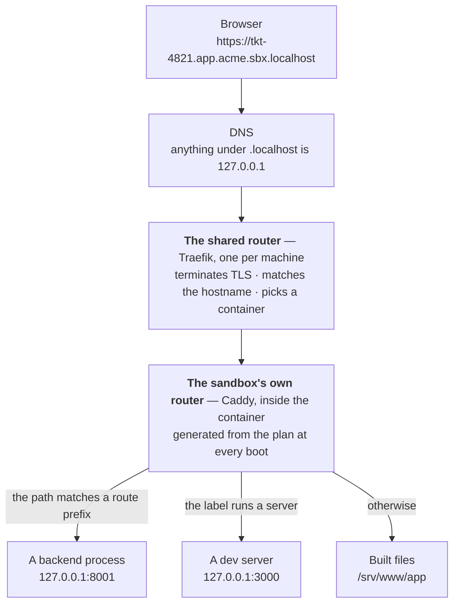

A sandbox URL passes through **two** routers, and telling them apart is most of what makes a
routing problem quick to fix.



## Hop 1 — which sandbox

Read a sandbox hostname as four parts:

```
tkt-4821 . app  . acme    . sbx.localhost
  slug     label  project   domain
```

The shared router is a single **Traefik** container, `sandboxr-router`, started by
`sandboxr init`. It publishes `127.0.0.1:80` and `127.0.0.1:443` by default and is the only thing
on the machine that publishes anything — sandbox containers get **no `-p` at all**. They join one
shared Docker network called `sandboxr`, and the router reaches them by container name.

### It reconciles from labels, not from a config file

Starting or stopping a sandbox never regenerates config and never triggers a reload. The
sandbox's own `docker run` carries everything the router needs:

| Label | Value |
|---|---|
| `traefik.enable` | `true` |
| `traefik.http.routers.<container>.rule` | `` HostRegexp(`^<slug>\.[a-z0-9-]+\.<project>\.<domain>$`) `` |
| `traefik.http.routers.<container>.entrypoints` | `websecure`, or `web` without TLS |
| `traefik.http.services.<container>.loadbalancer.server.port` | `80` |
| `traefik.http.routers.<container>.middlewares` | `sandboxr-auth@file`, **only** when `access.apps: private` |

One router entry per **sandbox**, not per app: the label in the middle of the rule is a wildcard.
Adding a front-end to a project therefore never requires telling the router about it — the
container itself is the right thing to resolve a label, and it already does.

Traefik's Docker provider runs with `exposedByDefault: false`. This router sits on a network
shared with every sandbox, and a default of "expose everything" would publish a container to the
internet-facing entry point the moment it joined.

### Certificates are per sandbox

A DNS wildcard matches exactly one label, and a sandbox hostname is three labels above the domain.
So `*.<domain>` reaches the dashboard and nothing else, and there is no wildcard that reaches a
sandbox.

Each sandbox therefore gets its own certificate, with its hostnames listed, issued by mkcert when
it starts and removed when it goes. Traefik picks between them by SNI and watches the directory,
so nothing reloads.

When no trusted certificate authority is present, the router serves plain HTTP and the `websecure`
entry point is not written at all — redirecting to a scheme nothing serves would take the whole
machine off the air rather than upgrading it.

### Private projects

If `access.apps` is `private`, the sandbox's router entry carries a forward-auth middleware
pointing at the dashboard's `GET /auth/verify`, which answers 200 or 401 and also checks that the
grant covers that hostname's project. A `public` project skips it entirely.

The token it looks for is bound to the hostname being asked about, so it cannot be a cookie the
dashboard sets — a cookie can only be set by something answering on the hostname it is for. That
is why there is a **second router entry** on the dashboard's container, and it is the one place
the dashboard answers on a sandbox hostname:

| Label | Value |
|---|---|
| `traefik.http.routers.sandboxr-handshake.rule` | `` HostRegexp(`^[a-z0-9-]+\.[a-z0-9-]+\.[a-z0-9-]+\.<domain>$`) && PathPrefix(`/.sandboxr/auth`) `` |
| `traefik.http.routers.sandboxr-handshake.service` | `sandboxr-dashboard` — two routers, one service |
| `traefik.http.routers.sandboxr-handshake.priority` | `10000` |

The priority is explicit because Traefik defaults it to the **length of the rule**, which would
decide this by accident: this rule's host pattern is generic where a sandbox's names its slug and
project, so which of the two strings is longer depends on how long somebody's branch name is.

The host pattern counts labels rather than naming anything — three above the domain is a sandbox,
and the dashboard's own bare domain has none, so this can never shadow the control plane. It
carries no forward-auth middleware, because the request whose entire purpose is to obtain a
credential cannot be asked to present that credential first.

Reaching it is a three-redirect handshake, described from the reader's side in
[Access and security](../access.md#opening-one-in-a-browser). Two consequences show up here:

- `/.sandboxr/` is **reserved on every sandbox hostname**, public projects included. One rule for
  the machine rather than one per private sandbox, because the rule has to exist before the
  sandbox it is for — and reconciling it from a sandbox's own labels would make it appear and
  disappear as a project's `access` changed.
- Only a browser navigation is redirected. Forward-auth covers a private project's **API**
  hostnames as much as its front-ends, so `GET /auth/verify` requires a `GET` or `HEAD`, an
  explicit `text/html` or `application/xhtml+xml` in `Accept`, and — where the client sends one —
  `Sec-Fetch-Mode: navigate`. `Accept: */*` is curl's default and is *not* read as asking for
  HTML. Everything else keeps the identical `401 application/json {"ok":false}`, so an app's own
  `fetch` and every API client see a refusal rather than a login page.

## Hop 2 — which app inside the sandbox

At every boot the container generates its own router configuration from `plan.json`. Host matchers
are **exact**: one per label the plan declares.

Take `https://tkt-4821.app.acme.sbx.localhost/api/orders`, with:

```yaml
routes:
  app:
    "/api": api
```

The label is `app`, so the request belongs to the `app` site. The path starts with `/api`, a
declared prefix, so `/api` is stripped and the rest is proxied to the `api` backend on its port
inside the container. A request to `/orders` matches no prefix and is served from the app's built
files instead.

Rules the generator applies:

- **Prefixes are emitted longest-first**, so declaring `"/api"` above `"/api/admin"` is harmless.
- **A route target may be a backend's `name` or any service's `label`**, and `name` wins, so a
  backend is never shadowed by a front-end sharing its label. A target holding no port is skipped
  with a warning rather than written as a broken proxy.
- **An optional service that was not requested gets no site block at all.** Its hostname 404s
  exactly as a misspelling would; `sandboxr up --with cms` is what starts it. It gets no
  `/__sandboxr/health/<name>` route either, which is how the dashboard tells a service that was
  never started from one that is failing.
- **`/__sandboxr/` is reserved, and answers before any app.** A path under it that names nothing
  is a 404 from the router itself. Without that rule the health probe of a dormant service fell
  into the site block of whichever hostname it arrived on and came back with that front-end's
  answer — a 503 "not built yet" page while the app was unbuilt, and a 200 with the app's own
  `index.html` once it was built. A service read as broken in the first case and healthy in the
  second, and neither answer had anything to do with the service.
- **A label is sanitised the way a slug is** — lower-cased, anything outside `[a-z0-9-]` replaced
  by `-`. A label with an underscore in the config is not the label in the URL.
- **`s3` is a reserved label** when the project declares object storage.
- **TLS is not terminated here.** The sandbox speaks plain HTTP on port 80 and only splits by
  hostname.

### Why `routes` exists at all

Every backend already has a hostname of its own, so serving `/api` on the app's hostname looks
redundant. It is not: a same-origin request needs no preflight, no per-sandbox allowlist and no
cookie reasoning, which takes CORS out of the picture entirely — and the app's own code can say
`/api` in every environment.

### Three ways to serve a built directory

| `static_mode` | Behaviour | For |
|---|---|---|
| `spa` *(default)* | Any unknown path falls back to `index.html` | A single-page app with client-side routing |
| `html` | `/blog/foo` resolves to `foo.html` | A generator emitting extensionful files |
| `files` | An unknown path is a real 404 | A plain directory of assets |

Getting it wrong does not crash anything — it produces an app that half-works, which is why it is
declared rather than guessed.

## What the answer tells you

Each of these comes from a different layer, and the response says which one. It is the fastest
diagnostic on this site.

| What you got | What it means | What to do |
|---|---|---|
| **502** | The label is right and the service behind it is not up — still building, crashed, or waiting on the database | `sandboxr status`, then `sandboxr logs <slug>` |
| **503 with build instructions** | The label is right and that app has never been built here. Not a failure | `sandboxr reload --web <label>` |
| **404 reading `sandboxr: no route for …`** | You reached a sandbox and it serves no such hostname. Wrong label, wrong project, wrong slug, or a domain the sandbox was not started with | Check the label against the config, and the domain against `SANDBOXR_DOMAIN` |
| **404 from something that is clearly an API** | You reached the right app, and a `routes` prefix points at the wrong service — or none matched, so the request fell through to the static files | Check the `routes` block for that label |
| **Connection refused** | Nothing reached the shared router | `sandboxr doctor` — is the router running, and on which port? |
| **404 from Traefik itself** | The router is up and no sandbox matched the hostname | `sandboxr ls`, then check the slug and project |
| **`{"ok":false}`** | A `private` project's forward-auth refused a request that did not ask for a page — usually the app's own `fetch`, since a navigation is redirected to the login form instead | Open the app's own URL in a tab and sign in there first |
| **A certificate warning** | The router is serving a certificate the browser does not trust | `mkcert -install`, then `sandboxr init` |
| **`ok` from `/__sandboxr/live`** | The container and its own router are both up. Anything still wrong is one specific service | — |

That last row is the single fastest check:

```bash
curl -s https://tkt-4821.app.acme.sbx.localhost/__sandboxr/live
```

> [!CAUTION] Why the domain is read in exactly one place
> The internal tool sandboxr was ported from wrote its domain into a static router config, in
> thirteen places. Its domain setting therefore silently did nothing: every request landed on the
> catch-all 404 and nothing said why. Here the config is generated at every boot and the domain is
> read once.

## The status surface

Every hostname a sandbox serves answers these, whatever else is on it, and answers them **while
the database is still restoring**:

| Path | What it gives you |
|---|---|
| `/__sandboxr/live` | `ok`, unconditionally |
| `/__sandboxr/status.json` | `booting` / `ok` / `degraded`, plus the migration verdict |
| `/__sandboxr/built.json` | Each label, and when it was last built |
| `/__sandboxr/health/<service>` | Proxied to that service's own declared health path |

They answer during a first boot because the sandbox's router is deliberately not gated on the
database. During a restore that takes minutes, these are the only way to tell a slow sandbox from
a broken one — [the reasoning in full](startup.md#the-router-is-deliberately-not-gated).

## Related

- [The startup graph](startup.md) — how the things at hop 2 come to exist
- [plan.json](plan-json.md) — what hop 2 is generated from
- [State lives in labels](state.md) — why hop 1 needs no configuration file
- [Troubleshooting](../troubleshooting.md)
