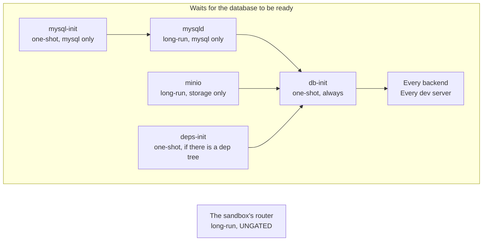

A sandbox has to come up in seconds and then tell you honestly what is still happening. This page
is the order things run in, and the two places that order is deliberately surprising.

Inside the container a **supervisor** keeps long-running processes alive. It is s6. The natural
thing would be to make the supervisor the very first process, and that is not what happens.

It cannot be. The supervisor compiles its list of services **once**, before any service runs, and
that list is a function of the project. A project with no database has no database services at all.

## The entrypoint is a script, not the supervisor

So the container's first process is a shell script, `entrypoint.sh`. It:

1. refuses to start without `SANDBOXR_SLUG`
2. reads [`/sandboxr/plan.json`](plan-json.md), and **refuses to start** if it is missing or is not
   valid JSON
3. exports the environment the sandbox computes for itself — its database address, its object
   storage, its own hostnames, and the project's own names for all three
4. records that it is booting
5. writes the router configuration
6. writes the service list
7. hands over to the supervisor, replacing itself

Everything after step 7 is supervision.

<details class="why">
<summary><b>Why it works this way</b> — the environment is derived in a sourced library, not just exported</summary>

The entrypoint's exports reach every *supervised* service, because the supervisor inherits them.

They do **not** reach a `docker exec` — which is how the host runs every migration, every build and
every database verb.

So the derivation lives in `container/scripts/env.sh`, a library each of those scripts sources for
itself. Without that, a script would silently run with an empty `SANDBOXR_DB_FILE` and open a
throwaway in-memory database instead of failing.

</details>

## The graph



A **one-shot** runs once and finishes. A **long-run** is kept alive. One-shots gate long-runs, so
nothing serves traffic against a database that is not ready.

## Which services exist depends on the plan

This is not a fixed graph with branches switched off. The list is *generated*, so a service that
does not apply does not exist at all.

| Service | Exists when |
|---|---|
| `mysql-init`, `mysqld` | `driver: mysql` |
| `minio` | the project declares `storage` |
| `deps-init` | the plan carries a `deps` block |
| `db-init` | **always**, `driver: none` included |
| one per backend | one per `kind: backend` service in the plan |
| one per dev server | one per `kind: server` service in the plan |
| the router | always |
| static front-ends | **never** — they are files, built on demand, with no process at all |

`db-init` exists even with no database, because it is also what writes the status file. A sandbox
with no database still has to be able to say it finished booting. Otherwise "no database" and
"still starting" look identical from outside.

<details class="agent">
<summary><b>Details for an agent</b> — how the service tree is really written</summary>

`container/scripts/gen-services.sh` writes into `/etc/s6-overlay/s6-rc.d`, merging over the
skeleton copied from `/opt/sandboxr/s6` rather than replacing the directory — s6-overlay's own
bundles have to survive alongside the generated ones.

- **Membership of the `user` bundle is what starts a service.** A service directory outside the
  bundle is inert. That is how an `optional` service is *defined but not enabled*: the plan stays
  honest about what the project has, and nothing runs.
- **A dependency is only recorded if the target directory exists**, which is what lets the same
  generator emit a graph for a project with no database and a project with five backends.
- **Backends depend on `db-init`. Dev servers depend on `db-init` and `deps-init`** — a dev server
  is a Node process and needs its dependency tree present before it starts.
- **Service ids**: a backend is its sanitised `name`; a front-end of either kind is `web-<label>`.
  Those ids are what `/__sandboxr/health/<service>` and the per-service log files use.
- **A port is injected as `PORT`** ahead of each service rather than left to the project's own
  config, because the plan is the single place a port is declared and the router reads the same
  number.
- **Every long-run gets a `finish` script that logs the exit and sleeps two seconds.** A crash loop
  that restarts instantly floods the log and hides its own first line.
- `SANDBOXR_WITH` is a comma-separated list of the optional services to enable. It matches a
  backend's `name` or a front-end's `label`.

</details>

## The router is deliberately not gated

The router starts immediately, before the database is provisioned. That looks like a mistake, and
it is the most important choice on this page.

It serves the [status surface](request-path.md) and the "not built yet" pages. Neither touches the
database. And a first-boot restore legitimately takes minutes, which is exactly when someone most
needs to know what is happening.

| Router ungated | Router gated on the database |
|---|---|
| A backend that is not up yet answers **502** | The whole sandbox answers **connection refused** |
| A 502 is truthful: I am here, that service is not | A refused connection is not an answer at all |
| The status endpoint says `booting`, with a reason | Nothing can say anything |

> [!CAUTION] This was learned the hard way
> The internal tool sandboxr was ported from *did* gate its router on database initialisation. Its
> sandboxes were unreachable and unexplained for the whole of their first boot, and nobody could
> tell a slow restore from a broken one.

## Why the gate is at the database step

The other direction is just as deliberate. The project's own services **do** wait.

A backend that starts before its database exists will crash-loop for a while and then work. That
sounds harmless. It is not:

- The logs fill with connection failures that look like the bug you are actually chasing.
- A service that seeds or migrates on boot may do so against a half-restored database.
- Anything watching the sandbox shows red during a normal startup, so red stops meaning anything.

## Nothing asserts a state

Every writer in the boot sequence records a **fact** in its own small file under `/run/sandboxr` —
the database step finished, the migration failed. A composer then works out the overall answer. No
writer ever sets the state directly, so two writers cannot disagree about whether the sandbox is
degraded.

```json
{
  "project": "acme", "slug": "tkt-4821", "domain": "sbx.localhost",
  "state": "booting | ok | degraded",
  "database": { "driver": "mysql", "name": "acme" },
  "migrations": { "state": "ok | failed | skipped | unknown", "file": "", "error": "" },
  "bootedAt": "2026-08-25T13:41:27Z", "updatedAt": "2026-08-25T13:44:02Z"
}
```

That document is what `/__sandboxr/status.json` serves, and it is where a sandbox's `degraded`
state comes from.

## A failed migration does not stop the sandbox

The database steps **always exit zero**. A failure is recorded, the services boot anyway, and the
sandbox reports itself `degraded`. Killing the container would destroy the evidence, and you cannot
get a shell into a container that exited.

<details class="failure">
<summary><b>If it goes wrong</b> — why the migration runner's own exit code is not trusted</summary>

A runner that prints its failure summary and *then* exits zero reports success while the schema is
half applied. And the sandbox builds that runner **from the branch under test**, so this is not an
exotic case.

A project whose runner behaves that way declares a `failure_pattern`, and the output is checked
against it as well as the exit code.

> [!WARNING] Never test a pipeline's exit status
> `cmd | tee log` exits with `tee`'s status, and `tee` always succeeds. The container reads the
> first element of the pipeline's status array instead.

[Testing a migration](../guides/testing-a-migration.md) is the same subject from a user's side.

</details>

## Dependency caching, and why `deps-init` exists

A bind mount **hides whatever the image put underneath it**. Dependencies installed at their natural
place inside the project would vanish the moment the container started.

So the image installs them at `/opt/deps`, and a boot step copies them into place.

That step is `deps-init`, and it decides what to do in three stages:

1. **Is `node_modules/.sandboxr-deps` already naming this lockfile?** If so, re-link the workspace
   binaries and stop. Nothing else is needed.
2. **Does the lockfile hash match the one stamped into the image?** If so, copy from `/opt/deps`,
   which takes seconds.
3. **Otherwise, run the plan's install command.** Slower, and correct.

Either of the last two then writes the marker, by rename, and re-links the workspace binaries.

The dependency volume is named after the lockfile hash, so every sandbox with matching dependencies
shares one install. A branch that changes them transparently gets its own.

<details class="failure">
<summary><b>If it goes wrong</b> — "populated" is a marker, never a non-empty directory</summary>

The volume is *shared*: every sandbox on that lockfile mounts the same one. A boot interrupted
part-way through the copy leaves a tree that is non-empty and missing packages, and a directory
listing cannot tell that from a finished install.

So the volume would report itself populated for ever, and every sandbox on the lockfile would
inherit it. The only symptom is builds failing to resolve imports that plainly exist.

`deps-init` therefore writes `node_modules/.sandboxr-deps` — the lockfile hash it installed from —
as its **last** act, by rename, and treats only that marker as done. A volume whose marker is
missing or names a different lockfile is repopulated over the top rather than emptied first,
because another sandbox may be running against it at that moment.

**Workspace binaries are re-linked on every boot**, including when the tree is already populated,
because the volume outlives any one sandbox. An image that installs from manifests alone skips
linking a command whose target file does not exist yet. A build script one workspace package exposes
to another is then missing, and the build dies with a bare `code 127` naming a binary that is
plainly installed.

The whole step runs without `set -e`, on purpose. No dependency problem is worth refusing to boot
over: a sandbox whose front-end builds do not work is still worth opening, and the failure is
visible in its log rather than as a container that is not there.

</details>

## Two traps in writing a supervised service

**A run script must replace itself with its service.** Write `exec cmd | tee log` and the *shell*
becomes the supervised process. A restart then signals the shell. The service survives it, keeps
holding its port, and every replacement dies with `address already in use` while the old code
carries on serving. It looks exactly like a deploy that did nothing. Redirect with `>>`. Never
pipe.

**Per-service log files are trimmed, not rotated.** `docker logs` interleaves every process and
cannot be filtered afterwards, so each service writes its own file. These are development logs, and
a sandbox left up for days must not be able to fill its own disk.

> [!NOTE] The service graph has only been booted for a two-service plan
> Five backends, a dev server and a first-boot restore have not been started together. See
> [What is built](../reference/status.md).

**Next:** [plan.json](plan-json.md) — the file all of this is generated from. Or
[How a request arrives](request-path.md) for what happens once it is up.
