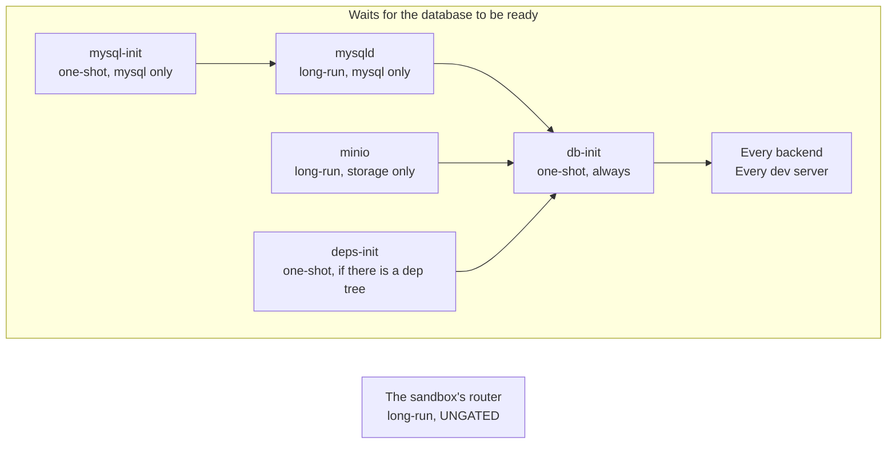
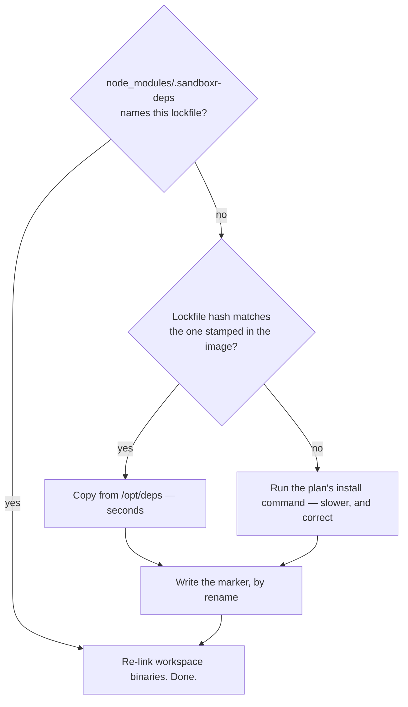

## The entrypoint is a script, not the supervisor

Inside the container a **supervisor** keeps long-running processes alive. The natural thing would
be to make it the first process. It cannot be: the supervisor compiles its list of services
**once**, before any service runs, and that list is a function of the project. A project with no
database has no database services at all.

So the container's first process is a shell script, and it:

1. reads [`/sandboxr/plan.json`](plan-json.md), and **refuses to start** if it is missing or is
   not valid JSON
2. exports the environment the sandbox computes for itself — its database address, its object
   storage, its own hostnames, and the project's own names for all three
3. writes the router configuration
4. writes the service list
5. hands over to the supervisor, replacing itself

Everything after point 5 is supervision.

> [!NOTE] Why the environment is derived in a sourced library
> The entrypoint's exports reach every *supervised* service, because the supervisor inherits them.
> They do **not** reach a `docker exec` — which is how the host runs every migration, build and
> database verb. So the derivation lives in a library each of those scripts sources for itself.
> Without that, a script would silently run with an empty `SANDBOXR_DB_FILE` and open a throwaway
> in-memory database instead of failing.

## The graph



A **one-shot** runs once and finishes. A **long-run** is kept alive. One-shots gate long-runs, so
nothing serves traffic against a database that is not ready.

## Which services exist depends on the plan

This is not a fixed graph with branches switched off. The list is *generated*, so a service that
does not apply does not exist at all.

| Service | Exists when |
|---|---|
| `mysql-init`, `mysqld` | `driver: mysql` |
| `minio` | the project declares `storage` |
| `deps-init` | the plan carries a `deps` block |
| `db-init` | **always**, `driver: none` included |
| one per backend | one per `kind: backend` service in the plan |
| one per dev server | one per `kind: server` service, unless it is `optional` and was not asked for |
| the router | always |
| static front-ends | **never** — they are files, built on demand, with no process at all |

`db-init` exists even with no database because it is also what writes the status file. A sandbox
with no database still has to be able to say it finished booting; otherwise "no database" and
"still starting" look identical from outside.

An `optional` service that was not requested is *defined but not enabled*, so the plan stays honest
about what the project has. The same check omits it from the router, so it 404s rather than 502s.

Service ids: a backend is its sanitised `name`; a front-end of either kind is `web-<label>`. Those
ids are what `/__sandboxr/health/<service>` and the per-service log files use.

## The router is deliberately not gated

The router starts immediately, before the database is provisioned. That looks like a mistake and
is the most important choice on this page.

It serves the [status surface](request-path.md#the-status-surface) and the "not built yet" pages,
neither of which touches the database. And a first-boot restore legitimately takes minutes — which
is exactly when someone most needs to know what is happening.

| Router ungated | Router gated on the database |
|---|---|
| A backend that is not up yet answers **502** | The whole sandbox answers **connection refused** |
| A 502 is truthful: I am here, that service is not | A refused connection is not an answer at all |
| The status endpoint says `booting`, with a reason | Nothing can say anything |

> [!CAUTION] This was learned the hard way
> The internal tool sandboxr was ported from *did* gate its router on database initialisation. Its
> sandboxes were unreachable and unexplained for the whole of their first boot, and nobody could
> tell a slow restore from a broken one.

## Why the gate is at the database step

The other direction is just as deliberate: the project's own services **do** wait. A backend that
starts before its database exists will crash-loop for a while and then work, which sounds harmless.
It is not:

- The logs fill with connection failures that look like the bug you are actually chasing.
- A service that seeds or migrates on boot may do so against a half-restored database.
- The dashboard shows red during a normal startup, so red stops meaning anything.

## Nothing asserts a state

Every writer in the boot sequence records a **fact** in its own small file under `/run/sandboxr` —
the database step finished, the migration failed — and a composer works out the overall answer. No
writer ever sets the state directly, so two writers cannot disagree about whether the sandbox is
degraded.

```json
{
  "project": "acme", "slug": "tkt-4821", "domain": "sbx.localhost",
  "state": "booting | ok | degraded",
  "database": { "driver": "mysql", "name": "acme" },
  "migrations": { "state": "ok | failed | skipped | unknown", "file": "", "error": "" },
  "bootedAt": "2026-08-25T13:41:27Z", "updatedAt": "2026-08-25T13:44:02Z"
}
```

## A failed migration does not stop the sandbox

The database steps **always exit zero**. A failure is recorded, the services boot anyway, and the
sandbox reports itself `degraded`. Killing the container would destroy the evidence, and you cannot
get a shell into a container that exited.

The runner's own exit code is not always trusted either: a runner that prints its failure summary
and *then* exits zero reports success while the schema is half applied — and the sandbox builds
that runner **from the branch under test**. A project whose runner behaves that way declares a
`failure_pattern`, and the output is checked against it as well as the exit code.

> [!WARNING] Never test a pipeline's exit status
> `cmd | tee log` exits with `tee`'s status, and `tee` always succeeds. The container reads the
> first element of the pipeline's status array instead.

## Dependency caching, and why `deps-init` exists

A bind mount **hides whatever the image put underneath it**. Dependencies installed at their
natural place inside the project would vanish the moment the container started.

So the image installs them at `/opt/deps`, and a boot step copies them into place:



The dependency volume is named after the lockfile hash, so every sandbox with matching dependencies
shares one install and a branch that changes them transparently gets its own.

> [!WARNING] "Populated" is a marker, never a non-empty directory
> The volume is *shared*: every sandbox on that lockfile mounts the same one. A boot interrupted
> part-way through the copy leaves a tree that is non-empty and missing packages, and a directory
> listing cannot tell that from a finished install — so the volume reports itself populated
> forever and every sandbox on the lockfile inherits it. The only symptom is builds failing to
> resolve imports that plainly exist. `deps-init` therefore writes
> `node_modules/.sandboxr-deps` — the lockfile hash it installed from — as its last act, by
> rename, and treats only that marker as done. A volume whose marker is missing or names a
> different lockfile is repopulated over the top rather than emptied first, because another
> sandbox may be running against it at that moment.

> [!TIP] Workspace binaries are re-linked, and the failure they prevent names nothing
> An image that installs from manifests alone skips linking a command whose target file does not
> exist yet. A build script one workspace package exposes to another is then missing, and the build
> dies with a bare `code 127` naming a binary that is plainly installed. The step re-links those
> commands on every boot — including when the tree is already populated, because the volume
> outlives any one sandbox.

The whole step runs without `set -e`, on purpose. No dependency problem is worth refusing to boot
over: a sandbox whose front-end builds do not work is still worth opening, and the failure is
visible in its log rather than as a container that is not there.

## Two traps in writing a supervised service

**A run script must replace itself with its service.** Write `exec cmd | tee log` and the *shell*
becomes the supervised process. A restart signals the shell; the service survives it, keeps holding
its port, and every replacement dies with `address already in use` while the old code carries on
serving. It looks exactly like a deploy that did nothing. Redirect with `>>`. Never pipe.

**Per-service log files are trimmed, not rotated.** `docker logs` interleaves every process and
cannot be filtered afterwards, so each service writes its own file. These are development logs, and
a sandbox left up for days must not be able to fill its own disk.

## Related

- [plan.json](plan-json.md) — what all of this is generated from
- [How a request arrives](request-path.md) — once it is up
- [Design decisions](decisions.md) — the reasoning, collected
