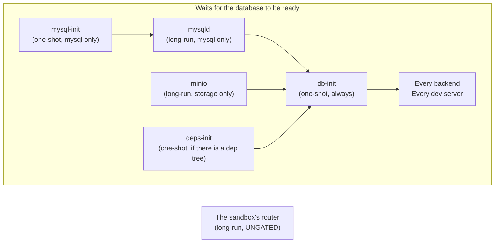

> **Partly verified** — The base image boots and the service tree generates correctly from both example plans, with the ungated services starting immediately and the database step running its driver dispatch. No real project has ever been booted, so no backend has ever been built or supervised by this graph.

A sandbox has to do several things before it can answer a request: bring up a database, restore a
copy of real data into it, run the project's migrations, install dependencies, and start the
project's own services. Some of those must happen before others. This page is the order, and the
two places where the obvious order is deliberately not used.

## The entrypoint is a script, not the supervisor

Inside the container, a **supervisor** keeps long-running processes alive and restarts them when
they die. The natural thing would be to make the supervisor the first process in the container.
It cannot be.

The supervisor compiles its list of services **once**, before any service runs. So the set of
services has to be settled first — and that set is a function of the project. A project with no
database has no database services at all. A project with no dependency tree has no
dependency-seeding step. One generic image serves every project, so the list is generated, and
generating it has to happen before the supervisor reads it.

So the container's first process is a shell script, and it:

1. reads [`/sandboxr/plan.json`](./plan-json.md), and refuses to start if it is missing
   or not valid JSON
2. exports the environment the sandbox computes for itself — its database address, its object
   storage, its own hostnames, and the project's own names for all three
3. writes the router configuration
4. writes the service list
5. hands over to the supervisor, replacing itself

Everything after point 5 is supervision.

<details>
<summary><b>Details for an agent:</b> the exact files, the two overrides, and why the environment is derived in a sourced library</summary>

| File | Job |
|---|---|
| `container/scripts/entrypoint.sh` | Points 1 to 5 above. The image's `ENTRYPOINT`. |
| `container/scripts/lib.sh` | Shared helpers, and it sources `env.sh`. |
| `container/scripts/env.sh` | Derives and exports every `SANDBOXR_*` value, then the project's own names for them. |
| `container/scripts/gen-caddyfile.sh` | Writes `/run/sandboxr/Caddyfile`. |
| `container/scripts/gen-services.sh` | Writes the supervisor's service directories. |

Two details worth knowing:

- **`env.sh` is sourced from `lib.sh`, not only from the entrypoint.** The entrypoint's exports
  reach every *supervised* service, because the supervisor inherits them and passes them on. They
  do **not** reach a `docker exec` — which is how the host runs every migration, build and
  database verb. A script that only worked under supervision would silently run with an empty
  `SANDBOXR_DB_FILE` and open a throwaway in-memory database instead of failing.
- **The generators take environment overrides** (`SANDBOXR_SCRIPTS`, `_RUN`, `_LOGS`, `_STATE`,
  `_WWW`, `_S6_DIR`, `_S6_SKEL`) so they can be exercised against a scratch directory on a
  laptop, with no image build. That is how both example plans are tested.

</details>

## The graph



*One-shot jobs gate the long-running ones. The router is deliberately outside the gate.*


A **one-shot** is a job that runs once and finishes. A **long-run** is a process that is kept
alive. One-shots gate long-runs here, so nothing serves traffic against a database that is not
ready yet.

## Which services exist depends on the plan

This is not a fixed graph with branches switched off. The service list is *generated*, so a
service that does not apply does not exist at all.

| Service | Exists when |
|---|---|
| `mysql-init`, `mysqld` | `driver: mysql` |
| `minio` | the project declares `storage` |
| `deps-init` | the plan carries a `deps` block |
| `db-init` | **always**, `driver: none` included |
| one per backend | one per `kind: backend` service in the plan |
| one per dev server | one per `kind: server` service, unless it is `optional` and was not asked for |
| the router | always |
| static front-ends | **never.** They are files, built on demand, with no process at all |

A project with no database therefore gets `db-init`, the router and its own services, and
nothing else. That is most of why such a sandbox is cheap.

### Why `db-init` exists even with no database

Because it is also what writes the status file the dashboard reads. A sandbox with no database
still has to be able to say it finished booting — otherwise "no database" and "still starting"
look identical from outside.

<details>
<summary><b>Details for an agent:</b> how the service tree is generated, and how an optional service is held back</summary>

`gen-services.sh` copies the supervisor's skeleton bundle into place and then, for each service,
writes a directory with a type (`oneshot` or `longrun`), a run script and a `dependencies.d`
entry per gate.

Membership of the `user` bundle is what actually *starts* something. A service directory outside
that bundle is written but inert — which is exactly how an optional service is held back: it is
defined, so the plan stays honest about what the project has, and it is not enabled.

`optional: true` services run only when named in `SANDBOXR_WITH`, a comma-separated list of
names or labels, which `sandboxr up --with cms,jobs` sets. The same check omits them from the
router, so an optional service that was not requested 404s rather than 502s.

Service ids: a backend is its sanitised `name`; a front-end of either kind is `web-<label>`.
Those ids are what `/__sandboxr/health/<service>` and the per-service log files use.

</details>

## The router is deliberately not gated

The router starts immediately, before the database is provisioned. That looks like a mistake and
is the most important choice on this page.

It serves the [status surface](./request-path.md#the-status-surface) and the "not built
yet" pages, neither of which touches the database. And a first-boot restore legitimately takes
minutes — which is exactly when someone most needs to know what is happening.

The trade is between two failure modes:

| Router ungated | Router gated on the database |
|---|---|
| A backend that is not up yet answers **502** | The whole sandbox answers **connection refused** |
| A 502 is a truthful answer: I am here, that service is not | A refused connection is not an answer at all |
| The status endpoint says `booting`, with a reason | Nothing can say anything |

> [!CAUTION] This was learned the hard way
> The internal tool sandboxr was ported from *did* gate its router on database initialisation. Its
> sandboxes were unreachable and unexplained for the whole of their first boot, and nobody could
> tell a slow restore from a broken one.

## Why the gate is at the database step

The other direction is just as deliberate: the project's own services **do** wait.

A backend that starts before its database exists will crash-loop for a while and then work, which
sounds harmless. It is not:

- The logs fill with connection failures that look like the bug you are actually chasing.
- A service that seeds or migrates on boot may do so against a half-restored database.
- The dashboard shows red during a normal startup, so red stops meaning anything.

Gating is cheap, and it makes "everything is green" a true statement.

## The status file, and why nothing asserts a state

Every writer in the boot sequence records a **fact** in its own small file under
`/run/sandboxr` — the database step finished, the migration failed — and then calls a composer
that works out the overall answer. No writer ever sets the state directly, so two writers cannot
disagree about whether the sandbox is degraded.

```json
{
  "project": "acme", "slug": "feat-123", "domain": "sbx.localhost",
  "state": "booting | ok | degraded",
  "database": { "driver": "mysql", "name": "acme" },
  "migrations": { "state": "ok | failed | skipped | unknown", "file": "", "error": "" },
  "bootedAt": "2026-08-25T13:41:27Z", "updatedAt": "2026-08-25T13:44:02Z"
}
```

Same principle as [state living only in Docker labels](./state.md), one level down:
derive the summary from the facts rather than storing the summary.

<details>
<summary><b>Details for an agent:</b> the marker files, the three states and the two things that survive a recomposition</summary>

Composed by `container/scripts/status.sh` into `/run/sandboxr/status.json`, served at
`/__sandboxr/status.json`.

| Marker | Written by | Means |
|---|---|---|
| `/run/sandboxr/boot.ok` | `db-init.sh` | The database step completed |
| `/run/sandboxr/boot.fail` | `db-init.sh` | It did not |
| `/run/sandboxr/migrate.json` | `migrate-run.sh` | The migration verdict, with the file and error extracted |
| `/run/sandboxr/migrate.ok` / `migrate.fail` | `packages/core` | What the host reads over `docker exec` to derive a sandbox's state |

The rules: no `boot.ok` yet means `booting`; `boot.fail` or a failed migration means `degraded`;
otherwise `ok`.

Two things survive a recomposition. `bootedAt` is the first time the container reached a terminal
state and is not overwritten, because clicking "retry migrations" is not a reboot. And the file is
written to a temporary name and moved into place, because the dashboard polls it and must never
read a half-written one.

`/run/sandboxr` is a tmpfs, so all of this is gone when the container stops. That is correct: none
of it describes anything that outlives the container.

</details>

## A failed migration does not stop the sandbox

The database steps **always exit zero**. A failure is recorded, the services boot anyway, and the
sandbox reports itself `degraded`.

Killing the container would destroy the evidence, and inspecting a failed migration is one of the
main reasons the sandbox exists. You cannot get a shell into a container that exited, or read a
schema you cannot reach.

```bash
sandboxr ls                  # STATE: degraded
sandboxr status feat-123     # the migration verdict, the file and the error
sandboxr logs feat-123       # the container's log stream
sandboxr db shell feat-123   # look for yourself
```

### The migration runner's exit code is not always trusted

A runner that prints its own failure summary and *then* exits zero reports success while the
schema is half-applied. And a sandbox builds that runner **from the branch it is testing**, so the
branch may be exactly the one with that bug.

A project whose runner behaves that way names a pattern, and the output is checked against it as
well as the exit code:

```jsonc
"migrate": {
  "command": "go run ./cmd/migrate",
  "failure_pattern": "[0-9]+ failed"
}
```

> [!WARNING] And never test a pipeline's exit status
> `cmd | tee log` exits with `tee`'s status, and `tee` always succeeds. Testing the pipeline
> reports **every** failed migration as a success. The container reads the first element of the
> pipeline's status array instead.

## Dependency caching, and why `deps-init` exists

A **bind mount** is a host directory made visible inside a container. sandboxr mounts your
worktree at `/workspace` that way, so a file you save is inside the container instantly.

The catch: a bind mount **hides whatever the image put underneath it**. Dependencies installed at
their natural place inside the project would simply vanish the moment the container started.

So the image installs them somewhere else — `/opt/deps` — and a boot step copies them into place:

1. If the sandbox's `node_modules` is already populated, nothing is copied.
2. Otherwise, the worktree's lockfile is hashed and compared with the hash stamped into the image.
3. Same hash: the tree is copied out of `/opt/deps`, which takes seconds.
4. Different hash: this branch changed its dependencies, so a real install runs instead. Slower,
   and correct — the alternative is a sandbox building against the wrong versions with no way to
   say so.

The dependency volume is named after the lockfile hash, so every sandbox with the same
dependencies shares one install and a branch that changes them transparently gets its own.

> [!TIP] Workspace binaries are re-linked, and the failure they prevent names nothing
> An image that installs from manifests alone skips linking a command whose target file does not
> exist yet. A build script one workspace package exposes to another is then missing, and the build
> dies with a bare `code 127` naming a binary that is plainly installed. The dependency step
> re-links those commands on every boot — including when the tree is already populated, because the
> volume outlives any one sandbox and a command added by a later branch would otherwise never
> appear.

<details>
<summary><b>If it goes wrong:</b> what the dependency step does when it cannot do its job, and why it never refuses to boot</summary>

`container/scripts/deps-init.sh` runs without `set -e`, on purpose: no dependency problem is worth
refusing to boot over. A sandbox whose front-end builds do not work is still worth opening, and
the failure is visible in its log rather than as a container that is not there.

Every exit path is zero:

| Situation | What happens |
|---|---|
| The plan declares no dependency tree | Logs that, exits |
| The declared root is not in this worktree | Logs that, exits |
| `node_modules` already populated | Re-links workspace binaries, exits |
| Lockfile hash differs from the image's | Runs the plan's `install` command; on failure warns that front-end builds will not work |
| Copy from `/opt/deps` fails | Warns, exits |

None of this has been run against a real project. The `/opt/deps` seed, the hash-mismatch install
path and the bin-linking are all on the container's own unverified list.

</details>

## Two traps in writing a supervised service

### A run script must replace itself with its service

Write `exec cmd | tee log` and the **shell** becomes the supervised process. A restart signals the
shell; the service survives it, keeps holding its port, and every replacement dies with
`address already in use` while the old code carries on serving.

It looks exactly like a deploy that did nothing, and you will read your own code for a long time
before you read a run script. Redirect with `>>`. Never pipe.

### Per-service log files, trimmed rather than rotated

`docker logs` interleaves every process in the container and cannot be filtered afterwards, which
is what makes a busy sandbox unreadable — for a person, and for an agent trying to find its own
failure. So each service writes its own file.

Those files are **trimmed**, not rotated: these are development logs, and a sandbox left up for
days must not be able to fill its own disk.

## Related

- [plan.json](./plan-json.md) — what all of this is generated from.
- [How a request arrives](./request-path.md) — once it is up.
- [Design decisions](./decisions.md) — the reasoning, collected in one place.
- [Symptom to cause](../troubleshooting.md) — when a step does not complete.
