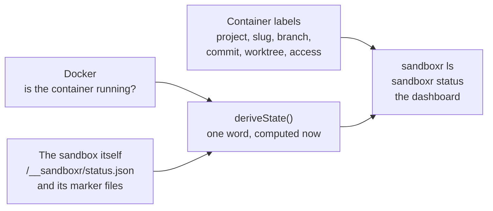

> **Written, never run** — The labels, the listing and the state derivation are written in packages/core and unit-tested. None of it has been run against real containers.

sandboxr keeps **no record of its own sandboxes**. There is no manifest file, no small database
of what exists, and no JSON file in `~/.sandboxr` listing running things.

A sandbox is a container, and everything durable about it is a **label** on that container — a
key and a value that Docker stores alongside it. `sandboxr ls` and `sandboxr gc` are pure
functions of `docker ps`, so nothing can drift out of sync with reality, because there is no
second copy of reality to drift.

| Label | Meaning |
|---|---|
| `sandboxr.project` | The project name from the config |
| `sandboxr.slug` | The sandbox's short name |
| `sandboxr.branch` | The branch, or `?` if it could not be resolved |
| `sandboxr.commit` | Short commit sha at the moment it started |
| `sandboxr.dirty` | `true` / `false` — were there uncommitted changes |
| `sandboxr.worktree` | Absolute path on the host |
| `sandboxr.driver` | Which database driver is in use |
| `sandboxr.created` | When, in ISO 8601 UTC |
| `sandboxr.access` | `public` / `private` |

## Labels hold durable state only

Every label above is fixed when the sandbox is created and never changes while it runs. That is
not a limitation of the design; it is the design.

**Runtime state — starting, running, degraded — is never written to a label.** It is worked out at
the moment somebody asks, from two things: what Docker says about the container, and what the
sandbox says about itself.

A label saying `running` would be a second source of truth that goes stale the instant a process
dies. You would then have two answers to "is this up", one of them wrong, and no way to tell which
from the outside.



*Durable facts come from the container. Runtime state is composed at read time and stored nowhere.*


## The one word, and how it is decided

| State | When |
|---|---|
| `stopped` | Docker says the container is not running |
| `degraded` | It is running, and the sandbox reports that its migrations failed |
| `running` | It is running, and the sandbox reports its migrations succeeded or were not configured |
| `starting` | It is running and has not said either way yet |

`degraded` matters most. A failed migration deliberately leaves the sandbox up so the failure can
be inspected, so Docker calls that container `running` — and anything reading only Docker would
paint the one sandbox worth looking at the same green as a healthy one.

<details>
<summary><b>Details for an agent:</b> the tension in contract §3.4, and exactly where the two sources are combined</summary>

The contract says state lives **only** in labels, and there is no `degraded` label. Read
carelessly, those two sentences contradict each other. The resolution:

- **Labels are the authority for durable facts** — what this sandbox is, and what it was made
  from. `packages/core/src/sandbox/labels.ts`, `LABELS` and `sandboxFromLabels`.
- **The sandbox itself is the authority for runtime state.** It composes its own verdict from
  marker files under `/run/sandboxr` and serves it at `/__sandboxr/status.json`. Two writers
  inside the container therefore cannot disagree, because none of them writes the verdict — see
  [the status file](./startup.md#the-status-file-and-why-nothing-asserts-a-state).
- **`deriveState` in `packages/core/src/sandbox/labels.ts` is where the two meet**, and it stores
  nothing.

Two readers, two paths to the same facts:

| Reader | How it asks |
|---|---|
| `packages/core` (`ls`, `status`, `gc`) | `docker exec` into the container to test for `/run/sandboxr/migrate.ok` and `/run/sandboxr/migrate.fail` |
| `packages/server` (the dashboard) | HTTP `GET /__sandboxr/status.json` on the sandbox's own hostname, folded into a display state by `displayState` in `src/sandboxes/model.ts` |

Both are read-time questions with no cached answer. The one gap worth naming: those are two
implementations of "what state is this sandbox in", and they read different sources for the same
verdict. Tracked on [what is built](../reference/status.md).

</details>

## What labels-only buys

**A listing cannot be stale.** A container that does not exist cannot appear in `sandboxr ls`,
because the listing *is* the container set.

**The dashboard cannot lie.** It reads live, so there is no cache to invalidate and no "the
dashboard says it is up but it is not".

**Crash recovery is free.** Interrupt `up` halfway, reboot the machine, `docker rm` a container by
hand — there is no bookkeeping left inconsistent, because there is no bookkeeping.

**A router needs no configuration file.** It can resolve a hostname by matching labels, so starting
a sandbox makes its hostnames work with nothing to write and nothing to reload.

## The alternative, and why it is worse

A manifest file is the obvious design: a JSON file listing sandboxes, updated on `up` and `down`.

It fails in the ordinary case, not the exotic one. Every one of these leaves it wrong:

- `up` is interrupted after the container starts and before the file is written.
- The machine reboots during a `down`.
- Somebody runs `docker rm` directly, which people do.
- Two `up` commands run at once and race on the file.
- The file sits inside a repository and `git clean` removes it.
- Docker's own pruning removes a container.

Each of those is recoverable with a reconciliation step — whose job is to compare the file against
`docker ps` and believe `docker ps`. At which point the file is a cache of the thing you already
have to read, and its only remaining function is to be wrong occasionally.

> [!TIP] The general shape of the argument
> When the truth is already stored somewhere durable that you have to read anyway, a second copy is
> not state. It is a bug with a schema.

## What it costs

This is a real trade, and it is worth being explicit about what you give up.

**A label is a string.** No nested structures, no lists, no booleans. `sandboxr.dirty` is the text
`"true"`.

**Labels cannot be changed on a running container.** So anything that changes while a sandbox runs
cannot live in one:

| Changes at runtime | So it lives |
|---|---|
| Which front-ends have been built | in `/srv/www/.built.json`, inside the container |
| Whether the last migration succeeded | as a marker file inside the container |
| Whether a backend is healthy right now | by asking it, live, over `/__sandboxr/health/<service>` |
| The current commit, if you commit inside the sandbox | nowhere — the label records the commit at start |

That last row is a genuine wart. `sandboxr.commit` and `sandboxr.dirty` are a snapshot from `up`
and go stale the moment you commit in the worktree. They answer "what was this started from", not
"what is it now", and the code says so rather than pretending otherwise.

**There is no history.** Remove a container and its state goes with it, which is right for a
sandbox — but you cannot ask what sandboxes existed last week.

## What is not in labels

Not everything is disposable. Some things must **outlive** a container, and those live under
`SANDBOXR_HOME` — `~/.sandboxr` by default.

| Path | Why it is not a label |
|---|---|
| `cache/` | Seed artifacts, shared between sandboxes and expensive to rebuild |
| `logs/<project>/<slug>/` | Survive the container on purpose — the logs from a sandbox you just deleted are the ones you want |
| `tls/`, `state/` | Machine-level, not per-sandbox |
| `secrets/<project>.env` | Per project, mode 0600, and must never be in an image |
| `build/<project>/<slug>.env` | The generated per-sandbox environment, rewritten on `up` |

`SANDBOXR_HOME` is deliberately **never inside a repository**, so `git clean -xdf` cannot destroy
your seed cache or your certificate.

## Reading the labels yourself

Everything `sandboxr ls` shows is available directly, which is occasionally useful — in a script,
or when you want to be sure the tool is not adding anything of its own:

```bash
docker ps --filter label=sandboxr.project=acme \
  --format '{{.Names}}\t{{.Label "sandboxr.slug"}}\t{{.Label "sandboxr.branch"}}'
```

```
sandboxr-acme-feat-123	feat-123	feat-123
sandboxr-acme-fix-nav	fix-nav	fix/nav-overflow
```

If `sandboxr ls` and `docker ps` ever disagree, that is a bug in the listing code, because there is
nothing else it could be.

<details>
<summary><b>Details for an agent:</b> the container filter, the naming rules and how gc decides what to reap</summary>

Every sandbox carries `sandboxr.slug`, so `label=sandboxr.slug` is the filter that finds all of
them whatever project they belong to. A container without that label is not one of ours and is
skipped rather than half-parsed, so a stray container on the same daemon can never appear in a
listing.

Names, from contract §3.3:

| Thing | Name |
|---|---|
| Container | `sandboxr-<project>-<slug>` |
| Network | `sandboxr` — one, shared |
| Per-sandbox volumes | `sandboxr-<purpose>-<project>-<slug>`, purpose one of `data`, `blob`, `bin`, `www` |
| Shared volumes | `sandboxr-deps-<lockfile hash>`, `sandboxr-gocache`, `sandboxr-gomod` |

`gc` reads two things: the sandbox list, and the volume list. It reaps a sandbox whose
`sandboxr.worktree` path no longer exists on disk, and removes any `sandboxr-` volume no surviving
sandbox has mounted. `--dry-run` prints what it would do and touches nothing.

It does **not** prune Docker's build cache. `docker builder prune` is what does that.

</details>

## Related

- [How a request arrives](./request-path.md) — a router reading these labels.
- [The startup graph](./startup.md) — where the runtime verdict is composed.
- [Lifecycle](../guides/lifecycle.md) — `gc` deciding what to reap.
- [Design decisions](./decisions.md) — the other decisions, and their reasons.
