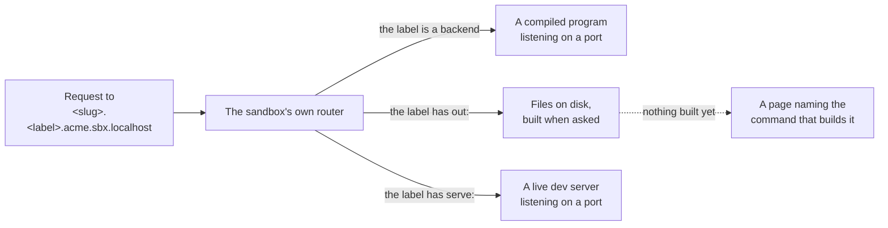

> **Written, never run** — All three kinds exist in the schema, in the plan emitter and in the container's scripts, and the script generators have been exercised against the two example plans. No real project's app has ever been built or served this way.

Everything a sandbox runs is exactly one of three things. Deciding which one each part of your
project is, is most of writing a config — and it is the decision that is expensive to get wrong,
because two of the three failure modes are things that *half*-work rather than things that stop.

| Kind | You write | What it is | What it costs |
|---|---|---|---|
| **backend** | `backends.services[]` | a program, compiled once, kept running | a process, and a few seconds to build |
| **static front-end** | a `frontends` entry with `out:` | a directory of files, built when you ask | nothing at all until you build it |
| **served front-end** | a `frontends` entry with `serve:` | a live development server, kept running | the most expensive thing in a sandbox |

All three answer on the same shape of address — `<slug>.<label>.<project>.<domain>` — so from
outside they look identical. What differs is what is behind it.



*One hostname pattern, three different things behind it.*


## A backend

A program that listens on a port. An API, a worker with an HTTP interface, anything you compile.

```yaml
backends:
  defaults:
    workdir: services
    build: go build -o {out} ./{name}
    health: /health
  services:
    - { name: api, port: 8001, label: api }
```

It is built when the sandbox starts, and then supervised: if it exits, it is started again. A
compiled service is cheap to build and useless until it exists, which is why this kind is built
up front while a front-end is not.

`health` gives the sandbox a way to answer "is this actually working" rather than only "is the
process alive". Without it, a service that started and immediately wedged still counts as up.

After you change its code:

```bash
sandboxr reload --go api
```

That is a compile and a process replacement — a couple of seconds for a Go service, and nothing
else in the sandbox is disturbed.

<details>
<summary><b>Details for an agent:</b> how a backend is built and supervised, and what a build failure looks like</summary>

The container's `run-backend.sh` is the supervised service. It builds first, then `exec`s the
binary — the `exec` matters, because a supervised shell would survive a restart request, keep its
child alive and hold the port, so every replacement would fail with "address already in use"
while the old code carried on serving.

A build failure is not allowed to become a crash-loop that scrolls its own error away: the script
warns, sleeps ten seconds, and exits, so the compiler output stays readable in that service's log
before the supervisor tries again.

`{name}` and `{out}` in the build command are substituted by the host, and both values are
checked against a strict character set first — a build command is handed to a shell inside the
container, so a value that could carry a metacharacter is refused rather than escaped.

Relevant fields: `name`, `port`, `label`, `build`, `workdir`, `health`, `memory`, `optional`. The
complete table is on [sandboxr.yaml, field by field](./sandboxr-yaml.md).

</details>

## A static front-end

A build command that leaves files in a directory. There is no process, no port and no memory cost
once it has been built — a request is a file read.

```yaml
frontends:
  root: web/packages
  defaults:
    build: npx vite build
    out: dist
  apps:
    - { label: app, package: web }
```

`out:` is what makes it this kind. It says where the build leaves its files, relative to the
package directory.

> [!TIP] Point `build` at the bundler, not at the npm script
> A typical `npm run build` is `tsc -b && vite build`, so a branch that does not type-check cannot
> be sandboxed at all. Calling the bundler directly means a branch mid-refactor still gets a
> running app, and CI stays the thing that enforces types. A sandbox is for looking at behaviour.

### Nothing is built when the sandbox starts

This is the rule that makes a sandbox come up in seconds rather than minutes. A freshly started
sandbox has built **nothing**. Each static hostname answers with a page saying so and naming the
command that builds it:

```bash
sandboxr reload --web app
```

Two reasons it is a page rather than a 404. A 404 at a sandbox hostname is indistinguishable from
DNS being broken or the router being misconfigured, so you would go and debug the wrong layer.
And most of the time you want one app out of six — building the other five is pure waiting.

### `static_mode`: three genuinely different ways to serve a directory

```yaml
apps:
  - { label: app, package: web, static_mode: spa }
  - { label: www, package: marketing, out: out, static_mode: html }
  - { label: assets, package: assets, static_mode: files }
```

| Mode | A path that is not a file on disk… | Use it for |
|---|---|---|
| `spa` (the default) | is rewritten to `index.html` | a single-page app that does its own routing |
| `html` | `/about` resolves to `about.html` | a generator that emits `about.html`, not `about/index.html` |
| `files` | is a real 404 | a plain directory of assets |

> [!CAUTION] The wrong mode does not fail — it half-works
> Serve a static-site generator's output in `spa` mode and every deep link renders the home page.
> Serve a single-page app in `files` mode and every route except `/` is a 404. Serve an asset
> directory in `spa` mode and a mistyped filename returns your app's HTML with a 200 — so the code
> fetching it parses a page of markup as JSON and reports something unrelated.
>
> None of those crash. Nothing appears in a log. You find out from whoever you sent the link to.
> That is why the mode is declared rather than guessed from what happens to be in the directory.

### `in_build_all`, and why "rebuild everything" has two meanings

Some front-ends are expensive and rarely the thing under test. A component-library viewer can
cost as much to build as every other app in the project put together.

```yaml
- { label: storybook, package: storybook, build: npm run build-storybook, out: storybook-static, in_build_all: false }
```

`in_build_all: false` takes it out of "build everything" — but not out of "refresh what this
sandbox has already built". Those are two different requests and the CLI has both:

| Command | Builds |
|---|---|
| `sandboxr reload --web app` | just that one app |
| `sandboxr reload --web all` | every app except those with `in_build_all: false` |
| `sandboxr reload --web built` | only what this sandbox has already built, whatever its setting |

The distinction earns its keep the moment a sandbox has built something expensive on purpose.
`--web built` refreshes it; `--web all` will never start its first build by accident.

<details>
<summary><b>Details for an agent:</b> exactly what each static mode generates, and the two failures a static build can produce</summary>

Each mode is a snippet in the router's generated configuration
(`container/scripts/gen-caddyfile.sh`):

| Mode | Behaviour |
|---|---|
| `spa` | `try_files {path} {path}/ /index.html`, then a file server |
| `files` | a file server only — it resolves `index.html` for a directory itself, and anything else unknown is a 404 |
| `html` | `try_files {path}.html {path} {path}/index.html`, then a file server |

All three test for `/index.html` to decide whether the app has been built, and all three set the
document root **before** that test — the file matcher resolves against the root, so testing first
looks in the wrong directory, always misses, and makes every built app report itself as not
built.

The build itself (`container/scripts/build-static.sh`) takes a label, `--all`, or `--built`. It
builds into the package's `out` directory, then copies the result beside the served directory and
swaps it into place, so a page load during a build never sees a half-written bundle. A build that
produces no `out/` is an error rather than an empty site.

Two failures worth recognising:

- **The declared memory is more than the sandbox has.** The build refuses in about a second and
  names the limit, rather than being killed part-way through and reporting only exit code 137.
  The message currently suggests restarting with `SANDBOXR_MEMORY=…`, which **nothing on the host
  reads today** — raise the app's `memory:` in the config instead, since the sandbox's limit is
  the largest any one app asks for, with a floor of 4 GB.
- **The app has not been built.** The hostname answers 503 with a page naming a build command.
  The page as generated today names `sandboxr build <slug> --app <label>`, which is not a real
  command; the real one is `sandboxr reload --web <label>`.

</details>

## A served front-end

A long-running process that serves the app itself, rather than a build that leaves files behind.
`wrangler dev` is one. So is a framework with no static export, and so is a CMS.

```yaml
frontends:
  apps:
    - label: cms
      package: cms
      serve: npx next dev --port 3000 --hostname 127.0.0.1
      port: 3000
      optional: true
```

`serve:` is what makes it this kind, and a `port:` is required with it, because the sandbox's
router has to have somewhere to forward requests to.

It is declared under `frontends` because it *is* the front-end for that label. It behaves like a
backend at run time: supervised, restarted if it exits, reached through a proxy.

The compensation for what it costs is that it needs no rebuild command at all. Your worktree is
mounted into the container, so the server sees your edits and reloads itself. Edit a file,
refresh the browser.

### Why this is a third kind and not a variation on the other two

It is tempting to collapse it — "a server is just a backend under a front-end label", or "a static
app is just a server that happens to write files". Both are wrong in ways that cost you.

**A server is not a backend.** It produces no artefact, so there is nothing for a rebuild command
to rebuild. It recompiles as it serves, so it needs no rebuild command in the first place. And it
takes an app label's hostname, not a service name's — which is exactly what a Workers project
needs, because the worker *is* the app. Calling it a backend would mean giving up the app
hostname; calling it static would mean having nothing to serve.

**A static app is not a server.** It has no port, no process, no health check and no memory cost
when nobody is looking at it. Building it is a discrete event with an exit code; serving it is a
file read.

Fold them together and every piece of code that touches a runtime has to ask "but which sort is
this one really?" — which is precisely the branching that three explicit kinds make visible in
one place.

### It is the most expensive thing in a sandbox

A development server holds the whole of your project's module graph in memory for **as long as
the container lives**, whether or not anybody ever opens it. Commonly hundreds of megabytes. It
is not paid when a request arrives; it is paid from the moment the sandbox starts.

That cost is also multiplied. Several sandboxes run at once on one machine, each under its own
memory limit, and a dev server in each of them is a dev server per branch.

So a project can mark one `optional: true`, and it is then defined but dormant until somebody asks
for it:

```bash
sandboxr up --with cms
```

Nothing about `optional` is specific to servers — a backend can be optional too — but a server is
the usual reason to want it.

### `prepare` runs once, just before the server starts

A server has no build step, but some need something done first: code generation, a schema pull, a
type build.

```yaml
- label: cms
  package: cms
  prepare: npm run codegen
  serve: npx next dev --port 3000 --hostname 127.0.0.1
  port: 3000
  optional: true
```

`prepare` is the whole of a server's "build", and it runs as part of starting the server — not on
demand, and not in parallel with it.

> [!CAUTION] A file-backed database needs the server pointed at the sandbox's state
> If the project uses the `d1` or `sqlite` driver, both the `serve` command and the `migrate`
> command must direct the runtime at the sandbox's own state directory:
>
> ```yaml
> serve: npx wrangler dev --port 8787 --ip 127.0.0.1 --persist-to $SANDBOXR_D1_DIR
> ```
>
> Leave it out and the runtime writes its database **into your worktree** — so sandbox data lands in
> your branch, and every sandbox of that project shares one file. `sandboxr doctor` warns when it
> cannot see the variable in the command; it does not refuse, because a project can point its
> runtime at the right place through a config file the tool cannot read.
> [D1 and SQLite](../databases/d1-sqlite.md).

<details>
<summary><b>Details for an agent:</b> how a served front-end is started, and why a non-owner is denied the database on purpose</summary>

`container/scripts/run-server.sh` runs `build-server.sh` first — which does nothing at all unless
the app declares `prepare` — and then `exec`s the serve command in the package directory. The
`exec` is what makes the supervisor watch the server itself rather than a shell wrapping it.

For a `d1` or `sqlite` project, the script then does something that looks unhelpful and is not:
**every server that is not the database's declared `owner` has the database's location removed
from its environment.** A second server that opens the same file does not error, it deadlocks —
a hang with nothing in any log. Withholding the location turns that into a loud failure about a
missing binding, in the process that was not supposed to have it.

`optional` is honoured by both container generators, so the router never advertises a hostname
for a service that will not answer. The host passes the requested set as `SANDBOXR_WITH`, a
comma-separated list of names or labels, from `sandboxr up --with a,b`.

</details>

## Choosing, in one table

| What you have | Kind | Write |
|---|---|---|
| A compiled service with an HTTP port | backend | an entry under `backends.services` |
| A bundled single-page app | static | `out: dist` |
| A static-export site generator | static | `out: out`, `static_mode: html`, and probably `memory:` |
| A component library's static build | static | `out: storybook-static`, `in_build_all: false` |
| A directory of assets with no app | static | `static_mode: files` |
| A framework with no static export | server | `serve:` and `port:`, probably `optional: true` |
| A Workers project under `wrangler dev` | server | `serve:` and `port:` |
| A worker with no HTTP interface at all | backend | an entry under `backends.services` |

## The trade you are making

| | Cost at startup | Cost while idle | Cost of a change | Picks up an edit on its own |
|---|---|---|---|---|
| **backend** | seconds — it is compiled | one process | about 2s to rebuild | no |
| **static** | none | none | seconds, more for a big site | no |
| **served** | seconds | hundreds of MB, permanently | none | yes |

Read the last column as the reason the first two kinds have no automatic reload. It is not a
missing feature. It is the price of running six sandboxes on one laptop.

## Related

- [sandboxr.yaml, field by field](./sandboxr-yaml.md) — every field of both blocks.
- [Editing and reloading](../guides/edit-and-reload.md) — the commands, and what each one actually does.
- [A MySQL monorepo](./example-monorepo.md) — a real config with all three kinds in it.
