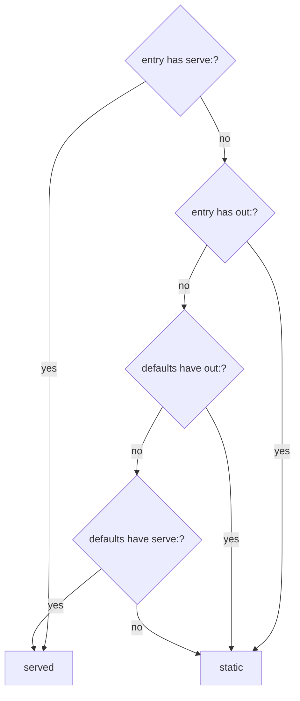

Every field a `sandboxer.yaml` accepts, in schema order. Use
[Build your config, step by step](index.md) if you are writing one for the first time;
this page is for looking things up.

```prompt
Answer a question about a sandboxer.yaml field.

Read docs/configuration/sandboxer-yaml.md. Treat it as the field list, and
docs/configuration/rules.md as the list of constraints. If the answer is not on either
page, say so rather than guessing — the authority is
packages/core/src/config/schema.ts in the sandboxer repository.
```

`packages/core/src/config/schema.ts` is the authority. Where this page and the schema
disagree, the schema is right.

**Every object is strict.** A misspelled key is an error naming the key, not a setting that
silently does nothing. That matters in a file which decides what a sandbox serves: a typo
you cannot see is worse than a failure you can.

## Top level

```yaml
project: acme            # required
sandboxer: ">=0.1.0"      # required
```

| Field | Type | Required | Default |
|---|---|---|---|
| `project` | lowercase letters, digits and dashes | **yes** | — |
| `sandboxer` | version constraint | **yes** | — |
| `database` | [block](#database) | no | `{ driver: none }` |
| `backends` | [block](#backends) | no | none |
| `frontends` | [block](#frontends) | no | none |
| `routes` | [block](#routes) | no | `{}` |
| `secrets` | [block](#secrets) | no | all four lists empty |
| `storage` | [block](#storage) | no | `{ driver: none, buckets: [] }` |
| `deps` | [block](#deps) | no | detected from a lockfile |
| `toolchain` | [block](#toolchain) | no | neither runtime |
| `access` | [block](#access) | no | `apps: public`, `controls: password`, `credentials: dummy` |
| `env` | map of name to string | no | `{}` |

`project` must match `^[a-z0-9]([a-z0-9-]*[a-z0-9])?$`. It goes into hostnames, container
names and volume names, so it shares the hostname alphabet.

`sandboxer` is matched against the tool's own version. Comparators: `>=`, `<=`, `>`, `<`,
`^`, `~`, `=`. A space or a comma between terms means AND. `||` separates alternatives. `*`
or an empty string accepts anything. `^0.x` treats the minor digit as the breaking one,
which is the convention every registry uses and the one a pre-1.0 tool needs.

### Shared value types

| Type | Rule |
|---|---|
| hostname label | `^[a-z0-9]([a-z0-9-]*[a-z0-9])?$`, at most 63 characters |
| port | integer, 1–65535 |
| memory | `^[0-9]+(b\|k\|m\|g)?$`, case-insensitive — `6g`, `512m` |
| path | non-empty string, relative to the tree the config governs unless stated |

## `database`

```yaml
database:
  driver: mysql
  version: "8.4"
  seed_from:
    local: { container: acme_db, database: acme }
    file: /var/sandboxer/seeds/acme.sql.zst
    fixtures: db/seeds/fixtures.sql
    anonymised: true
  migrate:
    workdir: services
    command: go run ./cmd/migrate --dir ../db/migrations --non-interactive
    since: "20240101"
    failure_pattern: "[0-9]+ failed"
    file_pattern: "[0-9]{8}-[^ ]+\\.sql"
    error_pattern: "Error [0-9]+ \\([0-9A-Z]+\\):.*"
  owner: app
```

| Field | Type | Required | Notes |
|---|---|---|---|
| `driver` | `mysql` \| `d1` \| `sqlite` \| `none` | **yes** if the block is present | See [Databases](../databases.md) |
| `version` | string or number | no | The version production runs, not the one you happen to have |
| `seed_from` | [block](#databaseseed_from) | no | Where the initial data comes from |
| `migrate` | [block](#databasemigrate) | no | The project's own migration command |
| `owner` | string | no | The one runtime allowed to open a file-backed database |

`owner` names a declared backend `name` or a front-end `label`. It is required for `d1` and
`sqlite` whenever the project declares more than one runtime; with exactly one runtime,
sandboxer resolves it for you when it writes the plan.

> [!WARNING] A driver with nothing to do is refused
> A `driver` other than `none`, with neither `seed_from` nor `migrate`, is a config error.
> There would be nothing for the driver to do.

### `database.seed_from`

| Field | Type | Notes |
|---|---|---|
| `local.container` | string | A database container already running on your machine. **Read only** |
| `local.database` | string | Which database inside it. Optional |
| `file` | path | A dump to restore, or a state directory for a file-backed driver |
| `fixtures` | path | Applied **after** migrations, whichever source was used |
| `anonymised` | boolean | Asserts that `file` holds no real personal data |

Precedence is **`local`, then `file`, then `fixtures`** — freshest first.
`sandboxer up --seed local|file|fixtures` forces one. The access rules filter the list
before anything is chosen, so a public project simply has fewer options.

`anonymised` is the only thing the public-sandbox refusal accepts as marking a dump safe. It
is an assertion by whoever wrote the config, not something the tool can verify.

### `database.migrate`

| Field | Type | Required | Notes |
|---|---|---|---|
| `command` | string | **yes** | Your project's own runner |
| `workdir` | path | no | Where to run it. Relative to the tree the config governs |
| `since` | string or number | no | A cutoff, exported as `SANDBOXER_MIGRATE_SINCE` |
| `failure_pattern` | string | no | Treat output matching this as a failure, even on exit 0 |
| `file_pattern` | string | no | How to pull the failing file's name out of the output |
| `error_pattern` | string | no | How to pull the error line out of the output |

`since` is exported as a variable rather than turned into a flag. sandboxer cannot guess a
runner's flag spelling, so **your command has to consume it**. If `since` appears to do
nothing, that is why.

The three patterns are passed into `plan.json` untouched and read by the container's
migration runner. Nothing on the host interprets them; the host's own output parsing uses
fixed heuristics.

<details class="agent">
<summary><b>Details for an agent</b> — where <code>migrate.command</code> runs, and the two halves that disagree</summary>

Declared `workdir` is joined to the worktree mount: `/workspace/<workdir>`.

With **no** `workdir`, the two halves of the tool differ today:

- The container's `migrate-run.sh` runs the command in `/empty`, a deliberately empty
  directory, so that no dotfile lying around the repo can shadow the environment the
  sandbox passed in. That is the path a boot takes.
- The host driver's `migrateWorkdir()` (`packages/core/src/drivers/migrate.ts`) falls back
  to `/workspace`. That is the path `sandboxer db migrate` and `sandboxer reload --migrate`
  take.

Declare `workdir` explicitly if it matters to your runner, which it usually does —
`wrangler`, for instance, resolves `wrangler.jsonc` from the working directory.

</details>

## `backends`

Long-running services the project compiles and runs. Two accepted shapes.

```yaml
# Mapping form — canonical, because `defaults:` cannot legally sit inside a YAML list.
backends:
  defaults:
    workdir: services
    build: go build -o {out} ./{name}
    health: /health
  services:
    - { name: api, port: 8001, label: api }
    - { name: adminApi, port: 8081, label: admin-api }

# List form — identical meaning, for a project with nothing to default.
backends:
  - { name: api, port: 8001, label: api, build: go build -o {out} ./api }
```

| Field | Type | Required | In `defaults` | Notes |
|---|---|---|---|---|
| `name` | string | **yes** | no | Unique. The binary's name, and a `routes` target |
| `port` | port | **yes** | no | Where it listens **inside** the container |
| `label` | hostname label | **yes** | no | Its hostname: `<slug>--<label>--<project>.<domain>` |
| `build` | string | **yes**, here or in `defaults` | yes | `{name}` and `{out}` are substituted |
| `workdir` | path | no | yes | Where the build runs, and where the binary is started from |
| `health` | path | no | yes | Probed to decide whether the service is up |
| `memory` | memory | no | yes | Raises the whole sandbox's limit |
| `optional` | boolean | no | yes | Dormant unless named in `--with`. Default `false` |

Only `{name}` and `{out}` are substituted. The substituted value is checked against
`^[A-Za-z0-9._/@-]+$` first, because the command itself comes from your config and is
handed to a shell — a value with a space or a semicolon in it would be two commands rather
than one argument.

> [!TIP] Leave out a service that cannot start
> A service whose database exists on no developer machine, and that no migration creates,
> should be omitted or marked `optional` rather than declared. Otherwise it can only
> crash-loop, filling the log and making the sandbox look broken.

## `frontends`

Apps served on their own hostnames. The same two shapes, plus a `root`.

```yaml
frontends:
  root: web/packages
  defaults:
    build: npx vite build
    out: dist
  apps:
    - { label: app, package: web }
    - { label: admin, package: admin }
    - { label: www, package: marketing, build: npm run build, out: out, memory: 6g }
    - { label: cms, package: cms, serve: npx next dev --port 3000, port: 3000, optional: true }
```

| Field | Type | Required | In `defaults` | Notes |
|---|---|---|---|---|
| `label` | hostname label | **yes** | no | Its hostname, and the key `routes` uses |
| `package` | path | **yes** | no | The package directory, relative to `root` |
| `build` | string | for a static app | yes | What produces the output |
| `out` | path | for a static app | yes | The built directory, relative to the package |
| `serve` | string | for a served app | yes | A long-running command |
| `port` | port | for a served app | yes | Where that command listens |
| `prepare` | string | no | yes | Run once before a **served** app starts. Ignored for a static app |
| `health` | path | no | yes | For a **served** app. Ignored for a static app |
| `static_mode` | `spa` \| `files` \| `html` | no | yes | How the built directory is served. Default `spa` |
| `in_build_all` | boolean | no | yes | Whether "rebuild everything" includes it. Default `true` |
| `memory` | memory | no | yes | Raises the whole sandbox's limit |
| `optional` | boolean | no | yes | Dormant unless named in `--with`. Default `false` |

`root` exists only in the mapping form, and is optional there. In the list form, and when
`root` is absent, every `package` is relative to the tree the config governs.

### Static or served is decided per entry

**`out` and `serve` on the same entry is an error** — pick one. Otherwise the kind is
decided by looking at the entry first, and only then at the defaults.



The entry decides its own kind before defaults are consulted, so a served app declared
under a `defaults: { out: dist }` does not inherit an output directory it has no build to
fill.

After that: a static app with no `out` is an error, a static app with no `build` is an
error, and a served app with no `port` is an error. Each names the app.

### `static_mode`

| Mode | Behaviour | For |
|---|---|---|
| `spa` *(default)* | Any unknown path falls back to `index.html` | A single-page app with client-side routing |
| `html` | `/blog/foo` resolves to `foo.html`, then `foo`, then `foo/index.html` | A generator emitting extensionful files |
| `files` | An unknown path is a real 404 | A plain directory of assets |

Getting it wrong does not crash anything. It produces an app that *half-works*, which is
why the mode is declared rather than guessed. `spa` is the default because it is the common
case and the one that is wrong in the least damaging way.

### `in_build_all`

"Rebuild everything" deliberately means the project's ordinary apps, not literally
everything. Set `in_build_all: false` on the expensive members — a marketing site rendering
thousands of pages, a component library — so a shared-component tweak does not start a
multi-gigabyte build as a side effect. See [The edit–reload loop](../guides/edit-and-reload.md).

### `memory`

A declared limit raises the limit of the **whole sandbox**, because the cgroup total is
what the kernel enforces. The largest limit any one runtime asks for wins, over a floor of
`4g`.

A static build compares its declared `memory` against the container's real limit and
refuses in a second, naming both, rather than being killed part-way through. It also sets
`--max-old-space-size` to 75% of the limit, so a single overrunning process gives up with a
heap error instead of dying silently.

## `routes`

Path prefixes served on an app's own hostname, proxied to a service.

```yaml
routes:
  app:
    "/api": api
    "/cms": cms
  admin:
    "/api": adminApi
```

- The outer key must be a declared **front-end label**.
- The inner key must start with `/`.
- The value must be a backend **`name`**, or the **label** of a front-end that runs as a
  server.
- Prefixes are emitted longest-first, so the order you write them in does not matter.
- Each prefix strips itself before proxying: `/api/orders` reaches the backend as
  `/orders`.

Every backend already has a hostname of its own, so this looks redundant. It is not. A
same-origin request needs no preflight, no per-sandbox allowlist and no cookie reasoning,
which takes CORS out of the picture entirely — and the app's own code can say `/api` in
every environment.

## `secrets`

```yaml
secrets:
  read: [services/api/.env, web/packages/web/.env]
  keep: [AUTH0_DOMAIN, JWT_SECRET, ANALYTICS_ENDPOINT]
  rename: { ANALYTICS_API_HOST: ANALYTICS_ENDPOINT }
  never: ["DB_*", "S3_*", "*_URL", "PORT"]
```

| Field | Type | Notes |
|---|---|---|
| `read` | list of paths | The `.env` files to read, in order. A later file wins |
| `keep` | list of names | An allowlist. **Exact names only — no wildcards** |
| `rename` | map | Source name to target name. Outranks both `keep` and `never` |
| `never` | list of glob patterns | A denylist. `*` is the only wildcard |

Note the asymmetry: `never` is matched as a glob, `keep` is matched literally.
`keep: [ANALYTICS_*]` matches a variable actually called `ANALYTICS_*` and nothing else.

This block governs **importing**. The credentials themselves live in one file per project,
`~/.sandboxer/secrets/<project>.env`, which you also edit directly — `sandboxer secrets set` or
`sandboxer secrets edit`. A project with no `.env` files to import from needs no `read` list at
all, only `keep`, which doubles as its statement of which credentials it needs.

Full rules, and why `never` matters more than it looks: [Secrets](secrets.md).

## `storage`

```yaml
storage:
  driver: minio
  buckets: [uploads, avatars, exports]
```

| Field | Type | Required | Notes |
|---|---|---|---|
| `driver` | `minio` \| `none` | **yes** if the block is present | |
| `buckets` | list of strings | no | Created at first boot |

With `minio`, an S3-compatible store runs inside the sandbox, so uploads never reach a real
bucket. Its endpoint is exported as `SANDBOXER_S3_ENDPOINT`. The label `s3` is reserved:
`<slug>--s3--<project>.<domain>` reaches the store, and `/console/*` on that hostname reaches
its web console.

## `deps`

The Node dependency tree, when the project has one.

```yaml
deps:
  root: .
  lockfile: package-lock.json
  install: npm ci --no-audit --no-fund
```

| Field | Type | Required | Default |
|---|---|---|---|
| `root` | path | **yes** | — |
| `lockfile` | path | no | `package-lock.json` |
| `install` | string | no | `npm ci --no-audit --no-fund` |

Named rather than inferred, because the directory holding the lockfile is not always the
directory holding the packages, and the shared dependency volume is mounted at exactly one
path. Left out, sandboxer searches; see
[step 5 of building a config](index.md#step-5-add-deps) for the search order.

## `toolchain`

```yaml
toolchain:
  go: "1.23"
  node: "22"
```

Both optional. Both accept a string or a number. Both are prefixes: `24` picks the latest
24.x. They decide which blocks the project's image layer includes, so a Node-only project
carries no Go.

## `access`

```yaml
access:
  apps: public
  controls: password
  credentials: dummy
```

| Field | Values | Default | Notes |
|---|---|---|---|
| `apps` | `public` \| `private` | `public` | `private` puts every app hostname behind a forward-auth check in the shared router, answered by whatever serves the bare domain |
| `controls` | `password` | `password` | The only accepted value, and there is no way to turn it off. The engine parses it and enforces nothing — sandboxer serves no controls over http |
| `credentials` | `dummy` \| `real` | `dummy` | Whether the project's real third-party credentials may be present |

A public project seeding from live data, or carrying real credentials, is **refused** rather
than warned. [Access and security](../access.md) has the whole model.

## `env`

The join between sandboxer's names for things and the project's own.

```yaml
env:
  DB_HOST: "${SANDBOXER_DB_HOST}"
  DB_NAME: "${SANDBOXER_DB_NAME}"
  S3_ENDPOINT: "${SANDBOXER_S3_ENDPOINT}"
  S3_BUCKET: uploads
  VITE_API_URL: /api
  VITE_APP_URL: "${SANDBOXER_URL_APP}"
```

Keys must match `^[A-Za-z_][A-Za-z0-9_]*$`. Values are plain strings; `${SANDBOXER_*}`
placeholders are substituted **inside the container** with values the sandbox computed for
itself.

Substitution, never a shell — a value is data. Nothing here can point at a real service,
because the only variables available are the sandbox's own. Anything genuinely secret comes
from the project's secrets file instead and never appears here.

**This map is expanded last, so it beats everything else**, the secrets file included. A
credential set under a name this map also defines is silently replaced by the map's value —
`sandboxer secrets list` says which names those are.

The full list of what a sandbox computes:
[Environment variables](../reference/environment.md).

<details class="why">
<summary><b>Why it works this way</b> — <code>env:</code> and <code>deps:</code> are not in the engineering contract</summary>

`docs/architecture/contracts.md` §5 does not mention `env` or `deps`, and both are
load-bearing — `env` is the only thing joining a sandbox's computed addresses to a
project's own variable names. The contract's §5 YAML example also shows `backends:` as a
list with a sibling `defaults:` key, which is not valid YAML.

These pages follow the schema, which is the authority the contract itself names. Both gaps
are recorded in [What is built](../reference/status.md).

</details>

## Related

- [The rules a config must obey](rules.md) — every constraint, with the symptom
- [The three runtime kinds](runtime-kinds.md) — backend, static, served
- [Worked examples](examples.md) — three real files
- [plan.json](../architecture/plan-json.md) — what this resolves to

**Next:** [The rules a config must obey](rules.md) if a config is being refused.
[Worked examples](examples.md) if you would rather read a whole file than a table.
