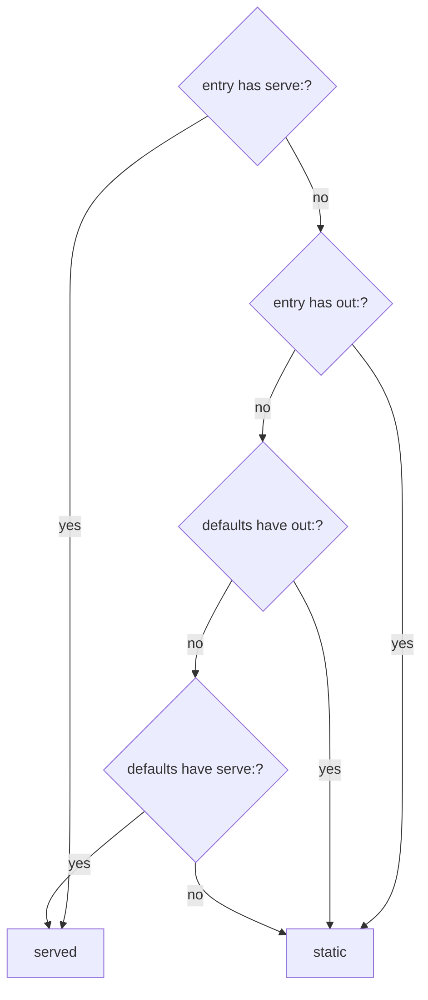

This is the full reference. `packages/core/src/config/schema.ts` is the authority; where this page
and the schema disagree, the schema is right.

Every object is **strict**: a misspelled key is an error naming the key, not a setting that
silently does nothing.

## Top level

```yaml
project: acme            # required
sandboxr: ">=0.1.0"      # required
```

| Field | Type | Required | Default |
|---|---|---|---|
| `project` | lowercase letters, digits and dashes | **yes** | — |
| `sandboxr` | version constraint | **yes** | — |
| `database` | [block](#database) | no | `{ driver: none }` |
| `backends` | [block](#backends) | no | none |
| `frontends` | [block](#frontends) | no | none |
| `routes` | [block](#routes) | no | `{}` |
| `secrets` | [block](#secrets) | no | empty |
| `storage` | [block](#storage) | no | `{ driver: none }` |
| `deps` | [block](#deps) | no | auto-detected |
| `toolchain` | [block](#toolchain) | no | none |
| `access` | [block](#access) | no | `apps: public, controls: password, credentials: dummy` |
| `env` | map of name to string | no | `{}` |

`project` goes into hostnames, container names and volume names, so it shares the hostname
alphabet. `sandboxr` is matched against the tool's own version and supports `>= <= > < ^ ~ =`,
space or comma for AND, `||` for OR.

### Shared value types

| Type | Rule |
|---|---|
| hostname label | `^[a-z0-9]([a-z0-9-]*[a-z0-9])?$`, at most 63 characters |
| port | integer, 1–65535 |
| memory | `^[0-9]+(b\|k\|m\|g)?$`, case-insensitive — `6g`, `512m` |
| path | non-empty string, relative to the config's directory unless stated |

## `database`

```yaml
database:
  driver: mysql
  version: "8.4"
  seed_from:
    local: { container: acme_db, database: acme }
    file: /var/sandboxr/seeds/acme.sql.zst
    fixtures: db/seeds/fixtures.sql
  migrate:
    workdir: services
    command: go run ./cmd/migrate --dir ../db/migrations --non-interactive
    since: "20240101"
  owner: app
```

| Field | Type | Required | Notes |
|---|---|---|---|
| `driver` | `mysql` \| `d1` \| `sqlite` \| `none` | **yes** | See [databases](../databases.md) |
| `version` | string or number | no | The version production runs, not the one you happen to have |
| `seed_from` | block | no | Where the data comes from |
| `migrate` | block | no | The project's own migration command |
| `owner` | string | no | Which runtime may open a file database. Required for `d1`/`sqlite` with more than one runtime |

> [!WARNING] A driver with nothing to do is refused
> `driver` other than `none`, with neither `seed_from` nor `migrate`, is a config error. There
> would be nothing for the driver to do.

### `database.seed_from`

| Field | Type | Notes |
|---|---|---|
| `local.container` | string | A database container already running on your machine. **Read only** |
| `local.database` | string | Which database inside it. Optional |
| `file` | path | A dump to restore, or a state directory for a file driver |
| `fixtures` | path | Applied **after** migrations, whichever source was used |
| `anonymised` | boolean | Declares that `file` contains no real personal data. Required before a public project may use it |

Listing several is normal: a laptop forks the container the developer already runs, a server
restores a dump, and neither source exists on the other machine. Precedence is **`local`, then
`file`, then `fixtures`** — freshest first. `sandboxr up --seed <source>` forces one.

Access control filters that list *before* anything is chosen, so a public project simply has fewer
options rather than a separate code path.

### `database.migrate`

| Field | Type | Required | Notes |
|---|---|---|---|
| `command` | string | **yes** | The project's own runner. sandboxr never reimplements migration logic |
| `workdir` | path | no | Where to run it. Default is a deliberately empty directory |
| `since` | string or number | no | A cutoff, exported as `SANDBOXR_MIGRATE_SINCE` |
| `failure_pattern` | string | no | Passed to the container, for a runner that exits zero while failing |
| `file_pattern` | string | no | Passed to the container |
| `error_pattern` | string | no | Passed to the container |

`workdir` defaults to an empty directory on purpose: a migration run from the repo root can pick
up a config file meant for a different environment. Declare it when the runner genuinely needs its
own directory — `wrangler`, for instance, resolves `wrangler.jsonc` from the working directory.

`since` exists because a project that adopted migration tracking part-way through its life has
files that predate it, which fail on columns that already exist. Pin the cutoff its own runner
uses.

> [!NOTE] The three patterns are passed through untouched
> They are carried into `plan.json` for the container to use. Nothing on the host reads them; the
> host's own output parsing uses fixed heuristics.

## `backends`

Long-running services the project compiles and runs. Two accepted shapes:

```yaml
# Mapping form — canonical, because `defaults:` cannot legally sit inside a YAML list.
backends:
  defaults:
    workdir: services
    build: go build -o {out} ./{name}
    health: /health
  services:
    - { name: api, port: 8001, label: api }
    - { name: adminApi, port: 8081, label: admin-api }

# List form — identical meaning, for a project with nothing to default.
backends:
  - { name: api, port: 8001, label: api, build: go build -o {out} ./api }
```

| Field | Type | Required | In `defaults` | Notes |
|---|---|---|---|---|
| `name` | string | **yes** | no | Unique. The binary's name, and a `routes` target |
| `port` | port | **yes** | no | Where it listens **inside** the container |
| `label` | hostname label | **yes** | no | Its hostname: `<slug>.<label>.<project>.<domain>` |
| `build` | string | **yes**, here or in `defaults` | yes | `{name}` and `{out}` are substituted |
| `workdir` | path | no | yes | Where the build runs |
| `health` | path | no | yes | Probed by `sandboxr status` |
| `memory` | memory | no | yes | Raises the whole sandbox's limit |
| `optional` | boolean | no | yes | Dormant unless named in `--with`. Default `false` |

Only `{name}` and `{out}` are substituted, and the substituted value must match
`^[A-Za-z0-9._/@-]+$`. The template itself comes from your config and is run by a shell.

> [!TIP] Leave out a service that cannot start
> A service whose database exists on no developer machine, and that no migration creates, should
> be omitted rather than declared — otherwise it can only crash-loop.

## `frontends`

Apps served on their own hostnames. Same two shapes, plus a `root`:

```yaml
frontends:
  root: web/packages
  defaults:
    build: npx vite build
    out: dist
  apps:
    - { label: app, package: web }
    - { label: admin, package: admin }
    - { label: www, package: marketing, build: npm run build, out: out, memory: 6g }
    - { label: cms, package: cms, serve: npx next dev --port 3000 --hostname 127.0.0.1, port: 3000, optional: true }
```

| Field | Type | Required | In `defaults` | Notes |
|---|---|---|---|---|
| `label` | hostname label | **yes** | no | Its hostname, and the key `routes` uses |
| `package` | path | **yes** | no | Relative to `root` |
| `build` | string | for a static app | yes | What produces the output |
| `out` | path | for a static app | yes | The built directory, relative to the package |
| `serve` | string | for a served app | yes | A long-running command |
| `port` | port | for a served app | yes | Where that command listens |
| `prepare` | string | no | yes | Run once before a **served** app starts. Ignored for static apps |
| `health` | path | no | yes | For a **served** app. Ignored for static apps |
| `static_mode` | `spa` \| `files` \| `html` | no | yes | How the built directory is served. Default `spa` |
| `in_build_all` | boolean | no | yes | Whether `reload --web all` includes it. Default `true` |
| `memory` | memory | no | yes | Raises the whole sandbox's limit |
| `optional` | boolean | no | yes | Dormant unless named in `--with`. Default `false` |

`root` exists only in the mapping form. In the list form every `package` is relative to the config
directory.

### Static or served is decided per entry

**`out` and `serve` on the same entry is an error** — pick one. Otherwise the kind is decided by
looking at the entry first, then the defaults:



A static app with no `out` or no `build` after defaults is an error, and so is a served app with
no `port`.

### `static_mode`

| Mode | Behaviour | For |
|---|---|---|
| `spa` *(default)* | Any unknown path falls back to `index.html` | A single-page app with client-side routing |
| `html` | `/blog/foo` resolves to `foo.html` | A generator emitting extensionful files |
| `files` | An unknown path is a real 404 | A plain directory of assets |

Getting it wrong does not crash anything — it produces an app that *half-works*, which is why it
is declared rather than guessed.

### `in_build_all`

`reload --web all` deliberately means "the project's ordinary apps", not "everything". Set
`in_build_all: false` on the expensive members — a marketing site rendering thousands of pages, a
component library — so a shared-component tweak does not start a multi-gigabyte build as a side
effect. See [the edit–reload loop](../guides/edit-and-reload.md).

## `routes`

Path prefixes served on an app's own hostname, proxied to a service.

```yaml
routes:
  app:
    "/api": api
    "/cms": cms
  admin:
    "/api": adminApi
```

- The outer key must be a declared **front-end label**.
- The inner key must start with `/`.
- The value must be a backend **`name`**, or the **label** of a *served* front-end. A backend
  `name` wins, so a backend is never shadowed by a front-end sharing its label.
- Prefixes are emitted longest-first by the generator, so the order you write them in does not
  matter.
- Each prefix strips itself before proxying: `/api/orders` reaches the backend as `/orders`.

Every backend already has a hostname of its own, so this looks redundant. It is not: a same-origin
request needs no preflight, no per-sandbox allowlist and no cookie reasoning, which takes CORS out
of the picture entirely — and the app's own code can say `/api` in every environment.

## `secrets`

```yaml
secrets:
  read: [services/api/.env, web/packages/web/.env]
  keep: [AUTH0_DOMAIN, JWT_SECRET, ANALYTICS_*]
  rename: { ANALYTICS_API_HOST: ANALYTICS_ENDPOINT }
  never: ["DB_*", "S3_*", "*_URL", "PORT"]
```

| Field | Type | Notes |
|---|---|---|
| `read` | list of paths | The `.env` files to read |
| `keep` | list of names | An allowlist. `*` is the only wildcard |
| `rename` | map | Old name to new name. Outranks `keep` and `never` |
| `never` | list of names | A denylist |

Full rules, and why `never` matters more than it looks: [secrets](secrets.md).

## `storage`

```yaml
storage:
  driver: minio
  buckets: [uploads, avatars, exports]
```

| Field | Type | Required | Notes |
|---|---|---|---|
| `driver` | `minio` \| `none` | **yes** if the block is present | |
| `buckets` | list of strings | no | Created at first boot |

With `minio`, an S3-compatible store runs inside the sandbox, its endpoint is exported as
`SANDBOXR_S3_ENDPOINT`, and the label `s3` is reserved: `<slug>.s3.<project>.<domain>` reaches it,
and `/console/*` on that hostname reaches its web console.

## `deps`

The Node dependency tree, when the project has one.

```yaml
deps:
  root: .
  lockfile: package-lock.json
  install: npm ci --no-audit --no-fund
```

| Field | Type | Required | Default |
|---|---|---|---|
| `root` | path | **yes** | — |
| `lockfile` | path | no | `package-lock.json` |
| `install` | string | no | `npm ci --no-audit --no-fund` |

Named rather than inferred, because the directory holding the lockfile is not always the directory
holding the packages, and the shared dependency volume is mounted at exactly one path. Left out,
sandboxr looks for `package-lock.json`, `pnpm-lock.yaml`, `yarn.lock` then `bun.lockb`, in the
config directory, then the first segment of `frontends.root`, then `frontends.root` itself.

## `toolchain`

```yaml
toolchain:
  go: "1.23"
  node: "22"
```

Both optional, both accept a string or a number, both are prefixes: `24` picks the latest 24.x.
They decide which blocks the project's image layer includes, so a Node-only project carries no Go.

## `access`

```yaml
access:
  apps: public
  controls: password
  credentials: dummy
```

| Field | Values | Default | Notes |
|---|---|---|---|
| `apps` | `public` \| `private` | `public` | `private` puts every app hostname behind the dashboard's session check |
| `controls` | `password` | `password` | The only accepted value. There is no way to turn it off |
| `credentials` | `dummy` \| `real` | `dummy` | Whether the project's real third-party credentials may be present |

A public project with real credentials, or one seeding from live data, is **refused** rather than
warned. [Access and security](../access.md).

## `env`

The join between sandboxr's names for things and the project's own.

```yaml
env:
  DB_HOST: "${SANDBOXR_DB_HOST}"
  DB_NAME: "${SANDBOXR_DB_NAME}"
  S3_ENDPOINT: "${SANDBOXR_S3_ENDPOINT}"
  S3_BUCKET: uploads
  VITE_API_URL: /api
  VITE_APP_URL: "${SANDBOXR_URL_APP}"
```

Keys must match `^[A-Za-z_][A-Za-z0-9_]*$`. Values are plain strings; `${SANDBOXR_*}` placeholders
are substituted **inside the container** with values the sandbox computed for itself.

Substitution, never a shell — a value is data. Nothing here can point at a real service, because
the only variables available are the sandbox's own. Anything genuinely secret comes from the
`secrets` block instead and never appears here.

The full list of what a sandbox computes: [environment variables](../reference/environment.md).

## Rules checked after parsing

| Rule | Error |
|---|---|
| Every backend and front-end `label` is unique across both lists | names the duplicate |
| Every backend `name` is unique | names the duplicate |
| Each `routes` outer key is a declared front-end label | names the label |
| Each `routes` target is a backend `name` or a served front-end label | names the target |
| A `d1`/`sqlite` project with more than one runtime declares `owner` | says why: one writer only |
| `owner` names a declared backend or front-end | names it |
| `driver` other than `none` has `seed_from` or `migrate` | "nothing to do" |
| A static app has `build` and `out`; a served app has `port` | names the missing field |
| No entry has both `out` and `serve` | "pick one" |
| The `sandboxr:` constraint matches the tool's version | tells you which to change |
| A public project's seeds and credentials are permitted | names the field and the fix |

## Where the file is found

`sandboxr` walks **up** from the current directory, trying `sandboxr.yaml`, `sandboxr.yml`, then
`.sandboxr.yaml` in each directory. The directory holding it is what gets mounted at `/workspace`
— which is the config's directory, not the git top level, so a project kept in a subdirectory of a
larger repository is mounted at the right level.

## Related

- [Two worked examples](examples.md)
- [Three runtime kinds](runtime-kinds.md)
- [plan.json](../architecture/plan-json.md) — what this resolves to
