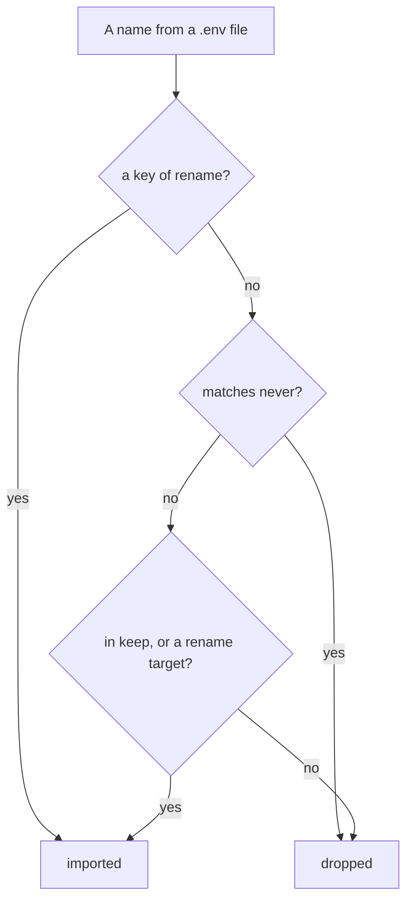

A sandbox needs your project's third-party credentials — an identity provider, an analytics
key, a maps key. It must **not** have anything saying where things run. Those two kinds of
setting live side by side in the same `.env` files, so the config says which is which.

```prompt
Set up this project's secrets block and import its credentials.

Read docs/configuration/secrets.md. Find the project's .env files, then write a `secrets`
block listing them under `read`, an exact-name allowlist under `keep`, and glob patterns
under `never` for anything describing where something runs. Then run
`sandboxr secrets import` and `sandboxr secrets check`.

Never print a value from a .env file, in any output, for any reason. Stop and ask me if a
name could plausibly be either a credential or an address.
```

```yaml
secrets:
  read:
    - services/api/.env
    - web/packages/web/.env
  keep:
    - AUTH0_DOMAIN
    - AUTH0_CLIENT_SECRET
    - JWT_SECRET
  rename:
    ANALYTICS_API_HOST: ANALYTICS_ENDPOINT
    VITE_AUTH0_DOMAIN: SANDBOXR_AUTH0_SPA_DOMAIN
  never:
    - "DB_*"
    - "MYSQL_*"
    - "S3_*"
    - "*_URL"
    - "PORT"
```

| List | Means |
|---|---|
| `read` | What to look in. Files are read in order and a later one wins. A missing file is reported and skipped, not an error |
| `keep` | An allowlist of names. Anything not on it is dropped. Nothing is imported because it looked important |
| `rename` | The name on the left is what the file calls it; the name on the right is what the sandbox will call it |
| `never` | Patterns to refuse whatever else the file says |

> [!IMPORTANT] `keep` takes exact names; only `never` takes wildcards
> `never` patterns are matched as globs, where `*` is the only special character.
> `keep` is matched **literally**. `keep: [ANALYTICS_*]` matches a variable actually called
> `ANALYTICS_*`, and nothing else. List the names out.

## The rule that matters most

**Anything describing *where* something runs is never imported.**

`DB_HOST`, `MYSQL_*`, `S3_ENDPOINT`, `API_URL`, `PORT` do not identify anybody. They say
where something is. A sandbox works all of those out for itself: its database is inside its
own container, its object storage is inside its own container, and its services reach each
other on internal ports.

Import a developer's `DB_HOST` and you get a disposable container **pointed at their real
database**. Nothing errors. The app works perfectly. Then a migration you thought you were
testing safely runs against something that was never a copy.

So `never` is written as patterns over the *shape* of a name, not as a list of the ones you
happened to think of.

Addresses come from [`env`](sandboxr-yaml.md#env) instead, which can only ever reference the
sandbox's own computed values.

## The order the rules are applied



**An explicit rename is its own permission.** Neither `keep` nor `never` gets a say, because
the author named both the source and the destination in a reviewed file.

That ordering is load-bearing. A browser-side `VITE_AUTH0_DOMAIN` that the config renames is
a vendor setting the sandbox cannot invent, and matching it against `*_URL` would drop it —
while the pattern still has to catch every inter-service URL nobody thought to list.

A rename **target** is also accepted on its own, without being renamed. So a file that
already spells the name `ANALYTICS_ENDPOINT` is imported even though only
`ANALYTICS_API_HOST` appears in `keep`.

## Why `rename` exists

**The same value has two names.** A codebase can spell one setting `ANALYTICS_API_HOST` in
its `.env` files and read `ANALYTICS_ENDPOINT` in its code. Alias rather than duplicate.

**Two names that must *not* be merged.** Browser-side identity settings are genuinely allowed
to differ from server-side ones. An identity provider can serve one tenant on both a custom
domain and a provider domain. Fold them together and one service rejects the other's token as
an invalid issuer: login succeeds and every API call comes back 401. Rename them apart on
purpose.

## Two commands, and no third

```bash
sandboxr secrets import   # read those files, write the project's secrets file
sandboxr secrets check    # say which credentials are missing, by name
```

```
  ok read /home/you/acme/services/api/.env
   ! not found: /home/you/acme/web/packages/web/.env
  ok wrote 7 credential(s) to /home/you/.sandboxr/secrets/acme.env
  imported (names only):
      ANALYTICS_ENDPOINT
      AUTH0_CLIENT_ID
      AUTH0_CLIENT_SECRET
      JWT_SECRET
```

**Names only, never values.** That is a design goal, not politeness. The command is safe to
run in a screen share, safe to paste into a ticket, and safe to hand to an agent whose
transcript you have not read. There is no command that prints a value, because there is no
safe version of one.

<details class="agent">
<summary><b>Details for an agent</b> — the file, the parser, and what <code>check</code> exits with</summary>

**The file.** `~/.sandboxr/secrets/<project>.env`, mode `0600`. Written to
`<file>.partial` and renamed into place, so an interrupted import cannot leave half a
credential file behind. It opens with a generated header naming the project and saying not
to commit it.

**Reading a `.env` line.** `NAME=value`, with an optional `export ` in front and whitespace
anywhere sensible. Blank lines and `#` comment lines are skipped. One layer of matching
quotes is stripped. On an **unquoted** value a trailing ` #` comment is removed — some
loaders keep it and services do not. **An empty value is dropped**: a name present but blank
is what a template looks like, and importing it would mask a real value from a later file.

**`secrets check`** reports on every name in `keep` that is not renamed, plus every rename
target. It never reads a value, so its output is safe to print. Exit codes: `0` when nothing
is missing, `1` when the file does not exist yet or any expected name is absent.
`sandboxr doctor` runs the same check.

Both commands load the config with access enforcement **off**, so a config that `up` would
refuse can still have its secrets managed.

</details>

## Public sandboxes get dummy credentials

A project serving public apps may not carry real third-party credentials. Anyone who can
drive a public app could otherwise make it send real email, spend real credit, or write to
somebody's account.

```yaml
access:
  apps: public
  credentials: dummy    # the default
```

With `credentials: dummy` and a secrets file present, `sandboxr up` **refuses to start** and
names both ways out:

```
acme serves public apps, so it may not carry the real credentials in
/home/you/.sandboxr/secrets/acme.env
  Either set access.credentials to real (and accept that), or set access.apps to private.
```

It is a refusal rather than a warning because money spent calling somebody's API stays
spent.

Supply harmless values through `env:` instead:

```yaml
env:
  API_TOKEN: dummy
```

[Access and security](../access.md) has the whole model.

**Next:** [Access and security](../access.md) for the two tiers this refusal belongs to, or
[sandboxr.yaml, field by field](sandboxr-yaml.md#secrets) for the block's exact shape.
