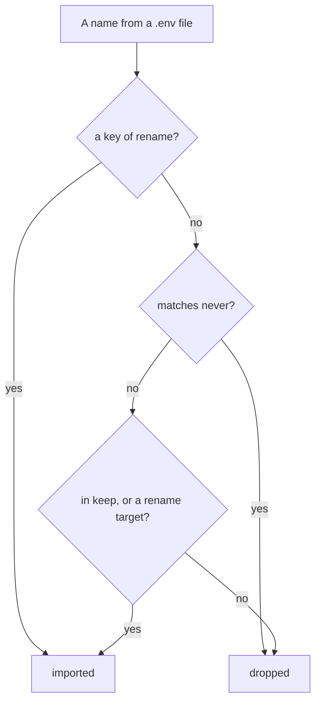

A sandbox needs the project's third-party credentials — an identity provider, an analytics key, a
maps key — and must **not** have anything saying where things run. Those two things live side by
side in the same `.env` files, so the config says which is which.

```yaml
secrets:
  read:
    - services/api/.env
    - web/packages/web/.env
  keep:
    - AUTH0_DOMAIN
    - AUTH0_CLIENT_SECRET
    - JWT_SECRET
  rename:
    ANALYTICS_API_HOST: ANALYTICS_ENDPOINT
    VITE_AUTH0_DOMAIN: SANDBOXR_AUTH0_SPA_DOMAIN
  never:
    - "DB_*"
    - "MYSQL_*"
    - "S3_*"
    - "*_URL"
    - "PORT"
```

| List | Means |
|---|---|
| `read` | What to look in. Files are read in order and a later one wins. A missing file is reported and skipped, not an error |
| `keep` | An allowlist of names. Anything not on it is dropped. Nothing is imported because it looked important |
| `rename` | The name on the left is what the file calls it; the name on the right is what the sandbox will call it |
| `never` | Patterns to refuse whatever else the file says. `*` is the only wildcard |

## The rule that matters most

**Anything describing *where* something runs is never imported.**

`DB_HOST`, `MYSQL_*`, `S3_ENDPOINT`, `API_URL`, `PORT` do not identify anybody — they say where
something is. A sandbox works all of those out for itself: its database is inside its own
container, its object storage is inside its own container, and its services reach each other on
internal ports.

Import a developer's `DB_HOST` and you get a disposable container **pointed at their real
database**. Nothing errors. The app works perfectly. Then a migration you thought you were testing
safely runs against something that was never a copy.

So `never` is written as patterns over the *shape* of a name, not as a list of the ones you
happened to think of.

## The order the rules are applied



**An explicit rename is its own permission.** Neither `keep` nor `never` gets a say, because the
author named both the source and the destination in a reviewed file.

That ordering is load-bearing. A browser-side `VITE_AUTH0_DOMAIN` that the config renames is a
vendor setting the sandbox cannot invent, and matching it against `*_URL` would drop it — while
the pattern still has to catch every inter-service URL nobody thought to list.

## Why `rename` exists

**The same value has two names.** A codebase can spell one setting `ANALYTICS_API_HOST` in its
`.env` files and read `ANALYTICS_ENDPOINT` in its code. Alias rather than duplicate.

**Two names that must *not* be merged.** Browser-side identity settings are genuinely allowed to
differ from server-side ones — an identity provider can serve one tenant on both a custom domain
and a provider domain. Fold them together and one service rejects the other's token as an invalid
issuer: login succeeds and every API call comes back 401. Rename them apart on purpose.

## Two commands, and no third

```bash
sandboxr secrets import   # read those files, write the project's secrets file
sandboxr secrets check    # say which credentials are missing, by name
```

```
  ok read /home/you/acme/services/api/.env
   ! not found: /home/you/acme/web/packages/web/.env
  ok wrote 7 credential(s) to /home/you/.sandboxr/secrets/acme.env
  imported (names only):
      ANALYTICS_ENDPOINT
      AUTH0_CLIENT_ID
      AUTH0_CLIENT_SECRET
      JWT_SECRET
```

**Names only, never values.** That is a design goal, not politeness: the command is safe to run in
a screen share, safe to paste into a ticket, and safe to hand to an agent whose transcript you
have not read. There is no command that prints a value, because there is no safe version of one.

The file is written to `~/.sandboxr/secrets/<project>.env`, mode `0600`, via a temporary name so
an interrupted import cannot leave half a credential file behind.

`secrets check` reports on every name in `keep` that is not renamed, plus every rename target. It
exits non-zero if any is missing. `sandboxr doctor` runs the same check.

## How a `.env` line is read

`NAME=value`, with an optional `export ` in front and whitespace anywhere sensible. One layer of
matching quotes is stripped. On an **unquoted** value a trailing ` #` comment is removed — some
loaders keep it and services do not.

**An empty value is dropped.** A name present but blank is what a template looks like, and
importing it would mask a real value from a later file.

## Public sandboxes get dummy credentials

A project serving public apps may not carry real third-party credentials. Anyone who can drive a
public app could otherwise make it send real email, spend real credit, or write to somebody's
account.

```yaml
access:
  apps: public
  credentials: dummy    # the default
```

With `credentials: dummy` and a secrets file present, `sandboxr up` **refuses to start** and names
both ways out: opt in with `credentials: real`, or make the apps `private`. It is a refusal rather
than a warning because money spent calling somebody's API stays spent.

Supply harmless values through `env:` instead:

```yaml
env:
  API_TOKEN: dummy
```

[Access and security](../access.md) has the whole model.

## Related

- [sandboxr.yaml, field by field](sandboxr-yaml.md#secrets)
- [Environment variables](../reference/environment.md)
