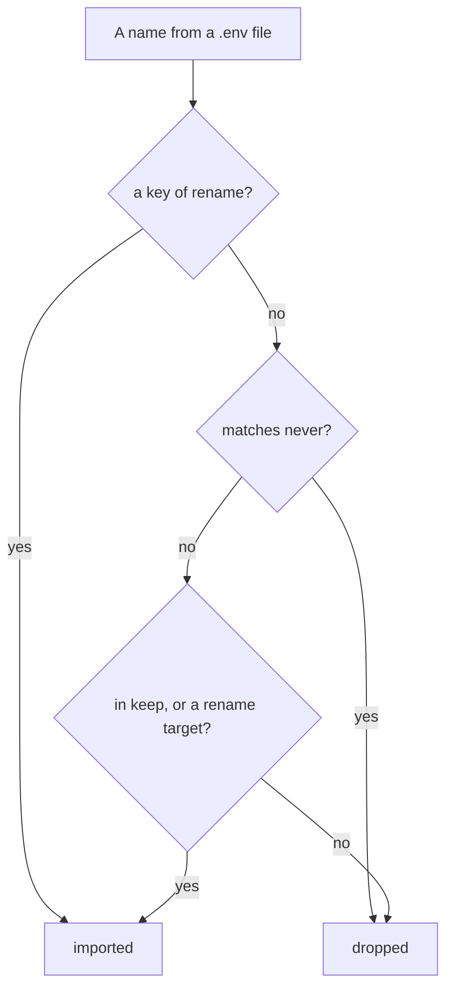

A sandbox needs your project's third-party credentials — an identity provider, an analytics
key, a maps key. It must **not** have anything saying where things run. Those two kinds of
setting live side by side in the same `.env` files, so the config says which is which.

Every one of those credentials lives in **one file**, `~/.sandboxr/secrets/<project>.env`.
You can write it by hand, from the CLI, or from the dashboard; and you can import into it
from the `.env` files your project already has. All four are the same file.

```prompt
Set up this project's secrets block and get its credentials into sandboxr.

Read docs/configuration/secrets.md. Find the project's .env files, then write a `secrets`
block listing them under `read`, an exact-name allowlist under `keep`, and glob patterns
under `never` for anything describing where something runs. Then run
`sandboxr secrets import` and `sandboxr secrets check`.

If `check` still names something as missing, the value is on no file on this machine: tell
me which names those are and ask me for each one, then set it with
`printf '%s' "$VALUE" | sandboxr secrets set NAME` so it never reaches the shell history.

Never print a value from a .env file, in any output, for any reason. Stop and ask me if a
name could plausibly be either a credential or an address.
```

## The file

| | |
|---|---|
| Where | `~/.sandboxr/secrets/<project>.env` |
| Mode | `0600` — nobody else on the machine reads it |
| Format | `NAME="value"`, one per line, **always quoted** |
| Written by | `secrets set`, `secrets edit`, `secrets import`, the dashboard, or your editor |

There is deliberately **one** file, and no second hand-edited one layered over the imported
one. Two files holding the same name is two answers to "what is this project's API key", and
the one that loses is invisible.

<details class="agent">
<summary><b>Details for an agent</b> — the exact format, and the two readers that must agree on it</summary>

**Every value is written quoted, with nothing escaped.** Not tidiness: a value written raw
does not survive being read back. The reader trims a value and strips a trailing ` #` comment
from an **unquoted** one — both right for a `.env` somebody wrote by hand, and wrong for a
credential, because a password containing ` #` came back truncated at the hash with nothing
reporting it.

Quoting unconditionally is lossless for any single-line value, so **a value may not contain a
newline** and one is refused by name. A value that is itself `"abc` is written `""abc"`, and
stripping one layer leaves `"abc` again.

**Reading a line.** `NAME=value`, with an optional `export ` in front and whitespace anywhere
sensible. Blank lines and `#` comment lines are skipped. One layer of matching quotes is
stripped. **An empty value is dropped**: a name present but blank is what a template looks
like, and importing it would mask a real value from a later file.

There are exactly two readers — the host's, in `packages/core/src/secrets.ts`, and the
container's, in `container/scripts/env.sh` — and both strip exactly one layer of matching
quotes. If they ever disagree, every credential reaches the application with quotes around
it, which fails as an authentication error and looks nothing like a parsing problem.

The file is rewritten **in place**, keeping its inode, because every running sandbox of the
project has this exact file bind-mounted. A write-and-rename would swap the inode out from
under those mounts and pin each container to the unlinked old one.

</details>

## Editing it

Six verbs, and only one of them shows you a value.

```bash
sandboxr secrets list          # names, the last four characters, the length
sandboxr secrets set NAME      # the value is read from a prompt, or from stdin
sandboxr secrets unset NAME    # remove one
sandboxr secrets edit          # open the whole file in $EDITOR, checked on save
sandboxr secrets import        # merge the project's own .env files in
sandboxr secrets check         # say which credentials are missing, by name
```

**The value is never an argument to `set`.** It is typed at a prompt that does not echo, or
piped in:

```bash
printf '%s' "$STRIPE_KEY" | sandboxr secrets set STRIPE_SECRET_KEY
```

An argument would be in your shell history, and in every `ps` on the machine for as long as
the command runs. A pipe is what a script or a server operator uses.

`secrets list` prints the name, the last four characters and the length — enough to tell two
keys apart and to spot a paste that lost its tail:

```
/home/you/.sandboxr/secrets/acme.env
NAME                 ENDS   CHARS
ANALYTICS_ENDPOINT   …f10a  38
AUTH0_CLIENT_SECRET  …9c2d  64
JWT_SECRET           -      9
   ! STRIPE_SECRET_KEY is declared in sandboxr.yaml and not set
      sandboxr secrets set STRIPE_SECRET_KEY
```

**Names only, never values.** That is a design goal, not politeness. The output is safe to
run in a screen share, safe to paste into a ticket, and safe to hand to an agent whose
transcript you have not read.

`secrets edit` is the one exception, and it is a different kind of act: it opens the file in
the editor you already use, with the same trust as opening it by hand. Nothing is printed, so
nothing lands in a transcript.

<details class="agent">
<summary><b>Details for an agent</b> — what each verb does, and what it exits with</summary>

| Command | Behaviour |
|---|---|
| `secrets list` (or `ls`) | Always exits `0`, even for an empty file. It is a listing, not a check |
| `secrets set NAME` | Reads the value from stdin when stdin is not a terminal, otherwise from a hidden prompt. Refuses the name **before** asking for a value. An empty value is refused and changes nothing |
| `secrets unset NAME` | Exits `0` when the name was not there — the file is in the state asked for |
| `secrets edit` | Opens `$VISUAL`, then `$EDITOR`, then `vi`, on a `0600` copy beside the real file. Comments and order are not kept: the file is rewritten sorted by name. A name it no longer carries is removed. Exits `1` if any line was refused |
| `secrets import` | **Merges.** `--replace` rebuilds the file from the `.env` files instead, discarding anything set by hand |
| `secrets check` | Exits `0` when nothing is missing, `1` when the file does not exist or any expected name is absent. `sandboxr doctor` runs the same check |

`edit` on an empty file opens a template listing the names `sandboxr.yaml` declares, commented
out — the case it exists for is a fresh checkout with nothing to import from, and a blank
buffer does not say which keys the project is waiting for.

Every one of them loads the config with access enforcement **off**, so a config that `up`
would refuse can still have its secrets managed.

</details>

### Names a sandbox works out for itself are refused

A sandbox derives its own database address, its own object storage and its own inter-service
URLs, and exports them under a `SANDBOXR_` prefix. Those exact names are refused here,
whoever typed them:

`SANDBOXR_SLUG`, `SANDBOXR_PROJECT`, `SANDBOXR_DOMAIN`, `SANDBOXR_ACCESS`, `SANDBOXR_SCHEME`,
`SANDBOXR_PUBLIC_PORT`, `SANDBOXR_WITH`, `SANDBOXR_SEED`, `SANDBOXR_PLAN`, `SANDBOXR_SCRIPTS`,
`SANDBOXR_SANDBOX`, `SANDBOXR_ENV_READY`, and everything beginning `SANDBOXR_DB_`,
`SANDBOXR_S3_`, `SANDBOXR_D1_`, `SANDBOXR_URL_` or `SANDBOXR_PORT_`.

Your project's **own** `SANDBOXR_`-prefixed names are fine, which is why this is a list rather
than the prefix. `rename` legitimately carries a browser-side identity domain across to
`SANDBOXR_AUTH0_SPA_DOMAIN`, and only the project can supply that value.

The refusal names what to do instead. A refused name in a pasted `.env` is reported and the
rest of the paste is still applied, so one bad line does not cost you the other nineteen.

## The config block

```yaml
secrets:
  read:
    - services/api/.env
    - web/packages/web/.env
  keep:
    - AUTH0_DOMAIN
    - AUTH0_CLIENT_SECRET
    - JWT_SECRET
  rename:
    ANALYTICS_API_HOST: ANALYTICS_ENDPOINT
    VITE_AUTH0_DOMAIN: SANDBOXR_AUTH0_SPA_DOMAIN
  never:
    - "DB_*"
    - "MYSQL_*"
    - "S3_*"
    - "*_URL"
    - "PORT"
```

| List | Means |
|---|---|
| `read` | What to look in. Files are read in order and a later one wins. A missing file is reported and skipped, not an error |
| `keep` | An allowlist of names. Anything not on it is dropped. Nothing is imported because it looked important |
| `rename` | The name on the left is what the file calls it; the name on the right is what the sandbox will call it |
| `never` | Patterns to refuse whatever else the file says |

> [!IMPORTANT] `keep` takes exact names; only `never` takes wildcards
> `never` patterns are matched as globs, where `*` is the only special character.
> `keep` is matched **literally**. `keep: [ANALYTICS_*]` matches a variable actually called
> `ANALYTICS_*`, and nothing else. List the names out.

**`keep` does double duty.** It is the allowlist an import filters against, *and* it is the
project's statement of which credentials it needs at all. That second job is what lets
`secrets check`, `secrets list` and the dashboard tell you a name is declared and not set —
and that has to be shown, because a front-end built without its API key does not fail. It
falls back to whatever its code defaults to, and a default is often a production URL.

## The rule that matters most

**Anything describing *where* something runs is never imported.**

`DB_HOST`, `MYSQL_*`, `S3_ENDPOINT`, `API_URL`, `PORT` do not identify anybody. They say
where something is. A sandbox works all of those out for itself: its database is inside its
own container, its object storage is inside its own container, and its services reach each
other on internal ports.

Import a developer's `DB_HOST` and you get a disposable container **pointed at their real
database**. Nothing errors. The app works perfectly. Then a migration you thought you were
testing safely runs against something that was never a copy.

So `never` is written as patterns over the *shape* of a name, not as a list of the ones you
happened to think of.

Addresses come from [`env`](sandboxr-yaml.md#env) instead, which can only ever reference the
sandbox's own computed values.

## The order the rules are applied



**An explicit rename is its own permission.** Neither `keep` nor `never` gets a say, because
the author named both the source and the destination in a reviewed file.

That ordering is load-bearing. A browser-side `VITE_AUTH0_DOMAIN` that the config renames is
a vendor setting the sandbox cannot invent, and matching it against `*_URL` would drop it —
while the pattern still has to catch every inter-service URL nobody thought to list.

A rename **target** is also accepted on its own, without being renamed. So a file that
already spells the name `ANALYTICS_ENDPOINT` is imported even though only
`ANALYTICS_API_HOST` appears in `keep`.

## Why `rename` exists

**The same value has two names.** A codebase can spell one setting `ANALYTICS_API_HOST` in
its `.env` files and read `ANALYTICS_ENDPOINT` in its code. Alias rather than duplicate.

**Two names that must *not* be merged.** Browser-side identity settings are genuinely allowed
to differ from server-side ones. An identity provider can serve one tenant on both a custom
domain and a provider domain. Fold them together and one service rejects the other's token as
an invalid issuer: login succeeds and every API call comes back 401. Rename them apart on
purpose.

## Importing is a merge

```bash
sandboxr secrets import
```

```
  ok read /home/you/acme/services/api/.env
   ! not found: /home/you/acme/web/packages/web/.env
  ok merged 7 credential(s) into /home/you/.sandboxr/secrets/acme.env
  imported (names only):
      ANALYTICS_ENDPOINT
      AUTH0_CLIENT_ID
      AUTH0_CLIENT_SECRET
      JWT_SECRET
```

A name it imports replaces that name and touches nothing else. Anything you set by hand and
did not import stays where it is.

`--replace` builds the file from the `.env` files instead, discarding everything else in it.
That is the right command for rebuilding a file from scratch, and the wrong one for a routine
refresh.

> [!TIP] A project with nothing to import from is the ordinary case
> A fresh checkout whose `.env` files are all `.env.example` has no values to import. That is
> what `secrets set` and the dashboard's panel are for; without them nothing would reach a
> sandbox at all.

## How it reaches a sandbox

The file is **bind-mounted read-only** into every sandbox of the project, at
`/sandboxr/secrets.env`. The container reads it line by line, as data and never as a shell
script, before it derives anything of its own.

Two consequences follow, and both are things people go looking for:

- **A credential the services read at run time is picked up by a restart.** Change the value,
  then Restart services in the dashboard or `sandboxr stop` and `start`. The container re-reads
  the file every time it sets its environment up.
- **A value baked into a front-end bundle at build time needs a rebuild too** — a `VITE_*`, a
  `NEXT_PUBLIC_*`. It is already in the built files, and nothing in the environment can reach
  back into them.

The values do not appear in `docker inspect`.

<details class="why">
<summary><b>Why it works this way</b> — a mounted file rather than a second <code>--env-file</code></summary>

The file used to be handed to `docker run` as a second `--env-file`, layered under the
generated per-sandbox one, and Docker settled which name won.

An env-file is read **once**, when the container is created, and baked into its
configuration. So an edited credential could not reach a running sandbox at all: `restart` and
`stop`/`start` keep the environment the container was created with, and only recreating the
container picked up a new value. "Restart services" was a button that appeared to apply a
rotated key and did not.

Mounting the file moves the read inside the container, where it happens every time the
environment is set up. It also takes the values out of `docker inspect`, which an env-file put
there.

What settles a name collision now is a refusal on the host rather than Docker's layering —
the sandbox's own names are the ones nothing else may supply. That is the list above.

</details>

### What wins, when two things set the same name

Lowest to highest:

1. this file;
2. what the host passes in — the generated per-sandbox environment, your git identity, a
   GitHub token;
3. what the sandbox derives for itself — `SANDBOXR_DB_*`, `SANDBOXR_S3_*`, `SANDBOXR_URL_*`;
4. the project's `env:` map in `sandboxr.yaml`, expanded last.

Two of those orderings have a failure that does not resemble its cause, so they are worth
stating plainly.

**Nothing outside a sandbox can redirect it at something that is not its own.** That is what
(3) beating (1) is for.

> [!WARNING] A name the `env:` map also defines is silently overwritten
> The map is expanded last, so a credential you set under a name the map already claims is
> replaced by the map's value. Nothing fails. The variable has a value, and it is the wrong
> one. `secrets list`, `secrets set` and the dashboard all say which names those are, because
> nothing else would.

[Environment variables](../reference/environment.md) has the whole of the sandbox's
environment, group by group.

## From the dashboard

A project's page in the dashboard has an **Environment** panel: the same file, as a table of
names and values with one Save under it. It marks the names the project declares and does not
have, and the names its own `env:` map will overwrite. An eye beside a row fetches that one
value — its own request, which the server logs — and pasting a whole `.env` into a name box
splits it into rows you can check before saving.

It does **not** edit `sandboxr.yaml`. The `env:` map is versioned with the project's code, and
it is still the only way to wire an internal address such as
`VITE_API_URL: "${SANDBOXR_URL_API}"`.

See [The dashboard](../guides/dashboard.md#the-environment-panel).

## Public sandboxes get dummy credentials

A project serving public apps may not carry real third-party credentials. Anyone who can
drive a public app could otherwise make it send real email, spend real credit, or write to
somebody's account.

```yaml
access:
  apps: public
  credentials: dummy    # the default
```

With `credentials: dummy` and a secrets file that **holds something**, `sandboxr up`
**refuses to start** and names both ways out:

```
acme serves public apps, so it may not carry the real credentials in
/home/you/.sandboxr/secrets/acme.env
  Either set access.credentials to real (and accept that), or set access.apps to private.
```

An empty file is not a refusal. What matters is whether anything is in it.

It is a refusal rather than a warning because money spent calling somebody's API stays
spent. The dashboard says the same thing earlier: a project in this state gets a read-only
Environment panel naming both ways out, rather than a table that would build a file no
sandbox could start with.

Supply harmless values through `env:` instead:

```yaml
env:
  API_TOKEN: dummy
```

[Access and security](../access.md) has the whole model.

**Next:** [Environment variables](../reference/environment.md) for everything else in a
sandbox's environment and what beats what, or [Access and security](../access.md) for the two
tiers this refusal belongs to.
