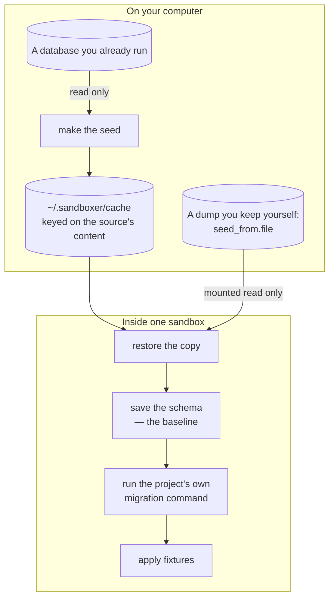

Every [sandbox](reference/glossary.md) has its own database. That is the single most useful
thing about it. A branch with a migration in it can be run against real structure and real
volume, and getting the migration wrong costs one `sandboxer down`.

```prompt
Set this project up so each sandbox gets its own database, and test a migration in one.

Read docs/databases.md first, then docs/guides/testing-a-migration.md. Work out which
driver the project needs, write the `database` block, and take one sandbox through
`up`, `db snapshot`, `db migrate`, `db snapshot` and a diff.

Stop and tell me before you point `seed_from.local` at anything: forking a live database
is only permitted for a `private` project, and I need to confirm which database that is.
```

## The four rules

These are why it is safe to point sandboxer at a database with real data in it.

**1. The source database is only ever read.** Everything destructive happens to a **copy**
inside the sandbox.

**2. A failed migration does not stop the sandbox.** The failure is recorded, the sandbox is
marked `degraded`, and the services start anyway.

**3. The schema baseline survives a failed run.** The saved schema is replaced only after a
migration **succeeds**.

**4. sandboxer never reimplements a project's migration logic.** It runs the project's own
command.

> [!CAUTION] A tool that quietly fixes things stops being evidence
> Where a driver does intervene before a migration runs, it says exactly what it did. The
> moment a migration tool repairs something silently, its output stops being proof of
> anything.

<details class="why">
<summary><b>Why it works this way</b> — what each of the four rules is protecting you from</summary>

**1. Read-only at the source.** The migration, the fixtures and anything you type into a
shell all target the copy. Without this rule, the first person to mistype a `DROP` while
testing would destroy their own development database, and nobody would trust the tool again.

**2. Booting anyway.** Stopping would be exactly backwards. Looking at a failed migration is
one of the reasons the sandbox exists, and you cannot open a shell into a container that has
exited.

**3. Keeping the baseline.** Shape changes cannot always be rolled back, so a migration can
fail with its earlier statements already permanent. "What did that actually change?" is only
answerable against the last schema known to be clean.

**4. No second migration engine.** Two migration engines that have to agree for ever will
not agree for long.

</details>

## The four commands

| Command | What it does | Needs a running sandbox |
|---|---|---|
| `sandboxer db seed` | Produce or refresh the seed artifact | no |
| `sandboxer db migrate` | Run the project's own migration command | yes |
| `sandboxer db snapshot` | Print the schema — structure, not rows | yes |
| `sandboxer db shell` | An interactive database prompt | yes |

That is the whole database surface. There is no `db diff` and no `db reset`. Comparing
before and after is two snapshots and `diff`; starting clean is `down` then `up`. See
[Testing a migration](guides/testing-a-migration.md), and
[CLI commands](reference/cli.md) for every flag.

## Choosing a driver

| Driver | Use it when | What it costs |
|---|---|---|
| `mysql` | The project uses MySQL | A whole database server per sandbox: install, start, wait, restore |
| `d1` | The project uses Cloudflare D1 | A file copy. Nearly free |
| `sqlite` | The project opens a SQLite file directly | A file copy. Nearly free |
| `none` | The project has no database | Nothing |

`none` is a real choice, not a placeholder. A front-end-only project should not pay for a
database it never opens.

<details class="agent">
<summary><b>Details for an agent</b> — what the <code>none</code> driver actually does</summary>

Nothing in it touches the container, reads the cache or creates a directory. It writes one
marker, so the sandbox reports `running` rather than sitting at `starting` for ever.

</details>

### Two families, not four variations

| | Server-based (`mysql`) | File-based (`d1`, `sqlite`) |
|---|---|---|
| What the database *is* | a running program | a file |
| Making a copy | dump it, then restore it | copy the file |
| Server version | a real hazard, pinned in the config | there is no server |
| Two things writing at once | needs a lock | **one writer only**, named in the config |
| Time to start | seconds to tens of seconds | milliseconds |
| Ways it goes wrong | disk, character sets, replication state, grants | one: two writers |

## Where the work happens

Making the seed happens on your computer, **once**. Everything else is inside the sandbox.



That split is why the second sandbox on a project starts quickly. Nothing re-reads the
source unless its content changed.

## Seeds: three sources, one order

```yaml
database:
  seed_from:
    local: { container: acme_db, database: acme }   # fork a container you already run
    file: /var/sandboxer/seeds/acme.sql.zst          # or restore a dump
    fixtures: db/seeds/fixtures.sql                 # applied after migrations, either way
```

Listing several is normal. A laptop forks the container the developer already has, and a
server restores a dump. Neither source exists on the other machine.

**Precedence is `local`, then `file`, then `fixtures`** — freshest first.
`sandboxer up --seed local|file|fixtures` forces one.

**The access rules filter that list before anything is chosen**, so a public project has
fewer options rather than a separate code path:

| Source | `access.apps: public` | `access.apps: private` |
|---|---|---|
| `fixtures` | permitted | permitted |
| `file` with `anonymised: true` | permitted | permitted |
| `file` without it | not permitted | permitted |
| `local` | not permitted | permitted |

A source is then only used if it is actually *available* on this machine.
[Access and security](access.md) explains why the filter exists.

<details class="agent">
<summary><b>Details for an agent</b> — availability, the cache, the fingerprint and the two artifact kinds</summary>

**Availability, on top of permission.** `local` needs its container to be running, and
`file` needs the path to hold something. If nothing is both permitted and available, and the
config named a source, the error says which rule excluded it.

**The cache key is a fingerprint of the source's content**, not a timestamp. Entries live at
`~/.sandboxer/cache/seed-<project>-<key>` with a `.meta.json` beside them, so an entry is
immutable — a changed source writes a new file rather than overwriting one something may be
restoring from.

- **MySQL** fingerprints the server version, the table count, the column count and the total
  byte size across tables, via `SHA2(CONCAT_WS(...))`. It deliberately does not notice one
  edited row: re-dumping a whole database because somebody changed a record would make the
  cache pointless.
- **D1 and SQLite** hash the file itself, sidecars included. A database file's timestamp
  moves every time the engine checkpoints, whether or not anything changed.

A time-to-live bounds how stale an entry can get: `SANDBOXER_CACHE_TTL_HOURS`, default 24. An
in-progress artifact is written as `<name>.partial` and renamed only on success, so an
interrupted dump can never be mistaken for a complete one.

**Two artifact kinds reach the container, and they are not interchangeable:**

| Artifact | Path inside the container | Mount |
|---|---|---|
| A dump sandboxer took and content-addressed | `/sandboxer/cache/<name>` | the cache directory, already mounted read-only |
| A `database.seed_from.file` the project declared | `/sandboxer/seed/<name>` | that **one file**, bind-mounted read-only |

`plan.json`'s `database.seed.path` is therefore a path *inside* the container — never a host
path, and never a bare name to be resolved against a directory the container has to know
about. A declared `file:` may live anywhere the user keeps it, deliberately outside every
repo so `git clean` cannot destroy it, and its directory is the only thing locating it.

The declared file is bind-mounted rather than copied. A copy would have to be re-made or
re-fingerprinted on every `up` — a dump is routinely tens of gigabytes — and a copy taken
once goes stale silently the next time the file is rebuilt. The mount is the file itself, not
its directory, so pointing `file:` at something in a shared download directory does not hand
the sandbox everything else in it.

The basename is preserved because the container decides how to decompress by extension
(`.zst`, `.gz`, plain). When `seed.path` is absent the container falls back to the newest
dump in `/sandboxer/cache`, so `sandboxer db seed` takes effect without regenerating the plan.

**D1 and SQLite copy rather than mount**, because a database file is small and has to be
fingerprinted anyway.

</details>

### What a driver keeps, per sandbox

Under `~/.sandboxer/logs/<project>/<slug>/`:

| File | What it is |
|---|---|
| `schema-before.sql` | The baseline — the last schema known to be clean |
| `schema-after.sql` | The schema as of the last successful migration |
| `.failed` | Written when a run fails. Its presence is what protects the baseline |
| `migrate.log` | Everything the migration command printed |

---

# MySQL: the hard case

> [!WARNING] MySQL has never been run, and its host half has two known defects
> Nothing in this section has been exercised against a live MySQL server. Two specific bugs
> are known and neither is fixed; they are described immediately below, because they change
> what you should expect to see. See [What is built](reference/status.md).

## Two known defects in the host half

**The host authenticates as `root` with a password the container does not set.** Every
host-side `mysql` command against a sandbox fails with `Error 1045: Access denied`.

**Nothing orders the two provisioners.** The host half is called before `mysqld` accepts
connections, so it loses the race.

The visible symptom of both is `sandboxer up` reporting **"Provisioning did not complete"**
against a sandbox the container brought up perfectly. Nothing is lost, because the container
half does all the work. But nothing the host driver does to a running MySQL sandbox runs at
all.

<details class="failure">
<summary><b>If it goes wrong</b> — the mechanism behind both defects, and why they have to be fixed together</summary>

**The credential.** The container initialises its server with `--initialize-insecure`, so
root has no password — deliberately, and for a reason the script states. The host driver's
settings default `rootPassword` to `sandboxer`. Every host-side statement therefore fails on
`Error 1045: Access denied`, and the driver reports that as a provisioning failure.

**The ordering.** `provision` runs twice by design. The container's own `db-init` oneshot
provisions at boot, and `up` calls the driver's `provision` once the container is answering.
Both are wanted: the container has to come up on its own, and the host has to be able to
report what happened. But `up` waits only for `/workspace` to exist before calling
`provision`, which is seconds before `mysqld` accepts connections.

**They have to be fixed together.** Correcting the credentials *without* deciding who owns
first boot would turn a harmless failure into two concurrent restores of the same dump into
the same schema.

</details>

<details class="why">
<summary><b>Why it works this way</b> — <code>provision</code> means first boot, and must be idempotent</summary>

A `mysqldump` carries `CREATE TABLE` and no `DROP TABLE IF EXISTS`, so replaying it over a
populated schema fails on `Error 1050`. On any start where the data volume survives, the
database is already seeded by the time the host's `provision` is reached.

**An already-populated database is kept, on both sides.** The table count is what decides
whether this is a first boot, and both halves apply the same rule. Without it, a healthy
sandbox reported "Provisioning did not complete" purely because it had been started twice.

</details>

## Restore into the version production runs

```yaml
database:
  driver: mysql
  version: "8.4"
```

Not the version on the developer's laptop. A migration is only meaningfully tested against
the version it will really run on.

> [!TIP] If you can, move your own database to the pinned version
> The seed cache makes re-dumping cheap, so this is roughly a one-minute job. It deletes a
> whole category of "but it worked in my sandbox".

## Three dump flags are load-bearing

Getting any one of them wrong produces a failure that never mentions the flag.

| Flag | Without it |
|---|---|
| **No `--databases`** | The dump pins itself to the source's database name, every sandbox has to overwrite that one name, and a per-sandbox database becomes impossible |
| **`--hex-blob`** | Binary columns come out as escaped text. Any character-set mismatch then corrupts them **silently**: the restore succeeds and the bytes are wrong |
| **`--set-gtid-purged=OFF`** | The dump carries the source's replication state. Replaying it needs a privilege the sandbox's user does not have, and the symptom is a permissions error on a statement nobody wrote |

## Grants: escape the underscore

MySQL treats `_` and `%` as wildcards in the database part of a `GRANT`, so the escaped
underscore with a live `%` is the only correct spelling.

```sql
GRANT ALL PRIVILEGES ON `acme\_%`.* TO 'sandboxer'@'%';
```

<details class="failure">
<summary><b>If it goes wrong</b> — the two ways a grant is spelled wrongly, and two more restore settings</summary>

- `acme_%` unescaped grants far more widely than intended, because `_` matches any
  character.
- `` `acme_%` `` with nothing escaped grants on a database *literally named* `acme_%`, and
  every connection then fails with `Error 1044: Access denied`. The failure names a database
  that looks perfectly reasonable, which is why it is worth reading twice.

Two other settings behind the restore:

**The restore runs with `FOREIGN_KEY_CHECKS=0, UNIQUE_CHECKS=0`, for the load only.** A
dump's tables arrive in alphabetical order, so a child table can legitimately precede its
parent.

**The database is created with an explicit collation** rather than the server default
(`utf8mb4`, `utf8mb4_0900_ai_ci`). A mismatch does not fail at connect time. It fails halfway
through a migration with "illegal mix of collations".

</details>

## The lock name, and why long slugs are hashed

MySQL's named locks are cut off at **64 characters**, silently. That budget puts the ceiling
on the slug: at most **31 characters**, hashed past that rather than truncated.

> [!CAUTION] Hashed, not truncated — and this is load-bearing
> `feature/checkout-redesign-part-one` and `feature/checkout-redesign-part-two` truncate to
> the same string, so two sandboxes would share one lock and one migration would silently
> wait on the other. Do not raise the ceiling without re-checking the lock-name budget of
> every driver.

<details class="agent">
<summary><b>Details for an agent</b> — the lock name, and how the ceiling is spelled</summary>

sandboxer computes one lock name per sandbox — `sandboxer_migrate_<project>_<slug>` — and
passes it as `SANDBOXER_MIGRATION_LOCK`. A runner that takes a lock therefore takes one
nobody else can hold.

Over 31 characters, the slug keeps its first 22 with an 8-character hash of the *original*
name appended.

</details>

## Where the migration runs

Inside the sandbox's container, through `docker exec`, with an explicit list of variables and
nothing else. It does not inherit your shell.

If your project keeps a production config in the repository, choose a `workdir` from which
the runner's relative paths do not resolve.

`since` is passed as `SANDBOXER_MIGRATE_SINCE` rather than as a flag, because sandboxer cannot
guess a runner's flag spelling. **Your command has to consume it.**

<details class="why">
<summary><b>Why it works this way</b> — how a runner ends up pointed at production, and what the container removes</summary>

A typical migration runner looks for its config at a handful of **relative** paths. It loads
that config without overriding variables that are already set, so a *partly* set environment
gets quietly topped up from whichever file it found. A repository holding a production config
anywhere in its tree can supply the missing half, and the runner then points at production
having been told to point at a sandbox.

Running inside the container removes most of that. What remains is the worktree, which **is**
mounted — hence the `workdir` advice above.

If `since` appears to do nothing, the reason is that your command never referenced
`SANDBOXER_MIGRATE_SINCE`.

</details>

## The exit code is not always the whole answer

A runner that prints its own failure summary and *then* exits zero reports success while the
schema is half applied. And a sandbox builds that runner from the branch under test.

```yaml
migrate:
  command: go run ./cmd/migrate
  failure_pattern: "[0-9]+ failed"          # treated as a failure even on exit 0
  file_pattern: "[0-9]{8}-[^ ]+\\.sql"      # how to pull the failing file out
  error_pattern: "Error [0-9]+ \\([0-9A-Z]+\\):.*"
```

> [!CAUTION] Never test a pipeline's exit status
> `cmd | tee log` exits with `tee`'s status, and `tee` always succeeds. Testing the pipeline
> reports **every** failed migration as a success. The container's runner reads
> `PIPESTATUS[0]`.

## Stuck bookkeeping is the project's problem

Most runners record their own progress, and a row left incomplete means an earlier run died
part-way. A careful runner then refuses to continue unattended. A faithful copy inherits that
refusal.

sandboxer does not repair a project's bookkeeping, because that is the reimplementation rule 4
forbids. The repair belongs in the project's own runner, under two rules:

1. **Heal a row by completing it, never by deleting it.**
2. **Never heal a row whose migration file is still present.**

<details class="why">
<summary><b>Why it works this way</b> — what each repair rule prevents, and the driver's one narrow exception</summary>

**Complete, never delete.** Deleting makes the runner treat the migration as pending and run
it again. Re-running something that already applied half its changes is exactly the hazard
the refusal exists to prevent.

**Never heal a row whose file is still present.** That marks a broken migration as done. The
next run then fails one migration further along, until the database looks fully migrated
having never actually run any of it.

**The MySQL driver carries one narrow exception**, and it prints a line you will otherwise
not understand:

```
Healed 2 incomplete migration row(s) in the COPY: 20240612-1030-add-orders-index.sql, …
  The source database is untouched. Check the result before trusting it.
```

It runs **only** when the copy has a table called `migrations` with `filename` and
`completed_at` columns. It completes rows rather than deleting them, it touches the copy
only, and it reports every row it healed. It does **not** implement the second rule above.
Treat the printed list as something to read, not as a repair you can rely on.

</details>

---

# D1 and SQLite: the easy case

A database that is a file. There is no server, no version skew and no advisory lock.

The `d1` path has been run end to end. The plain `sqlite` driver has not; see
[What is built](reference/status.md).

## Rule one: one writer per file

**Two processes that open the same database file deadlock.** They hang, or fail with a busy
error, and nothing reaches the log. A slow boot and a permanent hang look identical.

So the config names the single service allowed to open it:

```yaml
database:
  owner: app
```

The value is a front-end `label` or a backend `name` the project already declares. More than
one runtime and no owner is **refused** when the config is read.

> [!CAUTION] This is a rule of the engine, not a workaround
> Retries and a longer busy timeout do not fix it. The local runtime that backs D1 holds the
> file in a way a second opener cannot share.

**Nothing else may open it either** — not a script in a shell while the app is serving, not
a database browser you left open on Tuesday.

<details class="agent">
<summary><b>Details for an agent</b> — the six things the one-writer rule decides</summary>

- **No two sandboxes share a file.** Each gets a private copy — the same isolation a MySQL
  sandbox buys with a whole server, for the price of a file copy.
- **Every non-owner is denied the database's location.** The container simply does not tell
  any other service where the file is, so a second one fails loudly on a missing binding
  instead of quietly hanging.
- **Migrations run before any service starts**, which is the one moment nothing else holds
  the file.
- **Fixtures are applied with the SQLite client directly**, not through the project's own
  tooling, which would open its own runtime against the same file.
- **A D1 shell is read-only**, because the owning service holds the file while it runs.
- **The refusal lists the names it could have used**, so the config error names its own fix.

</details>

## Rule two: point the runtime at the sandbox's own directory

The sandbox exports its database's location as `$SANDBOXER_D1_DIR`. **Both** the migrate
command and the owner's serve command have to be told about it:

```yaml
database:
  driver: d1
  migrate:
    command: npx wrangler d1 migrations apply DB --local --persist-to "$SANDBOXER_D1_DIR"
  owner: app

frontends:
  apps:
    - label: app
      package: .
      serve: npx wrangler dev --port 8787 --ip 127.0.0.1 --persist-to "$SANDBOXER_D1_DIR"
      port: 8787
```

Leave it off either one and the runtime falls back to a directory inside your worktree. Three
things then go wrong at once and none of them is an error. The database turns up in
`git status`, two sandboxes from one worktree share a file, and `sandboxer down` stops removing
it.

> [!WARNING] doctor warns about this, and deliberately does not refuse
> `sandboxer doctor` reads both commands and reports any that never mention the variable. A
> refusal has to be certain, and this one cannot be: a project may point its runtime at the
> right place through a config file sandboxer cannot read.

<details class="agent">
<summary><b>Details for an agent</b> — the five state variables, and why <code>docker exec</code> does not have them</summary>

The variables, which the host driver and the container scripts agree on:

| Variable | Value | Driver |
|---|---|---|
| `SANDBOXER_DB_DRIVER` | `d1` or `sqlite` | both |
| `SANDBOXER_DB_NAME` | the project name | both |
| `SANDBOXER_DB_DIR` | `/var/lib/sandboxer/data/<driver>` | both |
| `SANDBOXER_D1_DIR` | the same directory | `d1` only |
| `SANDBOXER_DB_FILE` | `/var/lib/sandboxer/data/sqlite/<project>.sqlite` | `sqlite` only |

`d1` gets a *directory* rather than a file because the local Cloudflare runtime owns the
layout inside it. The driver finds the actual SQLite file by searching for `*.sqlite`
underneath. No match means "nothing has created it yet", which is a normal first-boot state.

**`docker exec` does not inherit them.** The container exports these before it starts its
services, so every supervised service has them. A command you run by hand has to carry them
itself. Otherwise `$SANDBOXER_DB_FILE` expands to nothing, and `sqlite3 ""` quietly operates
on a temporary in-memory database instead of failing. `sandboxer db shell` and
`sandboxer db snapshot` pass them for you.

Written out in full, the three failures when nothing names the state directory:

1. The sandbox's database lands in your branch and turns up in `git status`.
2. Two sandboxes from the same worktree share one file, breaking the one-writer rule by
   construction.
3. `sandboxer down` no longer removes the database, because it is not in the sandbox's volume.

</details>

## An empty seed is normal

```yaml
seed_from:
  file: .wrangler/state
```

That is where the local runtime keeps its SQLite files, and it is almost always gitignored.
So a fresh worktree has nothing there. With nothing to copy, the sandbox starts empty, runs
the project's migrations and applies the fixtures. The driver says so plainly:

```
No database to seed from, so this sandbox starts empty and migrates.
```

<details class="agent">
<summary><b>Details for an agent</b> — how the driver decides there is nothing to copy</summary>

Docker creates a missing bind-mount source as an empty directory rather than failing, so the
driver does not trust the path's existence. It looks for a `.sqlite`, `.sqlite3` or `.db`
file of at least 1 KB underneath.

When there is one, the whole directory is copied — write-ahead log and shared-memory sidecars
included, because a copy missing them reads as corrupt.

</details>

## `sqlite` versus `d1`

They are separate drivers because they are *found* differently, not because the engine
differs. Opening a SQLite file directly is `sqlite`; going through a Workers binding is `d1`.

| | `sqlite` | `d1` |
|---|---|---|
| Where the database is | one file, at a path the sandbox fixes | inside the runtime's state directory, found by search |
| Migration command | the project's own | usually the platform CLI's |
| Starting empty | an empty file is created, in write-ahead mode | the first thing to open it creates it |
| `sandboxer db shell` | read-write | **read-only** |

> [!WARNING] A `sqlite` shell is a second writer
> `sandboxer db shell` opens a `d1` database read-only, so it can never break the one-writer rule.
> The plain `sqlite` shell opens it read-write. Leave one open while a migration runs and you get
> exactly the deadlock this rule exists to prevent. Close it first.

<details class="failure">
<summary><b>If it goes wrong</b> — telling a deadlock apart from a slow boot</summary>

The two-writer deadlock has no error message, so recognise it by shape.

| What you see | What it is |
|---|---|
| The sandbox sits at `starting` for ever, and the log stops mid-way through database setup with nothing after it | Two openers. Count them before you look at anything else |
| A service fails immediately, complaining about a missing database binding | The one-writer rule working. That service is not the `owner` |
| A `.sqlite` file turns up in `git status` | A command is missing `--persist-to "$SANDBOXER_D1_DIR"` |
| `no D1 database in <directory> yet` from `db shell` | Nothing has created it. Normal on a fresh worktree with no seed |
| Fixtures did not apply | Non-fatal by design — a fixture that no longer matches the schema is a signal, not a reason to refuse to start |
| `Provisioning did not complete` on a MySQL sandbox that looks fine | The known host-side credential defect above. The container did the work |

Two sandboxes of the same project can never deadlock each other; each has its own copy in
its own volume. The deadlock is always *within* one sandbox, or between a sandbox and
something you ran by hand.

</details>

**Next:** [Testing a migration](guides/testing-a-migration.md) is the loop this page exists
for. [The rules a config must obey](configuration/rules.md) collects the database
constraints with their exact error messages.
