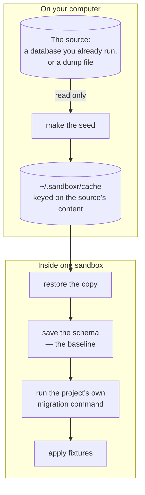

Every sandbox has its own database. That is the single most useful thing about it: a branch with a
migration in it can be run against real structure and real volume, and getting the migration wrong
costs one `sandboxr down`.

## The four rules

Every driver obeys these, and they are why it is safe to point sandboxr at a database with real
data in it.

**1. The source database is only ever read.** Everything destructive — the migration, the
fixtures, anything you type into a shell — happens to a **copy** inside the sandbox. Without this
rule, the first person to mistype a `DROP` while testing would destroy their own development
database and nobody would trust the tool again.

**2. A failed migration does not stop the sandbox.** It is recorded, the sandbox is marked
`degraded`, and the services start anyway. Stopping would be exactly backwards: looking at a failed
migration is one of the reasons the sandbox exists, and you cannot open a shell into a container
that has exited.

**3. The schema baseline survives a failed run.** A driver saves the schema before it migrates and
replaces that copy only after a migration **succeeds**. Shape changes cannot be rolled back, so a
migration can fail with its earlier statements already permanent — and "what did that actually
change?" is only answerable against the last schema known to be clean.

**4. sandboxr never reimplements a project's migration logic.** It runs the command in the
project's own config. Two migration engines that have to agree for ever will not agree for long.

> [!CAUTION] A tool that quietly fixes things stops being evidence
> Where a driver does intervene before a migration runs, it says exactly what it did, every time.
> The moment a migration tool repairs something silently, its output stops being proof of anything.

## The four commands

| Command | What it does | Needs a running sandbox |
|---|---|---|
| `sandboxr db seed` | Produce or refresh the seed artifact | no |
| `sandboxr db migrate` | Run the project's own migration command | yes |
| `sandboxr db snapshot` | Print the schema — structure, not rows | yes |
| `sandboxr db shell` | An interactive database prompt | yes |

That is the whole database surface. There is no `db diff` and no `db reset`: comparing before and
after is two snapshots and `diff`, and starting clean is `down` then `up`. See
[testing a migration](guides/testing-a-migration.md).

## Choosing a driver

| Driver | Use it when | What it costs |
|---|---|---|
| `mysql` | The project uses MySQL | A whole database server per sandbox: install, start, wait, restore |
| `d1` | The project uses Cloudflare D1 | A file copy. Nearly free |
| `sqlite` | The project opens a SQLite file directly | A file copy. Nearly free |
| `none` | The project has no database | Nothing |

`none` is a real choice, not a placeholder. A front-end-only project should not pay for a database
it never opens.

## Two families, not four variations

| | Server-based (`mysql`) | File-based (`d1`, `sqlite`) |
|---|---|---|
| What the database *is* | a running program | a file |
| Making a copy | dump it, then restore it | copy the file |
| Server version | a real hazard, pinned in the config | there is no server |
| Two things writing at once | needs a lock | **one writer only**, named in the config |
| Time to start | seconds to tens of seconds | milliseconds |
| Ways it goes wrong | disk, character sets, replication state, grants | one: two writers |

## Where the work happens

Making the seed happens on your computer, **once**. Everything else happens inside the sandbox.



That split is why the second sandbox on a project starts quickly: the dump is already cached and
nothing re-reads the source unless its content changed.

### Where the seed comes from

```yaml
database:
  seed_from:
    local: { container: acme_db, database: acme }   # fork a container you already run
    file: /var/sandboxr/seeds/acme.sql.zst          # or restore a dump
    fixtures: db/seeds/fixtures.sql                 # applied after migrations, either way
```

Listing several is normal: a laptop forks the container the developer already has, a server
restores a dump, and neither source exists on the other machine. Precedence is **`local`, then
`file`, then `fixtures`** — freshest first. `sandboxr up --seed <source>` forces one, and the
access rules filter the list before anything is chosen.

The cache key is a fingerprint of the source's **content**, not a timestamp:

- **MySQL** fingerprints the server version, the table count, the column count and the total byte
  size. It deliberately does not notice one edited row — re-dumping a whole database because
  somebody changed a record would make the cache pointless. `SANDBOXR_CACHE_TTL_HOURS` (default
  24) bounds how stale an entry can get.
- **D1 and SQLite** hash the file itself, sidecars included. A database file's timestamp moves
  every time the engine checkpoints, whether or not anything changed.

An in-progress artifact is written as `<name>.partial` and renamed only on success, so an
interrupted dump can never be mistaken for a complete one.

### What a driver keeps, per sandbox

Under `~/.sandboxr/logs/<project>/<slug>/`:

| File | What it is |
|---|---|
| `schema-before.sql` | The baseline — the last schema known to be clean |
| `schema-after.sql` | The schema as of the last successful migration |
| `.failed` | Written when a run fails. Its presence is what protects the baseline |
| `migrate.log` | Everything the migration command printed |

---

# MySQL: the hard case

## Restore into the version production runs

```yaml
database:
  driver: mysql
  version: "8.4"
```

Not the version on the developer's laptop, and the difference is not pedantry. A `latest` tag
drifts, and often resolves to a release line production will never run. A migration is only
meaningfully tested against the version it will really run on.

> [!TIP] If you can, move your own database to the pinned version
> The seed cache makes re-dumping cheap, so this is roughly a one-minute job and it deletes a whole
> category of "but it worked in my sandbox".

## Three dump flags are load-bearing

Getting any one wrong produces a failure that never mentions the flag.

| Flag | Without it |
|---|---|
| **No `--databases`** | The dump pins itself to the source's database name, every sandbox has to overwrite that one name, and a per-sandbox database becomes impossible |
| **`--hex-blob`** | Binary columns come out as escaped text. Any character-set mismatch then corrupts them **silently**: the restore succeeds and the bytes are wrong |
| **`--set-gtid-purged=OFF`** | The dump carries the source's replication state. Replaying it needs a privilege the sandbox's user does not have. The symptom is a permissions error on a statement nobody wrote |

The restore runs with `FOREIGN_KEY_CHECKS=0, UNIQUE_CHECKS=0` **for the load only** — a dump's
tables arrive in alphabetical order, so a child table can legitimately precede its parent.

## Grants: escape the underscore

MySQL treats `_` and `%` as wildcards in the database part of a `GRANT`.

```sql
GRANT ALL PRIVILEGES ON `acme\_%`.* TO 'sandboxr'@'%';
```

- `acme_%` unescaped grants far more widely than intended, because `_` matches any character.
- `` `acme_%` `` with nothing escaped grants on a database *literally named* `acme_%`, and every
  connection then fails with `Error 1044: Access denied`.

The escaped underscore with a live `%` is the only correct spelling. The failure names a database
that looks perfectly reasonable, which is why it is worth reading twice.

The database itself is created with an explicit collation rather than the server default. A
mismatch does not fail at connect time — it fails halfway through a migration with "illegal mix of
collations".

## The lock name, and why long slugs are hashed

MySQL's named locks are cut off at **64 characters**, silently. sandboxr computes one lock name per
sandbox and passes it as `SANDBOXR_MIGRATION_LOCK`, so a runner that takes a lock takes one nobody
else can hold.

That budget puts the ceiling on the slug: at most **31 characters**, and over that the first 22 are
kept with an 8-character hash of the *original* name appended.

> [!CAUTION] Hashed, not truncated — and this is load-bearing
> `feature/checkout-redesign-part-one` and `feature/checkout-redesign-part-two` truncate to the
> same string, so two sandboxes would share one lock and one migration would silently wait on the
> other. Do not raise the ceiling without re-checking the lock-name budget of every driver.

## Where the migration runs

Inside the sandbox's container, through `docker exec`, with an explicit list of variables and
nothing else. It does not inherit your shell.

A typical migration runner looks for its config at a handful of **relative** paths and loads it
without overriding variables that are already set — so a *partly* set environment gets quietly
topped up from whichever file it found. A repository containing a production config anywhere in its
tree can supply the missing half, and the runner points at production having been told to point at
a sandbox.

Running inside the container removes most of that. What remains is the worktree, which **is**
mounted: if your project keeps a production config in the repository, choose a `workdir` from which
the runner's relative paths do not resolve.

`since` is passed as `SANDBOXR_MIGRATE_SINCE` rather than turned into a flag, because sandboxr
cannot guess a runner's flag spelling. **The command has to consume it.** If `since` appears to do
nothing, that is why.

## The exit code is not always the whole answer

A runner that prints its own failure summary and *then* exits zero reports success while the schema
is half applied — and a sandbox builds that runner **from the branch under test**, so the branch may
be exactly the one with that bug.

```yaml
migrate:
  command: go run ./cmd/migrate
  failure_pattern: "[0-9]+ failed"          # treated as a failure even on exit 0
  file_pattern: "[0-9]{8}-[^ ]+\\.sql"      # how to pull the failing file out
  error_pattern: "Error [0-9]+ \\([0-9A-Z]+\\):.*"
```

> [!CAUTION] Never test a pipeline's exit status
> `cmd | tee log` exits with `tee`'s status, and `tee` always succeeds. Testing the pipeline
> reports **every** failed migration as a success.

## Stuck bookkeeping is the project's problem

Most runners record their own progress: a row when a file starts, a completion mark when it lands.
A row left incomplete means an earlier run died part-way, and a careful runner refuses to continue
unattended. That refusal is correct, and a faithful copy inherits it.

sandboxr does not repair a project's bookkeeping in general, and should not — that is the
reimplementation rule 4 forbids. The repair belongs in the project's own runner, and whoever writes
it there needs two rules:

1. **Heal a row by completing it, never by deleting it.** Deleting makes the runner treat the
   migration as pending and run it again — re-running something that already applied half its
   changes is exactly the hazard the refusal exists to prevent.
2. **Never heal a row whose migration file is still present.** That marks a broken migration as
   done, so the next run fails one migration further along, until the database looks fully migrated
   having never actually run any of it.

The MySQL driver carries one narrow exception, and it prints a line you will otherwise not
understand:

```
Healed 2 incomplete migration row(s) in the COPY: 20240612-1030-add-orders-index.sql, …
  The source database is untouched. Check the result before trusting it.
```

It runs **only** when the copy has a table called `migrations` with `filename` and `completed_at`
columns, it completes rows rather than deleting them, it touches the copy only, and it reports
every row it healed. It does **not** implement the second rule. Treat the printed list as something
to read, not as a repair you can rely on.

---

# D1 and SQLite: the easy case

A database that is a file. There is no server, no version skew, no advisory lock — and one rule
that comes with it.

## Rule one: one writer per file

**Two processes that open the same database file deadlock.** Not "contend", not "run slowly" —
they hang, or fail with a busy error, and each looks from the outside as if it is working. A slow
boot and a permanent hang are identical for the first minute, and nothing is written to the log.

So the config names the single service allowed to open it:

```yaml
database:
  owner: app
```

The value is a front-end `label` or a backend `name` the project already declares. A project with
more than one runtime and no owner is **refused** when its config is read, with the list of names
it could have used.

> [!CAUTION] This is a rule of the engine, not a workaround
> Retries and a longer busy timeout do not fix it. The local runtime that backs D1 holds the file
> in a way a second opener cannot share.

What follows from the rule:

- **No two sandboxes share a file.** Each gets a private copy — the same isolation a MySQL sandbox
  buys with a whole server, for the price of a file copy.
- **Every non-owner is denied the database's location.** The container simply does not tell any
  other service where the file is, so a second one fails loudly on a missing binding instead of
  quietly hanging.
- **Migrations run before any service starts**, which is the one moment nothing else holds the file.
- **Fixtures are applied with the SQLite client directly**, not through the project's own tooling,
  which would open its own runtime against the same file.
- **A D1 shell is read-only**, because the owning service holds the file while it runs.
- **Nothing else may open it either** — not a script you run in a shell while the app is serving,
  not a database browser you left open on Tuesday.

## Rule two: point the runtime at the sandbox's own directory

The sandbox exports its database's location as `$SANDBOXR_D1_DIR`. **Both** the migrate command and
the owner's serve command have to be told:

```yaml
database:
  driver: d1
  migrate:
    command: npx wrangler d1 migrations apply DB --local --persist-to "$SANDBOXR_D1_DIR"
  owner: app

frontends:
  apps:
    - label: app
      package: .
      serve: npx wrangler dev --port 8787 --ip 127.0.0.1 --persist-to "$SANDBOXR_D1_DIR"
      port: 8787
```

Leave it off either one and the runtime falls back to a directory inside the project — which is
your worktree, mounted. Three things then go wrong at once, and none of them produces an error:

1. The sandbox's database lands in your branch and turns up in `git status`.
2. Two sandboxes from the same worktree share one file, breaking the one-writer rule by
   construction.
3. `sandboxr down` no longer removes the database, because it is not in the sandbox's volume.

> [!WARNING] doctor warns about this, and deliberately does not refuse
> `sandboxr doctor` reads both commands and reports any that never mention the variable. A refusal
> has to be certain, and this one cannot be: a project may point its runtime at the right place
> through a config file sandboxr cannot read.

The variables, which the host driver and the container scripts agree on:

| Variable | Value | Driver |
|---|---|---|
| `SANDBOXR_DB_DRIVER` | `d1` or `sqlite` | both |
| `SANDBOXR_DB_NAME` | the project name | both |
| `SANDBOXR_DB_DIR` | `/var/lib/sandboxr/data/<driver>` | both |
| `SANDBOXR_D1_DIR` | the same directory | `d1` only |
| `SANDBOXR_DB_FILE` | `/var/lib/sandboxr/data/sqlite/<project>.sqlite` | `sqlite` only |

`d1` gets a *directory* rather than a file because the local Cloudflare runtime owns the layout
inside it; the driver finds the actual SQLite file by searching for `*.sqlite` underneath. No match
means "nothing has created it yet", a normal first-boot state.

> [!NOTE] `docker exec` does not inherit them
> The container exports these before it starts its services, so every supervised service has them —
> but a command you run by hand has to carry them itself, or `$SANDBOXR_DB_FILE` expands to nothing
> and `sqlite3 ""` quietly operates on a temporary in-memory database instead of failing.
> `sandboxr db shell` and `sandboxr db snapshot` pass them for you.

## An empty seed is normal

```yaml
seed_from:
  file: .wrangler/state
```

That is where the local runtime keeps its SQLite files, and it is almost always gitignored — so a
fresh worktree has nothing there. With nothing to copy, the sandbox starts empty, runs the
project's migrations and applies the fixtures. The driver says so plainly:

```
No database to seed from, so this sandbox starts empty and migrates.
```

Docker creates a missing bind-mount source as an empty directory rather than failing, so the driver
does not trust the path's existence: it looks for a `.sqlite`, `.sqlite3` or `.db` file of at least
1 KB underneath. When there is one, the whole directory is copied — write-ahead log and
shared-memory sidecars included, because a copy missing them reads as corrupt.

## `sqlite` versus `d1`

They are separate drivers because they are *found* differently, not because the engine differs.

| | `sqlite` | `d1` |
|---|---|---|
| Where the database is | one file, at a path the sandbox fixes | inside the runtime's state directory, found by search |
| Migration command | the project's own | usually the platform CLI's |
| Starting empty | an empty file is created, in write-ahead mode | the first thing to open it creates it |
| `sandboxr db shell` | read-write | **read-only** |

If your project opens a SQLite file directly, use `sqlite`. If it goes through a Workers binding,
use `d1`.

## Telling a deadlock apart from a slow boot

The two-writer deadlock has no error message, so recognise it by shape:

| What you see | What it is |
|---|---|
| The sandbox sits at `starting` for ever, and the log stops mid-way through database setup with nothing after it | Two openers. Count them before you look at anything else |
| A service fails immediately, complaining about a missing database binding | The one-writer rule working. That service is not the `owner` |
| A `.sqlite` file turns up in `git status` | A command is missing `--persist-to "$SANDBOXR_D1_DIR"` |
| `no D1 database in <directory> yet` from `db shell` | Nothing has created it. Normal on a fresh worktree with no seed |
| Fixtures did not apply | Non-fatal by design — a fixture that no longer matches the schema is a signal, not a reason to refuse to start |

Two sandboxes of the same project can never deadlock each other; each has its own copy in its own
volume. The deadlock is always *within* one sandbox, or between a sandbox and something you ran by
hand.

## Related

- [Testing a migration](guides/testing-a-migration.md) — the loop
- [Two worked examples](configuration/examples.md) — a MySQL monorepo and a Worker on D1
- [Troubleshooting](troubleshooting.md)
