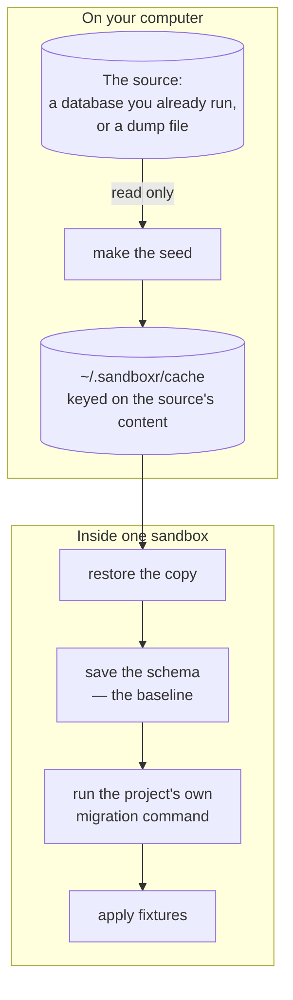

> **Written, never run** — All four drivers are written and unit-tested, and the container half was exercised with stub commands. No driver has taken a real dump, restored one, or migrated a real database.

A **driver** is everything sandboxr knows about one kind of database. There is one for MySQL, one
for Cloudflare D1, one for SQLite, and one for a project that has no database at all.

A driver does five jobs, and they are the five things a sandbox needs:

| The job | What it means | The command that runs it |
|---|---|---|
| Make a seed | Get a copy of the data a new sandbox should start from | `sandboxr db seed` |
| Provision | Take a brand-new sandbox from empty to seeded and migrated | happens during `sandboxr up` |
| Migrate | Run the project's own migration command | `sandboxr db migrate` |
| Snapshot | Print the shape of the database — the tables and columns, not the rows | `sandboxr db snapshot` |
| Shell | Open an interactive database prompt inside the sandbox | `sandboxr db shell` |

Those four `db` commands are the whole database surface. There is no `db diff`, no `db reset` and
no `db fork` — see [testing a migration](../guides/testing-a-migration.md) for what to do instead.

## The four rules

Every driver obeys these four, and they are the reason it is safe to point sandboxr at a database
that has real data in it.

### 1. The real database is only ever read

sandboxr never writes to the database you are copying from. It opens it, reads it, and leaves.
Everything destructive — the migration, the fixtures, anything you type into a shell — happens to
a **copy** that lives inside the sandbox.

This is the rule the whole tool rests on. Without it, the first person to mistype a `DROP` in a
migration they were testing would destroy their own development database, and nobody would trust
the tool again.

### 2. A failed migration does not stop the sandbox

If the project's migrations fail, sandboxr writes down that they failed, marks the sandbox
**degraded**, and starts the services anyway.

Stopping the container would be exactly backwards. **Looking at a failed migration is one of the
reasons the sandbox exists.** You want to open a shell, see what landed and compare the schema —
and you can do none of that against a container that has exited.

The failure is never silent: `sandboxr ls` and `sandboxr status` both show `degraded`, and the
dashboard paints that card differently from a healthy one.

### 3. The schema baseline survives a failed run

Before it migrates, a driver saves a copy of the schema. It only replaces that saved copy after a
migration **succeeds**.

The reasoning is worth a paragraph, because it is the kind of thing that looks like an oversight
until you need it. In MySQL, and in most engines, a change to the shape of a table cannot be
rolled back. So a migration can fail halfway with its earlier statements already permanent. The
question you ask next is "what did that actually change?", and the only way to answer it is to
compare against the last schema known to be clean.

If the saved copy were replaced on every attempt, the failed attempt would overwrite it with the
half-migrated schema. The next comparison would then report **no change at all** — precisely when
the question matters most, and in a way that reads as reassurance rather than as a missing answer.

### 4. Never reimplement the project's migration logic

sandboxr runs the command in the project's own config. It does not order migrations, apply them or
track them itself.

Two migration engines that have to agree for ever will not agree for long. And a project's runner
encodes decisions that are its own — the order, how it records what it has done, what counts as
pending — which a generic tool cannot copy without becoming a fork of it.

> [!CAUTION] A tool that quietly fixes things stops being evidence
> Where a driver does have to intervene in a database before a migration runs, it must say exactly
> what it did, every time. The moment a migration tool repairs something silently, its output stops
> being proof of anything.

## Choosing a driver

```yaml
database:
  driver: mysql
```

| Driver | Use it when | What it costs |
|---|---|---|
| `mysql` | The project uses MySQL | A whole database server per sandbox: install, start, wait, restore. The expensive one. |
| `d1` | The project uses Cloudflare D1 | A file copy. Nearly free. |
| `sqlite` | The project opens a SQLite file directly | A file copy. Nearly free. |
| `none` | The project has no database | Nothing. |

`none` is a real choice, not a placeholder. A front-end-only project, or a service whose data all
lives behind someone else's API, should not pay for a database it never opens.

## Two families, not four variations

`mysql` on one side and `d1`/`sqlite` on the other are genuinely different problems.

| | Server-based (`mysql`) | File-based (`d1`, `sqlite`) |
|---|---|---|
| What the database *is* | a running program | a file |
| Making a copy | dump it, then restore it | copy the file |
| Server version | a real hazard, and pinned in the config | there is no server |
| Two things writing at once | needs a lock | one writer only, named in the config |
| Time to start | seconds to tens of seconds | milliseconds |
| Ways it goes wrong | disk, character sets, replication state, grants | one: two writers |

Read [MySQL](./mysql.md) if your project is the hard case and
[D1 and SQLite](./d1-sqlite.md) if it is not.

## Where the work happens

Making the seed happens **on your computer, once**. Everything else happens **inside the
sandbox**.



*The expensive part runs once and is cached. Starting a second sandbox on the same project skips it.*


That split is why the second sandbox on a project starts quickly: the dump is already in the
cache, and nothing re-reads the source unless its content has changed.

> [!WARNING] Three of the four db commands need a running sandbox
> `sandboxr db seed` works on its own — it only reads the source and writes to the cache.
> `db migrate`, `db snapshot` and `db shell` run **inside** the sandbox's container, so the sandbox
> has to be up. If it is not, start it with `sandboxr up`.

<details>
<summary><b>Details for an agent:</b> the five methods, the context a driver is given, and what a migration reports back</summary>

The interface, from `docs/architecture/contracts.md` §6 and `packages/core/src/drivers/types.ts`:

```ts
export interface DatabaseDriver {
  readonly name: "mysql" | "d1" | "sqlite" | "none";

  /** Host-side: produce a reusable seed artifact in ~/.sandboxr/cache. Idempotent. */
  prepareSeed(ctx: DriverContext): Promise<SeedArtifact>;

  /** Inside the container, first boot: get from empty to seeded-and-migrated. */
  provision(ctx: DriverContext, seed: SeedArtifact): Promise<void>;

  /** Run the project's own migration command. Never reimplement the project's logic. */
  migrate(ctx: DriverContext): Promise<MigrateResult>;

  /** Structure-only snapshot, for diffing before/after a migration. */
  snapshot(ctx: DriverContext): Promise<string>;

  /** An interactive shell against this sandbox's database. */
  shell(ctx: DriverContext): Promise<void>;
}
```

`DriverContext` carries the resolved config, the slug, the worktree, `SANDBOXR_HOME`, and two ways
to run a command: `exec(cmd)` runs inside the sandbox's container, and the optional `host` runner
runs on your computer. `driverContext()` in `packages/core/src/drivers/index.ts` wires `exec` to
`docker exec` against `sandboxr-<project>-<slug>`, which is the mechanical reason every
destructive operation lands on the copy.

`migrate()` returns a `MigrateResult`: `ok`, the exit `code`, `applied` (files the output
mentioned), `failed` (the file it stopped on, when the output names one), `baseline` (host path to
the pre-run schema), `log` (host path to the full output), `durationMs` and `output`. Nothing in
there decides success except the exit code and, where a project declares one, its
`failure_pattern` — the file names are pulled out heuristically, for display only
(`packages/core/src/drivers/migrate.ts`).

Files a driver keeps on the host, per sandbox, under `~/.sandboxr/logs/<project>/<slug>/`:

| File | What it is |
|---|---|
| `schema-before.sql` | The baseline — the last schema known to be clean |
| `schema-after.sql` | The schema as of the last successful migration |
| `.failed` | Written when a run fails. Its presence is what protects the baseline |
| `migrate.log` | Everything the migration command printed |

</details>

<details>
<summary><b>Details for an agent:</b> where the seed comes from, and when the cache is re-taken</summary>

A project can name up to three seed sources, and a run picks one
(`packages/core/src/drivers/seed.ts`):

```yaml
database:
  seed_from:
    local:                 # fork a database container you already run
      container: acme_db
      database: acme
    file: /var/sandboxr/seeds/acme.sql.zst   # or restore a dump
    fixtures: db/seeds/fixtures.sql          # applied after migrations, whichever source is used
```

Listing several is normal and correct: a laptop forks the container the developer already has
running, a server restores a dump, and neither source exists on the other machine. The order of
preference is `local`, then `file`, then `fixtures` — freshest first. `sandboxr up --seed <source>`
forces one.

Access control filters that list **before** anything is chosen, so a project serving public apps
simply has fewer options rather than a separate code path — see
[public sandboxes](../security/public-sandboxes.md).

The cache lives in `~/.sandboxr/cache`, and its key is a fingerprint of the source's *content*, not
a timestamp:

- **MySQL** fingerprints the server version, the table count, the column count and the total byte
  size across tables. It deliberately does not notice one edited row — re-dumping a whole database
  because somebody changed a record would make the cache pointless. A 24-hour time-to-live
  (`SANDBOXR_CACHE_TTL_HOURS`) bounds how stale an entry can get.
- **D1 and SQLite** hash the file itself, sidecar files included. A database file's timestamp moves
  every time the engine checkpoints, whether or not anything changed, so content is the only honest
  key.

An in-progress artifact is written as `<name>.partial` and renamed into place only on success, so
an interrupted dump can never be mistaken for a complete one.

</details>

<details>
<summary><b>If it goes wrong:</b> what each rule looks like when it fires, and where to look</summary>

| What you see | Which rule is at work |
|---|---|
| `sandboxr ls` shows `degraded` | Rule 2. The migration failed, the sandbox is up on purpose. `sandboxr logs <slug>` has the output; `~/.sandboxr/logs/<project>/<slug>/migrate.log` has all of it. |
| `Comparing against the baseline from before the last failed run.` | Rule 3, working. The baseline was not overwritten by the failed attempt. |
| `healed N incomplete migration row(s) in the COPY` | A driver intervened, and said so. Read what it healed before trusting the run — and note it happened only to the copy. |
| `Fixtures did not apply cleanly — the sandbox is up anyway` | Deliberate. A fixture that no longer matches the schema is a useful signal, not a reason to refuse to start. |
| `restore produced no tables` | The dump restored but the database is empty, so the artifact is wrong or truncated. Not a sandbox problem. |

</details>

## Related

- [MySQL: the hard case](./mysql.md)
- [D1 and SQLite: the easy case](./d1-sqlite.md)
- [Testing a migration](../guides/testing-a-migration.md)
- [What is built](../reference/status.md) — how much of this has actually been run
