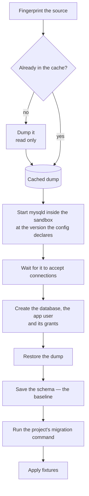

> **Written, never run** — The host driver and the container scripts are written and unit-tested. No dump has been taken from a real server, and no restore, grant or migration has run against a live mysqld.

A MySQL database is a **running program**, not a file. Nothing about it can be done by copying.
Every sandbox has to start its own server, wait for it, restore a copy of the data into it, and
create the user the app connects as.

That is the whole reason this page is long and [the D1 one](./d1-sqlite.md) is short.



*Six steps. The dump is cached across sandboxes, so most runs skip the first two.*


## Restore into the version production runs

```yaml
database:
  driver: mysql
  version: "8.4"
```

This is not the version on the developer's laptop, and the difference is not pedantry.

A `mysql:latest` tag drifts over time, and often resolves to a release line production will never
run — sometimes one that is already out of support. A migration is only meaningfully tested against
the version it will really run on, so the copy is restored into the version the config declares. If
the source is a different version, the driver says so once, while dumping, rather than absorbing it
quietly.

> [!TIP] If you can, move your own database to the pinned version
> This whole hazard is one you can simply delete. The seed cache makes re-dumping cheap, so moving
> your local database to the version production runs is roughly a one-minute job and removes a whole
> category of "but it worked in my sandbox".

## The three dump flags that are load-bearing

Most of the dump command is ordinary. Three parts of it are not, and getting any one wrong produces
a failure that never mentions the flag.

### No `--databases`

Left out, the dump contains no "create this database" statement and no "use this database"
statement — so the same file can be restored into a database of **any** name. Included, the file
pins itself to the source's name, every sandbox has to overwrite that one name, and a
per-sandbox database becomes impossible.

### `--hex-blob`

Without it, binary columns come out as escaped text. Any character-set mismatch anywhere in the
pipeline then corrupts them, and the corruption is **silent**: the restore succeeds and the bytes
are wrong.

### `--set-gtid-purged=OFF`

Without it the dump carries a statement about the source server's replication state. Replaying it
needs a privilege the sandbox's user does not have, and if it does apply it poisons the target. The
symptom is a permissions error on a statement nobody wrote.

<details>
<summary><b>Details for an agent:</b> the exact dump, restore and snapshot commands, and every environment variable the driver reads</summary>

From `packages/core/src/drivers/mysql.ts`.

```
mysqldump -u<user> [-p<password>]
  --single-transaction --quick --no-tablespaces
  --set-gtid-purged=OFF --hex-blob --no-autocommit
  --default-character-set=utf8mb4 --routines --events
  <database>
```

Piped through `zstd -3 -T0 -q -c` into `~/.sandboxr/cache/seed-<project>-<fingerprint>.sql.zst`.

Restore, inside the sandbox, as root:

```
mysql -uroot -p<root>
  --default-character-set=utf8mb4
  --init-command=SET FOREIGN_KEY_CHECKS=0, UNIQUE_CHECKS=0
  <database>
```

The checks are off **for the load only**: a dump's tables arrive in alphabetical order, so a child
table can legitimately precede its parent.

Snapshot — structure only, cheap enough to run on every migration:

```
mysqldump -uroot -p<root> --no-data --no-tablespaces --skip-comments --set-gtid-purged=OFF <database>
```

| Variable | Default | What it is for |
|---|---|---|
| `SANDBOXR_SOURCE_DB_USER` | `root` | Reading the database you are copying from |
| `SANDBOXR_SOURCE_DB_PASSWORD` | empty | The same. An empty value omits the flag entirely |
| `SANDBOXR_DB_USER` | `sandboxr` | The user the app connects as, inside the sandbox |
| `SANDBOXR_DB_PASSWORD` | `sandboxr` | Its password |
| `SANDBOXR_DB_ROOT_PASSWORD` | `sandboxr` | Root inside the sandbox's own server |
| `SANDBOXR_DB_NAME` | the project name, with non-alphanumerics folded to `_` | The database inside the sandbox |
| `SANDBOXR_MYSQL_IMAGE` | `mysql:<database.version>`, default `mysql:8.4` | Overrides the image entirely |
| `SANDBOXR_CACHE_TTL_HOURS` | `24` | How long a cached dump is used before it is re-taken |

The sandbox's own server is initialised with `--initialize-insecure`, so root has no password
inside the container. It listens only on the container's loopback and its contents are disposable,
so a password there would protect nothing. The app user gets one anyway, because application
config expects one.

</details>

## The lock name, and why long slugs are hashed

MySQL's named locks are cut off at **64 characters**, silently. sandboxr computes one lock name per
sandbox — `sandboxr_migrate_<project>_<slug>` — and hands it to the project's migration command as
`SANDBOXR_MIGRATION_LOCK`, so a runner that takes a lock takes one that nobody else can be holding.

That budget is what puts a ceiling on the slug. A slug is at most **31 characters**; over that, the
first 22 characters are kept and an 8-character hash of the *original* name is appended.

> [!CAUTION] Hashed, not truncated — and this is load-bearing
> Two long branch names very often share a prefix. `feature/checkout-redesign-part-one` and
> `feature/checkout-redesign-part-two` truncate to the same string, so two sandboxes would end up
> sharing one lock and one migration would silently wait on the other. A hash of the original name
> cannot collide that way.
>
> Do not raise the ceiling without re-checking the lock-name budget. `lockName()` in
> `packages/core/src/naming.ts` throws rather than truncating, so the failure is at least loud.

## Grants: escape the underscore

MySQL treats `_` and `%` as **wildcards** in the database part of a `GRANT`. A grant meant to cover
every database whose name starts with `acme_` has to be written like this:

```sql
GRANT ALL PRIVILEGES ON `acme\_%`.* TO 'sandboxr'@'%';
```

- `acme_%` unescaped grants far more widely than intended, because `_` matches any single
  character.
- `` `acme_%` `` in plain backticks with nothing escaped grants on a database *literally named*
  `acme_%`, and every connection then fails with `Error 1044: Access denied`.

The escaped underscore with a live `%` is the only correct spelling. The failure from getting it
wrong is an access-denied error naming a database that looks perfectly reasonable — which is why
this one is worth reading twice.

<details>
<summary><b>Details for an agent:</b> the full set of users and grants a sandbox creates</summary>

`container/scripts/db/mysql.sh` creates the app user for both `%` and `localhost`, because a
project's connection string may resolve either way, and grants three things:

```sql
CREATE USER IF NOT EXISTS '<user>'@'%'         IDENTIFIED BY '<password>';
CREATE USER IF NOT EXISTS '<user>'@'localhost' IDENTIFIED BY '<password>';
GRANT ALL PRIVILEGES ON `<db>`.*     TO '<user>'@'%';
GRANT ALL PRIVILEGES ON `<db>`.*     TO '<user>'@'localhost';
GRANT ALL PRIVILEGES ON `<db>\_%`.*  TO '<user>'@'%';
FLUSH PRIVILEGES;
```

The third grant is the escaped-wildcard one, and it exists so a test suite that creates sibling
databases named after the main one keeps working inside a sandbox.

The database itself is created with an explicit collation
(`CHARACTER SET utf8mb4 COLLATE utf8mb4_0900_ai_ci`) rather than the server default. A project's
connection string often names a collation, and a mismatch does not fail at connect time — it fails
halfway through a migration with "illegal mix of collations".

</details>

## Where the migration runs, and what it can see

The migration command runs **inside the sandbox's container**, through `docker exec`, with an
explicit list of variables and nothing else. It does not inherit your shell.

```yaml
database:
  migrate:
    workdir: services
    command: go run ./cmd/migrate --dir ../db/migrations --non-interactive
    since: "20240101"
```

`workdir` is relative to the worktree, which is mounted at `/workspace`. The variables the driver
sets are `DB_HOST`, `DB_PORT`, `DB_NAME`, `DB_USERNAME`, `DB_PASSWORD`, `SANDBOXR_MIGRATION_LOCK`
and, when the config sets `since`, `SANDBOXR_MIGRATE_SINCE`.

<details>
<summary><b>Why it works this way:</b> why running inside the container closes a genuinely dangerous accident</summary>

A typical migration runner looks for its configuration file at a handful of **relative** paths and
loads it without overriding variables that are already set. That sounds safe, and it is not: a
*partly* set environment gets quietly topped up from whichever file the runner happened to find. A
repository containing a production configuration file anywhere in its tree can therefore supply the
missing half, and the runner points at production having been told to point at a sandbox.

Running inside the container removes most of that. The process gets the container's environment
plus the variables named above, never the developer's shell, and the database it can reach on
`127.0.0.1:3306` is the sandbox's own.

What remains is the worktree, which **is** mounted. If the project keeps a production configuration
file in the repository, choose a `workdir` from which the runner's relative paths do not resolve —
a runner that reports it is configured purely from environment variables is giving you per-run
proof that nothing shadowed the values the sandbox passed.

`since` is passed as an environment variable rather than turned into a flag because sandboxr cannot
guess a runner's flag spelling. The command in the config has to consume it
(`docs/architecture/contracts.md` §5.4). If `since` appears to do nothing, that is why.

</details>

## The runner's exit code is not always the whole answer

A runner that prints its own failure summary and *then* exits zero reports success while the schema
is half applied. And a sandbox builds that runner **from the branch under test**, so the branch may
be exactly the one with that bug.

A project whose runner behaves that way declares patterns alongside the command:

```yaml
migrate:
  command: go run ./cmd/migrate
  # Treated as a failure even on exit 0.
  failure_pattern: "[0-9]+ failed"
  # How to pull the failing file and the error text out of the output.
  file_pattern: "[0-9]{8}-[^ ]+\\.sql"
  error_pattern: "Error [0-9]+ \\([0-9A-Z]+\\):.*"
```

> [!CAUTION] And never test a pipeline's exit status
> `cmd | tee log` exits with `tee`'s status, and `tee` always succeeds. Testing the pipeline
> therefore reports **every** failed migration as a success — a false green in the one place you can
> least afford one.

## Stuck migration bookkeeping is the project's problem

Most migration runners record their own progress: a row when a file starts, a completion mark when
it lands. A row left incomplete means an earlier run died part-way, and a careful runner refuses to
continue unattended until somebody has looked. That refusal is correct — and a copy inherits it,
because the copy is faithful.

**sandboxr does not repair a project's bookkeeping in general, and should not.** Reading and writing
a project's tracking table means encoding one project's schema into a generic tool, and it is the
reimplementation of the project's migration logic that
[rule 4](./drivers.md#4-never-reimplement-the-projects-migration-logic) forbids.

The reasoning is still worth having, because the repair belongs in the **project's own runner**, and
whoever writes it there needs these two rules:

| Option | What happens |
|---|---|
| **Delete the row** | The runner treats that migration as pending and runs it again. Re-running a migration that already applied half its changes is exactly the hazard the refusal exists to prevent. |
| **Complete the row** | The runner treats it as done and moves on. Conservative: it may leave a half-applied state in place, but it applies nothing twice. |

1. **Heal a row by completing it, never by deleting it.**

2. **Never heal a row whose migration file is still present.** That marks a broken migration as
   done, so the next run fails one migration further along, and the one after that fails further
   still, until the database looks fully migrated having never actually run any of it.

<details>
<summary><b>Details for an agent:</b> the one narrow repair the MySQL driver carries today, and its limits</summary>

`healStuckRows()` in `packages/core/src/drivers/mysql.ts` is a deliberate, narrow exception, and
worth knowing about because it prints a line you will otherwise not understand:

```
Healed 2 incomplete migration row(s) in the COPY: 20240612-1030-add-orders-index.sql, …
  The source database is untouched. Check the result before trusting it.
```

Its limits, all of them intentional:

- It runs **only** if the copy has a table called `migrations` with both a `filename` and a
  `completed_at` column. Any other tracking shape is left alone, because guessing would mean
  writing to a table this tool does not understand.
- It **completes** rows, never deletes them — the conservative half of the advice above.
- It touches the copy inside the sandbox only. The source is never written to.
- It reports every row it healed, every time. A silent workaround in a migration tool is how you
  stop believing its results.

It does **not** implement the second rule: it does not check whether the migration file is still
present. Treat the printed list as something to read, not as a repair you can rely on, and fix the
underlying state in the project.

</details>

<details>
<summary><b>If it goes wrong:</b> the MySQL failures worth recognising on sight</summary>

| Symptom | Cause |
|---|---|
| `Error 1044: Access denied ... to database 'acme_...'` | The grant is missing, or its underscore is not escaped. |
| A refusal to run naming unfinished migration rows | Bookkeeping inherited from the source. The runner is protecting you; fix it in the project. |
| InnoDB reporting "probably out of disk space" mid-restore | **A full Docker disk.** It reads as a corrupt database. Check disk first, always. |
| A permissions error on a statement nobody wrote | `--set-gtid-purged=OFF` is missing from the dump. |
| Binary columns are garbage after a restore | `--hex-blob` is missing. |
| `restore produced no tables` | The dump restored, and the database is still empty. The artifact is wrong or truncated. |
| `could not fingerprint <db> in <container>` | The source credentials are wrong. Set `SANDBOXR_SOURCE_DB_USER` and `SANDBOXR_SOURCE_DB_PASSWORD`. |
| "illegal mix of collations" halfway through a migration | The database was created with a collation the project does not expect. |
| Two worktrees report a different number of pending migrations | Expected. The set comes from *that worktree's* migration directory, which is the point of a sandbox. |

More of these, with what to do about each: [troubleshooting](../troubleshooting.md).

</details>

## Related

- [The driver model](./drivers.md) — the four rules this page is an instance of.
- [Testing a migration](../guides/testing-a-migration.md) — the loop, with the four commands that
  exist.
- [The MySQL monorepo example](../configuration/example-monorepo.md) — a complete config.
