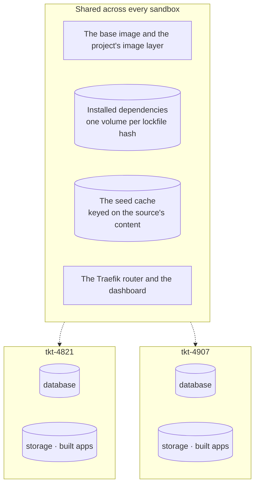

One sandbox is convenient. **All of them at once is the reason the tool exists.**

```bash
for wt in .worktrees/*/; do
  sandboxr up --worktree "$wt"
done
sandboxr ls
```

```
PROJECT  SLUG       STATE     BRANCH             WORKTREE
acme     tkt-4821   running   tkt-4821           /home/dev/acme/.worktrees/tkt-4821
acme     tkt-4907   running   tkt-4907*          /home/dev/acme/.worktrees/tkt-4907
acme     fix-nav    degraded  fix/nav-overflow   /home/dev/acme/.worktrees/fix-nav
```

Three branches, three URLs, three databases, all live at the same time:

```
https://tkt-4821.app.acme.sbx.localhost
https://tkt-4907.app.acme.sbx.localhost
https://fix-nav.app.acme.sbx.localhost
```

## What that gets you

| | Without sandboxr | With every worktree running |
|---|---|---|
| Comparing two branches | Stash, checkout, rebuild, look, repeat | Two tabs |
| Testing a migration | The shared database has already run it once | Each sandbox migrates its own copy |
| Reviewing a pull request | Check it out, hope the dependencies match | Open the URL |
| Three agents working unsupervised | They fight over one dev server and one database | Three sandboxes, three URLs, nothing shared |
| A branch that breaks the database | You spend the afternoon repairing it | `sandboxr down`, `sandboxr up` |

## What is shared, and what is not



Everything a branch can damage is private to its sandbox. Everything expensive to produce is
shared, which is why the second sandbox on a project starts far faster than the first:

- The **project image** is content-addressed on the toolchain and the lockfile, so branches that
  have not changed either share one image and build nothing.
- The **dependency volume** is named after a hash of the lockfile. Branches with matching
  lockfiles share one `node_modules`; a branch that changes its dependencies transparently gets
  its own.
- The **seed cache** is keyed on the source database's content, so it is produced once and every
  sandbox restores from it.

## What it costs

**Memory is the limit that matters.** Each sandbox gets one cgroup covering everything inside
it: the largest `memory:` any single runtime in the project declares, with a floor of **4 GB**.

That is a *ceiling*, not a reservation. A container capped at 4 GB using 500 MB is using 500 MB,
so the number that decides how many fit is real usage, not the cap. Divide your Docker VM's
memory by what a sandbox actually uses.

| Project shape | Roughly, per sandbox |
|---|---|
| A Worker or a single Node service on a file database | tens of megabytes |
| Several compiled services on a file database | a few hundred megabytes |
| The same with a MySQL server of its own | add several hundred megabytes, and seconds to start |

The cap only bites at the moment something spikes, which in practice means a large front-end
build. If one app needs more, declare `memory:` on it — and note that raising it raises the
ceiling for the *whole* sandbox, because the kernel enforces the container total.

## Keeping the set tidy

A worktree you delete leaves a sandbox behind. `gc` reaps them:

```bash
sandboxr gc --dry-run    # say what would go
sandboxr gc              # do it
```

It removes sandboxes whose recorded worktree no longer exists on disk, and then any
`sandboxr-` volume nothing owns and nothing has mounted. Shared volumes and dependency volumes
are left alone.

## Doing it from the dashboard instead

The dashboard at `https://sbx.localhost` lists every **worktree** on the machine — grouped by
project, or by when each was made, when it last had a commit, or what state it is in — with the
state of the sandbox on each one shown on its row. It can start a sandbox for a branch that has
none. For a reviewer who does not want a terminal, that is the whole interface. See
[the dashboard](../guides/dashboard.md).

## Related

- [Start, stop, list, clean up](../guides/lifecycle.md)
- [Agents in a sandbox](../guides/agents-in-a-sandbox.md)
- [Running on a server](../running-on-a-server.md) — the same thing, for a team
