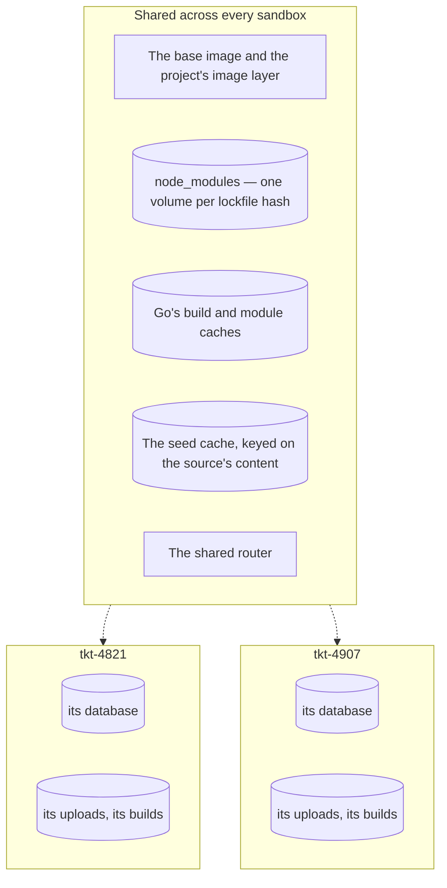

One sandbox is convenient. **All of them at once is the reason the tool exists.** This page starts
several, then explains what they share and what they keep to themselves.

You want [Your first sandbox](first-sandbox.md) working before this.

```prompt
Start a sandbox for every worktree of this project and report the URLs.

Read docs/getting-started/every-worktree.md and follow it. Start one sandbox per worktree, then run
`sandboxer ls` and give me the table plus one URL per sandbox.

Stop and ask me if:
- Any sandbox comes up degraded (exit code 3). Report which and show me its logs.
- There are more than five worktrees. Tell me how many and wait — each one costs memory.
- Docker reports it is out of disk or memory.

Do not run `sandboxer down` or `sandboxer gc` on anything. Both delete databases.
```

## Start them all

```bash
for wt in .worktrees/*/; do
  sandboxer up --worktree "$wt"
done
sandboxer ls
```

```
PROJECT  SLUG      STATE     TTL    BRANCH            WORKTREE
acme     fix-nav   degraded  12h    fix/nav           /home/dev/acme/.worktrees/fix-nav
acme     tkt-4821  running   kept   tkt-4821          /home/dev/acme/.worktrees/tkt-4821
acme     tkt-4907  running   12h    tkt-4907*         /home/dev/acme/.worktrees/tkt-4907

* uncommitted changes when the sandbox started
```

Three branches, three URLs, three databases, all live at the same time:

```
https://tkt-4821--app--acme.sbx.localhost
https://tkt-4907--app--acme.sbx.localhost
https://fix-nav--app--acme.sbx.localhost
```

The first one was slow. The rest were not — the expensive work was already done and shared, which
is the next section.

## What that gets you

| | Without sandboxer | With every worktree running |
|---|---|---|
| Comparing two branches | Stash, checkout, rebuild, look, repeat | Two tabs |
| Testing a migration | The shared database has already run it once | Each sandbox migrates its own copy |
| Reviewing a pull request | Check it out and hope the dependencies match | Open the URL |
| Three agents working unsupervised | They fight over one dev server and one database | Three sandboxes, three URLs |
| A branch that corrupts the database | You spend the afternoon repairing it | `sandboxer down`, `sandboxer up` |

## What is shared, and what is not

The rule is simple, and everything below follows from it.

**Anything a branch could damage is private to its sandbox. Anything expensive to produce is
shared.**



### Shared

- **The base image.** Built once by `sandboxer init`, used by every sandbox on the machine.
- **The project's image layer** — its toolchains and its installed dependencies. Its tag is a hash
  of what went into it, so two branches that changed neither the toolchain nor the lockfile use the
  same image and build nothing at all.
- **`node_modules`, as one volume per lockfile.** The volume is named after a hash of the lockfile,
  so every branch with matching dependencies shares one install. A branch that changes its
  dependencies transparently gets its own volume and a real install.
- **Go's two caches**, one pair for the whole machine. Both are content-addressed by Go itself, so
  two sandboxes read the same entry only when the thing cached was identical anyway.
- **The seed cache.** Keyed on the content of the source database, so a dump or a fork is produced
  once and every sandbox restores its own copy from it.
- **The shared router.** One for the machine, in front of every sandbox of every project.
- **The git repository.** A worktree's `.git` points at the repository it was cut from, so that is
  mounted too, read-write, or nothing in git would work inside the sandbox. The cost is real: a
  sandbox can move a branch another worktree has checked out.

### Private to each sandbox

- **The container**, and the memory limit on it.
- **The database.** Its own volume, its own copy, its own migrations.
- **Object storage** — anything uploaded.
- **Built backend binaries**, and **built front-ends**.
- **The generated environment file, the plan, the log directory and the TLS certificate**, all
  named after the project and the slug.

So `sandboxer down` on one branch destroys that branch's data and nothing else. Nothing has to be
repaired afterwards.

<details class="agent">
<summary><b>Details for an agent</b> — the exact names of every shared and private resource</summary>

**Volumes**

| Name | Scope | Holds |
|---|---|---|
| `sandboxer-data-<project>-<slug>` | one sandbox | the database, or a file driver's private copy |
| `sandboxer-blob-<project>-<slug>` | one sandbox | object storage, when storage is declared |
| `sandboxer-bin-<project>-<slug>` | one sandbox | built backend binaries |
| `sandboxer-www-<project>-<slug>` | one sandbox | built front-ends |
| `sandboxer-deps-<lockfile hash>` | every sandbox on that lockfile | `node_modules` |
| `sandboxer-gocache` | the machine | Go's build cache |
| `sandboxer-gomod` | the machine | Go's module cache |

Those are the engine's own shared volumes and the whole of them. An embedder that mounts a
volume of its own into every sandbox — a credential store, say — hands it to `up` as a
`volumes` row and reserves it from the collector by naming it in `protectVolumes`. The engine
mounts what it is handed and has no name for any of it.

**Images**: `sandboxer/base:<tool version>` is the machine's, and is never reclaimed as
superseded. `sandboxer/<project>:<content hash>` is a project's layer. An embedder's own base —
built `FROM` this one and passed back as `UpOptions.baseImage` — is kept the same way, by being
named in `protectImages`.

**Containers**: `sandboxer-router`, one per sandbox, and whatever somebody put on the bare
domain.

**Host paths, all under `~/.sandboxer`**: `cache/` is the seed cache, mounted read-only into every
sandbox. `build/<project>/<slug>.plan.json` and `build/<project>/<slug>.env` are per sandbox.
`logs/<project>/<slug>/` is per sandbox and outlives the container. `tls/` holds certificates.
Full list in [Paths](../reference/paths.md).

**Mount modes worth knowing**: the worktree is read-write at `/workspace`. `plan.json` is
read-only, because a container that could rewrite it could change what it claims to be running. The
seed cache is read-only. The git repository is read-write, because `git commit` writes objects and
refs into the repository rather than the worktree.

</details>

## What it costs

**Memory is the limit that matters.** Each sandbox gets one limit covering everything inside it:
the largest `memory:` any single runtime in the project declares, with a floor of **4 GB**.

That is a *ceiling*, not a reservation. A container capped at 4 GB using 500 MB is using 500 MB. So
the number that decides how many fit is real usage, not the cap — and real usage for a small
service on a file database is tens of megabytes.

The cap only bites when something spikes, which in practice means a large front-end build. A build
killed for memory reports nothing but an exit code, so sandboxer names the cause for you when it
sees one.

Raising `memory:` on one app raises the ceiling for the **whole** sandbox, because the kernel
enforces the container total. [Giving Docker the whole machine](../guides/docker-capacity.md) has
the sizing arithmetic.

## Keeping the set tidy

Three commands, and they do genuinely different things.

```bash
sandboxer expire --dry-run   # which sandboxes have sat unused past their limit
sandboxer gc --dry-run       # which sandboxes have lost their worktree
sandboxer prune              # what disk could be handed back
```

**`expire` stops sandboxes that have sat idle.** The [ttl](../reference/glossary.md) measures
idleness, not uptime. The deadline is the later of "when it started" and "when a request last
arrived", plus its ttl, and last-activity comes from the shared router's own access log. Expiring only ever **stops** a
sandbox. It never removes one, so it reclaims memory and CPU and does nothing about disk.

> [!IMPORTANT] Nothing runs `expire` for you
> sandboxer starts no daemon and has no reaper of its own, so a ttl is enforced only when
> something runs the command. On a machine where nothing does, sandboxes live until something
> stops them. A cron entry every fifteen minutes is the whole fix — see
> [Just the CLI, on my laptop](../setups/cli-only.md).

**`gc` reaps sandboxes whose worktree is gone.** Delete a worktree and its sandbox is left behind;
`gc` removes those, and then any `sandboxer-` volume nothing owns and nothing has mounted, and then
any project image a newer build has replaced — about six gigabytes each, and nothing will ask for
their tags again. Shared volumes, dependency volumes and every project's newest image are left
alone.

**`prune` is the disk report.** It covers the same volumes and images with a size against each, and
adds Docker's build cache with `--build-cache`, which is not only ours. It reports by default and
removes only with `--yes` — the opposite way round from `gc --dry-run`, because a whole-machine
reclaim is worth reading first and because the build cache is shared with every other project on
the daemon.

> [!NOTE] `prune` has removed nothing for real yet
> Its report has been run against a live daemon and its figures match `docker system df`. The
> removal path is tested against a fake daemon only. [What is built](../reference/status.md) keeps
> the detail.

Keep one sandbox out of the clock's reach with `sandboxer keep <slug>`, and hand it back with
`sandboxer unkeep <slug>`. A kept sandbox shows `kept` in the TTL column instead of its limit.
`sandboxer expire --dry-run` is where you see how much idle time each one has left.

**Next:** [Start, stop, list, clean up](../guides/lifecycle.md) — the day-to-day commands in full.
Or [One repo, many branches](../setups/one-repo-many-worktrees.md), which takes this case further:
how slugs collide, and how many sandboxes fit on a machine.
