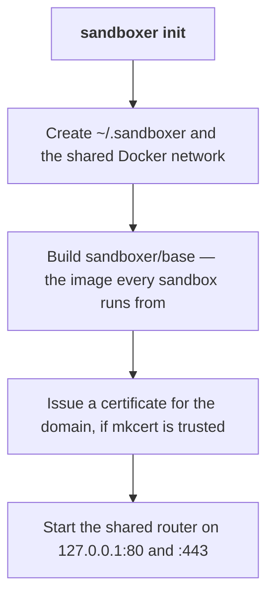

Two things happen on this page. You get the `sandboxer` command, and then you run `sandboxer init`
once to set the machine up. After that the machine is ready for any project.

Setting up takes about ten minutes. Almost all of it is Docker building one image.

```prompt
Install sandboxer on this machine and set it up.

Read docs/getting-started/install.md and follow it. Install from the repository checkout with
`npm link` — there is no published npm package. Then run `sandboxer init` and finish by running
`sandboxer doctor` and reporting every line of its output to me.

Stop and ask me if:
- Docker is not running, or has under 8 GB of memory available to it.
- `mkcert` is not installed, or its root certificate is not trusted. Do not run `mkcert -install`
  yourself; it needs my password.
- Port 80 or port 443 is already taken on this machine.
```

## What has to be installed

| | Why you need it | How to check |
|---|---|---|
| **Docker** | A sandbox is a container. Docker Desktop, OrbStack and Colima all work | `docker info` |
| **Node 22 or newer** | sandboxer itself is TypeScript | `node --version` |
| **git** | Sandboxes are built from git worktrees, and their names come from branches | `git --version` |
| **mkcert** *(optional)* | Gets you HTTPS instead of HTTP. Everything works without it | `mkcert -version` |

Give Docker at least **8 GB of memory** and **40 GB of disk**. Below that you will spend your
time having things killed for memory, and the thing the kernel picks to kill may not be the
sandbox. [Giving Docker the whole machine](../guides/docker-capacity.md) has the real numbers and
how to change them.

## Get the `sandboxer` command

**There is no published npm package.** You install from a checkout of the repository.

```bash
git clone https://github.com/mattmoran56/sandboxer-core
cd sandboxer-core
npm install
npm run build
npm link --workspace @sandboxer/cli
```

`sandboxer version` should now answer.

The checkout is not just a build step. sandboxer reads the Dockerfiles and the in-container scripts
out of that directory every time it builds an image, so the checkout has to stay where it is.

<details class="why">
<summary><b>Why it works this way</b> — the tool needs its own <code>container/</code> directory at run time</summary>

`sandboxer init` and `sandboxer up` both build images from `container/`, which ships in the
repository rather than inside the published JavaScript. The tool finds it by walking up from its
own module until it sees `container/base/Dockerfile` and `packages/core/package.json` side by
side.

So a copy of `dist/` on its own cannot build anything. If you move the installation, or package
it, set `SANDBOXER_INSTALL` to the directory that holds `container/` and `packages/`. Without it
you get:

```
cannot find the sandboxer installation (no container/ beside packages/) — set SANDBOXER_INSTALL
```

</details>

## Set the machine up

```bash
sandboxer init
```

That one command is the whole of machine setup. It is **idempotent** — running it again is how you
change the domain, move the router's ports, or pick up HTTPS after installing mkcert.



> [!NOTE] `sandboxer init` prepares the bare domain and does not fill it
> It says so when it finishes: nothing is serving `https://<your domain>`, because `sandboxer` is a
> command-line tool. Your sandboxes are reachable on their own hostnames either way. Putting your
> own control plane on that domain is contracts §7.2.

### Why the first run is slow

The [base image](../reference/glossary.md) is the long part. It is a Debian image carrying the
supervisor that runs a sandbox's services, the Caddy web server that answers inside it, MinIO for
object storage, `jq`, `git` and the GitHub CLI. Measured on arm64 it comes to around 580 MB.

It carries **no agent**, and that is a boundary rather than an omission: sandboxer runs a project
and has no opinion about who edits the worktree. A product that wants one in every sandbox builds
its own image `FROM` this one and hands the tag to `up`. A sandbox started by `sandboxer up` gets
the agent-free base.

It is built once. Nothing rebuilds it unless you pass `--rebuild` or something it is built from
changes. Every sandbox on the machine then starts from it.

A control plane you put on the bare domain needs a Docker client, and the base image deliberately
has none. That separation is what stops a project — or an agent working inside a sandbox — driving
Docker, and it is why such an image is built somewhere other than here.

### What it prints

```
  ok Ready on sbx.localhost

  sandboxes   https://<slug>.<label>.<project>.sbx.localhost
  bare domain https://sbx.localhost — free, for a control plane on port 8080

  Any name under sbx.localhost resolves to 127.0.0.1 on its own. Nothing to configure.

  ! Nothing is serving https://sbx.localhost — sandboxer is a command-line tool.

  Next: cd into a project with a sandboxer.yaml and run `sandboxer up`.
```

Anything that would work better after one more command is printed as a warning underneath, with
the command in it.

### There is no DNS step

The default domain is `sbx.localhost`. Every current browser, and macOS's own resolver, answer any
name ending in `.localhost` with the loopback address by themselves. No resolver file, no
`/etc/hosts` line, no `sudo`.

Change it with `SANDBOXER_DOMAIN` if you need to. A domain that does not end in `.localhost` is
your own DNS problem.

### HTTP or HTTPS

`init` serves HTTPS only when a certificate authority the machine **already trusts** is present.
Installing one needs an administrator password, so it is never done for you.

| What it finds | What you get | How to upgrade |
|---|---|---|
| mkcert not installed | Plain HTTP, and a note saying so | `brew install mkcert`, then `sandboxer init` again |
| mkcert installed, root not trusted | Plain HTTP, and a note saying so | `mkcert -install`, then `sandboxer init` again |
| mkcert's root trusted | HTTPS, with an HTTP redirect in front | — |

Everything works over HTTP. HTTPS matters if your project's own code cares about the scheme, or if
you need a browser feature that only works in a secure context.

`--tls` insists on HTTPS even when the root is untrusted. `--no-tls` forces plain HTTP.

> [!NOTE] The scheme is read back from what init wrote, not from what is installed
> Every URL sandboxer prints is built from the router's own state. Install mkcert after your last
> `init` and the URLs stay `http://` until you run `init` again — deliberately, because a URL
> printed for a scheme nothing is listening on sends you to a connection refused.

### Ports

The router publishes on `127.0.0.1:80` and `127.0.0.1:443`. If something else already holds those:

```bash
sandboxer init --http-port 8080 --https-port 8443
```

The port travels into every URL sandboxer prints, and into the variables a sandbox exports about
its own addresses, so nothing has to be told twice.

`--bind ADDR` publishes somewhere other than loopback. Read [Access and security](../access.md)
first: binding beyond `127.0.0.1` is what turns "public to this machine's browsers" into
"public".

## Check it

```bash
sandboxer doctor
```

`doctor` walks the lot. Whether Docker is running. Whether the base image is built. Whether the
router is up, and which scheme is being served. Whether anything is serving the bare domain.
Whether a config resolves in the current directory, and whether any credential it asks for is
missing. Everything it finds, it names the fix for.

## Undoing it

```bash
sandboxer teardown            # stop the router and whatever is on the bare domain
sandboxer teardown --network  # ...and remove the shared network too
```

Teardown deliberately leaves sandboxes running. Those are `sandboxer down`'s business.

<details class="agent">
<summary><b>Details for an agent</b> — every <code>init</code> flag, every variable, every path it writes</summary>

**Flags on `sandboxer init`**

| Flag | Effect |
|---|---|
| `--no-tls` | Serve plain http even if a trusted CA is present |
| `--tls` | Insist on https even if the CA is not trusted yet |
| `--rebuild` | Rebuild the base image even if a current tag exists |
| `--bind ADDR` | Publish the router on this address instead of `127.0.0.1` |
| `--http-port N` | Publish http on N instead of 80 |
| `--https-port N` | Publish https on N instead of 443 |
| `--json` | Put the report on stdout as JSON |

**Flags on `sandboxer teardown`**: `--network` also removes the shared Docker network. It is
refused while a sandbox is still attached to it.

**Variables `init` reads**

| Variable | Default | Meaning |
|---|---|---|
| `SANDBOXER_DOMAIN` | `sbx.localhost` | The domain everything is served under |
| `SANDBOXER_HTTP_PORT` | `80` | Same as `--http-port` |
| `SANDBOXER_HTTPS_PORT` | `443` | Same as `--https-port` |
| `SANDBOXER_HOME` | `~/.sandboxer` | Where this machine's state goes |
| `SANDBOXER_WORKSPACE` | `~/.sandboxer/workspace` | Where managed project mirrors go |
| `SANDBOXER_INSTALL` | found by walking up | The directory holding `container/` and `packages/` |

The full list is in [Environment variables](../reference/environment.md).

**What `init` creates**

- Directories under `~/.sandboxer`: `cache`, `logs`, `tls`, `state`, `secrets`, `build`, `bin`,
  `workspace`.
- `~/.sandboxer/config.yaml`, written once, commented and explained. It is where you set how long
  a sandbox may sit unused. Never rewritten after the first time.
- The shared Docker network, named `sandboxer`.
- The image `sandboxer/base:<tool version>`, also tagged `:latest`, and protected from
  `sandboxer prune`.
- A certificate for the domain and one wildcard under it, in `~/.sandboxer/tls`, when mkcert's root
  is trusted. That is the only certificate on the machine: a sandbox hostname is one label deep, so
  the wildcard covers every sandbox as well as the bare domain, and starting a sandbox issues
  nothing.
- The container `sandboxer-router`.

**Timeouts**: the base image build is allowed 30 minutes.

</details>

<details class="failure">
<summary><b>If it goes wrong</b> — the two failures specific to setting up</summary>

**`Docker is not running. Start it and try again.`** — `init` checks the daemon before it does
anything, so nothing is half-created. Start Docker and run it again.

**Port 80 or 443 is already taken.** The router will fail to publish. Pick other ports with
`--http-port` and `--https-port` and run `init` again; every URL sandboxer prints picks the new
ports up automatically.

Everything else, by symptom, is in [Troubleshooting](../troubleshooting.md).

</details>

**Next:** [Your first sandbox](first-sandbox.md) — a worktree, a URL, and throwing it away again.
If you want to prove the machine works before you involve your own project, jump to
[Run the demo project](demo-project.md).
