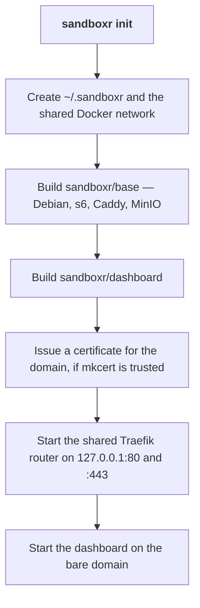

## What has to be installed

| | Why | Check |
|---|---|---|
| **Docker** | A sandbox is a container. Docker Desktop, OrbStack or Colima all work | `docker info` |
| **Node 22 or newer** | sandboxr itself is TypeScript | `node --version` |
| **git** | Slugs come from worktrees and branches | `git --version` |
| **mkcert** *(optional)* | HTTPS instead of HTTP. Without it everything still works, over `http://` | `mkcert -version` |

Give Docker at least **8 GB** of memory and **40 GB** of disk. Below 8 GB you will spend your
time having things killed for memory, and the process the kernel picks may not be the sandbox.

## Get the `sandboxr` command

```bash
git clone https://github.com/mattmoran56/sandboxr
cd sandboxr
npm install
npm run build
npm link --workspace @sandboxr/cli
```

`sandboxr version` should now answer.

## Set the machine up

```bash
export SANDBOXR_PASSWORD='something long and random'
sandboxr init
```

That one command is the whole of machine setup. It is idempotent, so it is also how you change
the domain, rotate the password, or pick up HTTPS after installing mkcert.



Building the base image takes a few minutes the first time and produces about 400 MB. Nothing
after that rebuilds it unless you pass `--rebuild`.

When it finishes it prints where things are:

```
✓ Ready on sbx.localhost

  dashboard   https://sbx.localhost
  sandboxes   https://<slug>.<label>.<project>.sbx.localhost

  Any name under sbx.localhost resolves to 127.0.0.1 on its own. Nothing to configure.
```

### Why there is no DNS step

The default domain is `sbx.localhost`. Every current browser, and macOS's own resolver, answer
any name under `.localhost` with the loopback address by themselves. No resolver file, no
`/etc/hosts` line, no `sudo`.

### HTTP or HTTPS

`init` serves HTTPS only when a certificate authority the machine already trusts is present,
because installing one is the single step that needs an administrator password — so it is never
done implicitly.

| State | What you get | To change it |
|---|---|---|
| mkcert not installed | Plain HTTP, and a note saying so | `brew install mkcert`, then `sandboxr init` again |
| mkcert installed, root not trusted | Plain HTTP, and a note saying so | `mkcert -install`, then `sandboxr init` again |
| mkcert's root trusted | HTTPS, with an HTTP redirect in front | — |

Everything works over HTTP. HTTPS matters if the project's own code cares about the scheme, or
if a browser feature you need is secure-context only.

`--tls` insists on HTTPS even when the root is untrusted; `--no-tls` forces plain HTTP.

### Ports

The router publishes on `127.0.0.1:80` and `127.0.0.1:443`. If something else on your machine
already holds those:

```bash
sandboxr init --http-port 8080 --https-port 8443
```

The port travels into every URL sandboxr prints and into the sandbox's own
`SANDBOXR_URL_<LABEL>` variables, so nothing has to be told about it twice.

`--bind ADDR` publishes somewhere other than loopback. Read
[access and security](../access.md) before you do that: binding beyond `127.0.0.1` is what turns
"public to this machine's browsers" into "public".

### The password

`SANDBOXR_PASSWORD` is what the dashboard admits you with. Without one, `init` still succeeds and
the dashboard still starts — it just admits nobody. There is no way to turn the password off.

Per-project passwords are also possible: `SANDBOXR_PASSWORD_ACME` grants access to the `acme`
project only. See [access and security](../access.md).

## Check it

```bash
sandboxr doctor
```

`doctor` reports on all of it: whether Docker is running, whether the base image exists, whether
the router and dashboard are up, whether the scheme is HTTP or HTTPS and why, whether a password
is set, whether a config resolves here, and how many sandboxes exist. Anything it finds, it names
the fix for.

## Undoing it

```bash
sandboxr teardown            # stop the router and the dashboard
sandboxr teardown --network  # ...and remove the shared network
```

Teardown deliberately leaves sandboxes running. Those are `sandboxr down`'s business.

**Next:** [your first sandbox](first-sandbox.md).
