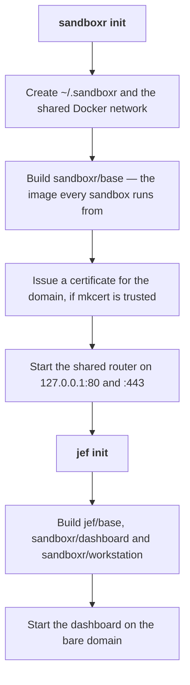

Two things happen on this page. You get the `sandboxr` command, and then you run `sandboxr init`
once to set the machine up. After that the machine is ready for any project.

Setting up takes about ten minutes. Almost all of it is Docker building one image.

```prompt
Install sandboxr on this machine and set it up.

Read docs/getting-started/install.md and follow it. Install from the repository checkout with
`npm link` — there is no published npm package. Then run `sandboxr init` and finish by running
`sandboxr doctor` and reporting every line of its output to me.

Stop and ask me if:
- Docker is not running, or has under 8 GB of memory available to it.
- `mkcert` is not installed, or its root certificate is not trusted. Do not run `mkcert -install`
  yourself; it needs my password.
- Port 80 or port 443 is already taken on this machine.
- You do not have a value for SANDBOXR_PASSWORD.
```

## What has to be installed

| | Why you need it | How to check |
|---|---|---|
| **Docker** | A sandbox is a container. Docker Desktop, OrbStack and Colima all work | `docker info` |
| **Node 22 or newer** | sandboxr itself is TypeScript | `node --version` |
| **git** | Sandboxes are built from git worktrees, and their names come from branches | `git --version` |
| **mkcert** *(optional)* | Gets you HTTPS instead of HTTP. Everything works without it | `mkcert -version` |

Give Docker at least **8 GB of memory** and **40 GB of disk**. Below that you will spend your
time having things killed for memory, and the thing the kernel picks to kill may not be the
sandbox. [Giving Docker the whole machine](../guides/docker-capacity.md) has the real numbers and
how to change them.

## Get the `sandboxr` command

**There is no published npm package.** You install from a checkout of the repository.

```bash
git clone https://github.com/mattmoran56/sandboxr
cd sandboxr
npm install
npm run build
npm link --workspace @sandboxr/cli
```

`sandboxr version` should now answer.

The checkout is not just a build step. sandboxr reads the Dockerfiles and the in-container scripts
out of that directory every time it builds an image, so the checkout has to stay where it is.

<details class="why">
<summary><b>Why it works this way</b> — the tool needs its own <code>container/</code> directory at run time</summary>

`sandboxr init` and `sandboxr up` both build images from `container/`, which ships in the
repository rather than inside the published JavaScript. The tool finds it by walking up from its
own module until it sees `container/base/Dockerfile` and `packages/server/package.json` side by
side.

So a copy of `dist/` on its own cannot build anything. If you move the installation, or package
it, set `SANDBOXR_INSTALL` to the directory that holds `container/` and `packages/`. Without it
you get:

```
cannot find the sandboxr installation (no container/ beside packages/) — set SANDBOXR_INSTALL
```

The same directory is where the dashboard's own build is read from, which is why a root
`npm run build` is the safe way to build: the dashboard's server serves the browser app's
`dist/`, and building one package alone can leave that missing.

</details>

## Set the machine up

```bash
export SANDBOXR_PASSWORD='something long and random'
sandboxr init
```

That one command is the whole of machine setup. It is **idempotent** — running it again is how you
change the domain, rotate the password, or pick up HTTPS after installing mkcert.



> [!NOTE] `sandboxr init` prepares the bare domain and does not fill it
> It says so when it finishes: nothing is serving `https://<your domain>`, because `sandboxr` is a
> command-line tool. Your sandboxes are reachable on their own hostnames either way. `jef init`
> is the command that builds and starts a dashboard there — see
> [the dashboard](../guides/dashboard.md).

### Why the first run is slow

The [base image](../reference/glossary.md) is the long part. It is a Debian image carrying the
supervisor that runs a sandbox's services, the Caddy web server that answers inside it, MinIO for
object storage, `jq`, `git` and the GitHub CLI. Measured on arm64 it comes to around 580 MB.

It carries **no agent**. `claude` lives one layer above, in `container/jef-base/Dockerfile`, which
adds about 234 MB and nothing else — sandboxr runs a project and has no opinion about who edits the
worktree; Jef is the thing that puts an agent in there. `jef init` below builds that layer as
`jef/base`, and every sandbox Jef starts is built on it, so a sandbox has `claude` in it. A sandbox
started by the engine's own `sandboxr up` does not, which is the same boundary seen from the other
side.

It is built once. Nothing rebuilds it unless you pass `--rebuild` or something it is built from
changes. Every sandbox on the machine then starts from it.

The dashboard image is `jef init`'s, and it is built separately on purpose: it carries a Docker
client and the base image deliberately does not. That is what stops a project — or an agent
working inside a sandbox — driving Docker.

The workstation image is the container a [session's](../guides/dashboard.md) agent runs in — around
640 MB, most of it `claude`. That copy is the workstation's own and has nothing to do with the agent
layer above the base: here the agent runs beside the sandbox rather than inside it. `jef init` builds
it too, rather than leaving it to the first time somebody makes a session, because a session is the
ordinary way to start work: left where it was, the build landed on whoever pressed **New session**
first, as several silent minutes inside a request with nowhere to show progress.

### What it prints

```
  ok Ready on sbx.localhost

  sandboxes   https://<slug>.<label>.<project>.sbx.localhost
  bare domain https://sbx.localhost — free, for a control plane on port 8080

  Any name under sbx.localhost resolves to 127.0.0.1 on its own. Nothing to configure.

  ! Nothing is serving https://sbx.localhost — sandboxr is a command-line tool.

  Next: cd into a project with a sandboxr.yaml and run `sandboxr up`.
```

Anything that would work better after one more command is printed as a warning underneath, with
the command in it.

### There is no DNS step

The default domain is `sbx.localhost`. Every current browser, and macOS's own resolver, answer any
name ending in `.localhost` with the loopback address by themselves. No resolver file, no
`/etc/hosts` line, no `sudo`.

Change it with `SANDBOXR_DOMAIN` if you need to. A domain that does not end in `.localhost` is
your own DNS problem.

### HTTP or HTTPS

`init` serves HTTPS only when a certificate authority the machine **already trusts** is present.
Installing one needs an administrator password, so it is never done for you.

| What it finds | What you get | How to upgrade |
|---|---|---|
| mkcert not installed | Plain HTTP, and a note saying so | `brew install mkcert`, then `sandboxr init` again |
| mkcert installed, root not trusted | Plain HTTP, and a note saying so | `mkcert -install`, then `sandboxr init` again |
| mkcert's root trusted | HTTPS, with an HTTP redirect in front | — |

Everything works over HTTP. HTTPS matters if your project's own code cares about the scheme, or if
you need a browser feature that only works in a secure context.

`--tls` insists on HTTPS even when the root is untrusted. `--no-tls` forces plain HTTP.

> [!NOTE] The scheme is read back from what init wrote, not from what is installed
> Every URL sandboxr prints is built from the router's own state. Install mkcert after your last
> `init` and the URLs stay `http://` until you run `init` again — deliberately, because a URL
> printed for a scheme nothing is listening on sends you to a connection refused.

### Ports

The router publishes on `127.0.0.1:80` and `127.0.0.1:443`. If something else already holds those:

```bash
sandboxr init --http-port 8080 --https-port 8443
```

The port travels into every URL sandboxr prints, and into the variables a sandbox exports about
its own addresses, so nothing has to be told twice.

`--bind ADDR` publishes somewhere other than loopback. Read [Access and security](../access.md)
first: binding beyond `127.0.0.1` is what turns "public to this machine's browsers" into
"public".

### The password

`SANDBOXR_PASSWORD` is what the dashboard admits you with. Without one, `init` still succeeds and
the dashboard still starts — it just admits nobody, and says so.

**The password cannot be turned off.** The dashboard holds the Docker socket, so everything it can
do is behind it. Per-project passwords work too: `SANDBOXR_PASSWORD_ACME` grants the `acme`
project and nothing else. [Access and security](../access.md) is the whole picture.

## Check it

```bash
sandboxr doctor
```

`doctor` walks the lot. Whether Docker is running. Whether the base image is built. Whether the
router and the dashboard are up, and which scheme is being served. Whether a password is set.
Whether a config resolves in the current directory, and whether any credential it asks for is
missing. Everything it finds, it names the fix for.

## Undoing it

```bash
sandboxr teardown            # stop the router and the dashboard
sandboxr teardown --network  # ...and remove the shared network too
```

Teardown deliberately leaves sandboxes running. Those are `sandboxr down`'s business.

<details class="agent">
<summary><b>Details for an agent</b> — every <code>init</code> flag, every variable, every path it writes</summary>

**Flags on `sandboxr init`**

| Flag | Effect |
|---|---|
| `--no-tls` | Serve plain http even if a trusted CA is present |
| `--tls` | Insist on https even if the CA is not trusted yet |
| `--rebuild` | Rebuild the base, dashboard and workstation images even if a current tag exists |
| `--bind ADDR` | Publish the router on this address instead of `127.0.0.1` |
| `--http-port N` | Publish http on N instead of 80 |
| `--https-port N` | Publish https on N instead of 443 |
| `--json` | Put the report on stdout as JSON |

**Flags on `sandboxr teardown`**: `--network` also removes the shared Docker network. It is
refused while a sandbox is still attached to it.

**Variables `init` reads**

| Variable | Default | Meaning |
|---|---|---|
| `SANDBOXR_PASSWORD` | none | The dashboard's password. Absent means the dashboard admits nobody |
| `SANDBOXR_PASSWORD_<PROJECT>` | none | A password scoped to one project. `<PROJECT>` upper-cased, `_` for `-` |
| `SANDBOXR_DOMAIN` | `sbx.localhost` | The domain everything is served under |
| `SANDBOXR_HTTP_PORT` | `80` | Same as `--http-port` |
| `SANDBOXR_HTTPS_PORT` | `443` | Same as `--https-port` |
| `SANDBOXR_HOME` | `~/.sandboxr` | Where this machine's state goes |
| `SANDBOXR_WORKSPACE` | `~/.sandboxr/workspace` | Where managed project mirrors go |
| `SANDBOXR_INSTALL` | found by walking up | The directory holding `container/` and `packages/` |

The full list is in [Environment variables](../reference/environment.md).

**What `init` creates**

- Directories under `~/.sandboxr`: `cache`, `logs`, `tls`, `state`, `secrets`, `build`, `bin`,
  `workspace`.
- `~/.sandboxr/config.yaml`, written once, commented and explained. It is where you set how long
  a sandbox may sit unused. Never rewritten after the first time.
- The shared Docker network, named `sandboxr`.
- Images `sandboxr/base:<tool version>`, `sandboxr/dashboard:<tool version>` and
  `sandboxr/workstation:<tool version>`, each also tagged `:latest`. All three are protected from
  `sandboxr prune`. The workstation image is what a session's agent runs in; building it here is
  what makes creating a session fast, and `createSession` still builds one if the tag is missing —
  which it is after an upgrade, since the tag carries the tool version.
- A certificate for the domain and one wildcard under it, in `~/.sandboxr/tls`, when mkcert's root
  is trusted. That is the only certificate on the machine: a sandbox hostname is one label deep, so
  the wildcard covers every sandbox as well as the dashboard, and starting a sandbox issues
  nothing.
- Containers `sandboxr-router` and `sandboxr-dashboard`.

**Timeouts**: the base image build is allowed 30 minutes, the dashboard image 10, the workstation
image 20.

</details>

<details class="failure">
<summary><b>If it goes wrong</b> — the three failures specific to setting up</summary>

**`Docker is not running. Start it and try again.`** — `init` checks the daemon before it does
anything, so nothing is half-created. Start Docker and run it again.

**`init` succeeds but the dashboard will not admit you.** Look for the warning in its output:
`No SANDBOXR_PASSWORD is set, so the dashboard will admit nobody.` Export one and run `init`
again. The variable has to be set in the shell `init` runs in, not just in the shell you browse
from.

**Port 80 or 443 is already taken.** The router will fail to publish. Pick other ports with
`--http-port` and `--https-port` and run `init` again; every URL sandboxr prints picks the new
ports up automatically.

Everything else, by symptom, is in [Troubleshooting](../troubleshooting.md).

</details>

**Next:** [Your first sandbox](first-sandbox.md) — a worktree, a URL, and throwing it away again.
If you want to prove the machine works before you involve your own project, jump to
[Run the demo project](demo-project.md).
