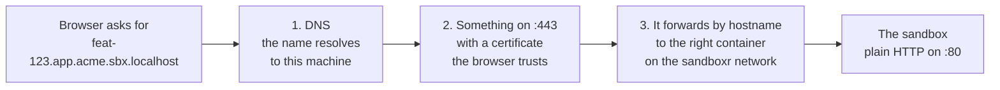

> **Written, never run** — `sandboxr doctor` and everything under `~/.sandboxr` are real code; no command installs DNS, a certificate or a router, and the manual instructions on this page have not been run end to end.

> [!WARNING] There is no setup command
> Older drafts of this page told you to run `sandboxr init`. **That command does not exist**, and
> nothing in `packages/cli` replaces it. Setting a machine up is manual today, and this page is
> the manual.
>
> You can start and use a sandbox without doing any of it. What you cannot do without it is open
> one in a browser.

## What has to be true for a hostname to work

A sandbox is meant to answer at a name like `feat-123.app.acme.sbx.localhost`. Three separate things
have to be in place before a browser can open that, and they are three genuinely different
jobs.



*The three things between a browser and a sandbox. sandboxr installs none of them today.*


1. **The name has to resolve to the machine.** There are dozens of these names and they change
   as branches come and go, so you resolve the whole suffix at once rather than listing names
   one by one.
2. **Something has to be listening on port 443 with a certificate the browser trusts.** The
   apps are served over HTTPS because a browser treats a plain-HTTP origin differently in ways
   that will waste your afternoon: secure cookies get dropped, service workers do not register,
   and some login providers refuse a plain-HTTP redirect address outright.
3. **That something has to forward each request to the right container.** This is the piece
   called **the router**, and it is the one that does not exist.

<details>
<summary><b>Details for an agent:</b> what a sandbox container actually exposes, and how a proxy is expected to reach it</summary>

- `docker run` is given **no `-p` flags at all**. A sandbox publishes nothing to the host, so
  there is no port on `localhost` to point a browser at.
- Every sandbox joins one shared Docker network called `sandboxr`, created on demand by
  `docker.ensureNetwork(NETWORK)` in `packages/core/src/sandbox/index.ts`.
- On that network the container answers to its own name: `sandboxr-<project>-<slug>`. For the
  worked example, `sandboxr-acme-feat-123`.
- Inside, it speaks **plain HTTP on port 80**. TLS is expected to terminate at the router in
  front of it, so the container's own router only has to split by hostname
  (`container/scripts/gen-caddyfile.sh`).
- Every sandbox answers `GET /__sandboxr/live` with `200 ok` on **any** hostname, and serves
  `GET /__sandboxr/status.json`. Those are the two things worth curling first, because they
  answer while the database is still loading.
- Each container carries the label `sandboxr.router=true`, so a router can discover the set of
  sandboxes from Docker rather than from a config file.

</details>

## What works today with none of that

Quite a lot, in fact. Everything except opening a URL.

```bash
sandboxr up                  # start a sandbox
sandboxr ls                  # every sandbox on the machine
sandboxr status feat-123     # one in detail, including which services are up
sandboxr logs feat-123 -f    # follow its log stream
sandboxr shell feat-123      # a shell inside it
sandboxr db shell feat-123   # an interactive database shell
sandboxr down feat-123       # throw it away
```

To reach a service in a browser-shaped way without a router, ask the container from inside it:

```bash
sandboxr shell feat-123 -- curl -sS -H 'Host: feat-123.app.acme.sbx.localhost' localhost/
```

Anything after `--` runs instead of a login shell, so this works from a script too. The `Host`
header matters: the container's internal router splits on it, and a request without one gets
the catch-all.

<details>
<summary><b>If it goes wrong:</b> the two answers a sandbox gives that look like errors and are not</summary>

| Answer | What it means |
|---|---|
| **503** with a page naming a command | That front-end has not been built. Front-ends are built on demand, never at startup. Run the command the page names. |
| **502** | The service exists and is not up yet. A 502 is a truthful answer — *I am here, that one is not*. A refused connection would not be. |

A **404** is different: it means no app in the plan claims that hostname, and the body names
the host it was asked for.

</details>

## Making the three things true, by hand

#### Laptop

1. **Resolve the whole suffix locally.**

   `sbx.localhost` is deliberately not a real top-level domain, so nothing you do here can shadow a
   name you actually need.

   On macOS, one file makes every name under one suffix go to a resolver of your choice. This
   is the one `sudo` the setup needs:

   ```bash
   sudo mkdir -p /etc/resolver
   echo "nameserver 127.0.0.1" | sudo tee /etc/resolver/sbx.localhost
   ```

   That points the suffix at a DNS server on your own machine, which you then have to be
   running — `dnsmasq` from Homebrew is the usual choice, configured to answer every
   `*.sbx.localhost` with `127.0.0.1`.

   Check it with `dscacheutil`, not `ping`:

   ```bash
   dscacheutil -q host -a name feat-123.app.acme.sbx.localhost
   ```

   **`ping` is the wrong test on macOS.** It does not use the `/etc/resolver` mechanism at
   all, so a name that resolves perfectly well in a browser can still fail to ping. Use
   `dscacheutil`, or just open the URL.

2. **Make a certificate your browser trusts.**

   You need one certificate covering the whole suffix, signed by an authority your own machine
   has been told to trust. [`mkcert`](https://github.com/FiloSottile/mkcert) is the least
   painful way to do both:

   ```bash
   mkcert -install
   mkdir -p ~/.sandboxr/tls
   mkcert -cert-file ~/.sandboxr/tls/cert.pem \
          -key-file  ~/.sandboxr/tls/key.pem \
          '*.acme.sbx.localhost' '*.app.acme.sbx.localhost' 'sbx.localhost'
   ```

   `~/.sandboxr/tls/` is where sandboxr's own paths module expects the certificate and key to
   live, so putting them there now means a future setup command finds them already in place.

   **A local certificate authority is a real privilege, so treat it like one.**
   `mkcert -install` adds an authority to your system trust store, and anything signed by it
   will be trusted for *any* name on that machine. Keep the key where it is, mode `0600`, and
   never copy it to a machine anyone else uses. A shared server uses real certificates
   instead.

   Remember the hostname shape is `<slug>.<label>.<project>.<domain>` — four labels deep. A
   certificate wildcard covers exactly one label, so `*.acme.sbx.localhost` does **not** cover
   `feat-123.app.acme.sbx.localhost`. You need one wildcard per app label, or a certificate listing
   the names you actually use.

3. **Run a reverse proxy on the `sandboxr` network.**

   This is the part sandboxr does not do for you. The shape is: a proxy container joined to the
   `sandboxr` Docker network, holding port 443 and the certificate from step 2, forwarding each
   hostname to a sandbox by container name.

   One block per sandbox is the simplest thing that definitely works. A `Caddyfile`:

   ```
   feat-123.app.acme.sbx.localhost,
   feat-123.api.acme.sbx.localhost,
   feat-123.admin.acme.sbx.localhost {
     tls /tls/cert.pem /tls/key.pem
     reverse_proxy sandboxr-acme-feat-123:80
   }
   ```

   All of a sandbox's hostnames go to the same container, because the router inside it already
   splits by hostname. That is why one rule per *sandbox* is enough, and one rule per app would
   be duplicated work.

   ```bash
   docker run -d --name my-sandbox-proxy \
     --network sandboxr \
     -p 443:443 \
     -v "$HOME/.sandboxr/tls:/tls:ro" \
     -v "$PWD/Caddyfile:/etc/caddy/Caddyfile:ro" \
     caddy:2-alpine
   ```

   This is yours, not sandboxr's. You add a block when you start a sandbox and remove it when
   you stop one, and nothing reconciles it for you. That reconciliation is precisely the job
   the real router is meant to do.

4. **Set the control password.**

   ```bash
   export SANDBOXR_PASSWORD='a long random string'
   ```

   Put it in your shell profile so it survives a reboot. This protects the dashboard, the
   terminal, and every button that starts or stops something. On a laptop the threat is smaller
   than on a server, but the requirement is identical because the mechanism is identical:
   [the two tiers](../security/two-tiers.md).

5. **Check what can be checked.**

   ```bash
   sandboxr doctor
   ```

   It will tell you whether Docker is running, whether your project's `sandboxr.yaml` resolves,
   and whether the credentials the config asks for are present. It will **not** tell you
   whether steps 1 to 3 worked, because it does not know about them yet.
   [What it checks, exactly](./prerequisites.md).

#### Shared server

> [!WARNING] Remote deployment is planned, not built
> Nothing in this repository sets up wildcard DNS, requests a certificate, or installs a service
> that starts at boot. This tab is the shape the design commits to, so you can plan around it —
> not a set of steps that have been run. [What is built](../reference/status.md).

A server changes three things: DNS is real, certificates are real, and the machine can be
reached by people who are not you. That last one is why
[access and security](../security/two-tiers.md) is not optional reading.

1. **Wildcard DNS, one record per project.**

   Sandbox hostnames are four labels deep, and a DNS wildcard covers one label. So
   `*.sbx.example.com` matches `app.sbx.example.com` but **not**
   `feat-123.app.sbx.example.com`. Most providers do not support multi-level wildcards, so the
   practical answer is a record per project:

   ```
   *.acme.sbx.example.com.           A   203.0.113.10
   *.worker-thing.sbx.example.com.   A   203.0.113.10
   sbx.example.com.                  A   203.0.113.10
   ```

   The bare `sbx.example.com` record is the dashboard, which never lives on a per-sandbox
   hostname.

   Adding a record per project is a small cost, and it has the useful side effect of making the
   set of projects on a host explicit.

2. **Real certificates, by DNS challenge.**

   Use ACME with a **DNS-01** challenge, not HTTP-01. HTTP-01 cannot issue a wildcard, and you
   need wildcards — one per project, plus the bare domain. That means giving whatever runs the
   challenge an API credential for your DNS provider, scoped to that one zone and nothing else.

   Do not reuse the local authority from the laptop tab. It works only because your own machine
   was told to trust it.

3. **A strong password, stored properly.**

   ```bash
   export SANDBOXR_PASSWORD="$(openssl rand -base64 32)"
   ```

   Put it in whatever secret manager the machine already uses. It is compared timing-safely and
   stored as a hash and never logged — but a password in a shell history file is still a
   password in a shell history file.

4. **Firewall: 80 and 443, nothing else.**

   Sandbox containers publish no host ports, so there is nothing else to open. The Docker
   socket must never be exposed over TCP; the dashboard reaches it over a mounted Unix socket.

5. **Load the database from a dump, not from a live copy.**

   Copying a running database container is a laptop technique. On a server there is no such
   container, and pointing one at a production database would be exactly the mistake the driver
   design exists to prevent. Use a file, and mark it anonymised if the apps are public:

   ```yaml
   database:
     seed_from:
       file: /var/sandboxr/seeds/acme.sql.zst
       anonymised: true
   ```

6. **Read [public sandboxes](../security/public-sandboxes.md) before you point the DNS record at
   the machine.** Two of its requirements are enforced as refusals, and understanding why takes
   two minutes now instead of an incident later.

## What a setup command would do

Recording this because it is the gap, and because a future `sandboxr init` should not have to
be re-derived from scratch.

| Step | What it would install | Automatable? |
|---|---|---|
| Local DNS | The resolver file for the suffix, and a resolver that answers for it | Yes, with one `sudo`. Print the command when it cannot elevate. |
| Certificate | A local authority, trusted, plus one wildcard per app label into `~/.sandboxr/tls/` | Yes on a laptop. A server needs ACME with a DNS-01 challenge and a provider credential. |
| The router | One container on the `sandboxr` network, holding 443 and the certificate, reconciling its rules from the `sandboxr.router=true` label as sandboxes come and go | Yes, and it is the piece that most needs to be code rather than a page of instructions. |
| The dashboard | One container on the bare domain, behind `SANDBOXR_PASSWORD` | Yes. |
| Verification | Extending `doctor` to check the resolver answers, the certificate is present and unexpired, and the router is up on the shared network | Yes, and this is what turns "it does not work" into a diagnosis. |

Until that exists, the honest summary is: **sandboxr starts and manages containers; getting a
browser to them is your job.**

## Where the files go

Everything sandboxr writes lives under `SANDBOXR_HOME`, default `~/.sandboxr` — deliberately
outside every repository, so that `git clean -xdf` cannot destroy your database cache or your
certificate. The full table of paths, on the host and inside a container, is
[where everything lives](../orientation/where-things-live.md).

Next: [your first sandbox](./first-sandbox.md).
