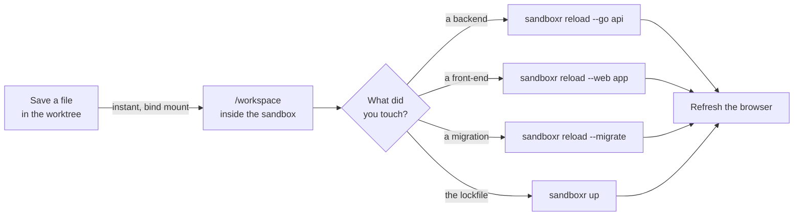

> **Written, never run** — `sandboxr reload` exists in packages/core and has unit tests, and its argument parsing was run for this page; no backend or front-end has ever been built inside a real sandbox, and the timings are measurements of the internal tool sandboxr generalises, on a different project.

## Your changes are already inside

Your worktree is **bind-mounted** into the sandbox — the same directory, visible in two places
at once, not a copy. Save a file on your machine and it is inside the container in that
instant. There is no push, no sync, no copy step, and nothing to remember.

It works the other way too. Anything editing inside the container — you in `sandboxr shell`, or
a coding agent — writes into your worktree, so its changes turn up in `git status` and you
commit them normally. That is the whole basis of [agents in a sandbox](./agents-in-a-sandbox.md).

What a bind mount does *not* do is rebuild anything. A compiled backend is a binary; a bundled
web app is a directory of files with hashed names. Applying a change means rebuilding the one
thing you touched, and that is what `sandboxr reload` is for.



*The loop. The mount is instant; the rebuild is the only cost.*


## The three things reload can do

```bash
sandboxr reload --go api       # rebuild one backend, then restart it
sandboxr reload --go           # every backend the config declares
sandboxr reload --web app      # rebuild one front-end, by its label
sandboxr reload --web all      # the project's main front-ends
sandboxr reload --web built    # everything this sandbox has already built
sandboxr reload --migrate      # re-run this sandbox's migrations
```

One of `--go`, `--web` or `--migrate` is required; without one, `reload` says so and stops.
As with every other command, the slug is optional when you are standing in the worktree.

> [!WARNING] Today, write the name with an equals sign
> `--go api` and `--web app` are the intended spelling and are what `sandboxr help` prints, but
> the argument parser does not currently treat `--go` and `--web` as flags that take a value. The
> name is read as the *slug* instead, and the reload silently widens to every backend or every
> app. Until that is fixed, write `--go=api` and `--web=app`. Verified by running the parser;
> see the collapsed block below.

**The costs in the last column were measured somewhere else.** They come from one large
monorepo using the internal tool sandboxr was generalised from — a different tool, on a
different project, on somebody else's laptop. Nothing has ever been built inside a sandboxr
sandbox. Read them as the right order of magnitude and nothing more; see
[what is built](../reference/status.md).

| Command | What it covers | Cost, elsewhere |
|---|---|---|
| `reload --go <name>` | one backend: compile, replace the binary, restart the service | ~2s |
| `reload --go` | every backend the config declares | ~2s each |
| `reload --web <label>` | one front-end bundle | ~3s |
| `reload --web <label>` (a component library) | a static component-library build | ~25–45s |
| `reload --web all` | the project's main single-page apps | ~9s |
| `reload --web built` | exactly what this sandbox has already built | ~9s, or ~35s once a component library is among them |
| `up` | a dependency change: a new lockfile means a new dependency volume | ~30s |

### A backend that fails to build leaves the old one running

If the compile fails, `reload --go` says so and **does not touch the running process**. The
sandbox keeps serving the previous binary. That is deliberate: a branch that does not compile
should not also take down the sandbox you were using to work out why.

### A front-end build does not check types

The front-end build runs the project's build command and nothing else. A branch that does not
typecheck still needs a sandbox — often that is exactly the branch you need one for — and CI is
what enforces types. `reload` prints a line saying so each time it builds.

<details>
<summary><b>Details for an agent:</b> exactly what each reload flag does inside the container, and what it returns</summary>

`reload()` in `packages/core/src/sandbox/index.ts`. The sandbox must be running; a stopped one
is refused with `sandbox <slug> is not running`.

**`--go [name]`** — with no value, or `all`, every backend in the config; otherwise the one
whose `name` matches, or `no backend called <name>`. For each one it runs the backend's `build`
command via `docker exec` in its `workdir`, and on success runs `sandboxr-restart <name>`
inside the container. On failure the name goes in the `failed` list and the running process is
left alone.

**`--web <label|all|built>`** — with no value it means `all`.

- a **label** (or a package name) selects that one front-end
- **`all`** is every app with `in_build_all: true`, which is the default
- **`built`** reads `/srv/www/.built.json` — the sandbox's own record of what it has built —
  and refreshes exactly those. With nothing built yet it falls back to `all`.

A static app is built in its package directory and the output is then copied into
`/srv/www/<label>/`, rather than the build being told to write there: a build tool's output
path is its own business, and several refuse to write outside their own package.

A `serve:` front-end — a long-running development server rather than a static build — is
**restarted, not built**, and `reload` prints a line saying so.

**`--migrate`** — runs the project's migrations through the sandbox's database driver, the same
code path as `sandboxr db migrate`, and returns the list of files applied or the one that
failed.

Returns `{ kind, built[], failed[], output }`. The CLI prints one line per name, and on any
failure prints the last 20 lines of the build output and exits `1`. `--json` gives the whole
structure.

`--backend` is still accepted as an undocumented alias for `--go`. `--app` is not accepted at
all; the front-end flag is `--web`.

**The parsing defect, exactly.** `VALUE_FLAGS` in `packages/cli/src/args.ts` lists the flags
that consume the next word, and it contains `worktree`, `slug`, `project`, `seed`, `target`,
`tail`, `ref`, `timeout`, `with`, `prefer` and `since` — not `go` and not `web`. So:

```
parseArgs(["reload", "--go", "api"])
  → { command: "reload", positional: ["api"], flags: { go: true } }
```

`cmdReload` then reads `positional[0]` as the slug and, seeing `flags.go === true` rather than
a string, targets `all`. The `=` form parses correctly:

```
parseArgs(["reload", "--go=api"])
  → { command: "reload", positional: [], flags: { go: "api" } }
```

The fix is to add `go` and `web` to `VALUE_FLAGS`; this page can drop the warning above when
that lands.

</details>

## `all` and `built` are not the same thing, on purpose

This distinction saves real time and it is not obvious.

**`all`** means the project's ordinary apps and nothing else. It deliberately leaves out the
expensive members of the list — a marketing site that renders thousands of pages, a component
library — because something as small as a shared-component tweak triggers `all`, and widening
it would start a multi-gigabyte site build as a side effect. An app opts out with
`in_build_all: false`.

**`built`** reads what this sandbox has actually built and refreshes exactly that. Once you
have built the marketing site in a sandbox, `built` includes it; in a sandbox where you never
did, it does not. It never *starts* a first build of an expensive app — that stays an explicit
act — and with nothing built yet it falls back to `all`.

So: `all` is "the usual few, fast". `built` is "everything this sandbox actually serves".

## There is no hot reload

The loop is **edit, reload, refresh**. That is a trade, made deliberately, and it is worth
understanding rather than working around.

A development server for every app in every sandbox would hold hundreds of megabytes resident
for the life of the container, whether or not anybody ever opens that app. The point of
sandboxr is running *several* sandboxes at once on one machine, so that cost gets paid over
and over for something consulted occasionally. A static build costs a few seconds when you ask
for it, and nothing at all when you do not.

Where you genuinely need hot reload — iterating on one component's styling — the answer is to
run that one app's development server on your own machine, pointed at the sandbox's API, and
keep the sandbox for the integration.

The exception is a `serve:` front-end, which really is a long-running development server and
really does hot-reload. That is what [the third runtime kind](../configuration/runtime-kinds.md) exists
for, and it is why such apps are usually declared `optional: true`.

## Memory, and the failure that reads as something else

A sandbox gets **one memory limit for the whole container**. It is the largest `memory:` that
any single app or backend in the project declares, and never less than **4 GB**.

One limit for everything, because that is what the kernel actually enforces: a build needing
6 GB is killed part-way through under a 4 GB cap no matter which app declared what. So one
app's `memory: 6g` has to raise the whole sandbox's limit.

#### The symptom

```
> marketing@1.0.0 build
> next build

  ▲ Next.js 15.0.0
   Creating an optimized production build ...
   Collecting page data ...
Killed
npm ERR! Lifecycle script `build` failed with error:
npm ERR! code 137
```

Nothing in that output mentions memory. `code 137` is `128 + 9` — the process was killed by
signal 9 — and it reads like a broken build rather than a full one. People go and debug their
own code for an hour.

`reload` watches for exactly this. If the build output contains `137` or `Killed`, it says so
in plain words: that is the kernel taking it for memory, not a code error, and the fix is to
give the sandbox more.

#### The cause

A static site generator spreads page rendering over many worker processes. No single heap
limit bounds it, because no single process is the problem: the **cgroup total** — the memory
the whole container is using — is what the kernel measures and what the out-of-memory killer
acts on.

A build that dies at 4 GB will also die at 6 GB, later, in a different phase, in exactly the
same way. Raising the limit until it stops is the wrong loop; declaring what the app needs is
the right one.

#### The fix

Declare what the app actually needs, in the config, and start the sandbox again:

```yaml
frontends:
  apps:
    - label: www
      package: marketing
      build: npm run build
      out: out
      memory: 6g
```

```bash
sandboxr up
```

There is no flag that raises the limit for one run. The limit is a property of the container,
so changing it means a new container — which is exactly what `up` does, keeping the database.

The container-side builder also **refuses up front** when an app declares more memory than the
sandbox has, printing the app, the number it declared and the number it has got. Failing in a
second with a named cause beats failing in twenty with `code 137`.

> [!CAUTION] Under memory pressure, the kernel does not choose politely
> On a machine with several sandboxes running, a heavy front-end build gets *something*
> out-of-memory-killed, and that something can be another sandbox — or your own local database
> container. Before a big build, stop the sandboxes you are not using.

<details>
<summary><b>If it goes wrong:</b> a build that dies for memory, and the one piece of advice in the output that is wrong today</summary>

Inside the container, `build-static.sh` does two things about memory:

1. If the app declares `memory:` and the container's cgroup limit is lower, it refuses before
   running the build and prints the shortfall.
2. It exports `NODE_OPTIONS=--max-old-space-size=<75% of the limit>` so that a single-process
   JavaScript build gives up with a heap error naming the problem, rather than being killed
   silently. That bounds one process, not the sum of several, which is why the check above
   exists as well.

**The refusal message currently suggests `SANDBOXR_MEMORY=6g sandboxr up`. Nothing reads that
variable.** No code in `packages/core` or `packages/cli` looks at `SANDBOXR_MEMORY`, and there
is no `--memory` flag. Set `memory:` on the app in `sandboxr.yaml` and run `sandboxr up`
instead.

The limit is computed by `memoryFor()` in `packages/core/src/sandbox/run.ts`: the maximum of
`4g` and every `memory:` declared by any backend or front-end, passed to `docker run --memory`.

</details>

## When reload is not enough

| Situation | What to run |
|---|---|
| Added a dependency, or the lockfile changed | `sandboxr up` — the dependency volume is named after a hash of the lockfile, so only a new container picks up a new one |
| Changed `sandboxr.yaml` | `sandboxr up` — it replaces the container from the new config and keeps the database |
| Added a migration | `sandboxr reload --migrate`, or `sandboxr db migrate` for the fuller output — then `sandboxr db snapshot` to read the schema back |
| A service is wedged and the code is fine | `sandboxr up` — there is no `restart` command; the dashboard has a "restart services" button |
| The database is in a state you no longer trust | `sandboxr down` then `sandboxr up` — there is no `db reset`; `down` removes the database volume and `up` restores a fresh copy |
| Changed a toolchain version | Nothing builds a per-project image today. `packages/core` runs `sandboxr/base:latest` unless `SANDBOXR_IMAGE` names another. [What is built](../reference/status.md) |

## Related

- [Start, stop, list, clean up](./lifecycle.md) — what `up` and `down` keep and remove.
- [Logs, shells and terminals](./logs-and-shells.md) — reading the output of a build that
  went wrong.
- [Testing a migration](./testing-a-migration.md) — the loop for schema changes rather
  than code.
