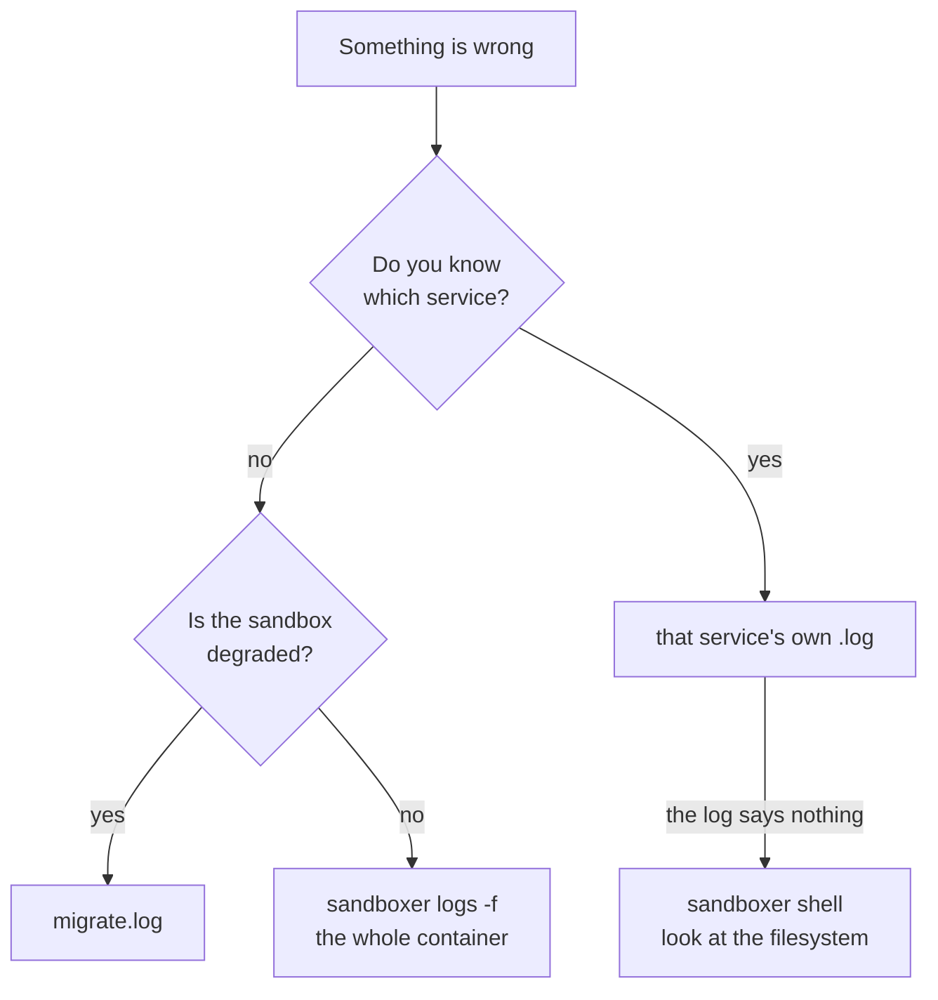

Something is wrong inside a sandbox and you want to look. There are three ways in, and
picking the right one first saves most of the time. This page is which to reach for.

```prompt
A sandbox on this machine is not behaving. Find out why.

Read docs/guides/logs-and-shells.md first. Start with `sandboxer status <slug>` to see
which services answer, then read the logs — `~/.sandboxer/logs/<project>/<slug>/` on the
host is the same directory the container writes to, so read the files directly rather
than shelling in. Report what you found before changing anything.

Stop and ask me before running anything that writes: no migrations, no rebuilds, no
`down`. Stop and tell me if `sandboxer ls` shows the sandbox as `stopped` — a stopped
container has no live processes to inspect.
```

| | Reach for it when | How |
|---|---|---|
| **The container's log stream** | You do not yet know which part is broken | `sandboxer logs` |
| **Per-service log files** | You know which service you care about | `~/.sandboxer/logs/<project>/<slug>/` |
| **A shell inside** | You need to look at the filesystem, or run something | `sandboxer shell` |

## 1. The container's log stream

```bash
sandboxer logs                    # the last 200 lines
sandboxer logs tkt-4821           # a sandbox other than this worktree's
sandboxer logs --tail 1000
sandboxer logs -f                 # follow it
```

Every process in the sandbox, interleaved. That is both its strength and its weakness.

It is the right place in the first minute of a sandbox's life. A container that dies during
boot leaves its reason here and nowhere else, because the per-service files below only exist
once a service has started.

It is the wrong place once you know which service you care about, because an interleaved
stream cannot be filtered after the fact.

The log itself goes to **stdout**, whether or not you asked for `--json`, so `sandboxer logs >
today.txt` produces the file you expected.

## 2. Per-service log files, on your own disk

Every supervised process in the sandbox also writes its own file. So does the migration run.

| File | What is in it |
|---|---|
| `<backend-name>.log` | One backend, one file, named after the backend |
| `web-<label>.log` | One long-running (`serve:`) front-end |
| `caddy.log` | The sandbox's own internal router |
| `mysqld.log` | The database server, for a MySQL project |
| `minio.log` | Object storage, for a project that declares it |
| `migrate.log` | **The project's migrations.** The first file to read when a sandbox is `degraded` |

Inside the container that directory is `/var/log/sandboxer`. On your machine it is:

```
~/.sandboxer/logs/<project>/<slug>/
```

Same files, two names — it is a bind mount. So you can `grep` and `tail` them with ordinary
tools, with no shell inside the sandbox and no Docker command at all. And, deliberately,
**they survive `sandboxer down`**. The logs from a sandbox you have just deleted are usually
exactly the ones you want.

> [!TIP] Why the log path is outside every repository
> `SANDBOXER_HOME` defaults to `~/.sandboxer` and is never inside a checkout, so `git clean
> -xdf` cannot destroy your logs, your seed cache or your certificates.

> [!IMPORTANT] These logs are not a sign of life
> Anything that health-probes a sandbox dials its container directly, and every probe is a
> request the sandbox's own router records in `caddy.log`. So the files keep growing while a
> sandbox sits completely unused. If you are trying to work out whether
> anybody is using a sandbox, ask `sandboxer expire --dry-run` — the idle clock reads the
> *shared* router's log, which probes never touch.

<details class="agent">
<summary><b>Details for an agent</b> — how the files are written, trimmed and named</summary>

Written by `container/scripts/logged.sh`, which every supervised service's run script `exec`s
through. The service name is the s6 service id, from `svc_id` in
`container/scripts/lib.sh`:

- a `backend` → its `name`, sanitised to `[A-Za-z0-9_]`
- a `server` front-end → `web-<label>`, sanitised the same way
- `static` front-ends have no service and no log file. They are built on demand, and a build
  driven by `sandboxer reload` prints to your terminal instead

The oneshots that run during boot — `mysql-init`, `deps-init`, `db-init` — do **not** go
through `logged.sh`. Their output goes to the container stream only, so `sandboxer logs` is
the only place to read a failed restore, a failed dependency seed or a data directory that
would not initialise. `db-init` delegates the migration step to `migrate-run.sh`, and that one
does write `migrate.log`.

A oneshot that runs a noisy tool keeps the tool's output and prints it **only when the tool
fails** (`run_quiet`, in `container/scripts/lib.sh`). The plain `>/dev/null 2>&1` it replaced
kept a clean boot readable and threw away the one message that explained a failure: with the
host's disk full, mysqld's "no space left on device" went nowhere and all that reached the
container stream was a oneshot exiting non-zero.

**Trimmed, not rotated.** Before a service starts, a log over **20 MB** is cut back to its
last **5 MB**. These are development logs, and a sandbox left up for days must not be able
to fill its own disk. There are no `.1` or `.gz` files to look for.

Redirection is `>>`, never a pipe. A pipe would leave the shell as the supervised process, so
a restart would signal the shell, the service would survive still holding its port, and every
replacement would die with `address already in use` while the old code carried on serving.

`sandboxer logs` flags: `[slug]`, `--tail N` (default `200`), `-f` / `--follow`,
`--project NAME`, `--worktree PATH`, `--json` (which returns `{ container, lines[] }`).
A followed log is streamed rather than collected, so it prints as it arrives.

</details>

## 3. A shell inside

```bash
sandboxer shell                        # an interactive bash, starting in /workspace
sandboxer shell tkt-4821
sandboxer shell -- ls -la /srv/www     # run one command instead of a login shell
sandboxer db shell                     # an interactive database prompt
```

Inside, `/workspace` **is** your worktree. A file you write there shows up in your `git
status` on the host — the mount goes both ways.

The environment is the sandbox's own. The addresses sandboxer computed and the project's own
names for them are all set, so a command you run by hand sees exactly what the services see.

```bash
sandboxer shell -- env | grep SANDBOXER_
sandboxer shell -- cat /sandboxer/plan.json | jq .services
sandboxer shell -- cat /run/sandboxer/status.json
```

Those last two are the sandbox's own view of itself: the [plan](../architecture/plan-json.md)
it was started from, and the status document it composes as it boots.

<details class="agent">
<summary><b>Details for an agent</b> — the paths worth knowing inside a sandbox</summary>

| Path | What |
|---|---|
| `/workspace` | The worktree, bind-mounted read-write |
| `/sandboxer/plan.json` | The plan, read-only. The container's only view of the project |
| `/run/sandboxer/status.json` | The composed status document. On a tmpfs, so it dies with the container |
| `/run/sandboxer/migrate.json` | The migration verdict: `state`, `file`, `error` |
| `/var/log/sandboxer/` | The log files above |
| `/srv/www/<label>/` | A built static front-end |
| `/srv/www/.built.json` | Label → last build time, for every app built here |
| `/var/lib/sandboxer/bin/<name>` | A built backend binary |
| `/var/lib/sandboxer/data` | The database volume |
| `/var/lib/sandboxer/blob` | Object storage |

`sandboxer shell` is `docker exec -it -w /workspace <container> bash`. Anything after a bare
`--` replaces `bash`, which is what makes `sandboxer shell -- go test ./...` work from a
script. It has no `--json`: its output is the command's own.

The same status surface is reachable over HTTP on every hostname the sandbox serves —
`/__sandboxer/live`, `/__sandboxer/status.json`, `/__sandboxer/built.json` and
`/__sandboxer/health/<service>`. A path under `/__sandboxer/` that names nothing answers `404`,
deliberately, so a probe can tell "the router has no such route" from "the service said no".

</details>

## Choosing between them



**Next:** [Troubleshooting](../troubleshooting.md) is organised by the message you actually
saw, which is usually not the same as the part that is broken. [The startup
graph](../architecture/startup.md) says what writes which log, and in what order.
