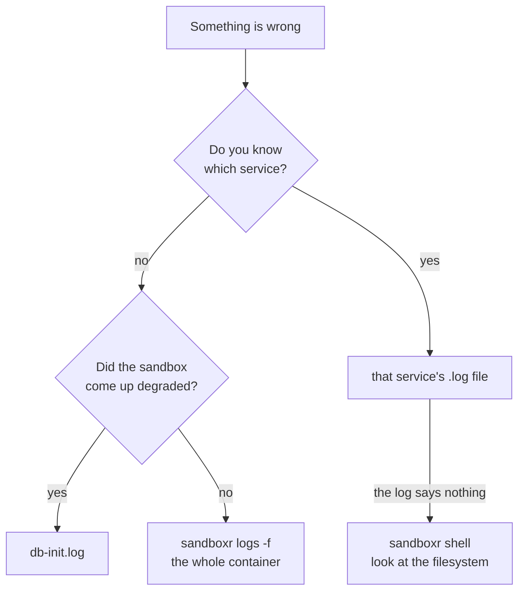

| | Use it when | Where it lives |
|---|---|---|
| **The container's log stream** | You do not yet know which part is broken | `sandboxr logs` |
| **Per-service log files** | You know which service you care about | `~/.sandboxr/logs/<project>/<slug>/` |
| **A shell inside** | You need to look at the filesystem or run something | `sandboxr shell` |

## 1. The container's log stream

```bash
sandboxr logs                    # the last 200 lines
sandboxr logs tkt-4821           # a sandbox other than this worktree's
sandboxr logs --tail 1000
sandboxr logs -f                 # follow
```

Every process in the sandbox, interleaved. That is its strength and its weakness: it is the
right place in the first minute of a sandbox's life, when a container that dies during boot
leaves its reason here and nowhere else, and the wrong place once you know which service you
care about, because it cannot be filtered afterwards.

The log itself goes to **stdout**, whether or not you asked for `--json`, so
`sandboxr logs > today.txt` produces the file you expected.

## 2. Per-service log files

Every supervised process also writes its own file:

```
/var/log/sandboxr/api.log        one backend
/var/log/sandboxr/db-init.log    restore, migrations, fixtures, buckets
/var/log/sandboxr/caddy.log      the sandbox's internal router
/var/log/sandboxr/mysqld.log     the database server
```

**`db-init.log` is the one worth remembering.** Restoring the database, running the project's
migrations and applying its fixtures all happen there, so it is the first place to look when a
sandbox comes up `degraded`.

### They are on your machine too

That directory is a bind mount of a host directory:

```
~/.sandboxr/logs/acme/tkt-4821/
```

Same files, two names. You can `grep` and `tail` them with ordinary tools without a shell inside
the sandbox — and, deliberately, **they survive `sandboxr down`**. The logs from a sandbox you
have just deleted are usually the ones you want.

> [!TIP] Why the log path is outside every repository
> `SANDBOXR_HOME` defaults to `~/.sandboxr` and is never inside a checkout, so `git clean -xdf`
> cannot destroy your logs, your seed cache or your certificates.

A log over **20 MB** is trimmed back to its last **5 MB** before its service starts. These are
development logs: a sandbox left up for days must not be able to fill its own disk.

## 3. A shell inside

```bash
sandboxr shell                        # an interactive bash, starting in /workspace
sandboxr shell tkt-4821
sandboxr shell -- ls -la /srv/www     # run one command instead
sandboxr db shell                     # an interactive database prompt
```

Inside, `/workspace` **is** your worktree. A file you write there appears in your `git status`
on the host. The environment is the sandbox's own — `SANDBOXR_DB_HOST`, `SANDBOXR_URL_APP` and
the project's own names for them are all set, so a command you run by hand sees what the
services see.

```bash
sandboxr shell -- env | grep SANDBOXR_
sandboxr shell -- cat /sandboxr/plan.json | jq .services
sandboxr shell -- cat /run/sandboxr/status.json
```

## The same three things in a browser

The [dashboard](dashboard.md) streams a sandbox's log on its page and gives you a full terminal
inside the container over a websocket. Both sit behind the same password as every other control.

## Choosing between them



## Related

- [Troubleshooting](../troubleshooting.md) — organised by the message you saw
- [The startup graph](../architecture/startup.md) — what writes which log, and when
