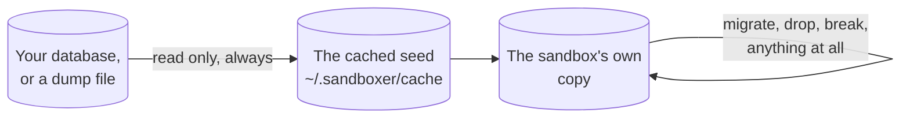

A sandbox's database is a copy. So you can point a half-written migration at real
structure and real volume, get it wrong, and lose nothing. This page is the loop for
doing that and reading the result.

```prompt
I am writing a database migration on this branch. Set up a sandbox for it and run the
snapshot-migrate-snapshot loop so I can see exactly what the migration changed.

Read docs/guides/testing-a-migration.md and follow it. Take a schema snapshot before
you run anything. Stop and tell me if the sandbox comes up `degraded`, or if the
migration fails — do not try to fix my migration unless I ask.
```

## Nothing you do here touches the real database

The starting data for a sandbox is a [seed](../reference/glossary.md). sandboxer reads
your source database, or a dump file, once. It writes the result into a cache. Each
sandbox then gets its own copy of that.



The left-hand box is never written to. That is the first of four rules every database
driver in sandboxer obeys, and it is the one that makes the rest of this page safe.

<details class="facts">
<summary><b>Fact sheet</b> — the four rules every database driver obeys</summary>

From `packages/core/src/drivers/types.ts` and `docs/architecture/contracts.md` §6.

1. **The source database is only ever read.** Every destructive operation targets a
   copy. This is the property that makes it safe to point a half-written migration at
   real data.
2. **A failed migration does not stop the sandbox.** The failure is recorded, the
   sandbox is marked `degraded`, and the services boot anyway — inspecting a failed
   migration is a reason the sandbox exists.
3. **The schema baseline survives a failed run.** The baseline is taken before
   migrating, and only re-taken after a *success*.
4. **The project's migration logic is never reimplemented.** sandboxer shells out to
   the command in your `sandboxer.yaml`. It may *read* migration state to show
   progress; what runs is always your own program.

The interface is five methods — `prepareSeed`, `provision`, `migrate`, `snapshot`,
`shell` — and every driver (`mysql`, `d1`, `sqlite`, `none`) implements all five.

</details>

## The commands

Four, and they are the whole surface.

```bash
sandboxer db seed        # produce or refresh the seed artifact
sandboxer db migrate     # run the project's own migration command inside the sandbox
sandboxer db snapshot    # print the schema — structure, not rows
sandboxer db shell       # an interactive database prompt inside the sandbox
```

Only `db seed` works without a running sandbox. It is host-side work: it reads your
source and writes the cache. The other three run inside the container, so the sandbox
has to be up.

`db snapshot` puts the schema on **stdout** and nothing else there. So
`sandboxer db snapshot > before.sql` always gives you a usable file, with or without
`--json`.

<details class="agent">
<summary><b>Details for an agent</b> — every <code>db</code> subcommand, its arguments and its exit code</summary>

From `packages/cli/src/main.ts` (`cmdDb`) and the `USAGE` constant.

| Command | Runs where | Notes |
|---|---|---|
| `sandboxer db seed [--seed local\|file\|fixtures]` | host | Idempotent. Content-addressed into `~/.sandboxer/cache`. `--seed` forces a source. Prints `<kind> from <source> (<key>)` |
| `sandboxer db migrate [slug]` | in the container | Exit `0` on success, `1` on failure. On failure it prints the migration it stopped on, where the baseline is, and that the database is left as-is |
| `sandboxer db snapshot [slug]` | in the container | Schema to stdout, raw, newline-terminated. `--json` wraps it as `{project, slug, schema}` |
| `sandboxer db shell [slug]` | in the container | Interactive. **Do not run this from a non-interactive agent — it will hang.** |

Every one of them also takes the global flags: `--worktree PATH`, `--project NAME`,
`--slug NAME`, `--json`.

Where the slug is omitted, it is derived from the current worktree. Where a slug *is*
named and matches exactly one sandbox, the worktree comes off that sandbox's own
Docker label — so these work from any directory.

`db migrate` runs the command in `database.migrate` from your `sandboxer.yaml`, through
`sh -lc`, inside the container. Nothing a caller supplies is interpolated into that
string; a slug or a branch name travels as an environment variable and can never
become shell syntax.

</details>

## The loop

Snapshot, run it, snapshot again, compare.

```bash
sandboxer db snapshot > before.sql     # 1. the schema as it is now
sandboxer db migrate                   # 2. run it
sandboxer db snapshot > after.sql       # 3. the schema now
diff -u before.sql after.sql           # 4. what actually changed
```

Step four is where the answer is. Columns added, indexes created, types changed — and,
after a failure, exactly how far it got.

> [!IMPORTANT] There is no `sandboxer db diff` and no `sandboxer db reset`
> Comparing two schemas is two snapshots and your own `diff`, as above. Starting from
> clean is `sandboxer down` then `sandboxer up`. The driver interface has `snapshot` and
> nothing that compares two snapshots, and no command returns a database to a fresh
> restore. See [What is built](../reference/status.md).

To start clean:

```bash
sandboxer down tkt-4821 && sandboxer up tkt-4821
```

On a file-backed database that is close to instant. On MySQL it is a restore from the
cached seed, so it takes as long as the restore does.

> [!TIP] Iterating without a full rebuild
> `sandboxer reload --migrate` re-runs this sandbox's migrations in place. It is much
> faster. But it runs against whatever the last attempt left behind, which is a state
> that will never exist in production. Iterate with it, then do the final run from a
> clean sandbox.

## When it fails

A migration that fails does not take the sandbox down. The container keeps running and
the sandbox is marked **`degraded`**.

That is deliberate. Looking at a failed migration is one of the main reasons to have a
sandbox at all, and you cannot look at one inside a container that has exited.

```bash
sandboxer ls                # the sandbox shows as degraded
sandboxer logs tkt-4821     # the migration output, including what it stopped on
sandboxer db shell          # the state it left behind
```

`degraded` is a state of its own rather than a shade of `running`, because Docker would
call that container `running` and be right. The sandbox writes its own verdict, and
sandboxer reads it. So the one row worth acting on is not painted the same green as a
healthy one.

### The baseline is what makes the comparison possible

Changing the shape of a table cannot be rolled back in most engines. A migration can
fail with its earlier statements already permanent. What you are left with is a schema
that is neither the old one nor the new one, and the only useful question is "what did
that actually change?".

That question is answerable because the baseline was **not** overwritten by the failed
attempt.

> [!CAUTION] Why the baseline is only re-taken after a success
> If it were re-taken on every attempt, a failed run would replace it with the
> half-migrated state. The next comparison would then report **no change** — at
> precisely the moment the question matters most, and in a way that reads as
> reassurance rather than as a missing answer.
>
> When a driver reuses a protected baseline it says so on the log:
> *Comparing against the baseline from before the last failed run.*

So the useful sequence after a failure is:

```bash
sandboxer db snapshot > after-failure.sql
diff -u ~/.sandboxer/logs/acme/tkt-4821/schema-before.sql after-failure.sql
sandboxer db shell        # look at the state it left behind
sandboxer logs tkt-4821   # what the runner printed
# fix the migration, then:
sandboxer down tkt-4821 && sandboxer up tkt-4821
```

<details class="failure">
<summary><b>If it goes wrong</b> — the four files a migration leaves on the host, and what each proves</summary>

Under `~/.sandboxer/logs/<project>/<slug>/`. They outlive the container, so they are
still there after `sandboxer down`.

| File | What it is |
|---|---|
| `schema-before.sql` | The baseline — the last schema known to be clean |
| `schema-after.sql` | The schema as of the last **successful** migration |
| `.failed` | Written when a run fails. Its presence is what protects the baseline |
| `migrate.log` | Everything the migration command printed |

The rule in code is `shouldTakeBaseline` in
`packages/core/src/drivers/migrate.ts`: re-take the baseline when the previous run did
*not* fail, or when there is no baseline yet. Nothing else.

Two more things worth knowing about how a failure is decided:

- **The exit code is the truth.** What is read out of the migration command's output —
  which files it mentioned, which one it stopped on — is for display only.
- **A runner that exits zero while printing its own failure summary produces a false
  green.** Declare `database.migrate.failure_pattern` in your `sandboxer.yaml` if your
  runner does that. sandboxer builds that runner from the branch under test, so it
  cannot know.

The verdict itself is written inside the container, to `/run/sandboxer/migrate.json`, in
the same shape whether the host ran the migration or the container did at boot. Two
writers of one fact produce one file. When they did not, a container-side run left the
file saying `ok` while the host read absent markers as `pending`, and every such
sandbox reported `starting` forever.

</details>

## A new sandbox does all of this for itself

At boot, a sandbox restores the seed, runs your migrations and applies fixtures. Then it
keeps running whatever happened. If the migration failed, it comes up `degraded` and the
commands above are how you find out why.

## What this does not test

Be honest with yourself about the four things a sandbox cannot tell you.

- **Production data volume**, unless your seed has it. A migration that takes four
  seconds against a copy of a laptop database can take forty minutes on production.
- **Concurrent load.** A migration that takes a table lock behaves very differently with
  traffic on it.
- **Deploy ordering.** A sandbox tells you the migration works. It does not tell you
  that shipping the schema change and the code that uses it in separate releases is
  safe.
- **Rollback**, because there usually is not one. If your project's answer to a bad
  migration is "write a new one", a sandbox is where you write and test that one too.

## Habits worth having

| Habit | Why |
|---|---|
| Snapshot before every run, not just the first | It costs a second, and it is the only thing that makes the comparison meaningful |
| Keep the diff after a successful run | A reviewer reading the schema change is worth more than one reading the SQL file |
| Rebuild between attempts rather than migrating twice | A second run against a half-migrated schema tests a state that will never exist |
| Declare `failure_pattern` if your runner can exit zero on failure | Otherwise a runner that prints its own failure summary produces a false green |
| Pin `database.version` to the version production runs | A migration is only meaningfully tested against the version it will really run on |

<details class="why">
<summary><b>Why it works this way</b> — one writer per file-backed database, and what MySQL costs</summary>

**`d1` and `sqlite` are the easy case.** The database is a file. Seeding is a copy,
forking is a copy, there is no server and no lock. The one rule is **one writer per
file**: two processes opening the same D1 file deadlock, so each sandbox gets a private
copy, and `database.owner` in your config has to name the single service that owns it.

A slug ends up in a database advisory lock name, which is why a slug over 31 characters
is hashed rather than truncated — two sandboxes that truncated to the same name would
collide on one lock.

**`mysql` is the hard case**, and the host half of that driver currently has two known
defects. Neither is fixed, and both are written down in
`docs/architecture/contracts.md` §6.1. The short version: the container brings a MySQL
sandbox up correctly and does all the real work, while every host-side `mysql` exec
against it fails on an access-denied error. So `sandboxer up` can report "Provisioning
did not complete" against a sandbox that is in fact fine. Nothing is lost, but nothing
the *host* driver does to a running MySQL sandbox runs at all.

MySQL has also never been run against a real project — none of it. See
[What is built](../reference/status.md).

`provision` runs twice on purpose, once from the container at boot and once from the
host when the container answers, so it has to be idempotent. An already-populated
database is kept on both sides; `provision` means *first boot*, and the table count is
what decides whether this is one.

</details>

**Next:** [Databases](../databases.md) for drivers, seeds and what each engine needs
declared. [Logs, shells and terminals](logs-and-shells.md) if the migration failed and you
want to read what it actually said.
