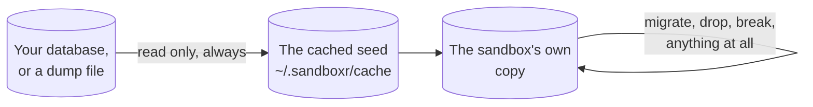

This is the strongest case for a sandbox. Its database is a **copy**, so a half-written migration
can be pointed at real structure and real volume, and getting it wrong costs one `sandboxr down`.



Nothing destructive ever touches the left-hand box. If that were not true, the first person to
mistype a `DROP TABLE` while testing would lose their own development database, and nobody would
use the tool again.

## The four commands

```bash
sandboxr db seed        # produce or refresh the seed artifact  (host; no sandbox needed)
sandboxr db migrate     # run the project's own migration command inside the sandbox
sandboxr db snapshot    # print the schema — structure, not rows
sandboxr db shell       # an interactive database prompt inside the sandbox
```

Only `db seed` works without a running sandbox; the other three exec inside the container.

`db snapshot` writes the schema to **stdout** and nothing else to it, so
`sandboxr db snapshot > before.sql` always produces a usable file.

## The loop

```bash
sandboxr db snapshot > before.sql     # 1. the schema as it is now
sandboxr db migrate                   # 2. run it
sandboxr db snapshot > after.sql      # 3. the schema now
diff -u before.sql after.sql          # 4. what actually changed
```

Columns added, indexes created, types changed — and, after a failure, exactly how far it got.

To start clean:

```bash
sandboxr down tkt-4821 && sandboxr up tkt-4821
```

On a file-based project that is close to instant; on MySQL it is a restore from the cached seed.

> [!TIP] Iterating without a full rebuild
> `sandboxr reload --migrate` re-runs this sandbox's migrations in place. Much faster, but it
> runs against whatever the last attempt left behind — a state that will never exist in
> production. Iterate with it; do the final run from a clean sandbox.

## After a failure, the comparison is the point

Changes to the shape of a table cannot be rolled back in most engines. A migration can fail with
its earlier statements already permanent, leaving a schema that is neither the old one nor the
new one. "What did that actually change?" is answerable only because the baseline was **not**
overwritten by the failed attempt.

> [!CAUTION] Why the baseline is only re-taken after a success
> If it were re-taken on every attempt, a failed run would replace it with the half-migrated
> state, and the next comparison would report **no change** — at precisely the moment the question
> matters most, and in a way that reads as reassurance rather than as a missing answer.
>
> When a driver reuses a protected baseline it says so: *Comparing against the baseline from
> before the last failed run.*

Files kept on the host, under `~/.sandboxr/logs/<project>/<slug>/`:

| File | What it is |
|---|---|
| `schema-before.sql` | The baseline — the last schema known to be clean |
| `schema-after.sql` | The schema as of the last **successful** migration |
| `.failed` | Written when a run fails. Its presence is what protects the baseline |
| `migrate.log` | Everything the migration command printed |

So the useful sequence after a failure is:

```bash
sandboxr db snapshot > after-failure.sql
diff -u ~/.sandboxr/logs/acme/tkt-4821/schema-before.sql after-failure.sql
sandboxr db shell        # look at the state it left behind
sandboxr logs tkt-4821   # what the runner printed
# fix the migration, then:
sandboxr down tkt-4821 && sandboxr up tkt-4821
```

## At boot, a sandbox does this for itself

A new sandbox restores the seed, runs the project's migrations and applies fixtures — and then
**keeps running even if the migration failed**. It shows as `degraded`, which is the signal to go
and look:

```bash
sandboxr ls                # degraded
sandboxr logs tkt-4821     # the migration output, including what it stopped on
sandboxr db shell
```

## What this does not test

- **Production data volume**, unless your seed has it. A migration that takes four seconds against
  a copy of a laptop database can take forty minutes on production.
- **Concurrent load.** A migration that takes a table lock behaves very differently with traffic
  on it.
- **Deploy ordering.** A sandbox tells you the migration works, not that shipping the schema
  change and the code that uses it in separate releases is safe.
- **Rollback**, because there usually is not one. If your project's answer to a bad migration is
  "write a new one", a sandbox is where you write and test that one too.

## Habits worth having

| Habit | Why |
|---|---|
| Snapshot before every run, not just the first | It costs a second, and it is the only thing that makes the comparison meaningful |
| Keep the diff after a successful run | A reviewer reading the schema change is worth more than one reading the SQL file |
| Rebuild between attempts rather than migrating twice | A second run against a half-migrated schema tests a state that will never exist |
| Declare `failure_pattern` if your runner can exit zero on failure | A runner that prints its own failure summary and then exits zero produces a false green — and the sandbox builds that runner from the branch under test |
| Pin `database.version` to the version production runs | A migration is only meaningfully tested against the version it will really run on |

## Related

- [Databases](../databases.md) — the four rules every driver obeys
- [The dashboard](dashboard.md) — the same actions, with the output streamed to a page
