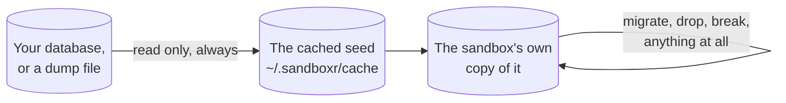

> **Written, never run** — Every command on this page exists in packages/cli and is unit-tested. None has been run against a real database, so treat the loop as how it is designed to work.

A migration is the one change you cannot undo, and the one you cannot meaningfully test against an
empty database. A sandbox gives you a copy of the real structure — and, if you want, the real
volume — that you are allowed to destroy.

This is the strongest single reason to use one.

## The four commands there are

```
sandboxr db seed        Produce or refresh the copy this project starts from
sandboxr db migrate     Run the project's own migrations against the sandbox's copy
sandboxr db snapshot    Print the schema: tables and columns, no rows
sandboxr db shell       An interactive database prompt inside the sandbox
```

That is the whole database surface. `db migrate`, `db snapshot` and `db shell` run **inside** the
sandbox, so the sandbox has to be up.

> [!WARNING] There is no `sandboxr db diff`, and that is a gap
> Comparing the schema before and after is the whole point of this page, and there is no command that
> does it for you yet. You do it by hand with two snapshots and `diff`, below. It works, and it is
> more typing than it should be.

<details>
<summary><b>Details for an agent:</b> the full syntax of the four commands, which sandbox they pick, and their JSON output</summary>

```
sandboxr db seed     [--seed local|file|fixtures] [--worktree PATH]
sandboxr db migrate  [slug] [--worktree PATH]
sandboxr db snapshot [slug] [--worktree PATH]
sandboxr db shell    [slug] [--worktree PATH]
```

The help text advertises `--seed` on `db seed`, and the command does not currently read it: it
takes whichever source the config and the machine make available. `sandboxr up --seed <source>` is
the one that really forces a choice.

With no slug, the sandbox is worked out from where you are standing, in the same order `up` uses: an
explicit name, a ticket-style id in the worktree's directory name, the same pattern in the branch
name, the branch, then the directory. `--slug NAME` and `--project NAME` are accepted too.

`--json` puts a machine-readable result on standard output and sends the human-readable lines to
standard error:

| Command | What `--json` gives you |
|---|---|
| `db seed` | The seed artifact: `kind`, `source`, `key`, `path`, `bytes`, `createdAt`, `meta` |
| `db migrate` | The full `MigrateResult`: `ok`, `code`, `applied`, `failed`, `healed`, `baseline`, `log`, `durationMs`, `output` |
| `db snapshot` | `project`, `slug`, `schema` |
| `db shell` | Nothing — it replaces the process with an interactive shell |

`db snapshot` is the exception worth knowing: **the schema goes to standard output either way**, so
`sandboxr db snapshot > before.sql` always produces a usable file.

`db migrate` exits non-zero when the migration failed, and prints the host path of the baseline so
the next comparison is one command away.

</details>

## The loop

1. **Save the schema as it is now.**

   ```bash
   sandboxr db snapshot > before.sql
   ```

   `db snapshot` writes the schema to standard output and nothing else to it, so redirecting it
   into a file always produces a usable file.

2. **Run the migration.**

   ```bash
   sandboxr db migrate
   ```

   This runs the project's own migration command inside the sandbox. sandboxr does not order,
   apply or track migrations itself.

   A failure here is not a problem. It is information — and the sandbox stays up so you can look
   at it.

3. **Save the schema again.**

   ```bash
   sandboxr db snapshot > after.sql
   ```

4. **Compare them.**

   ```bash
   diff -u before.sql after.sql
   ```

   Columns added, indexes created, types changed — and, after a failure, exactly how far it got.

5. **Start again from clean, when you need to.**

   ```bash
   sandboxr down feat-123
   sandboxr up feat-123
   ```

   `down` removes the sandbox **and its database**, and `up` builds a new one from the cached seed.
   On a file-based project that is close to instant; on MySQL it is a restore.

> [!TIP] Re-running migrations without a full rebuild
> `sandboxr reload <slug> --migrate` re-runs this sandbox's migrations in place. Useful after editing
> a migration file, and much faster than a rebuild — but it runs against whatever state the last
> attempt left behind, which is not a state that will ever exist in production. Use it to iterate,
> and do the final run from a clean sandbox.

## Why it is safe



*Nothing destructive ever touches the left-hand box.*


**The source is only ever read.** Every destructive operation targets the copy inside the sandbox.
That separation is the whole point: it is what makes it reasonable to run a migration you are not
sure about.

If it were not true, the first person to mistype a `DROP TABLE` while testing would lose their own
development database, and nobody would use the tool again.

## After a failure, the comparison is the point

Changes to the shape of a table cannot be rolled back in most engines. A migration can fail with
its earlier statements already permanent, leaving a schema that is neither the old one nor the new
one.

"What did that actually change?" is answerable only because **the baseline was not overwritten by
the failed attempt**.

> [!CAUTION] Why the baseline is only re-taken after a success
> sandboxr saves the schema before it migrates, and replaces that saved copy only when a migration
> succeeds. If it were re-taken on every attempt, a failed run would replace it with the
> half-migrated state, and the next comparison would report **no change** — at precisely the moment
> the question matters most, and in a way that reads as reassurance rather than as a missing answer.
>
> When a driver reuses a protected baseline it says so: `Comparing against the baseline from before
> the last failed run.`

So the useful sequence after a failure is:

```bash
sandboxr db snapshot > after-failure.sql
diff -u ~/.sandboxr/logs/acme/feat-123/schema-before.sql after-failure.sql
sandboxr db shell        # look at the actual state
sandboxr logs feat-123   # what the runner printed
# fix the migration file, then:
sandboxr down feat-123 && sandboxr up feat-123
```

<details>
<summary><b>Details for an agent:</b> the files sandboxr keeps per sandbox, and the diff the container can do itself</summary>

On the host, under `~/.sandboxr/logs/<project>/<slug>/`:

| File | What it is |
|---|---|
| `schema-before.sql` | The baseline — the last schema known to be clean |
| `schema-after.sql` | The schema as of the last **successful** migration |
| `.failed` | Written when a run fails. Its presence is what stops the baseline being overwritten |
| `migrate.log` | Everything the migration command printed |

The container keeps its own pair, in `$SANDBOXR_STATE/schema/`, written by the migration that runs
at boot — and it has a diff verb that no CLI command exposes:

```bash
sandboxr shell feat-123 -- /opt/sandboxr/scripts/db.sh diff
```

That compares the current schema against the **container's** baseline, which is the one taken on
first boot. A `sandboxr db migrate` run from the host writes its baseline to the host paths above
and does not update the container's copy, so the two can disagree about what "before" means. Until
that is reconciled, prefer the two-snapshot method in the loop above: it is explicit about which
two things you are comparing.

</details>

## Inside a sandbox, at boot

A sandbox does all of this for itself when it starts, and then **keeps running even if the
migration failed**. That is deliberate: the sandbox is where you inspect the failure.

```bash
sandboxr ls                # the sandbox shows `degraded`
sandboxr logs feat-123     # the migration output, including what it stopped on
sandboxr db shell          # look at the state it left behind
```

The dashboard shows the same thing, painted differently from a healthy sandbox — see
[the dashboard](./dashboard.md).

## What this does not test

Be honest with yourself about the limits.

- **It does not test production data volume**, unless your seed has it. A migration that takes four
  seconds against a copy of a laptop database can take forty minutes on production. If runtime
  matters, test against a dump with real row counts.
- **It does not test concurrent load.** A migration that takes a table lock behaves very
  differently with traffic on it.
- **It does not test deploy ordering.** If your project ships a schema change and the code that
  uses it in separate releases, a sandbox tells you the migration works — not that the *sequence* is
  safe.
- **It does not test rollback**, because there usually is no rollback. If your project's answer to a
  bad migration is "write a new one", a sandbox is where you write and test that one too.

## Habits worth having

| Habit | Why |
|---|---|
| Snapshot before every run, not just the first | It costs a second, and it is the only thing that makes the comparison meaningful. |
| Keep the diff after a successful run | It is a review artefact. Paste it into the pull request; a reviewer reading the schema change is worth more than one reading the SQL file. |
| Rebuild the sandbox between attempts rather than migrating twice | A second run against a half-migrated schema tests a state that will never exist in production. |
| Declare a `failure_pattern` if your runner can exit zero on failure | A runner that prints its own failure summary and then exits zero produces a false green — and the sandbox builds that runner from the branch under test. [How](../databases/mysql.md#the-runners-exit-code-is-not-always-the-whole-answer). |
| Test against the version production runs | Pinned by `database.version`. [Why it matters](../databases/mysql.md#restore-into-the-version-production-runs). |

## Related

- [The driver model](../databases/drivers.md) — the four rules behind all of this.
- [MySQL: the hard case](../databases/mysql.md)
- [D1 and SQLite: the easy case](../databases/d1-sqlite.md)
- [The CLI reference](../reference/cli.md) — every command, in full.
