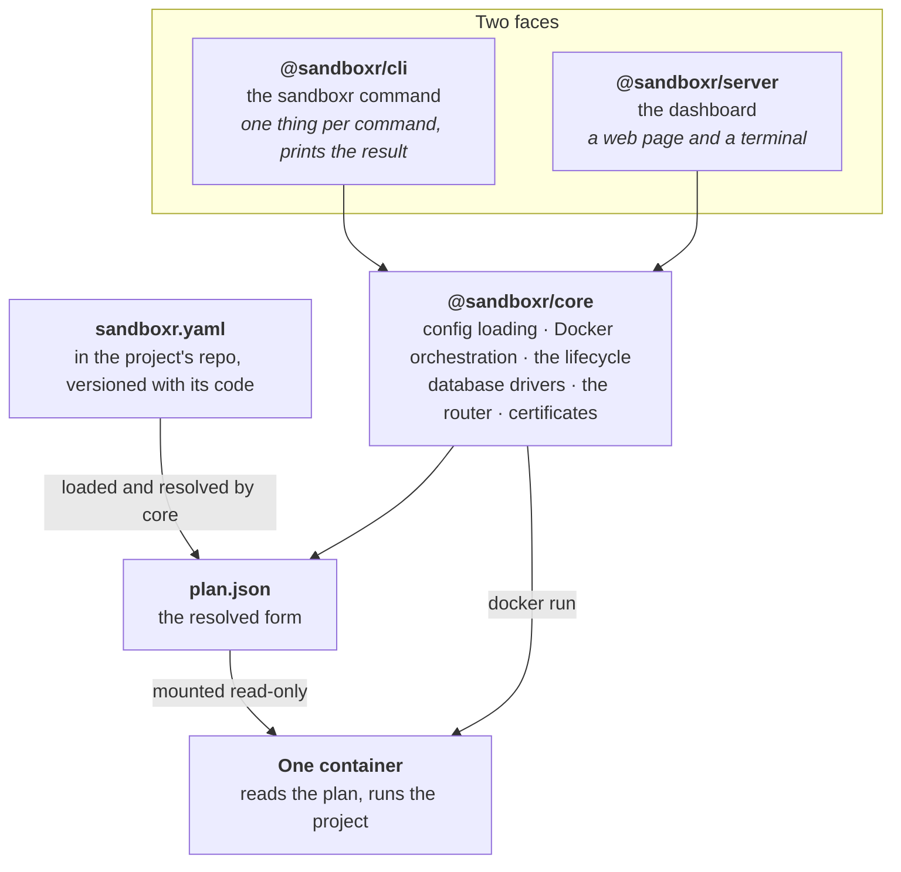
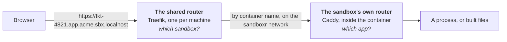
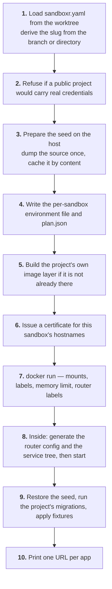

sandboxr is one library with two faces on it, and one file between the host and the container.
Everything else follows from that.



## The four layers

| Layer | What it is | Who reads it |
|---|---|---|
| **`sandboxr.yaml`** | How a project describes itself. Lives at the project's repo root, versioned with its code | `@sandboxr/core`, on the host, only |
| **`plan.json`** | The resolved form: every default applied, every path made absolute, every choice already made | The container, and nothing else |
| **`@sandboxr/core`** | Where all the actual work happens | The CLI and the dashboard |
| **`@sandboxr/cli` / `@sandboxr/server`** | Two faces on that one library | You |

### The CLI and the dashboard cannot disagree

This is the point of the shape. `@sandboxr/server` does **not** shell out to the `sandboxr`
command. It loads `@sandboxr/core` and calls it in process — see
`packages/server/src/core/adapter.ts`, the one file in that package that knows how core is
really called. Everything else in the dashboard talks to an interface, so a change on core's
side lands in that file and nowhere else.

So "what is a sandbox", "which seed source wins", "what does `down` delete" have exactly one
answer, and pressing a button in the dashboard is the same act as typing the command.

### Nothing inside a container reads `sandboxr.yaml`

The container never sees the project's config. It is handed `plan.json` — mounted read-only at
`/sandboxr/plan.json` — and that file is its entire view of the project.

That boundary is deliberate. A container that parsed YAML would need the schema, the defaults
and the version rules inside the image, so a change to any of them would mean rebuilding every
image. Resolving on the host means the image knows nothing about the project, and a plan is a
flat, already-decided document that a shell script can read with `jq`.

The container hard-fails at startup if the plan is missing or is not valid JSON. It never
guesses. [plan.json, field by field](architecture/plan-json.md).

## Where the work happens

`@sandboxr/core` is the only package with real logic in it.

| Module | Job |
|---|---|
| `config/` | Load and validate `sandboxr.yaml` (zod), apply defaults, resolve the plan, enforce the access rules |
| `drivers/` | One module per kind of database: `mysql`, `d1`, `sqlite`, `none` |
| `access/` | The shared Traefik router, per-sandbox certificates, the dashboard container |
| `sandbox/` | The lifecycle: `up`, `down`, `list`, `status`, `reload`, `gc` — and the `docker run` argument list |
| `image.ts` | Renders and builds the project's own image layer on top of the base image |
| `naming.ts` | Slugs, hostnames, container and volume names — the single source of the naming scheme |
| `paths.ts` | Every host path sandboxr owns, all under `SANDBOXR_HOME` |
| `secrets.ts` | Importing a project's `.env` files under its own rules |

`@sandboxr/cli` is a switch statement and a printer. `@sandboxr/server` is HTTP, a session
cookie, a closed table of actions and a terminal.

## The two routers

A sandbox URL passes through two routers, and telling them apart is most of what makes a routing
problem quick to fix.



| | The shared router | The sandbox's own router |
|---|---|---|
| What | One Traefik container per machine, started by `sandboxr init` | Caddy inside every sandbox |
| Question it answers | Which sandbox? | Which app, and which path? |
| Configured by | Docker labels on each sandbox container | Generated from `plan.json` at every boot |
| Terminates TLS | Yes, when a trusted certificate exists | No — plain HTTP on port 80 |

Sandbox containers publish **no host ports at all**. They join one shared Docker network called
`sandboxr`, and the router reaches them by container name. Only the router publishes anything.

Because the shared router reconciles from Docker labels, starting or stopping a sandbox never
writes a config file and never triggers a reload. [How a request arrives](architecture/request-path.md)
has the detail.

## The life of a sandbox

What `sandboxr up` actually does, in order.



Two things about that order are load-bearing:

- **The seed is made on the host, before the container starts.** A sandbox restores from the
  host cache rather than carrying data in its image, so the image never needs rebuilding when
  the source database changes. The cache is keyed on the source's *content*, so the second
  sandbox on a project skips step 3 entirely.
- **The certificate is issued before the container starts**, so the router already holds one by
  the time a browser asks. It is per sandbox rather than per machine: a sandbox hostname is
  three labels above the domain, and a DNS wildcard matches exactly one label, so no wildcard
  certificate can reach it.

Step 9 can fail without stopping anything. A failed migration marks the sandbox **degraded** and
the services boot anyway — inspecting a failed migration is one of the reasons a sandbox exists.

## There is no list of sandboxes

`sandboxr ls` is a pure function of `docker ps`. There is no manifest file, no database of
sandboxes, and nothing on the host that can drift out of sync with what is running. Every column
comes from a label on the container.

```
sandboxr.project   sandboxr.slug     sandboxr.branch   sandboxr.commit
sandboxr.dirty     sandboxr.worktree sandboxr.driver   sandboxr.created
sandboxr.access
```

Labels hold **durable** state only — facts fixed when the sandbox started. Runtime state
(`running`, `degraded`, `stopped`) is derived at read time from Docker's own state plus marker
files the container writes as it comes up. [State lives in labels](architecture/state.md).

## What lives where

| | On the host | Inside the container |
|---|---|---|
| The project's code | your worktree | `/workspace`, bind-mounted read-write |
| The plan | `~/.sandboxr/build/<project>/<slug>.plan.json` | `/sandboxr/plan.json`, read-only |
| Seed artifacts | `~/.sandboxr/cache` | `/sandboxr/cache`, read-only |
| Logs | `~/.sandboxr/logs/<project>/<slug>` | `/var/log/sandboxr` |
| The database | a Docker volume | `/var/lib/sandboxr/data` |
| File storage | a Docker volume | `/var/lib/sandboxr/blob` |
| Built front-ends | a Docker volume | `/srv/www` |
| Built binaries | a Docker volume | `/var/lib/sandboxr/bin` |

Everything on the host hangs off `SANDBOXR_HOME` (default `~/.sandboxr`), which is deliberately
outside any repository so `git clean` cannot destroy a seed cache or a certificate.
[The full path list](reference/paths.md).

## Two images, not one

| Image | What it holds | Built by |
|---|---|---|
| `sandboxr/base` | Debian, s6, Caddy, MinIO, and nothing project-specific | `sandboxr init` |
| `sandboxr/<project>` | The base plus the project's toolchain: Go, Node, a MySQL server, its dependencies | the first `sandboxr up` |

The base image knows nothing about any project, so it is built once per machine and shared. The
project layer is rendered from `container/project/Dockerfile.template` — only the blocks the
project's plan actually needs are included, so a Node-only project carries no Go and no MySQL.

## Where to go next

- **Try it:** [getting started](getting-started/index.md).
- **Describe your project:** [sandboxr.yaml, field by field](configuration/sandboxr-yaml.md).
- **The reasoning behind each choice:** [design decisions](architecture/decisions.md).
- **The authority:** [`docs/architecture/contracts.md`](architecture/contracts.md).
