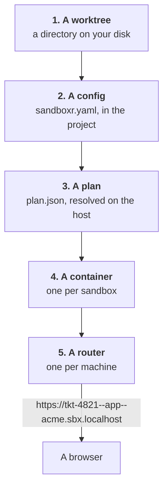

This page is the mental model. Read it once and the rest of the documentation stops needing
explanation, because every page is describing one of these five steps in more detail.



## Step 1 — A worktree

Everything starts from a directory.

A [worktree](reference/glossary.md) is git's own feature for having more than one branch checked
out at once, each in its own directory. You run `sandboxr up` inside one of them. That directory,
and the branch it is on, are the whole input.

From it sandboxr works out a **slug**: a short name for this sandbox. A worktree at
`.worktrees/tkt-4821` gets the slug `tkt-4821`. The slug turns up everywhere afterwards — in the
hostname, in the container's name, in the names of its volumes — so it is worth knowing that it
came from your directory or your branch, and nowhere else.

<details class="agent">
<summary><b>Details for an agent</b> — exactly how a slug is derived</summary>

In order of preference, stopping at the first that applies:

1. An explicit argument (`sandboxr up my-name`).
2. A slug recorded for this worktree, in `~/.sandboxr/state/slug/`. Written only when the
   slug the worktree would derive was already a sibling's — see below.
3. A ticket-style id anywhere in the worktree **directory** name, matching `/[a-z]+-[0-9]+/i`.
4. That same pattern in the **branch** name.
5. The branch name itself. A detached worktree reports `HEAD`, which names nothing and is
   skipped.
6. The worktree directory name.

Then sanitised: lowercased, every character outside `[a-z0-9-]` replaced with `-`, runs of `-`
collapsed, leading and trailing `-` stripped.

**The ceiling is 31 characters.** Over that, the result is the first 22 characters, a `-`, and
the first 8 hex characters of the SHA-256 of the *raw* input. It is hashed rather than truncated
because a slug ends up inside a database advisory lock name, and two long branch names often
share a prefix — truncation would let two sandboxes collide on one lock.

**Two branches on one ticket derive one slug**, and a slug names the container, the volumes
and the database lock — so that would be one sandbox for two branches. When sandboxr cuts the
worktree itself it catches this and gives the new one `<slug>-<4 random characters>`, which is
what rule 2 reads back. Four characters and not a UUID: the ceiling is a lock-name budget, and
a name nobody can read defeats the point of the ticket-id rule.

Source: `packages/core/src/naming.ts` for the derivation, `packages/core/src/worktree-slug.ts`
for the recorded slug and the collision check. Depth on collisions and how many worktrees fit
on one machine: [One repo, many branches](setups/one-repo-many-worktrees.md).

</details>

## Step 2 — A config

The project says what it is, once, in a file it keeps.

That file is `sandboxr.yaml`, at the root of the repository, committed alongside the code. It
names the project, its front-ends, its services, which database it wants, how to install
dependencies, and which toolchains it needs. sandboxr has no built-in knowledge of any project.
If it is not in the config, it does not happen.

Because the file is committed, it travels with the branch. A branch that adds a new service adds
it to the config too, and a sandbox on that branch gets the new service without anyone
configuring anything.

You do not need to write the whole file at once.
[Build your config, step by step](configuration/index.md) starts from an empty file and adds one
block at a time.

## Step 3 — A plan

The config is written for people. The container needs something simpler.

So before anything starts, sandboxr reads the config on your machine and resolves it into
`plan.json`: every default filled in, every path made absolute, every choice already made. The
plan is the container's entire view of the project. It is mounted read-only, and nothing inside a
container ever reads `sandboxr.yaml`.

<details class="why">
<summary><b>Why it works this way</b> — the container knows nothing about your config format</summary>

If the container parsed the YAML itself, the image would have to carry the schema, the defaults
and the version rules. Changing any of them would mean rebuilding every image on the machine.

Resolving on the host instead means the image knows nothing about any project, and the plan is a
flat, already-decided document that a shell script can read with `jq`.

The container hard-fails at startup if the plan is missing or is not valid JSON. It never
guesses. Field by field: [plan.json](architecture/plan-json.md).

</details>

## Step 4 — A container

One sandbox is one container, started from that plan.

Inside it, a supervisor reads the plan and starts what it names: the project's services, its
database, an S3-compatible bucket for uploaded files, and a small router of its own that decides
which app answers which request. The database is created, seeded and migrated as part of coming
up.

Your worktree is **mounted**, not copied. A file you save in your editor is inside the container
immediately, and a file the container writes appears in your `git status`.

The container publishes no ports on your machine. Nothing about it is reachable directly, which
is what step 5 is for.

<details class="agent">
<summary><b>Details for an agent</b> — the names and paths one sandbox occupies</summary>

| Thing | Value |
|---|---|
| Container | `sandboxr-<project>-<slug>` |
| Docker network | `sandboxr` — one, shared by every sandbox and the router |
| The worktree, inside | `/workspace`, read-write bind mount |
| The plan, inside | `/sandboxr/plan.json`, read-only |
| Host state | everything under `SANDBOXR_HOME`, default `~/.sandboxr` |

`SANDBOXR_HOME` sits deliberately outside any repository, so `git clean` cannot destroy a seed
cache or a certificate. Full list: [Paths](reference/paths.md).

Two images are involved, not one. `sandboxr/base` carries the operating system, the supervisor
and the shared pieces, and is built once per machine by `sandboxr init`. `sandboxr/<project>`
adds that project's toolchains and dependencies, and is built by its first `sandboxr up`.

There is no manifest of sandboxes anywhere. Durable facts — project, slug, branch, commit,
worktree, driver — live as labels on the container, and `sandboxr ls` is a pure function of
`docker ps`. Nothing on the host can drift out of sync with what is running.
[State lives in labels](architecture/state.md).

</details>

## Step 5 — A router

One router sits in front of every sandbox on the machine, and decides which one a request is for.

It is a single container, started by `sandboxr init`, and it is the only thing listening on your
machine's ports. It works out where a request belongs from the **hostname**. Sandboxes do not
have to be registered with it: it watches Docker and reconciles from the labels on each sandbox
container, so starting or stopping a sandbox never edits a config file and never triggers a
reload.

### The shape of a hostname

Every sandbox address in these docs has the same four parts, in the same order:

```
<slug>--<label>--<project>.<domain>
```

Read left to right, it narrows:

| Part | What it is | Where it comes from |
|---|---|---|
| **slug** | which sandbox | your branch or worktree directory (step 1) |
| **label** | which app inside that sandbox | the project's config: `app`, `api`, `admin` |
| **project** | which project | the `project:` field in `sandboxr.yaml` |
| **domain** | this machine's sandbox domain | `SANDBOXR_DOMAIN`, default `sbx.localhost` |

So one sandbox of the `acme` project, with two apps in it, serves two hostnames on a machine
using the default domain:

```
https://tkt-4821--app--acme.sbx.localhost      the front-end
https://tkt-4821--api--acme.sbx.localhost      the service behind it
```

The three parts are joined by `--` into a **single** name under the domain, rather than by dots
into three. That is a TLS decision: a wildcard certificate covers exactly one level, so
`*.sbx.localhost` covers every sandbox that will ever run on this machine — where the older dotted
shape could be covered by no wildcard at all and needed a certificate issued per sandbox.

The cost is a length limit, and it is worth knowing about once: all three parts share the 63
characters a single name is allowed. A long project name with a long label leaves less room for the
slug, so sandboxr shortens slugs to fit — and refuses a config where there would be almost nothing
left, rather than producing a hostname that does not work.

There is no DNS to set up. Every current browser, and macOS's own resolver, answer any name
under `.localhost` with the loopback address by themselves.

### The bare domain is the exception

The **bare domain** — `https://sbx.localhost` — is not a sandbox hostname and never becomes one.
`sandboxr init` prepares it and serves nothing on it, so it is where a control plane goes if you
put one there.

That separation is deliberate. A control plane can start and stop containers, so it must never be
one guessed label away from an app that anyone can reach. sandboxr routes the bare domain and
nothing more: whatever answers there brings its own authentication.
[Access and security](access.md).

> [!NOTE] HTTP or HTTPS depends on your machine
> The router serves HTTPS only when the machine already trusts a local certificate authority.
> Without one, everything still works over `http://`. Installing that authority is the one step
> that needs an administrator password, so it is never done implicitly.
> [Install it](getting-started/install.md) covers both cases.

## That is the whole model

Worktree, config, plan, container, router. Every page in these docs is one of those five in more
detail:

| Step | Where it goes deeper |
|---|---|
| The worktree and its slug | [One repo, many branches](setups/one-repo-many-worktrees.md) |
| The config | [sandboxr.yaml, field by field](configuration/sandboxr-yaml.md) |
| The plan | [plan.json](architecture/plan-json.md) |
| The container coming up | [The startup graph](architecture/startup.md) |
| The router, in full | [How a request arrives](architecture/request-path.md) |

**Next:** [Start here](getting-started/index.md) to put this on your machine, or
[The shape of it](architecture/index.md) for how the code itself is arranged.
