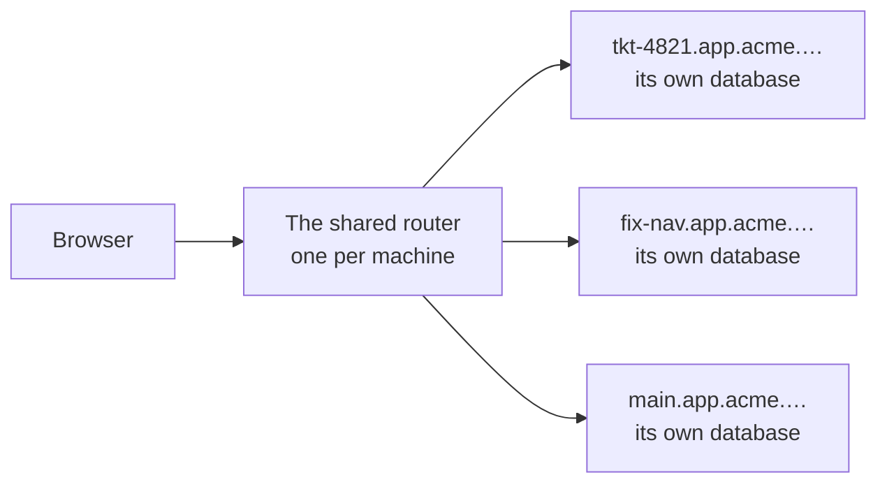
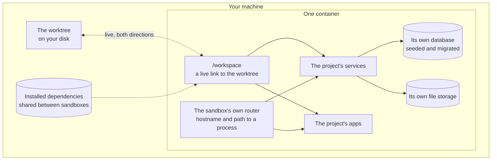

Some changes cannot be reviewed by reading them. A change that moves a field between two
services, or adds a column and then uses it, is only really checked by running the thing.

sandboxr runs the thing. **One git worktree becomes one container holding the whole project** —
every service, every front-end, its own database already loaded, its own file storage — reachable
in a browser at an address of its own.

## The two cases it is for

### 1. One worktree, one container

The everyday case. You are on a branch and you want to see it working.

```bash
cd .worktrees/tkt-4821
sandboxr up
```

Half a minute later the project is serving at
`https://tkt-4821.app.acme.sbx.localhost`, with a database of its own that your branch's
migrations have already run against. Break it however you like; `sandboxr down` throws away the
container, the database and the uploads, and never touches your worktree.

### 2. Every worktree at once

The case that makes the tool worth having. Each worktree gets its own sandbox on its own
hostname, and they all run side by side.



Two branches compared without stashing anything. A migration running in one while the old schema
still serves in another. Three agents working unsupervised in three worktrees, each with a URL
you can refresh to see what it has done. Nothing is shared between them except a cache of
installed dependencies, so one cannot break another.

## What is actually inside one



The worktree is bind-mounted, not copied. A file you save on the host is inside the container
immediately, and a file the container writes shows up in your `git status`.

## The words this site uses precisely

| Word | Means |
|---|---|
| **Sandbox** | One container, made from one worktree, with its own database and storage |
| **Slug** | The sandbox's short name — `tkt-4821`. It appears in the hostname, the container name and the volume names |
| **Project** | A repository with a `sandboxr.yaml` at its root. Several can run side by side |
| **Label** | The per-app part of a hostname: `app`, `api`, `admin` |
| **Driver** | Which kind of database the project uses: `mysql`, `d1`, `sqlite` or `none` |
| **Degraded** | A sandbox that started, but whose migrations failed. It stays up deliberately |

Longer list: [the glossary](reference/glossary.md).

## The hostnames

```
https://tkt-4821.app.acme.sbx.localhost      the main app
https://tkt-4821.api.acme.sbx.localhost      the service behind it
https://sbx.localhost                        the dashboard, for every sandbox on the machine
```

Read one as `<slug>.<label>.<project>.<domain>`. The slug comes from the branch or the worktree
directory, the label from the project's config, the project from its `project:` field, and the
domain from `SANDBOXR_DOMAIN` — which defaults to `sbx.localhost`. Every current browser resolves
anything under `.localhost` to the loopback address by itself, so there is no DNS to configure.

The dashboard is the exception: it sits on the **bare domain**, never on a per-sandbox hostname,
so the thing that can start and stop containers is never one label away from an app anyone can
reach.

## Two tiers of access

| | Default | Can it be turned off? |
|---|---|---|
| **The apps** a sandbox serves | Public — anyone who can reach the machine sees a preview | Yes: `access.apps: private` |
| **The controls** — dashboard, terminal, start, stop, migrate | Behind a password | **No** |

> [!CAUTION] The controls are not negotiable
> The dashboard talks to the Docker socket. A control endpoint reachable without a password is
> not a misconfigured page — it is the ability to run anything on the host.
> [Access and security](access.md) is the whole story.

Making the apps public brings two refusals with it: the database may not be a copy of live data
unless the dump is marked anonymised, and real third-party credentials may not be present unless
the config opts in. sandboxr refuses to start rather than warning, because neither failure can be
undone.

## Do not use one when

| Situation | Do this instead |
|---|---|
| You want the page to update as you type | There is no hot reload. Run that one app's dev server locally and keep the sandbox for checking the whole thing works together |
| A unit test would answer the question | Run the test |
| You need to reproduce something on real production data | A sandbox starts from fixtures or an anonymised dump. Debugging one customer's record is a different job with different rules |
| You are measuring performance | Several sandboxes share one machine's processors and one Docker VM's memory. Numbers from a sandbox mean nothing |
| The machine has under 8 GB available to Docker | Below that you spend your time having things killed for memory |

## The honest limits

- **No hot reload.** The loop is edit, rebuild the thing you touched, refresh.
  See [the edit–reload loop](guides/edit-and-reload.md).
- **Front-ends are built on demand, never at startup.** A sandbox that has just come up has built
  nothing; each app answers `503` with a page naming the command that builds it.
- **A heavy front-end build needs headroom.** A static site rendering thousands of pages is killed
  part-way through without it, reported by npm as nothing but `code 137`. Declare `memory:` on
  that app.
- **A failed migration leaves the sandbox running.** That is intended, but "the sandbox is up" is
  not the same as "the database is what you expected". Check for `degraded`.
- **One writer per file-backed database.** Two processes opening the same D1 or SQLite file
  deadlock, so exactly one service may own it.

What has and has not been run for real: [what is built](reference/status.md).

**Next:** [how it works](how-it-works.md), or [getting started](getting-started/index.md).
