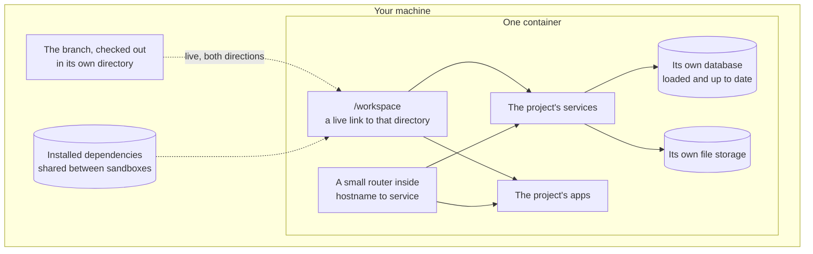

> **Partly verified** — The shape described here is the shape the code is built to. The container half has been booted and serves pages; no sandbox has yet been taken from `sandboxr up` to a working URL.

**sandboxr gives one branch its own running copy of a whole project.**

Every service the project declares, every app, a database of its own already loaded with
data, its own file storage. All of it inside one container, started from one branch, and
thrown away when you are finished with it. Several can run at the same time on one machine.

That is the whole idea. The rest of this page is why it is worth having, and the words the
rest of the site uses.

## The problem it solves

Some changes cannot be reviewed by reading them. A change that moves a field from one
service to another, or adds a column and then uses it, is only really checked by running the
thing. And running the thing usually means one of three unhappy options.

**Switch your local setup to the branch.** You get one branch at a time. Switching costs a
rebuild, and if the branch changed the database, the database no longer matches whatever you
switch back to. Two people cannot look at two branches at once.

**Use the shared staging environment.** One branch at a time again, now with a queue in front
of it. A broken deploy blocks everybody. Nobody can safely test a change to the database,
because the data is shared and the change has already run once.

**Use a per-pull-request preview environment.** Closer, but these are usually front-end only.
They take minutes rather than seconds, they need continuous integration to build them, and
there is no database you are allowed to break.

What all three lack is a **disposable whole**: the project, running from one branch, for as
long as you want, with permission to destroy it.

## What is actually inside one

One Docker container, holding everything the project needs to serve itself. Plus a live link
back to the directory on your disk that the branch is checked out in — edit a file there and
it is inside the container immediately.



*One sandbox. Everything inside is private to it, except the shared cache of installed dependencies.*


For the worked example on this site — a project called **acme**, with three back-end services,
several front-end apps and a MySQL database — one sandbox is MySQL with a loaded and migrated
copy of the schema, a local file store with three buckets, the three services, and the apps.

<details>
<summary><b>Details for an agent:</b> what the container is given, what it is denied, and the resulting size</summary>

- **The branch's directory** is bind-mounted at `/workspace`, read and write. There is no
  copy step and no sync: it is the same directory. An agent editing inside the container
  writes to your branch, and shows up in your `git status`.
- **One file, `plan.json`,** mounted read-only, is the container's entire view of the project.
  Nothing inside ever reads the project's `sandboxr.yaml`.
- **No host ports are published.** `docker run` is given no `-p` at all. Every sandbox joins
  one shared Docker network called `sandboxr`, and is reachable on that network by its
  container name, `sandboxr-<project>-<slug>`.
- **Memory** is one limit for the whole container: the largest `memory:` any single app in
  the project declares, with a floor of **4 GB**. The kernel enforces the container total, so
  one app needing 6 GB has to raise the whole sandbox's ceiling.
- **Measured cost**, on one large monorepo using the internal tool sandboxr generalises: about
  560 MB of memory in use with everything running. That is a measurement from a different
  tool, not from sandboxr. The 4 GB figure above is a *ceiling*, not a reservation.

Code: `packages/core/src/sandbox/run.ts`. Full path list:
[where everything lives](../orientation/where-things-live.md).

</details>

## The words this site uses precisely

| Word | Means |
|---|---|
| **Sandbox** | One container, made from one branch, with its own database and storage. |
| **Slug** | The short name for a sandbox — `feat-123`. It appears in the hostname, the container name, the volume names and a database lock name. |
| **Project** | A repository that has a `sandboxr.yaml` file. Several projects can run side by side on one machine. |
| **Label** | The per-app part of a hostname: `app`, `api`, `www`. It comes from the project's settings. |
| **Driver** | Which kind of database the project uses: `mysql`, `d1`, `sqlite` or `none`. |
| **Dashboard** | The password-protected web page that lists and controls every sandbox on the machine. |
| **Router** | The one process per machine that would map a hostname to the right container. Not built yet — see below. |
| **Degraded** | A sandbox that started, but whose database migrations failed. It stays up deliberately. |

Longer list: [the glossary](../reference/glossary.md).

## The hostname each app gets

Every app and service the project declares is meant to answer on a name of its own:

```
https://feat-123.app.acme.sbx.localhost      the main app
https://feat-123.api.acme.sbx.localhost      the service behind it
https://feat-123.admin.acme.sbx.localhost    the admin app
https://sbx.localhost                        the dashboard, for every sandbox on the machine
```

Read one as `<slug>.<label>.<project>.<domain>`. The slug comes from the branch or its
directory, the label from the project's settings, the project from its `project:` field, and
the domain from `SANDBOXR_DOMAIN` — which defaults to `sbx.localhost`, a made-up suffix chosen so it
cannot shadow a real name.

The dashboard is the exception: it sits on the **bare domain** and never on a per-sandbox
hostname, so that the thing that can start and stop containers is never one label away from an
app anyone can reach.

> [!WARNING] Nothing maps those hostnames to a container yet
> Each sandbox container is labelled `sandboxr.router=true`, so a router could find every one of
> them. No code in this repository starts, configures or reconciles that router today. Until it
> exists, a sandbox is reached with `sandboxr shell`, or through a reverse proxy you run
> yourself on the `sandboxr` Docker network. [Set up your machine](../getting-started/setup.md) gives the
> manual route, and [what is built](../reference/status.md) is the full honest list.

## Two tiers of access, on purpose

The apps a sandbox serves can be **public** — anyone with the URL sees a preview of unreleased
work. That is usually the point: you want to send a link to a designer or a product manager
without giving them an account on your machine.

Everything that **controls** a sandbox — the dashboard, the terminal, start, stop, rebuild,
re-run migrations — is behind a password. Always. There is no setting that turns that off.

> [!CAUTION] This is not a style preference
> The dashboard talks to the Docker socket. A control endpoint reachable without a password is
> not a misconfigured page — it is the ability to run anything on the host. See
> [the two tiers](../security/two-tiers.md), and read
> [public sandboxes](../security/public-sandboxes.md) before you point a domain at anything.

Making the apps public brings two hard requirements with it: the database may not be a copy of
live data unless somebody has marked the dump as anonymised, and real third-party credentials
may not be present unless the settings explicitly opt in. sandboxr **refuses to start** a
sandbox that breaks either. They are refusals rather than warnings because neither failure can
be undone — leaked records stay leaked, and money spent calling somebody's API stays spent.

## Where to go next

- **How it is put together, and which part does what:** [the map](../orientation/repository-map.md).
- **One sandbox from the first command to deleting it:**
  [the life of a sandbox](../orientation/life-of-a-sandbox.md).
- **Whether you want one at all:** [when to use it](./when-to-use.md).
- **What exists and what does not:** [what is built](../reference/status.md).

<details>
<summary><b>Why it works this way:</b> where the reasoning in these docs comes from, and why so much of it is about failure</summary>

sandboxr generalises an internal tool that did this for a single monorepo and was used every
day. Much of the container half is a direct port, and a great deal of the reasoning recorded
here — particularly [design decisions](../architecture/decisions.md) and
[symptom to cause](../troubleshooting.md) — is a record of things that went
subtly wrong in that implementation.

It is written down for the same reason it was written down there: in this system the symptom
almost never resembles the cause. A full disk reports itself as a corrupt database. An
out-of-memory kill reports itself as a build error. A gated router reports itself as broken
DNS. Each of those cost somebody real hours once.

</details>
