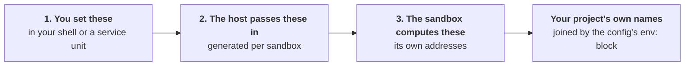

Every environment variable sandboxr reads or writes, in three groups. Mixing the groups up is the
source of most confusion, so the groups come first.



Group 1 is yours. Group 2 is written for you on every `sandboxr up`. Group 3 never leaves the
container until your `env:` block gives it one of your project's names.

One thing is in none of the three: your project's own third-party credentials, which arrive as a
file mounted into the container. They get a section of their own, after group 2, along with the
order everything above is applied in.

## 1. Variables you set

### On any machine

| Variable | Default | What it does |
|---|---|---|
| `SANDBOXR_HOME` | `~/.sandboxr` | Everything sandboxr keeps on the host. Never put it inside a repository |
| `SANDBOXR_WORKSPACE` | `$SANDBOXR_HOME/workspace` | Where managed projects live. Its own variable so the repositories can sit on a different disk |
| `SANDBOXR_DOMAIN` | `sbx.localhost` | The hostname suffix |
| `SANDBOXR_HTTP_PORT` | `80` | Where the router publishes HTTP |
| `SANDBOXR_HTTPS_PORT` | `443` | Where the router publishes HTTPS |
| `SANDBOXR_TTL_HOURS` | `12` | How long a sandbox may sit unused. **`config.yaml` beats this** |
| `SANDBOXR_REAP_MINUTES` | `5` | How often the dashboard looks for idle sandboxes. **`0` turns it off** |
| `SANDBOXR_PASSWORD` | — | The dashboard's password. Grants every project |
| `SANDBOXR_PASSWORD_<PROJECT>` | — | A password granting one project |
| `SANDBOXR_PROJECTS_<PROJECT>` | the suffix, lower-cased | A comma-separated list overriding what that password grants |
| `SANDBOXR_CACHE_TTL_HOURS` | `24` | How long a cached seed is reused before it is taken again |
| `SANDBOXR_INSTALL` | found by walking up | Where sandboxr itself is checked out |
| `SANDBOXR_IMAGE` | the built project layer | **Skips the project image build entirely** |
| `SANDBOXR_ROUTER_IMAGE` | a pinned Traefik | Override the router image |
| `SANDBOXR_DASHBOARD_IMAGE` | the built dashboard image | Override the dashboard image |

`.localhost` is why the default domain needs no setup: browsers and macOS resolve any name under it
to the loopback address on their own.

> [!WARNING] `SANDBOXR_IMAGE` skips the project layer
> With it set, `up` never renders or builds the project's own image. Whatever you named is what the
> sandbox has, toolchains and dependencies included. Useful for debugging an image, and confusing
> when you have forgotten it is exported.

`SANDBOXR_REAP_MINUTES` is read in whole minutes and clamped between `0` and `1440`. Anything under
one minute truncates to zero, which is off rather than a busy loop. **`0` is the honest setting on a
laptop**, because the reaper lives in the dashboard process and a laptop's dashboard is usually
stopped. See [Just the CLI, on my laptop](../setups/cli-only.md).

### The setting that is a file, not a variable

How long a sandbox may sit unused lives in `~/.sandboxr/config.yaml`, which `sandboxr init` writes
with the setting explained in it.

```yaml
ttl: 12h
projects:
  acme-monorepo: { ttl: 3d }
```

The key is the project's workspace directory — the name in every dashboard URL — or the `project:`
its own `sandboxr.yaml` declares. Either works.

Most specific wins:

1. `--ttl` on the command, or the dashboard's field
2. the project's entry in `config.yaml`, under either of its names
3. the file's top-level `ttl`
4. `SANDBOXR_TTL_HOURS`
5. the built-in `12h`

The variable sits **below** the file on purpose. A variable is set once by whoever installed the
service and then forgotten; the file is what somebody edits when they want a different answer. An
edit that lost to a forgotten variable is the worst kind of not working.

The same file holds `github:`, which decides whether a project's sandboxes carry this machine's
GitHub token. That one has **no flag and no environment variable** — the project's entry, then the
file's top-level value, then the built-in `none`. See [Access and security](../access.md).

### For a MySQL project

| Variable | Default | What it is for |
|---|---|---|
| `SANDBOXR_SOURCE_DB_USER` | `root` | Reading the database you are copying **from** |
| `SANDBOXR_SOURCE_DB_PASSWORD` | empty | The same. An empty value omits the flag entirely |
| `SANDBOXR_DB_USER` | `sandboxr` | The user the app connects as, inside the sandbox |
| `SANDBOXR_DB_PASSWORD` | `sandboxr` | Its password |
| `SANDBOXR_DB_ROOT_PASSWORD` | `sandboxr` | Root inside the sandbox's own server |
| `SANDBOXR_DB_NAME` | the project name, non-alphanumerics folded to `_` | The database inside the sandbox |
| `SANDBOXR_MYSQL_IMAGE` | `mysql:<database.version>`, else `mysql:8.4` | The image a dump is restored into on the host |

The sandbox's own MySQL server is initialised with **no root password**. It listens only on the
container's loopback and its contents are disposable, so a password there would protect nothing. The
app user gets one anyway, because application config expects one.

> [!IMPORTANT] `SANDBOXR_DB_ROOT_PASSWORD` is half of a known defect
> The container initialises root without a password; the host driver defaults to `sandboxr`. Every
> host-side `mysql` call into a running sandbox therefore fails with `Error 1045: Access denied`,
> which is why `up` can report "Provisioning did not complete" against a sandbox that came up
> perfectly. Nothing is lost — the container half does the work. It is recorded in
> [What is built](status.md) and in the contract, and it is not fixed.

### For the dashboard

Set these on the dashboard's own process. `sandboxr init` sets the ones that matter, and forwards
the agent-session ones it finds.

| Variable | Default | Range |
|---|---|---|
| `SANDBOXR_PORT`, or `PORT` | `8080` | 1–65535 |
| `SANDBOXR_HOST` | `127.0.0.1` | |
| `SANDBOXR_DOCKER_SOCKET` | `/var/run/docker.sock` | |
| `SANDBOXR_SESSION_HOURS` | `168` | 1–8760 |
| `SANDBOXR_APP_SESSION_MINUTES` | `60` | 1–1440 |
| `SANDBOXR_SESSION_SECRET` | a file under `$SANDBOXR_HOME/state` | |
| `SANDBOXR_INSECURE_COOKIES` | off | `1`, `true`, `yes` or `on` turns it on |
| `SANDBOXR_TRUST_PROXY` | on | |
| `SANDBOXR_LOGIN_MAX_ATTEMPTS` | `5` | 1–1000 |
| `SANDBOXR_LOGIN_WINDOW_SECONDS` | `60` | 1–86400 |
| `SANDBOXR_CONTAINER_SCRIPTS` | `/opt/sandboxr/scripts` | |
| `SANDBOXR_TTL_HOURS` | `12` | 1–8760. Here it is only the *default in the form* |
| `SANDBOXR_REAP_MINUTES` | `5` | 0–1440 |

A value outside a range is clamped rather than refused, and an unreadable one falls back to the
default. The dashboard refusing to boot over a malformed variable would take every sandbox on the
machine with it.

Two of those deserve a sentence each. `SANDBOXR_INSECURE_COOKIES` exists only for
`http://localhost:8080` with no router in front; a session cookie sent over plain HTTP is readable
by anything on the path, and the server says so at startup when you turn it off.
`SANDBOXR_APP_SESSION_MINUTES` is short because it is set on a hostname the dashboard cannot answer
on and therefore cannot clear — expiry is the whole of revocation for it.

**Every `SANDBOXR_PASSWORD*` variable is read once at startup and then deleted from the
environment**, so nothing the dashboard spawns inherits it.

<details class="agent">
<summary><b>Details for an agent</b> — how a password becomes a set of projects</summary>

The table is built in `packages/server/src/auth/passwords.ts`.

- `SANDBOXR_PASSWORD` grants `*` — every project.
- `SANDBOXR_PASSWORD_<NAME>` grants the single project `<name>`, lower-cased with `_` turned into
  `-`. So `SANDBOXR_PASSWORD_WIDGET_SHOP` grants `widget-shop`.
- `SANDBOXR_PROJECTS_<NAME>`, when set, replaces that: a comma-separated list, trimmed and
  lower-cased. One password for a group of projects is a real case.
- An empty value is ignored, so `SANDBOXR_PASSWORD=` configures nothing rather than an empty
  password.

Each password is hashed with scrypt at startup and the plaintext is dropped. Verification hashes the
candidate against **every** entry before deciding, so the timing does not leak how many passwords
are configured.

</details>

### For agent sessions

| Variable | Default | What it does |
|---|---|---|
| `SANDBOXR_CLAUDE_TOKEN` | — | The credential an [agent session](../guides/agent-sessions.md) runs with, unless the sandbox can read a login |
| `SANDBOXR_CLAUDE_MCP` | none | MCP servers every session is given, as JSON |
| `SANDBOXR_CLAUDE_MODEL` | `claude-opus-5` | Which model a session runs on when nothing picks one |
| `SANDBOXR_CLAUDE_PERMISSION_MODE` | `auto` | Which mode a session *starts* in |
| `SANDBOXR_CLAUDE_CREDENTIALS` | the host's `~/.claude/.credentials.json`, when it exists | Where the host keeps its Claude Code login |

<details class="agent">
<summary><b>Details for an agent</b> — every value each of the five accepts, and what an unreadable one costs</summary>

**`SANDBOXR_CLAUDE_TOKEN`** — mint it with `claude setup-token` on the host. It is passed into the
container as `CLAUDE_CODE_OAUTH_TOKEN` for the length of a session and written nowhere. Without it,
and without a host login to share, opening a session fails and says so. `CLAUDE_CODE_OAUTH_TOKEN` is
read as a fallback, for a host that already has one set. An empty value is treated as absent.

**`SANDBOXR_CLAUDE_MCP`** — either the whole JSON a `.mcp.json` holds, or just the `mcpServers` map
inside it; both spellings are accepted because pasting the wrong one is the obvious mistake. This is
the *only* route: a setup-token does not load claude.ai connectors, so nothing added there is visible
inside a sandbox. A value that will not parse becomes no servers rather than a dashboard that will
not boot.

**`SANDBOXR_CLAUDE_MODEL`** — one of `claude-opus-5`, `claude-fable-5`, `claude-sonnet-5`,
`claude-opus-4-8`, `claude-haiku-4-5`. Anything else falls back to `claude-opus-5`. A session opened
on a specific model runs on that one instead; this is only the answer when nothing asks.

**`SANDBOXR_CLAUDE_PERMISSION_MODE`** — one of `auto`, `acceptEdits`, `manual`, `plan`, `dontAsk`.
Anything else falls back to `auto`, and that includes `bypassPermissions`: it is a spelling of
`--dangerously-skip-permissions`, which Claude Code refuses when running as root, and every sandbox
is root. Honouring it would give you a dashboard where every session died instantly and silently. It
applies to sessions and never to a side question.

**`SANDBOXR_CLAUDE_CREDENTIALS`** — resolved for you at `sandboxr init`, from the host's
`CLAUDE_CONFIG_DIR` or `$HOME/.claude`, and forwarded to the dashboard, which cannot see your home
directory to work it out for itself. When that file exists it is bind-mounted read-write into every
sandbox at `/root/.claude/.credentials.json`, so one login is *shared* rather than copied. Set it
yourself only for a credential kept somewhere unusual. **On macOS that file is usually not a login**
— it holds MCP OAuth tokens, while the account credential is in the login keychain — and mounting
one costs you the session's credential entirely:
[why, and what to do](../guides/agent-sessions.md#on-macos-that-file-is-usually-not-your-login). A path that names nothing is worse than no
path at all, because Docker answers a missing bind source by creating a directory. So sandboxr
checks that the file exists and is non-empty before forwarding it. A credential deleted afterwards
needs another `init` to be noticed.

`init` forwards exactly four of these into the dashboard container by name:
`SANDBOXR_CLAUDE_TOKEN`, `SANDBOXR_CLAUDE_MODEL`, `SANDBOXR_CLAUDE_MCP` and
`SANDBOXR_CLAUDE_PERMISSION_MODE`. A named list rather than a wildcard, because the dashboard is the
one container on the machine holding a credential.

</details>

### For the orchestrator

Set these on the [orchestrator](../guides/orchestrator.md) daemon's own process. It also reads
`SANDBOXR_HOME` — the same run index the dashboard writes — and reuses `SANDBOXR_CLAUDE_TOKEN` and
`SANDBOXR_CLAUDE_MODEL` above to fork a session for a summary.

| Variable | Default | What it does |
|---|---|---|
| `SANDBOXR_ORCHESTRATOR_PORT` | `4600` | The loopback port Claude Code's hooks post to |
| `SANDBOXR_ORCHESTRATOR_SUMMARIES` | on | `0` stops it forking sessions for summaries |
| `SANDBOXR_VOICE_SOCKET` | — | The voice sidecar's socket. Unset runs without voice |
| `SANDBOXR_TELEGRAM_SOCKET` | — | The telegram sidecar's socket. Unset runs without calls |
| `SANDBOXR_TELEGRAM_CHAT_ID` | — | The group voice chat the userbot joins |
| `SANDBOXR_TELEGRAM_USER_ID` | — | Who it brings into that chat |

To run the orchestrator **inside the dashboard** instead, set these on the dashboard's own
process (see [In the dashboard](../guides/orchestrator.md#in-the-dashboard)):

| Variable | Default | What it does |
|---|---|---|
| `SANDBOXR_ORCHESTRATOR` | off | Any non-empty value but `0` turns on the dashboard's Orchestrator panel |
| `SANDBOXR_VOICE_SOCKET` | unset | The voice sidecar's socket. Without it the panel has no voice toggle and says so — everything else works |
| `SANDBOXR_ORCHESTRATOR_STALL_MS` | model default | How long a quiet session waits before it is a question — lower it to try the panel out |
| `SANDBOXR_VOICE_SOCKET` | — | The voice sidecar's socket, to speak escalations and carry the browser's audio |

The voice sidecar reads `SANDBOXR_VOICE_STREAMED` (or `--streamed`): set it so the sidecar's device
is the socket rather than a local microphone, which is what the browser and the container both need.

The **hook command** each session runs reads one variable of its own,
`SANDBOXR_ORCHESTRATOR_URL`. Unset, it posts to `http://127.0.0.1:4600/hooks`, which is right for
`claude` on the host. A session running inside a sandbox container needs it set to the daemon's
address on the docker-bridge gateway — see the reachability note in
[the orchestrator guide](../guides/orchestrator.md#2-point-the-hooks-at-the-daemon).

<details class="agent">
<summary><b>Details for an agent</b> — the two Python sidecars' own variables</summary>

Each sidecar takes the same values as a flag or an environment variable, because the daemon's
wiring starts it, not a person. Every one has a `--flag` twin; the flag wins where both are given.

**The voice sidecar** (`sidecars/voice`). A Piper voice model is the one hard requirement:

| Variable | Default | What it is |
|---|---|---|
| `SANDBOXR_VOICE_SOCKET` | `/tmp/sandboxr-voice.sock` | The socket the daemon connects to |
| `SANDBOXR_PIPER_MODEL` | — | Path to a Piper `.onnx` voice. Required |
| `SANDBOXR_PIPER_CONFIG` | beside the model | The voice's JSON config, if it is not alongside |
| `SANDBOXR_WHISPER_SIZE` | `base.en` | The Whisper model size |
| `SANDBOXR_WHISPER_DEVICE` | `cpu` | Where Whisper runs |
| `SANDBOXR_WHISPER_COMPUTE` | `int8` | Its compute type |
| `SANDBOXR_VAD_THRESHOLD` | `0.5` | How loud counts as speech, for Silero |
| `SANDBOXR_ENDPOINT_SILENCE_MS` | `700` | The silence that ends a turn |

**The telegram sidecar** (`sidecars/telegram`) takes the same Piper and Whisper variables, plus
its own. The three credentials are **read from the environment only, never a flag**, because a
flag lands in shell history and process listings:

| Variable | Default | What it is |
|---|---|---|
| `SANDBOXR_TELEGRAM_SOCKET` | `/tmp/sandboxr-telegram.sock` | The socket the daemon connects to |
| `SANDBOXR_TELEGRAM_API_ID`, `SANDBOXR_TELEGRAM_API_HASH` | — | From `my.telegram.org`. Required, environment only |
| `SANDBOXR_TELEGRAM_SESSION` | `sandboxr` | The Telethon session name |
| `SANDBOXR_TELEGRAM_CHAT_ID`, `SANDBOXR_TELEGRAM_USER_ID` | — | The group voice chat, and who to bring in |

The daemon itself also reads `SANDBOXR_CLAUDE_HAS_LOGIN` (`1` when the machine shares a Claude
login, so a summary fork withholds the setup token just as the dashboard does).

</details>

### The one variable that is not ours

| Variable | Default | What it does |
|---|---|---|
| `GH_TOKEN`, or `GITHUB_TOKEN` | whatever `gh auth token` answers on the host | Reads pull requests, lists the repositories the dashboard offers, and clones a private one |

That is `gh`'s own variable. The dashboard passes it to `gh` and `git` by simply being in their
environment.

It has to be a **value**, and the reason is easy to trip over. `sandboxr init` mounts the host's
`~/.config/gh` into the container, but on macOS `gh auth login` keeps the token in the login
keychain. The mounted `hosts.yml` then names your account and carries no credential, and a keychain
does not cross into a container. So `init` runs `gh auth token` on the host and passes the result in.

Set the variable yourself when there is no `gh` to ask, which is the ordinary case on a server. It
wins over `gh auth token` when both are available.

> [!NOTE] The token is captured when `sandboxr init` runs
> It is not read afresh per request. Sign in again on the host, or let the token expire, and the
> dashboard is still holding the old one until you run `sandboxr init` again. Without a token it
> still boots and says so once: private repositories and pull requests are simply not readable.

## 2. Variables the host passes into a container

Written to `~/.sandboxr/build/<project>/<slug>.env` on every `up`, and handed to `docker run`. You
do not set these.

| Variable | Present when | Value |
|---|---|---|
| `SANDBOXR_SLUG` | always | **The one variable the container requires** |
| `SANDBOXR_PROJECT` | always | the `project:` name |
| `SANDBOXR_DOMAIN` | always | the domain in use |
| `SANDBOXR_ACCESS` | always | `public` or `private` |
| `SANDBOXR_SCHEME` | always | `http` or `https`, as the router is actually serving |
| `SANDBOXR_PUBLIC_PORT` | always | the router's port when it is not the scheme's default; empty otherwise |
| `SANDBOXR_DB_USER`, `SANDBOXR_DB_PASSWORD` | `driver: mysql` | `sandboxr` / `sandboxr` unless you set them |
| `SANDBOXR_S3_KEY`, `SANDBOXR_S3_SECRET` | `storage.driver: minio` | `sandboxr` / `sandboxr` |
| `SANDBOXR_WITH` | `up --with` was used | the comma-separated list |
| `SANDBOXR_SEED` | a seed source was chosen | `local`, `file` or `fixtures` |
| `CLAUDE_CONFIG_DIR` | always | `/root/.claude` |
| `GIT_AUTHOR_NAME`, `GIT_AUTHOR_EMAIL`, `GIT_COMMITTER_NAME`, `GIT_COMMITTER_EMAIL` | the host has a `git config user.name` and `user.email` | the host's identity |
| `GH_TOKEN` | `config.yaml` says `github: token` for this project | the host's token |

That is the whole of what `docker run` is told. **The project's own credentials are not in it.**
They arrive as a file mounted into the container instead — see below.

<details class="agent">
<summary><b>Why it works this way</b> — the four <code>GIT_*</code> variables, and why the scheme comes from the host</summary>

**The four `GIT_*` variables are how a sandbox knows who a commit is by.** A sandbox has no
`~/.gitconfig`, and the host's is deliberately not mounted: it names a credential helper and a
signing key that do not exist inside a container. Without them `git commit` refuses outright — git
tries to invent an address from the hostname, and a container hostname has no domain. Both pairs are
set, because git fails on whichever is missing.

**`SANDBOXR_SCHEME` and `SANDBOXR_PUBLIC_PORT` come from the host because only the host knows.** The
router terminates TLS only when a trusted certificate exists on the machine, and it may be published
on non-default ports. The container builds every `SANDBOXR_URL_<LABEL>` from these two, and a URL
missing the port points at whatever else owns 443 on that machine.

**`CLAUDE_CONFIG_DIR` is load-bearing.** Claude Code keeps its token, settings and history under
`~/.claude`, and keeps the OAuth account, personal MCP servers and per-project trust in
`~/.claude.json` — a file *beside* that directory. Mounting the directory alone persists the history
and loses the login, which looks like the volume not working at all.

`GH_TOKEN` is off by default. Turning it on is a decision worth making on purpose: the credential
`gh auth token` prints is usually one that can push to every repository you can reach. See
[Access and security](../access.md).

</details>

## The project's credentials, which are none of those three

`~/.sandboxr/secrets/<project>.env` is **bind-mounted read-only** at `/sandboxr/secrets.env`, and
the container reads it before it derives anything of its own. It is not an `--env-file` and it is
not in `docker inspect`.

Three things follow from it being a file the container reads rather than something `docker run` was
told:

- **An edited credential reaches a running sandbox on a restart.** `sandboxr stop` then `start`, or
  Restart services in the dashboard.
- **A value baked into a front-end bundle at build time needs a rebuild as well** — a `VITE_*`, a
  `NEXT_PUBLIC_*`. It is already in the built files.
- **The names the sandbox derives for itself are refused in that file**, on the host, when you set
  them. Nothing else would stop an imported `DB_HOST` from pointing a disposable copy at a real
  database, because the file is read first.

[Secrets](../configuration/secrets.md) is how the file is written.

### The order of precedence, in full

Lowest to highest. This is the whole answer for any name set twice:

1. **the project's secrets file** — mounted, read first, and every name already set is left alone;
2. **what the host passes in** — the generated `<slug>.env` above, plus the git identity and any
   GitHub token;
3. **what the sandbox derives for itself** — `SANDBOXR_DB_*`, `SANDBOXR_S3_*`, `SANDBOXR_URL_*`,
   group 3 below;
4. **the project's `env:` map**, expanded with `envsubst` against everything above it.

Two of those orderings have a failure that looks nothing like its cause.

**(3) beating (1) is what stops anything outside a sandbox redirecting it at something that is not
its own.** A `DB_HOST` in a secrets file cannot win, whatever it says.

> [!WARNING] A credential under a name the `env:` map also defines is silently overwritten
> The map is expanded last. Nothing fails, the variable has a value, and it is the map's rather
> than yours. `sandboxr secrets list` and the dashboard's Environment panel both name which
> variables those are, because nothing else would.

## 3. Variables the sandbox works out for itself

Derived inside the container from `plan.json`, and exported before anything starts. This is the group
your `env:` block reaches.

| Variable | Present when |
|---|---|
| `SANDBOXR_DB_DRIVER`, `SANDBOXR_DB_NAME`, `SANDBOXR_DB_DIR` | always |
| `SANDBOXR_DB_HOST`, `_PORT`, `_USER`, `_PASSWORD` | `driver: mysql` |
| `SANDBOXR_DB_FILE` | `driver: sqlite` |
| `SANDBOXR_D1_DIR`, `SANDBOXR_D1_OWNER` | `driver: d1` |
| `SANDBOXR_S3_ENDPOINT`, `_KEY`, `_SECRET`, `_REGION` | `storage.driver: minio` |
| `SANDBOXR_URL_<LABEL>` | one per app label |
| `SANDBOXR_PORT_<SERVICE>` | one per port-holding service |
| `SANDBOXR_SERVICE` | inside one supervised service, naming itself |
| `SANDBOXR_ENV_READY` | `1`, once the derivation has run. It is what makes sourcing it twice a no-op |
| `SANDBOXR_SANDBOX` | `true`, always. Baked into the base image, so it is how a script tells it is running inside a sandbox at all |

Two more are set on the **migration command** rather than on the whole container:
`SANDBOXR_MIGRATE_SINCE` when `migrate.since` is set, and `SANDBOXR_MIGRATION_LOCK` for `mysql` — an
advisory-lock name nobody else can be holding.

`SANDBOXR_URL_<LABEL>` and `SANDBOXR_PORT_<SERVICE>` upper-case the name and turn hyphens into
underscores. A label `admin-api` becomes `SANDBOXR_URL_ADMIN_API`.

### Two you have to consume yourself

**`SANDBOXR_MIGRATE_SINCE`** — sandboxr cannot guess a runner's flag spelling, so your command has to
reference it:

```yaml
migrate:
  command: go run ./cmd/migrate --since "$SANDBOXR_MIGRATE_SINCE"
```

**`SANDBOXR_D1_DIR` and `SANDBOXR_DB_FILE`** — a file-backed runtime writes into the worktree unless
you point it at the sandbox's own directory. Both the migrate command and the owner's serve command
need it. `sandboxr doctor` warns when it cannot see the variable in the command.

### Why this group exists at all

The rule that makes a sandbox safe: **nothing describing *where* something runs may be imported from
a `.env` file.** Import a developer's `DB_HOST` and you get a disposable container pointed at their
real database, and nothing errors.

So the sandbox derives its own addresses under a `SANDBOXR_` prefix, and your project says what it
calls the same things:

```yaml
env:
  DB_HOST: "${SANDBOXR_DB_HOST}"
  DB_NAME: "${SANDBOXR_DB_NAME}"
  S3_ENDPOINT: "${SANDBOXR_S3_ENDPOINT}"
  VITE_APP_URL: "${SANDBOXR_URL_APP}"
```

Values go through substitution, never a shell, so a value is data and never a command.

> [!NOTE] `docker exec` does not inherit group 3
> The container exports these before it starts its services, so every supervised service has them. A
> command you run by hand with `docker exec` does not. `sandboxr shell`, `db shell` and `db snapshot`
> pass them for you, and each container script sources the derivation for itself.

## Setting them

```bash
export SANDBOXR_PASSWORD='something long and random'
sandboxr init
```

`SANDBOXR_DOMAIN` needs nothing locally: `sbx.localhost` already resolves.

On a server, put them in the service unit's environment rather than a shell profile. A service
started at boot has no login shell, and `SANDBOXR_HOME` falling back to a service account's home
directory puts the state somewhere nobody looks. See
[On a server, for a team](../setups/shared-server.md).

---

**Next:** [Paths](paths.md) for where each of these ends up on disk, or
[Secrets](../configuration/secrets.md) for the one file that holds your project's credentials, and
how you edit it.
