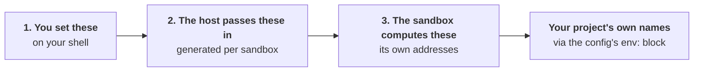

Three groups, and mixing them up is the source of most confusion.



## 1. Variables you set

### On any machine

| Variable | Default | What it does |
|---|---|---|
| `SANDBOXR_HOME` | `~/.sandboxr` | Everything sandboxr keeps on the host. Never put it inside a repository |
| `SANDBOXR_WORKSPACE` | `$SANDBOXR_HOME/workspace` | Where the projects the dashboard can start live, one directory each. Its own variable so the repositories can sit on a different disk |
| `SANDBOXR_TTL_HOURS` | `12` | How long a sandbox may sit unused before it is stopped. **`~/.sandboxr/config.yaml` beats this** — see below |
| `SANDBOXR_REAP_MINUTES` | `5` | How often the dashboard looks for sandboxes that have sat unused too long. **`0` turns it off** — which is the honest setting for a machine whose dashboard is usually not running, since nothing else enforces a lifetime |
| `SANDBOXR_DOMAIN` | `sbx.localhost` | The hostname suffix |
| `SANDBOXR_HTTP_PORT` | `80` | The port the router publishes HTTP on |
| `SANDBOXR_HTTPS_PORT` | `443` | The port the router publishes HTTPS on |
| `SANDBOXR_PASSWORD` | — | The dashboard's password. Grants every project |
| `SANDBOXR_PASSWORD_<PROJECT>` | — | A password granting one project. The name is the project, not the person |
| `SANDBOXR_PROJECTS_<PROJECT>` | derived | A comma-separated list overriding what that password grants |
| `SANDBOXR_IMAGE` | the built project layer | **Short-circuits the project image build entirely.** Use a hand-built image |
| `SANDBOXR_ROUTER_IMAGE` | a pinned Traefik | Override the router image |
| `SANDBOXR_DASHBOARD_IMAGE` | the built dashboard image | Override the dashboard image |
| `SANDBOXR_INSTALL` | found by walking up | Where sandboxr itself is checked out |
| `SANDBOXR_CACHE_TTL_HOURS` | `24` | How long a cached seed is used before it is re-taken |

> [!WARNING] `SANDBOXR_IMAGE` skips the project layer
> With it set, `up` never renders or builds the project's own image, so the toolchain and
> dependencies in whatever you named are what the sandbox has. Useful for debugging an image, and
> confusing if you forget it is exported.

### The one setting that is a file, not a variable

How long a sandbox may sit unused is read from `~/.sandboxr/config.yaml`, which `sandboxr init`
writes with the setting explained in it:

```yaml
ttl: 12h
projects:
  acme: { ttl: 3d }
```

Most specific wins: `--ttl` on the command, then the project's entry, then the file's top-level
`ttl`, then `SANDBOXR_TTL_HOURS`, then the built-in twelve hours. The variable sits below the file
because it is what a service unit sets once and everybody forgets — an edit to the file that lost to
it would be the worst kind of not working. Full description in
[Lifetimes](../guides/managed-sandboxes.md).

### For a MySQL project

| Variable | Default | What it is for |
|---|---|---|
| `SANDBOXR_SOURCE_DB_USER` | `root` | Reading the database you are copying **from** |
| `SANDBOXR_SOURCE_DB_PASSWORD` | empty | The same. An empty value omits the flag entirely |
| `SANDBOXR_DB_USER` | `sandboxr` | The user the app connects as, inside the sandbox |
| `SANDBOXR_DB_PASSWORD` | `sandboxr` | Its password |
| `SANDBOXR_DB_ROOT_PASSWORD` | `sandboxr` | Root inside the sandbox's own server |
| `SANDBOXR_DB_NAME` | the project name, non-alphanumerics folded to `_` | The database inside the sandbox |
| `SANDBOXR_MYSQL_IMAGE` | `mysql:<database.version>` | The image a dump is restored into on the host |

The sandbox's own server is initialised with no root password. It listens only on the container's
loopback and its contents are disposable, so a password there would protect nothing. The app user
gets one anyway, because application config expects one.

### For the dashboard

Set on the dashboard's own process. `sandboxr init` sets the ones that matter.

| Variable | Default |
|---|---|
| `SANDBOXR_PORT` (or `PORT`) | `8080` |
| `SANDBOXR_HOST` | `127.0.0.1` |
| `SANDBOXR_DOCKER_SOCKET` | `/var/run/docker.sock` |
| `SANDBOXR_SESSION_HOURS` | `168` |
| `SANDBOXR_APP_SESSION_MINUTES` | `60` — how long a private app stays open in a browser |
| `SANDBOXR_SESSION_SECRET` | a file under `$SANDBOXR_HOME/state` |
| `SANDBOXR_INSECURE_COOKIES` | `0` — set to `1` when the router serves plain HTTP |
| `SANDBOXR_TRUST_PROXY` | `true` |
| `SANDBOXR_LOGIN_MAX_ATTEMPTS` | `5` |
| `SANDBOXR_LOGIN_WINDOW_SECONDS` | `60` |
| `SANDBOXR_CONTAINER_SCRIPTS` | `/opt/sandboxr/scripts` |
| `SANDBOXR_CLAUDE_TOKEN` | — |
| `SANDBOXR_CLAUDE_MCP` | — |
| `SANDBOXR_CLAUDE_MODEL` | `claude-opus-5` |

Every `SANDBOXR_PASSWORD*` variable is read once at startup and then **deleted from the
environment**, so nothing the dashboard spawns inherits it.

#### The three for agent sessions

| Variable | What it does |
|---|---|
| `SANDBOXR_CLAUDE_TOKEN` | The credential every [agent session](../guides/agent-sessions.md) runs with. Mint it with `claude setup-token` on the host. Passed into the container as `CLAUDE_CODE_OAUTH_TOKEN` for the length of a session and written nowhere. Without it, opening a session fails and says so. `CLAUDE_CODE_OAUTH_TOKEN` is read as a fallback, for a host that already has one set |
| `SANDBOXR_CLAUDE_MCP` | MCP servers every session is given, as the JSON a `.mcp.json` holds — the whole file or just the `mcpServers` map. This is the *only* route: a setup-token does not load claude.ai connectors, so nothing you added there is visible inside a sandbox. A value that will not parse is treated as no servers rather than stopping the dashboard from booting |
| `SANDBOXR_CLAUDE_MODEL` | Which model a session runs on when the dashboard does not pick one. It has to be one of the models sandboxr offers — `claude-opus-5`, `claude-sonnet-5`, `claude-opus-4-8`, `claude-haiku-4-5` — and anything else falls back to `claude-opus-5` rather than stopping the dashboard from booting. A session opened on a specific model runs on that one instead; this is only the answer when nothing asks |

#### The one variable that is not ours

| Variable | Default | What it does |
|---|---|---|
| `GH_TOKEN` (or `GITHUB_TOKEN`) | whatever `gh auth token` answers on the host | Reads pull requests, lists the repositories Settings → Projects offers, and clones a private one |

`gh`'s own variable, not a sandboxr one, and the dashboard passes it to `gh` and `git` by simply
being in their environment.

It has to be a **value**, and the reason is easy to trip over. `sandboxr init` mounts the host's
`~/.config/gh` into the container, but on macOS `gh auth login` keeps the token in the login
keychain — so the mounted `hosts.yml` names your account and carries no credential, and a keychain
does not cross into a container. `init` therefore runs `gh auth token` on the host and passes the
result in. Set the variable yourself when there is no `gh` to ask, which is the ordinary case on a
server; it wins over `gh auth token` when both are available.

> [!NOTE] The token is captured when `sandboxr init` runs
> Not read afresh per request. Sign in again on the host, or let the token expire, and the
> dashboard is still holding the old one until you run `sandboxr init` again. Without a token it
> still boots, and says so once: private repositories and pull requests are simply not readable.

## 2. Variables the host passes into a container

Written to `~/.sandboxr/build/<project>/<slug>.env` on every `up` and handed to `docker run`. You
do not set these.

| Variable | Present when |
|---|---|
| `SANDBOXR_SLUG` | always — **the one variable the container requires** |
| `SANDBOXR_PROJECT`, `SANDBOXR_DOMAIN` | always |
| `SANDBOXR_ACCESS` | always — `public` or `private` |
| `SANDBOXR_SCHEME`, `SANDBOXR_PUBLIC_PORT` | always — so a URL the sandbox builds matches what the router serves |
| `SANDBOXR_DB_USER`, `SANDBOXR_DB_PASSWORD` | `driver: mysql` |
| `SANDBOXR_S3_KEY`, `SANDBOXR_S3_SECRET` | `storage: minio` |
| `SANDBOXR_WITH` | `up --with` was used |
| `SANDBOXR_SEED` | a seed source was chosen |

The project's secrets file, when one exists and is permitted, is passed as a second `--env-file`
**underneath** this one, so a generated value always wins over an imported one.

## 3. Variables the sandbox works out for itself

Derived inside the container from `plan.json` and exported before anything starts. This is the
group a project's `env:` block reaches.

| Variable | Present when |
|---|---|
| `SANDBOXR_DB_DRIVER`, `SANDBOXR_DB_NAME`, `SANDBOXR_DB_DIR` | always |
| `SANDBOXR_DB_HOST`, `_PORT`, `_USER`, `_PASSWORD` | `driver: mysql` |
| `SANDBOXR_DB_FILE` | `driver: sqlite` |
| `SANDBOXR_D1_DIR`, `SANDBOXR_D1_OWNER` | `driver: d1` |
| `SANDBOXR_S3_ENDPOINT`, `_KEY`, `_SECRET`, `_REGION` | storage is declared |
| `SANDBOXR_URL_<LABEL>` | one per app label, upper-cased with hyphens as underscores |
| `SANDBOXR_PORT_<SERVICE>` | one per port-holding service |
| `SANDBOXR_MIGRATE_SINCE` | `migrate.since` is set |
| `SANDBOXR_MIGRATION_LOCK` | `driver: mysql` — a lock name nobody else can be holding |
| `SANDBOXR_SANDBOX` | always, `true` — how a script tells it is inside one |

### Two you have to consume yourself

**`SANDBOXR_MIGRATE_SINCE`** — sandboxr cannot guess a runner's flag spelling, so the command in
your config has to use it:

```yaml
migrate:
  command: go run ./cmd/migrate --since "$SANDBOXR_MIGRATE_SINCE"
```

**`SANDBOXR_D1_DIR` / `SANDBOXR_DB_FILE`** — a file-backed runtime writes into the worktree unless
it is pointed at the sandbox's own directory. `sandboxr doctor` warns when it cannot see the
variable in the command.

## Why group 3 exists at all

The rule that nothing describing *where* something runs may be imported from a `.env` file is what
makes a sandbox safe. Import a developer's `DB_HOST` and you get a disposable container pointed at
their real database, and nothing errors.

So the sandbox derives its own addresses under a `SANDBOXR_` prefix, and the project says what it
calls the same things:

```yaml
env:
  DB_HOST: "${SANDBOXR_DB_HOST}"
  DB_NAME: "${SANDBOXR_DB_NAME}"
  S3_ENDPOINT: "${SANDBOXR_S3_ENDPOINT}"
  VITE_APP_URL: "${SANDBOXR_URL_APP}"
```

Substitution, never a shell, so a value is data.

> [!NOTE] `docker exec` does not inherit group 3
> The container exports these before it starts its services, so every supervised service has them.
> A command you run by hand with `docker exec` does not. `sandboxr shell`, `db shell` and
> `db snapshot` pass them for you; the container scripts each source the derivation for themselves.

## Setting them

```bash
export SANDBOXR_PASSWORD='something long and random'
# SANDBOXR_DOMAIN defaults to sbx.localhost, which is fine locally.
sandboxr init
```

For a server, put them in the service unit's environment rather than a shell profile. See
[running on a server](../running-on-a-server.md).

## Related

- [Secrets](../configuration/secrets.md) — what may and may not be imported
- [plan.json](../architecture/plan-json.md)
- [Paths](paths.md)
