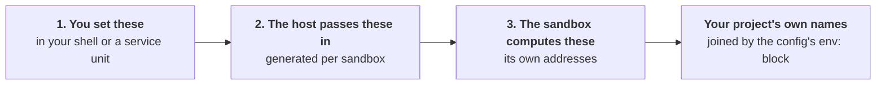

Every environment variable sandboxr reads or writes, in three groups. Mixing the groups up is the
source of most confusion, so the groups come first.



Group 1 is yours. Group 2 is written for you on every `sandboxr up`. Group 3 never leaves the
container until your `env:` block gives it one of your project's names.

One thing is in none of the three: your project's own third-party credentials, which arrive as a
file mounted into the container. They get a section of their own, after group 2, along with the
order everything above is applied in.

## 1. Variables you set

### On any machine

| Variable | Default | What it does |
|---|---|---|
| `SANDBOXR_HOME` | `~/.sandboxr` | Everything sandboxr keeps on the host. Never put it inside a repository |
| `SANDBOXR_WORKSPACE` | `$SANDBOXR_HOME/workspace` | Where managed projects live. Its own variable so the repositories can sit on a different disk |
| `SANDBOXR_DOMAIN` | `sbx.localhost` | The hostname suffix |
| `SANDBOXR_HTTP_PORT` | `80` | Where the router publishes HTTP |
| `SANDBOXR_HTTPS_PORT` | `443` | Where the router publishes HTTPS |
| `SANDBOXR_TTL_HOURS` | `12` | How long a sandbox may sit unused. **`config.yaml` beats this** |
| `SANDBOXR_CACHE_TTL_HOURS` | `24` | How long a cached seed is reused before it is taken again |
| `SANDBOXR_INSTALL` | found by walking up | Where sandboxr itself is checked out |
| `SANDBOXR_IMAGE` | the built project layer | **Skips the project image build entirely** |
| `SANDBOXR_ROUTER_IMAGE` | a pinned Traefik | Override the router image |

`.localhost` is why the default domain needs no setup: browsers and macOS resolve any name under it
to the loopback address on their own.

> [!WARNING] `SANDBOXR_IMAGE` skips the project layer
> With it set, `up` never renders or builds the project's own image. Whatever you named is what the
> sandbox has, toolchains and dependencies included. Useful for debugging an image, and confusing
> when you have forgotten it is exported.

### The setting that is a file, not a variable

How long a sandbox may sit unused lives in `~/.sandboxr/config.yaml`, which `sandboxr init` writes
with the setting explained in it.

```yaml
ttl: 12h
projects:
  acme-monorepo: { ttl: 3d }
```

The key is the project's workspace directory — the name sandboxr calls that project everywhere
else — or the `project:` its own `sandboxr.yaml` declares. Either works.

Most specific wins:

1. `--ttl` on the command
2. the project's entry in `config.yaml`, under either of its names
3. the file's top-level `ttl`
4. `SANDBOXR_TTL_HOURS`
5. the built-in `12h`

The variable sits **below** the file on purpose. A variable is set once by whoever installed the
service and then forgotten; the file is what somebody edits when they want a different answer. An
edit that lost to a forgotten variable is the worst kind of not working.

The same file holds `github:`, which decides whether a project's sandboxes carry this machine's
GitHub token. That one has **no flag and no environment variable** — the project's entry, then the
file's top-level value, then the built-in `none`. See [Access and security](../access.md).

### For a MySQL project

| Variable | Default | What it is for |
|---|---|---|
| `SANDBOXR_SOURCE_DB_USER` | `root` | Reading the database you are copying **from** |
| `SANDBOXR_SOURCE_DB_PASSWORD` | empty | The same. An empty value omits the flag entirely |
| `SANDBOXR_DB_USER` | `sandboxr` | The user the app connects as, inside the sandbox |
| `SANDBOXR_DB_PASSWORD` | `sandboxr` | Its password |
| `SANDBOXR_DB_ROOT_PASSWORD` | `sandboxr` | Root inside the sandbox's own server |
| `SANDBOXR_DB_NAME` | the project name, non-alphanumerics folded to `_` | The database inside the sandbox |
| `SANDBOXR_MYSQL_IMAGE` | `mysql:<database.version>`, else `mysql:8.4` | The image a dump is restored into on the host |

The sandbox's own MySQL server is initialised with **no root password**. It listens only on the
container's loopback and its contents are disposable, so a password there would protect nothing. The
app user gets one anyway, because application config expects one.

> [!IMPORTANT] `SANDBOXR_DB_ROOT_PASSWORD` is half of a known defect
> The container initialises root without a password; the host driver defaults to `sandboxr`. Every
> host-side `mysql` call into a running sandbox therefore fails with `Error 1045: Access denied`,
> which is why `up` can report "Provisioning did not complete" against a sandbox that came up
> perfectly. Nothing is lost — the container half does the work. It is recorded in
> [What is built](status.md) and in the contract, and it is not fixed.

### The one variable that is not ours

| Variable | Default | What it does |
|---|---|---|
| `GH_TOKEN`, or `GITHUB_TOKEN` | whatever `gh auth token` answers on the host | Reads pull requests, and clones a private repository |

That is `gh`'s own variable. sandboxr passes it to `gh` and `git` by simply being in their
environment.

Set it yourself when there is no `gh` to ask, which is the ordinary case on a server. It wins over
`gh auth token` when both are available, and a machine with neither simply has no token: nothing
fails, and private repositories and pull requests are not readable.

> [!NOTE] On the host it is read afresh, per command
> `up` asks for a token at the moment it needs one, so signing in again with `gh` takes effect on
> the very next command. A long-running process that captured the token when it started is a
> different matter, and says so where it is documented.

The same name appears in group 2 below. That is the token being handed **into** a sandbox, which
happens only when `config.yaml` opts that project in.

## 2. Variables the host passes into a container

Written to `~/.sandboxr/build/<project>/<slug>.env` on every `up`, and handed to `docker run`. You
do not set these.

| Variable | Present when | Value |
|---|---|---|
| `SANDBOXR_SLUG` | always | **The one variable the container requires** |
| `SANDBOXR_PROJECT` | always | the `project:` name |
| `SANDBOXR_DOMAIN` | always | the domain in use |
| `SANDBOXR_ACCESS` | always | `public` or `private` |
| `SANDBOXR_SCHEME` | always | `http` or `https`, as the router is actually serving |
| `SANDBOXR_PUBLIC_PORT` | always | the router's port when it is not the scheme's default; empty otherwise |
| `SANDBOXR_DB_USER`, `SANDBOXR_DB_PASSWORD` | `driver: mysql` | `sandboxr` / `sandboxr` unless you set them |
| `SANDBOXR_S3_KEY`, `SANDBOXR_S3_SECRET` | `storage.driver: minio` | `sandboxr` / `sandboxr` |
| `SANDBOXR_WITH` | `up --with` was used | the comma-separated list |
| `SANDBOXR_SEED` | a seed source was chosen | `local`, `file` or `fixtures` |
| `GIT_AUTHOR_NAME`, `GIT_AUTHOR_EMAIL`, `GIT_COMMITTER_NAME`, `GIT_COMMITTER_EMAIL` | the host has a `git config user.name` and `user.email` | the host's identity |
| `GH_TOKEN` | `config.yaml` says `github: token` for this project | the host's token |

That is the whole of what `docker run` is told. **The project's own credentials are not in it.**
They arrive as a file mounted into the container instead — see below.

<details class="why">
<summary><b>Why it works this way</b> — the four <code>GIT_*</code> variables, and why the scheme comes from the host</summary>

**The four `GIT_*` variables are how a sandbox knows who a commit is by.** A sandbox has no
`~/.gitconfig`, and the host's is deliberately not mounted: it names a credential helper and a
signing key that do not exist inside a container. Without them `git commit` refuses outright — git
tries to invent an address from the hostname, and a container hostname has no domain. Both pairs are
set, because git fails on whichever is missing.

**`SANDBOXR_SCHEME` and `SANDBOXR_PUBLIC_PORT` come from the host because only the host knows.** The
router terminates TLS only when a trusted certificate exists on the machine, and it may be published
on non-default ports. The container builds every `SANDBOXR_URL_<LABEL>` from these two, and a URL
missing the port points at whatever else owns 443 on that machine.

`GH_TOKEN` is off by default. Turning it on is a decision worth making on purpose: the credential
`gh auth token` prints is usually one that can push to every repository you can reach. See
[Access and security](../access.md).

</details>

## The project's credentials, which are none of those three

`~/.sandboxr/secrets/<project>.env` is **bind-mounted read-only** at `/sandboxr/secrets.env`, and
the container reads it before it derives anything of its own. It is not an `--env-file` and it is
not in `docker inspect`.

Three things follow from it being a file the container reads rather than something `docker run` was
told:

- **An edited credential reaches a running sandbox on a restart.** `sandboxr stop` then `start`.
- **A value baked into a front-end bundle at build time needs a rebuild as well** — a `VITE_*`, a
  `NEXT_PUBLIC_*`. It is already in the built files.
- **The names the sandbox derives for itself are refused in that file**, on the host, when you set
  them. Nothing else would stop an imported `DB_HOST` from pointing a disposable copy at a real
  database, because the file is read first.

[Secrets](../configuration/secrets.md) is how the file is written.

### The order of precedence, in full

Lowest to highest. This is the whole answer for any name set twice:

1. **the project's secrets file** — mounted, read first, and every name already set is left alone;
2. **what the host passes in** — the generated `<slug>.env` above, plus the git identity and any
   GitHub token;
3. **what the sandbox derives for itself** — `SANDBOXR_DB_*`, `SANDBOXR_S3_*`, `SANDBOXR_URL_*`,
   group 3 below;
4. **the project's `env:` map**, expanded with `envsubst` against everything above it.

Two of those orderings have a failure that looks nothing like its cause.

**(3) beating (1) is what stops anything outside a sandbox redirecting it at something that is not
its own.** A `DB_HOST` in a secrets file cannot win, whatever it says.

> [!WARNING] A credential under a name the `env:` map also defines is silently overwritten
> The map is expanded last. Nothing fails, the variable has a value, and it is the map's rather
> than yours. `sandboxr secrets list` names which variables those are, because nothing else would.

## 3. Variables the sandbox works out for itself

Derived inside the container from `plan.json`, and exported before anything starts. This is the group
your `env:` block reaches.

| Variable | Present when |
|---|---|
| `SANDBOXR_DB_DRIVER`, `SANDBOXR_DB_NAME`, `SANDBOXR_DB_DIR` | always |
| `SANDBOXR_DB_HOST`, `_PORT`, `_USER`, `_PASSWORD` | `driver: mysql` |
| `SANDBOXR_DB_FILE` | `driver: sqlite` |
| `SANDBOXR_D1_DIR`, `SANDBOXR_D1_OWNER` | `driver: d1` |
| `SANDBOXR_S3_ENDPOINT`, `_KEY`, `_SECRET`, `_REGION` | `storage.driver: minio` |
| `SANDBOXR_URL_<LABEL>` | one per app label |
| `SANDBOXR_PORT_<SERVICE>` | one per port-holding service |
| `SANDBOXR_SERVICE` | inside one supervised service, naming itself |
| `SANDBOXR_ENV_READY` | `1`, once the derivation has run. It is what makes sourcing it twice a no-op |
| `SANDBOXR_SANDBOX` | `true`, always. Baked into the base image, so it is how a script tells it is running inside a sandbox at all |

Two more are set on the **migration command** rather than on the whole container:
`SANDBOXR_MIGRATE_SINCE` when `migrate.since` is set, and `SANDBOXR_MIGRATION_LOCK` for `mysql` — an
advisory-lock name nobody else can be holding.

`SANDBOXR_URL_<LABEL>` and `SANDBOXR_PORT_<SERVICE>` upper-case the name and turn hyphens into
underscores. A label `admin-api` becomes `SANDBOXR_URL_ADMIN_API`.

### Two you have to consume yourself

**`SANDBOXR_MIGRATE_SINCE`** — sandboxr cannot guess a runner's flag spelling, so your command has to
reference it:

```yaml
migrate:
  command: go run ./cmd/migrate --since "$SANDBOXR_MIGRATE_SINCE"
```

**`SANDBOXR_D1_DIR` and `SANDBOXR_DB_FILE`** — a file-backed runtime writes into the worktree unless
you point it at the sandbox's own directory. Both the migrate command and the owner's serve command
need it. `sandboxr doctor` warns when it cannot see the variable in the command.

<details class="facts">
<summary><b>Fact sheet</b> — three names that are exported and read by nothing</summary>

`SANDBOXR_ACCESS` in group 2, and `SANDBOXR_D1_OWNER` and `SANDBOXR_S3_REGION` in this group, are
written into a container's environment and no script reads any of them back. They are there for
your `env:` map to reach and for a person debugging inside a shell, and they are listed here so
nobody goes looking for the code that consumes them. Setting one changes nothing on its own.

</details>

### Why this group exists at all

The rule that makes a sandbox safe: **nothing describing *where* something runs may be imported from
a `.env` file.** Import a developer's `DB_HOST` and you get a disposable container pointed at their
real database, and nothing errors.

So the sandbox derives its own addresses under a `SANDBOXR_` prefix, and your project says what it
calls the same things:

```yaml
env:
  DB_HOST: "${SANDBOXR_DB_HOST}"
  DB_NAME: "${SANDBOXR_DB_NAME}"
  S3_ENDPOINT: "${SANDBOXR_S3_ENDPOINT}"
  VITE_APP_URL: "${SANDBOXR_URL_APP}"
```

Values go through substitution, never a shell, so a value is data and never a command.

> [!NOTE] `docker exec` does not inherit group 3
> The container exports these before it starts its services, so every supervised service has them. A
> command you run by hand with `docker exec` does not. `sandboxr shell`, `db shell` and `db snapshot`
> pass them for you, and each container script sources the derivation for itself.

## Setting them

**Nothing reads a file.** sandboxr ships no `.env`, no `docker-compose.yml` and no settings file
that these are read from — `sandboxr` reads them out of its own environment, so you export them in
the shell you run it from.

```bash
export SANDBOXR_DOMAIN=sbx.example.com
sandboxr init
```

`SANDBOXR_DOMAIN` needs nothing locally: `sbx.localhost` already resolves.

If you would rather keep them in a file, keep them in a file of your own and source it first.
`set -a` exports every name the file sets, which is the difference between a list of settings and a
list of exports:

```bash
set -a && . ./.env && set +a
sandboxr up
```

That file is yours. Nothing looks for it, nothing reads it on your behalf, and its name is not
special.

On a server, put them in the service unit's environment rather than a shell profile. A service
started at boot has no login shell, and `SANDBOXR_HOME` falling back to a service account's home
directory puts the state somewhere nobody looks. See
[On a server, for a team](../setups/shared-server.md).

---

**Next:** [Paths](paths.md) for where each of these ends up on disk, or
[Secrets](../configuration/secrets.md) for the one file that holds your project's credentials, and
how you edit it.
