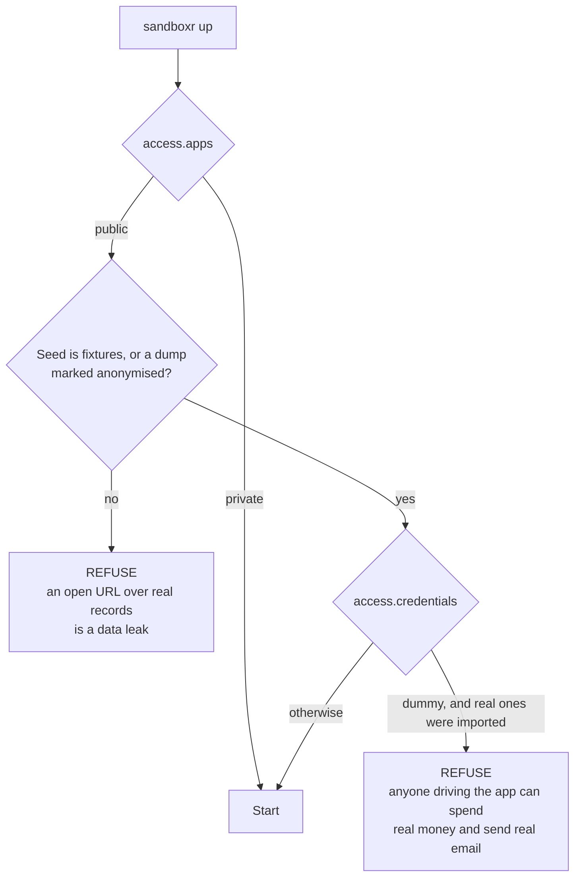

> **Written, never run** — Both refusals are implemented in packages/core/src/config/access.ts and covered by unit tests. Neither has fired during a real deployment, because no sandbox has been deployed anywhere yet.

**Read this page before you point a DNS record at a sandboxr host.** If you skim one thing, skim
the two conditions.

If a project's apps are open to anyone — `access.apps: public`, which is the default — sandboxr
**refuses to start** unless both of these hold:

1. **The data comes from fixtures, or from a dump somebody has marked as anonymised.** Never a copy
   of a live database.
2. **The third-party credentials are dummies**, unless the config explicitly opts in to real ones.

`access.apps: private` is the escape hatch. There is no third option and no override flag.



*Both gates, before the container starts. Not a warning at the end of the output.*


## Condition 1: where the data comes from

An open URL backed by real records is a data leak. Not a risk of one — an actual one, the moment
the URL is reachable.

It does not matter that the app requires a login:

- A sandbox runs unreleased code, which is exactly the code whose permission checks are least
  reviewed.
- Fixtures usually include accounts with known passwords, and a fixture login into a copy of live
  data is a login into real data.
- An API on an open hostname is an open API. Every endpoint the front-end does not call is still
  there.
- Search engines find hostnames. So do certificate transparency logs, which publish every name you
  issue a certificate for.

So a project with open apps may seed from `fixtures`, or from a `file` dump marked as anonymised,
and never from `local` — which means forking a database that is actually in use.

```yaml
database:
  seed_from:
    # No `local:` — copying a live database is refused for a project with open apps.
    file: /var/sandboxr/seeds/acme.sql.zst
    anonymised: true      # asserts this dump carries no real personal data
    fixtures: db/seeds/fixtures.sql
```

A `fixtures` seed is safe by definition and needs no flag.

> [!WARNING] `anonymised: true` is an assertion, not a guarantee — and that is deliberate
> sandboxr cannot tell an anonymised dump from a real one. Nothing can, from the outside.
>
> So the honest design is to make somebody **state it**, in a file that goes through review, rather
> than to imply a check that does not happen. The flag is the person who wrote the config saying
> "I have looked at this dump and it carries no real personal data", with their name on the commit.
>
> If you would not be comfortable saying that out loud in a review, use fixtures.

### "Anonymised" means anonymised

Worth being blunt, because this is where the requirement quietly gets downgraded:

- Blanking a `name` column while leaving `email` is not anonymisation.
- Hashing an email is not anonymisation if the hash can be reversed by guessing — and email
  addresses are extremely guessable.
- Free-text fields carry personal data: support notes, feedback, addresses typed into a "notes" box,
  machine-generated summaries about a person.
- Filenames and object-storage keys carry personal data. So do URLs.
- A "test" account containing a real customer's data is a real customer's data.

If you cannot describe the anonymisation in one sentence and defend it, use fixtures.

## Condition 2: the credentials

Anyone who can drive an open app can make it do whatever the app does. If its credentials are real,
that includes:

| The app can | So a stranger can |
|---|---|
| Send transactional email | Send email from your domain, to real addresses |
| Call a language-model provider | Spend your credit, as fast as a script can loop |
| Write to an analytics property | Poison the numbers your team makes decisions on |
| Write to object storage | Put whatever they like in your bucket |
| Call a payment provider | You do not want to finish this sentence |

None of that needs a vulnerability. It is the app working correctly.

So a project with open apps gets dummy values, and the opt-in is explicit:

```yaml
access:
  apps: public
  credentials: real     # and you are saying you accept what that means
```

The sandbox supplies its own versions of everything it can: its database is internal, its object
storage is internal, and the URLs its services use to reach each other are computed. That is why
anything describing *where* something runs is never imported at all — see
[secrets](../configuration/secrets.md#anything-describing-where-something-runs-is-never-imported).

<details>
<summary><b>Details for an agent:</b> exactly when each refusal fires, and the message you get</summary>

Both live in `packages/core/src/config/access.ts`.

**The seed refusal** is raised while the config is read, by `publicAccessViolations()`, and turned
into a `ConfigError` naming the field. `sandboxr up` is the command that enforces it — it is the one
command that decides to *start* something. Read-only commands such as `config`, `doctor` and
`secrets` load the config without enforcement, so they can still tell you what is wrong instead of
refusing to speak.

A config listing several seed sources is not a violation as long as **one** of them is permissible:
which source a run uses depends on the machine, so the choice is made when a sandbox starts.

```
database.seed_from.local: a public sandbox cannot be seeded by forking a live database —
  a public URL over real records is a data leak. Add database.seed_from.fixtures, mark a
  dump `anonymised: true`, or set access.apps to private
```

```
database.seed_from.file: a public sandbox may only restore a dump that is explicitly marked
  anonymised. Add `anonymised: true` beside the file if it is anonymised, or set
  access.apps to private
```

A `driver: none` project is exempt, because it has no data to leak.

**The credential refusal** is raised in `up` itself, by `allowsRealCredentials()`. It fires when the
project has an imported secrets file at all and the config has not opted in:

```
acme serves public apps, so it may not carry the real credentials in
  ~/.sandboxr/secrets/acme.env.
  Either set access.credentials to real (and accept that), or set access.apps to private.
```

Note what that check is and is not. It refuses on the **presence** of the imported secrets file, not
on an inspection of the values inside it — sandboxr cannot tell a real API key from a convincing
dummy. So the decision it forces is "did somebody import this project's real credentials onto this
host", which is a question that has an honest answer.

</details>

<details>
<summary><b>Why it works this way:</b> what a sandbox supplies for itself, so that dummy credentials are enough to run on</summary>

Dummy credentials are workable because a sandbox does not need real services for the things a
sandbox actually is.

- **The database is inside the container.** Nothing points at a shared server, so a connection
  string imported from a developer's `.env` would only ever be wrong.
- **Object storage is inside the container**, when the project declares any. Uploads land in the
  sandbox and go away with it.
- **The addresses services use to reach each other are computed** from the sandbox's own hostnames.

That is why anything describing *where* something runs — `DB_*`, storage endpoints, service URLs —
is never imported at all, whatever `access.credentials` says. It is a different rule with a
different reason: those values are not secret, they are simply wrong inside a sandbox.

Top-level `env:` in the config is the mapping between the two worlds. The sandbox exports what it
computed under `SANDBOXR_*` names, and the project says which of its own names those belong to:

```yaml
env:
  API_TOKEN: dummy
  APP_URL: "${SANDBOXR_URL_APP}"
```

Values are substituted, never run through a shell, so a value is data.

</details>

## Why refusals, not warnings

This is the part worth arguing with, so here is the argument.

A warning is a reasonable design when the cost of ignoring it is bounded and recoverable. You see
it, you weigh it, you proceed, and if you were wrong you fix it.

Neither of these failures is recoverable:

- **A leak cannot be un-leaked.** Once real records have been served to the internet you do not know
  who fetched them, and you have a disclosure obligation whatever you do next.
- **Spend cannot be un-spent**, and email cannot be un-sent. A stranger looping a request that
  triggers a model call can produce a bill overnight.

And warnings fail in exactly the situation that matters. They are printed during `up`, a command you
run dozens of times a day while thinking about something else. They scroll past. They get filtered
out of build logs. They become familiar, and familiar warnings are invisible.

A refusal is the only mechanism still working at six o'clock on a Friday when somebody is setting up
a demo in a hurry.

> [!CAUTION] The escape hatch is a config change, and that is the point
> `access.apps: private` is one line — and it is a line that ends up in a diff with a reviewer looking
> at it. That is the difference between a deliberate decision and a warning nobody read.

## Before you expose anything

Run through this before the DNS record exists.

- [ ] `access.apps` is left at `public` **only** where that is genuinely intended.
- [ ] No `seed_from.local` on the server. There is no local database container to fork there, and
      pointing it at a production database is the exact mistake the driver rules exist to prevent.
- [ ] The dump in `seed_from.file` really is anonymised, `anonymised: true` is beside it, and you
      can say who did it and how.
- [ ] `access.credentials` is left at `dummy`, or the real values on this host are ones you are
      content for a stranger to use.
- [ ] `secrets.keep` lists only names whose values are dummies on this host.
- [ ] `secrets.never` covers `DB_*`, `S3_*`, `*_URL`, and anything else describing where something
      runs.
- [ ] `SANDBOXR_PASSWORD` is set, long, random, and not sitting in a shell history file.
- [ ] Only ports 80 and 443 are open, and the Docker socket is not exposed over TCP.
- [ ] The certificate is a real one, not a local development authority.
- [ ] Any identity provider allowlists have the wildcard hostnames, on a **development-only**
      application — never the one production uses.
- [ ] You have opened the dashboard in a private browser window and confirmed it asks for the
      password.
- [ ] You have opened an app hostname in a private browser window and confirmed you see what you
      expect a stranger to see.

The last two take a minute and catch the mistakes that reading configuration does not.

## If the project needs real data

Set `access.apps: private`. The apps are then meant to sit behind the same session as the
dashboard, and neither condition applies, because there is no longer an open URL over real records.

> [!CAUTION] Private is not enforced yet
> `private` is honoured by the refusals on this page — set it and sandboxr will start — but the router
> that would actually put those apps behind the session **is not running on any machine today**.
>
> So `private` currently records an intention. Until the router lands, treat a sandbox holding real
> data as reachable by anything that can reach the host, and keep the host off the public internet.
> [The full state of it](./two-tiers.md#the-honest-state-of-the-private-tier).

## Related

- [The two tiers](./two-tiers.md) — the mechanism, and why the controls are never open.
- [Secrets](../configuration/secrets.md) — what gets imported and what never does.
- [Deployment guide](../running-on-a-server.md) — the rest of putting this on a server.
