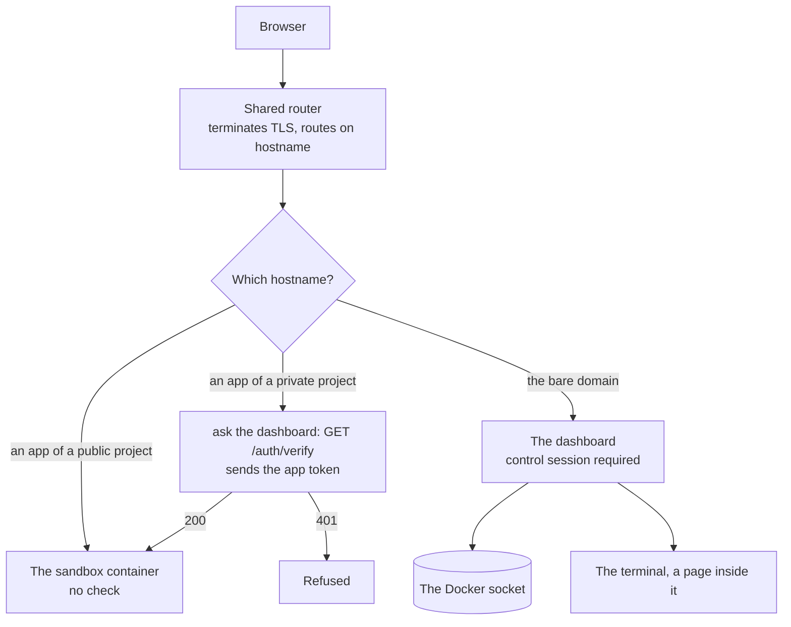

> **Newly running** — Both halves now run end to end: `sandboxr init` starts the router, a private project's sandbox hostnames go through forward-auth, and `GET /auth/verify` answers them. It has been exercised on one machine, not hardened by use. Wildcard DNS and real certificates are still not built.

sandboxr splits everything it serves into exactly two tiers.

| Tier | What is in it | How it is protected |
|---|---|---|
| **Apps** | Everything a sandbox serves: front-ends, APIs | Open to anyone by default. `access.apps: private` puts them behind the app token |
| **Controls** | The dashboard, the terminal, start, stop, rebuild, migrate, delete | **A password. Always. Not configurable.** |

There is **one** authentication mechanism, and it is used twice. The dashboard owns sessions. The
router protects everything else by asking the dashboard.



*One login, two tokens. Open app hostnames skip the check; nothing else does. The control session never leaves the bare domain.*


## Why apps are open by default

Because the point of a sandbox URL is to send it to somebody.

A designer, a product manager, the person who filed the ticket — none of them should need an
account on your Docker host to look at a branch. Someone who finds a sandbox sees a preview of
unreleased work, which is usually fine and often the entire objective.

That default comes with two conditions attached, and both are enforced as **refusals** rather than
warnings. Read [public sandboxes](./public-sandboxes.md) before you expose anything.

## Why the controls are not negotiable

The dashboard talks to the **Docker socket**, because that is how it starts and stops containers.

That is not a detail you can design around. Access to the Docker socket is equivalent to being root
on the machine, whatever flags it is mounted with: a process that can reach it can start a
container with the whole host filesystem mounted inside it.

So an action endpoint reachable without a session is not a leak and not a misconfigured page. It is
**arbitrary code execution, as root, on the machine**.

> [!CAUTION] If you skim one paragraph on this site, make it this one
> There is no mode in which the controls are open. No flag for local development, no "it is only on
> my laptop" exception, no environment variable that turns it off. With no password configured, every
> action endpoint refuses. Asking for a way around it is asking for a way to hand your machine to
> whoever finds port 443.
>
> The password is a root credential. Treat it that way: long, random, in a secret manager, rotated by
> changing the variable and restarting.

## The honest state of the private tier

Both halves run now. `sandboxr init` starts the router; a sandbox of a `private` project carries a
forward-auth middleware in its route labels; the middleware asks `GET /auth/verify`, which reads the
app token and checks its grant against the project the forwarded hostname belongs to.

Two things are worth knowing before you rely on it:

- **It is newly exercised, not battle-tested.** It has been run end to end on one machine.
- **A signed-out browser gets a bare `401` JSON body, not a login form.** `verify` answers the
  router, and the router relays that answer verbatim, so there is currently no redirect to the
  password page from a private app hostname. You log in on the bare domain first, then load the app.

<details>
<summary><b>Details for an agent:</b> how the router is meant to enforce it, and what exists so far</summary>

The design, from `docs/architecture/contracts.md` §7:

- One router container per machine, in front of every sandbox, reconciling from Docker labels — so
  starting a sandbox never rewrites a config file and never triggers a reload.
- Each sandbox's container carries the labels that describe its own route. A project whose
  `access.apps` is `private` gets a forward-auth middleware in that route; a public one does not.
- The middleware points at the dashboard's `GET /auth/verify`, and forwards the hostname it is
  asking about along with the browser's cookies. `verify` answers 200 when a valid **app token** is
  present **and** its grant covers that hostname's project, and 401 otherwise. So a password scoped
  to one project cannot unlock another's private apps.

What exists: `packages/core/src/access/router.ts` builds the route labels and the middleware
definition, `sandboxr init` starts the router, and `packages/server` serves `verify` with tests for
both answers.

What does not: wildcard DNS and real certificates — see [what is built](../reference/status.md).
Nor does a private app redirect a signed-out browser to the login form; it answers 401.

</details>

## The non-negotiables

These come from the contract, and they are what "behind a password" actually means in code. Each
has a test in `packages/server`.

### No action endpoint is reachable without a session

Not one. Not a health check that happens to accept a container name. Not a "read-only" listing that
leaks worktree paths. Not a WebSocket that authenticates after the upgrade. A test posts every
action in the table, to every route, with no cookie, and asserts 401 — and that neither the core
library nor Docker was touched.

### The set of actions is closed

There is no "run this command" box, and there must never be one. The things the dashboard can do
are a fixed table in the server package, and lookup goes through a `Map`, so a request naming
`constructor` or `__proto__` resolves to nothing.

This is what stops the dashboard being a shell with a nicer font. An attacker who gets a session
still cannot run arbitrary commands — only the enumerated ones.

### Every input is validated, and commands are argument arrays

Slugs, project names and branch names are checked against the documented patterns **before** they
reach a command. Commands are executed as argument arrays, never as a shell string with a request
value pasted into it.

Treat every request as untrusted, including one that arrives with a valid session. A slug is
`[a-z0-9-]` with a 31-character ceiling; anything else is rejected rather than escaped.

### Login is rate-limited, and the password is never recoverable

A password with no rate limit is a password you can guess at HTTP speed. Attempts are limited per
client and server-wide, and a refused attempt is not counted — so hammering cannot extend a lockout
on a shared proxy address.

The password is compared with a timing-safe comparison over the whole table, so login costs the
same whichever password matched. It is stored as a hash and salt, the environment variables are
deleted once read, and it appears in no log, no page and no redirect.

## Different people, different projects

One password can grant everything, or several passwords can each grant a subset — so a contractor
working on one project cannot control another.

```bash
# Grants every project.
export SANDBOXR_PASSWORD='...'

# Grants only the acme project.
export SANDBOXR_PASSWORD_ACME='...'

# A password that should cover two projects: name it after either one,
# then list what it really grants.
export SANDBOXR_PROJECTS_ACME='acme,worker-thing'
```

The grant is checked everywhere, not only on the buttons: the sandbox list is filtered, the terminal
refuses to open, a global action needs a grant covering everything, and the check that protects
private apps refuses a hostname belonging to a project the session was not granted.

<details>
<summary><b>Details for an agent:</b> the session cookie, where its key lives, and the six public routes</summary>

`POST /auth/login` takes a password and sets **two** signed cookies. Both are `HttpOnly` so page
JavaScript cannot read them, `Secure` so they never cross plain HTTP, `SameSite=Lax` so another
site cannot make your browser perform an action with them, `Path=/`, and a `Max-Age` matching the
session lifetime (`SANDBOXR_SESSION_HOURS`, default 168).

| Cookie | Scope | Accepted by | What it authorises |
|---|---|---|---|
| `sandboxr_session` | **Host-only** — the bare domain and nothing else | Every control route, and the terminal | The controls. Root-equivalent |
| `sandboxr_app` | `Domain=<domain>` — every sandbox hostname too | `GET /auth/verify`, and nothing else | *Viewing* the private apps its grant covers |

They are not interchangeable in either direction: each is signed over its own version tag, so
relabelling one as the other breaks the signature. A control session presented to `/auth/verify` is
a 401, and an app token presented to any control route is a 401.

The split is the reason the second cookie exists at all. A private project's app hostnames go
through forward-auth, and the only thing a browser can send to `<slug>.<app>.<project>.<domain>` is
a cookie scoped to reach it — so a host-only control session never arrives, and a private app is
unreachable in a browser. The obvious fix, putting `Domain` on the control session, is the one thing
that must not be done: a sandbox hostname serves *the project's own code, from a branch under
review*, so every cookie the browser sends there lands in a request header that branch code handles.
The control session authorises Docker-socket-backed actions. Widening it would hand every sandboxed
app — and every public sandbox reachable from the internet — a credential equivalent to root on the
host. `HttpOnly` is no defence, because the read is server-side rather than page script.

> [!NOTE] What the app token still exposes
> A cookie cannot be scoped to "the private hostnames only", so `sandboxr_app` is sent to every host
> under the domain, public projects included. A malicious or compromised app can therefore capture it
> and use it to view the private apps its grant covers. That is a real loss of confidentiality,
> bounded to viewing, within a grant the holder already had — it buys no control, no Docker socket
> and no path to the other tier. Any cookie-based scheme pays some version of this; the design that
> avoids it is a redirect handshake issuing a token bound to a single hostname, which is not built.

Each token carries its own grant and expiry and is signed with the key at
`$SANDBOXR_HOME/state/session.key` (mode 0600) — so there is no session table to lose, and
restarting the dashboard does not log everybody out. The signature is checked **before** the payload
is parsed, so a forged payload never reaches `JSON.parse`.

The public route set is exactly six, asserted as a literal list so that making something public is a
visible change to a test:

| Route | What it is |
|---|---|
| `GET /healthz` | Liveness |
| `GET /login` | The password form |
| `POST /auth/login` | Rate-limited. Password in, cookie out |
| `POST /auth/logout` | Clears the cookie |
| `GET /auth/verify` | 200 or 401 — the router's question |
| `GET /assets/*` | The dashboard's own CSS and JS, a closed set |

Everything else needs a session, and everything under `/p/:project/` needs a session whose grant
covers that project. Locally, over plain HTTP, `SANDBOXR_INSECURE_COOKIES=1` drops `Secure`; it is
the only supported reason to set it and the server says so at startup every time.

</details>

## Why the terminal is a page, not a hostname

The terminal lives at `/p/<project>/s/<slug>/terminal`, **inside the dashboard**, on the bare
domain. It never gets a hostname of its own, and that is structural rather than a routing
convenience.

- Inside the dashboard it inherits the dashboard's session automatically. There is no second way in
  to get wrong.
- On a per-sandbox hostname it would sit alongside apps that are open by default. One routing
  mistake, one copied config block, and you have published an interactive shell inside a container
  with your worktree mounted in it.

The dashboard itself is on the bare domain and never on a per-sandbox hostname, for the same
reason.

## What this protects against, and what it does not

| Threat | Covered? |
|---|---|
| Somebody finding an app URL | Yes, in the sense that this is the intended behaviour for a public project — and the [two requirements](./public-sandboxes.md) are what make it safe |
| Somebody finding the dashboard | Yes. Password, rate-limited, timing-safe, nothing reflected |
| Somebody guessing a slug to reach a private app | Yes. The hostname goes through forward-auth, and without an app token whose grant covers that project it is a 401 |
| A sandboxed app harvesting the credential the browser sends it | Partly. It can capture the **app token** and view private apps within that grant. It never receives the control session, which is host-only |
| A person who has the password doing damage | **No.** The password is full control of every sandbox on the host. It is a root credential |
| A malicious app *inside* a sandbox | Partly. It is a container, and the worktree is mounted read-write. It can rewrite your branch |
| Data leaking out of an open app | Only through the seed and credential refusals. Those are the whole defence, which is why they are refusals |

That read-write worktree is deliberate — it is what lets
[an agent work inside a sandbox](../guides/agents-in-a-sandbox.md). It is a feature with a sharp edge, not an
oversight.

## Related

- [Public sandboxes](./public-sandboxes.md) — the two refusals. Read it before you expose
  anything.
- [The dashboard](../guides/dashboard.md) — every variable it reads and every action it offers.
- [Deployment guide](../running-on-a-server.md) — running this where other people can reach it.
